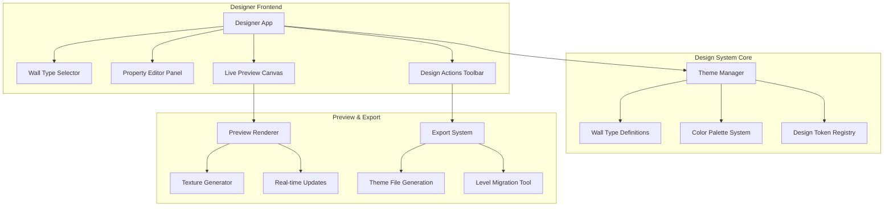
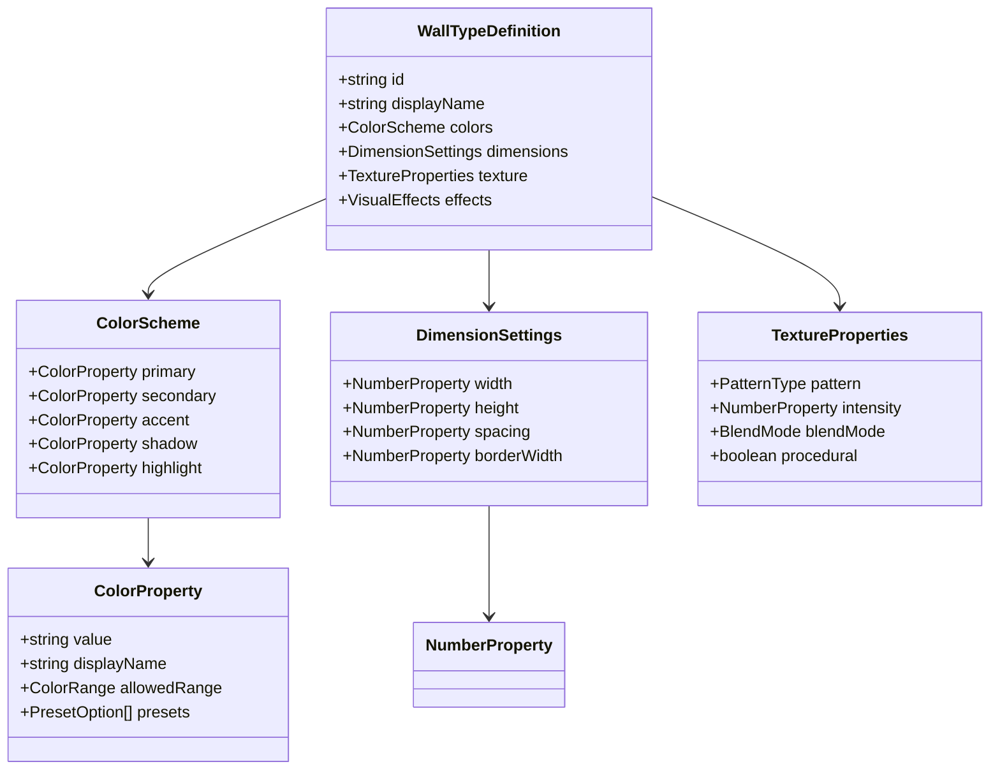
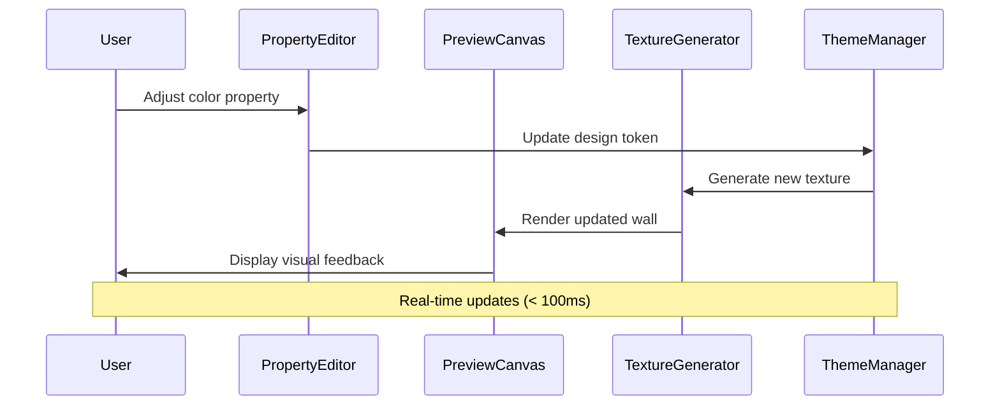
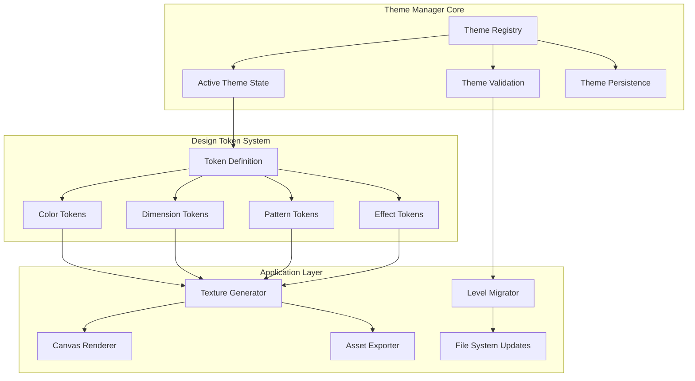

# Designer Mode Implementation

## Overview

The Designer Mode is a visual design system that extends the existing game engine to provide intuitive customization of wall types and their visual properties. This mode allows designers to modify wall appearances through a user-friendly interface without requiring knowledge of hexadecimal color codes or technical implementation details.

The system introduces a centralized theming architecture that replaces hardcoded visual values scattered across level files with configurable design tokens. This enables dynamic styling while maintaining consistency across all game levels and variants.

## Technology Stack & Dependencies

### Frontend Technologies
- **React**: User interface framework for the designer interface
- **Canvas API**: Real-time preview rendering of design changes
- **CSS Grid/Flexbox**: Layout system for the designer interface
- **TypeScript**: Type safety for design configurations

### Backend Integration
- **Node.js Server**: Design persistence and file generation
- **Express.js**: API endpoints for design operations
- **File System**: Storage of design configurations and generated assets

### Build System
- **Vite**: Development server with hot module replacement
- **Concurrently**: Parallel execution of frontend and backend services

## Component Architecture

### Designer Application Structure
The Designer Mode follows a modular architecture with clear separation between design tools, preview systems, and configuration management.



### Wall Type System Architecture
The wall type system centralizes all visual definitions and provides a consistent interface for customization across different wall materials.



## Wall Type Definitions & Design Tokens

### Current Wall Types Identification
Based on the texture system analysis, four primary wall types exist in the current implementation:

| Wall Type | Current Implementation | Design Challenges |
|-----------|----------------------|-------------------|
| **Brick** | Hardcoded colors in `createBrickTexture()` | Mortar color (#8B4513), brick color (#D3D3D3), joint color (#A0522D) |
| **Wood** | Hardcoded colors in `createWoodTexture()` | Base wood (#8B4513), plank color (#654321), gap color (#4A4A4A), grain (#5D4037) |
| **Stone** | Hardcoded colors in `createStoneTexture()` | Base gray (#708090), stone variants, shadow color (#2F4F4F) |
| **Door** | Hardcoded colors in `createDoorTexture()` | Wood gradient, metal hardware, highlight/shadow effects |

### Design Token Structure
Each wall type will be defined through a comprehensive design token system that replaces hardcoded values with configurable properties.

``mermaid
graph LR
    subgraph "Brick Wall Tokens"
        A1[Mortar Color] --> A2[#8B4513]
        A3[Brick Color] --> A4[#D3D3D3]
        A5[Joint Color] --> A6[#A0522D]
        A7[Pattern Offset] --> A8[16px]
        A9[Joint Width] --> A10[1px]
    end
    
    subgraph "Wood Wall Tokens"
        B1[Base Wood] --> B2[#8B4513]
        B3[Plank Color] --> B4[#654321]
        B5[Gap Color] --> B6[#4A4A4A]
        B7[Grain Color] --> B8[#5D4037]
        B9[Plank Width] --> B10[4px]
    end
    
    subgraph "Stone Wall Tokens"
        C1[Base Gray] --> C2[#708090]
        C3[Stone Variants] --> C4[Array]
        C5[Shadow Color] --> C6[#2F4F4F]
        C7[Block Size] --> C8[16px]
    end
```

## User Interface Design

### Property Editor Panel Layout
The Property Editor Panel provides intuitive controls for modifying wall type properties without requiring technical knowledge.

``mermaid
flowchart TD
    A[Property Editor Panel] --> B[Wall Type Selector]
    A --> C[Color Properties Section]
    A --> D[Dimension Properties Section]
    A --> E[Pattern Properties Section]
    A --> F[Action Buttons]
    
    C --> C1[Primary Color Picker]
    C --> C2[Secondary Color Picker]
    C --> C3[Accent Color Picker]
    C --> C4[Color Presets Gallery]
    
    D --> D1[Width Slider]
    D --> D2[Height Slider]
    D --> D3[Spacing Slider]
    D --> D4[Border Width Slider]
    
    E --> E1[Pattern Intensity]
    E --> E2[Texture Detail Level]
    E --> E3[Surface Roughness]
    
    F --> F1[Preview Changes]
    F --> F2[Apply to All Levels]
    F --> F3[Reset to Default]
    F --> F4[Save Theme]
```

### Color Selection Interface
The color selection system provides multiple input methods to accommodate different user preferences and skill levels.

| Input Method | Description | Use Case |
|-------------|-------------|----------|
| **Color Picker Widget** | Visual color wheel with saturation/lightness control | Intuitive color selection for non-technical users |
| **Preset Palette** | Curated color combinations for each wall type | Quick application of professionally designed themes |
| **HSL Sliders** | Separate controls for hue, saturation, lightness | Fine-tuned color adjustments |
| **Color Harmony Tools** | Complementary, analogous, triadic color suggestions | Creating cohesive color schemes |
| **Named Color Input** | CSS color names and web color standards | Familiar color selection for web designers |

### Live Preview System
The live preview system provides immediate visual feedback for all design changes, enabling iterative design workflows.



## Design System Architecture

### Theme Management System
The Theme Management System centralizes all design decisions and provides a consistent API for accessing and modifying visual properties.



### Design Token Migration Strategy
The migration from hardcoded values to design tokens requires a systematic approach to maintain backward compatibility while enabling new functionality.

**Phase 1: Token Extraction**
- Identify all hardcoded color values in texture generation functions
- Create corresponding design tokens with current values as defaults
- Implement token resolution system in texture generators

**Phase 2: Interface Integration**
- Develop property editor interfaces for each token type
- Implement real-time preview capabilities
- Create validation systems for token values

**Phase 3: Level Migration**
- Scan all level variant files for redundant value definitions
- Replace hardcoded values with token references
- Generate migration scripts for existing level data

## API Design & Integration

### Designer Backend API
The Designer Mode requires specific API endpoints to handle theme operations and level migration tasks.

| Endpoint | Method | Purpose | Request/Response |
|----------|---------|---------|------------------|
| `/api/themes` | GET | Retrieve all available themes | Returns theme list with metadata |
| `/api/themes/{id}` | GET | Get specific theme configuration | Returns complete theme definition |
| `/api/themes` | POST | Create new theme | Accepts theme data, returns created theme |
| `/api/themes/{id}` | PUT | Update existing theme | Accepts theme changes, returns updated theme |
| `/api/themes/{id}/preview` | POST | Generate preview assets | Accepts theme data, returns generated textures |
| `/api/migration/analyze` | GET | Analyze levels for migration needs | Returns migration assessment report |
| `/api/migration/execute` | POST | Execute level migration | Accepts migration plan, returns results |

### Theme Configuration Format
Themes are stored as structured JSON configurations that define all customizable properties for each wall type.

``mermaid
graph LR
    subgraph "Theme Configuration"
        A[Theme Metadata] --> A1[ID, Name, Version]
        B[Wall Type Configs] --> B1[Brick Definition]
        B[Wall Type Configs] --> B2[Wood Definition]
        B[Wall Type Configs] --> B3[Stone Definition]
        B[Wall Type Configs] --> B4[Door Definition]
        
        B1 --> C1[Color Properties]
        B1 --> C2[Pattern Properties]
        B1 --> C3[Dimension Properties]
        
        C1 --> D1[Primary, Secondary, Accent]
        C2 --> D2[Pattern Type, Intensity]
        C3 --> D3[Width, Height, Spacing]
    end
```

## Testing Strategy

### Unit Testing Approach
The Designer Mode implementation requires comprehensive testing to ensure design consistency and system reliability.

**Theme Management Tests**
- Theme creation and validation
- Design token resolution and inheritance
- Theme persistence and loading
- Migration script accuracy

**Texture Generation Tests**
- Procedural texture consistency
- Color space conversions
- Performance benchmarks for real-time generation
- Cross-browser rendering compatibility

**User Interface Tests**
- Color picker accuracy and range validation
- Property editor state management
- Live preview synchronization
- Responsive layout behavior

### Integration Testing Strategy
Integration tests focus on the interaction between Designer Mode components and the existing game system.

**Game Engine Integration**
- Theme application to existing levels
- Runtime texture loading performance
- Memory usage optimization
- Backward compatibility verification

**Level Migration Testing**
- Automated migration script validation
- Manual verification of migrated levels
- Performance impact assessment
- Rollback mechanism testing

## Data Flow Architecture

### Design Change Propagation
The system implements a reactive data flow that ensures all components stay synchronized when design properties change.

``mermaid
sequenceDiagram
    participant Designer as Designer Interface
    participant ThemeManager as Theme Manager
    participant TokenRegistry as Token Registry
    participant TextureGen as Texture Generator
    participant PreviewCanvas as Preview Canvas
    participant LevelSystem as Level System
    
    Designer->>ThemeManager: Update wall property
    ThemeManager->>TokenRegistry: Validate and store token
    TokenRegistry->>TextureGen: Trigger texture regeneration
    TextureGen->>PreviewCanvas: Update preview display
    TextureGen->>LevelSystem: Invalidate cached textures
    LevelSystem->>PreviewCanvas: Request new textures
    PreviewCanvas->>Designer: Display updated visuals
```

### Performance Optimization Strategy
The Designer Mode implements several optimization strategies to maintain responsive user experience during design iteration.

**Texture Caching System**
- LRU cache for generated textures
- Incremental updates for partial property changes
- Background pre-generation for common variations
- Memory management for large texture sets

**Debounced Updates**
- Property change debouncing (300ms delay)
- Batch texture generation requests
- Progressive loading for complex textures
- Optimistic UI updates with fallback handling

## Deployment & Build Integration

### Development Workflow
The Designer Mode integrates seamlessly with the existing development environment while providing its own specialized tooling.

**Development Commands**
- `npm run designer` - Launch Designer Mode with hot reload
- `npm run designer:frontend` - Frontend-only development
- `npm run designer:backend` - Backend-only development
- `npm run designer:build` - Production build for Designer Mode

**File Structure Integration**
```
src/
├── designer/                  # Designer Mode source code
│   ├── components/           # React components for designer UI
│   ├── hooks/               # Designer-specific React hooks
│   ├── utils/               # Design system utilities
│   ├── themes/              # Theme definitions and management
│   └── Designer.tsx         # Main designer application
├── themes/                   # Generated theme configurations
│   ├── default.json         # Default theme definition
│   ├── custom-themes/       # User-created themes
│   └── migrations/          # Theme migration scripts
└── shared/                   # Shared utilities between game and designer
    ├── design-tokens/       # Design token definitions
    └── texture-generation/  # Shared texture generation logic
```

### Production Considerations
The Designer Mode requires specific considerations for production deployment and performance optimization.

**Asset Generation Pipeline**
- Pre-compile default themes for faster initial load
- Optimize texture generation algorithms for production
- Implement progressive loading for design assets
- Cache management for frequently used themes

**Theme Distribution**
- Theme package format for sharing between installations
- Version compatibility checking for theme imports
- Theme marketplace integration preparation
- Automated theme validation and testing