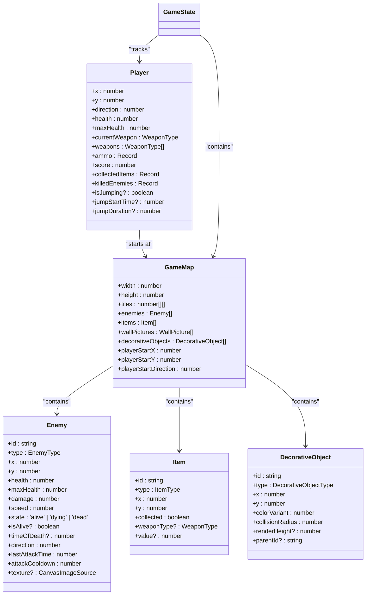
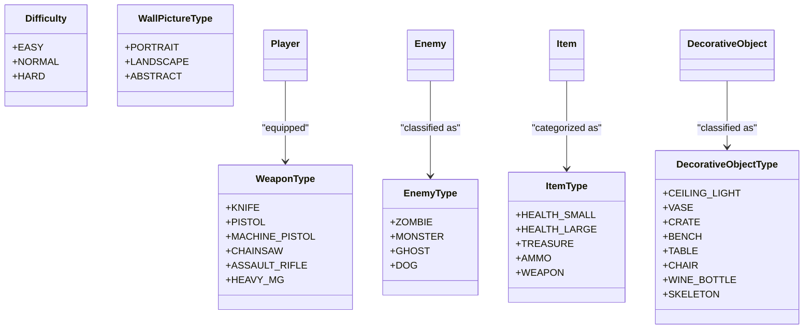
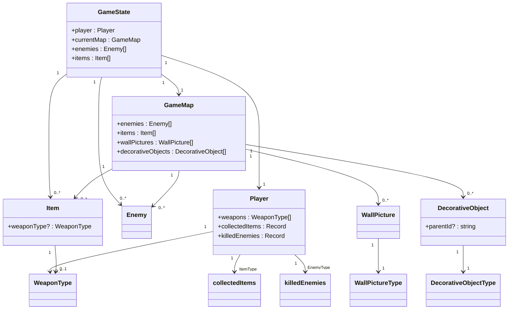
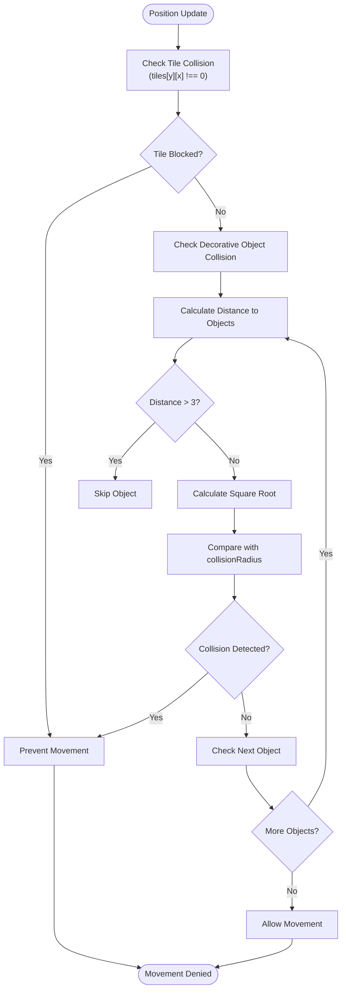
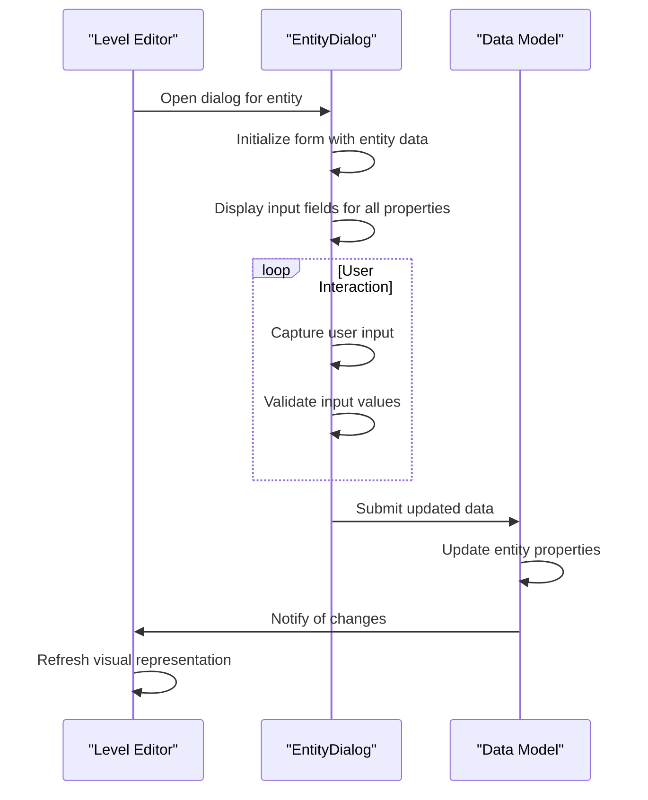

# Data Models

<cite>
**Referenced Files in This Document**   
- [types.ts](file://src/types.ts)
- [gameEngine.ts](file://src/gameEngine.ts)
- [levels.ts](file://src/levels.ts)
- [EntityDialog.tsx](file://src/editor/components/EntityDialog.tsx)
</cite>

## Update Summary
**Changes Made**   
- Updated Game State Structure section to include new item tracking properties
- Added documentation for totalItemsInLevel and collectedItemsInLevel fields in GameState
- Enhanced section sources to reflect updated code locations
- Maintained all existing data model documentation which remains accurate
- Updated source annotations to indicate recent changes

## Table of Contents
1. [Introduction](#introduction)
2. [Core Data Entities](#core-data-entities)
3. [Enum Definitions](#enum-definitions)
4. [Game State Structure](#game-state-structure)
5. [Entity Relationships](#entity-relationships)
6. [Collision Mechanics](#collision-mechanics)
7. [Editor Integration](#editor-integration)
8. [Extensibility Guidelines](#extensibility-guidelines)

## Introduction

This document provides comprehensive documentation for the data models used in the game system, as defined in the `types.ts` file. The data models represent the core entities that define gameplay mechanics, level design, and player progression. These models are used across both the game runtime and the level editor, ensuring consistency between gameplay and content creation. The system is designed with extensibility in mind, allowing for new features to be added while maintaining backward compatibility through careful type design and optional properties.

**Section sources**
- [types.ts](file://src/types.ts#L1-L20)

## Core Data Entities

The game's data model is built around several core entities that represent the fundamental components of gameplay: Player, Enemy, Item, GameMap, and DecorativeObject. These entities are interconnected through the GameState object, which maintains the current state of the game session. The Player entity tracks the player character's position, health, weapons, and inventory. Enemy entities represent adversaries with specific types, health values, and behaviors. Item entities represent collectible objects that provide health, weapons, or score bonuses. GameMap serves as a container for level data, including the tile layout and collections of enemies and items. DecorativeObject entities enhance the visual environment without directly affecting gameplay mechanics, though they can have collision properties.



**Diagram sources**
- [types.ts](file://src/types.ts#L126-L141)
- [types.ts](file://src/types.ts#L34-L50)
- [types.ts](file://src/types.ts#L60-L68)
- [types.ts](file://src/types.ts#L113-L124)
- [types.ts](file://src/types.ts#L102-L111)

**Section sources**
- [types.ts](file://src/types.ts#L34-L124)

## Enum Definitions

The system defines several enumerated types that provide type safety and clarity for game entities. WeaponType defines the available weapons in the game, including KNIFE, PISTOL, MACHINE_PISTOL, CHAINSAW, ASSAULT_RIFLE, and HEAVY_MG. Each weapon type corresponds to specific gameplay characteristics such as damage, fire rate, and ammunition requirements. EnemyType categorizes adversaries into ZOMBIE, MONSTER, GHOST, and DOG, each with distinct behaviors and statistics. ItemType classifies collectible items into HEALTH_SMALL, HEALTH_LARGE, TREASURE, AMMO, and WEAPON, determining their effects when collected by the player. DecorativeObjectType includes CEILING_LIGHT, VASE, CRATE, BENCH, TABLE, CHAIR, WINE_BOTTLE, and SKELETON, which are used to populate the game environment visually. These enums ensure that only valid values can be assigned to corresponding properties, preventing invalid states and making the code more maintainable.



**Diagram sources**
- [types.ts](file://src/types.ts#L7-L14)
- [types.ts](file://src/types.ts#L27-L32)
- [types.ts](file://src/types.ts#L52-L58)
- [types.ts](file://src/types.ts#L91-L100)
- [types.ts](file://src/types.ts#L70-L74)
- [types.ts](file://src/types.ts#L76-L79)

**Section sources**
- [types.ts](file://src/types.ts#L7-L100)

## Game State Structure

The GameState interface serves as the central data structure that maintains the complete state of the game during gameplay. It contains a reference to the Player object, tracking the player's current position, health, inventory, and progression. The currentLevel and currentVariant properties indicate the player's progress through the game's level structure, with variants providing different layouts for the same level number. The difficulty setting affects enemy behavior and player health through multipliers applied in the game engine. The isPaused and isGameOver flags control the game's operational state, determining whether gameplay mechanics are active. The enemies and items arrays contain the current instances of these entities in the active level, synchronized with the currentMap property. The gameStartTime timestamp enables time-based calculations for features like scoring or performance metrics. Optional notification properties provide temporary messages to the player about item collection or level completion.

Two new properties have been added to enhance item tracking: totalItemsInLevel and collectedItemsInLevel. The totalItemsInLevel field stores the total count of items present in the current level, providing a reference point for completion tracking. The collectedItemsInLevel field maintains a running count of items the player has collected during the current level session. Together, these properties enable progress tracking and completion percentage calculations for level objectives.

```mermaid
classDiagram
class GameState {
+player : Player
+currentLevel : number
+currentVariant? : number
+difficulty : Difficulty
+isPaused : boolean
+isGameOver : boolean
+enemies : Enemy[]
+items : Item[]
+currentMap : GameMap
+totalItemsInLevel : number
+collectedItemsInLevel : number
+gameStartTime : number
+lastItemNotification? : { message : string; timestamp : number }
+allEnemiesDefeatedNotification? : { message : string; timestamp : number }
}
class Player {
+x : number
+y : number
+direction : number
+health : number
+maxHealth : number
+currentWeapon : WeaponType
+weapons : WeaponType[]
+ammo : Record<WeaponType, number>
+score : number
+collectedItems : Record<ItemType, number>
+killedEnemies : Record<EnemyType, number }
}
class GameMap {
+width : number
+height : number
+tiles : number[][]
+enemies : Enemy[]
+items : Item[]
+wallPictures : WallPicture[]
+decorativeObjects : DecorativeObject[]
+playerStartX : number
+playerStartY : number
+playerStartDirection : number
}
GameState --> Player
GameState --> GameMap
GameState --> Enemy : "contains"
GameState --> Item : "contains"
```

**Diagram sources**
- [types.ts](file://src/types.ts#L143-L164)
- [types.ts](file://src/types.ts#L126-L141)
- [types.ts](file://src/types.ts#L113-L124)

**Section sources**
- [types.ts](file://src/types.ts#L143-L164)
- [gameEngine.ts](file://src/gameEngine.ts#L1-L100)

## Entity Relationships

The data model establishes clear relationships between entities through composition and references. The GameMap entity acts as a container for level-specific data, holding arrays of Enemy and Item instances that populate the level. This relationship enables efficient loading and unloading of level content by replacing the currentMap in the GameState. The Player entity maintains references to collected items and killed enemies through Record types indexed by ItemType and EnemyType respectively, allowing for statistical tracking without direct references to individual instances. The DecorativeObject entity includes a parentId property that suggests a hierarchical relationship, potentially for grouping objects or managing complex decorations. The WallPicture entity is positioned relative to specific wall tiles through x, y, and side properties, establishing a spatial relationship with the map's tile structure. These relationships are designed to support both gameplay mechanics and editor functionality, allowing for intuitive manipulation of entities within their contextual hierarchies.



**Diagram sources**
- [types.ts](file://src/types.ts#L113-L124)
- [types.ts](file://src/types.ts#L143-L164)
- [types.ts](file://src/types.ts#L126-L141)
- [types.ts](file://src/types.ts#L60-L68)
- [types.ts](file://src/types.ts#L102-L111)
- [types.ts](file://src/types.ts#L82-L89)

**Section sources**
- [types.ts](file://src/types.ts#L113-L124)
- [types.ts](file://src/types.ts#L143-L164)
- [gameEngine.ts](file://src/gameEngine.ts#L100-L200)

## Collision Mechanics

Collision detection in the game system is implemented through a combination of tile-based and object-based mechanics. The primary collision system uses the GameMap's tiles array, where values of 1 represent solid walls and 0 represent passable space. This grid-based system provides the foundation for movement restrictions and pathfinding. The DecorativeObject entity introduces an additional layer of collision through its collisionRadius property, which defines a circular area around the object that players and enemies cannot penetrate. This radius is used in the checkDecorativeObjectCollision function to determine if a position would intersect with any decorative object. Objects like CEILING_LIGHT have a collisionRadius of 0, making them purely visual, while objects like CRATE and TABLE have positive radii that create physical barriers. The collision system is optimized with early distance checks to avoid unnecessary calculations for distant objects, improving performance in levels with many decorative elements.



**Diagram sources**
- [types.ts](file://src/types.ts#L102-L111)
- [gameEngine.ts](file://src/gameEngine.ts#L156-L199)
- [EntityDialog.tsx](file://src/editor/components/EntityDialog.tsx#L324-L360)

**Section sources**
- [types.ts](file://src/types.ts#L102-L111)
- [gameEngine.ts](file://src/gameEngine.ts#L156-L199)

## Editor Integration

The data models are designed to support seamless integration with the level editor, allowing designers to create and modify game content through a visual interface. The editor uses the same type definitions as the game runtime, ensuring consistency between design and gameplay. The EntityDialog component in the editor provides a form-based interface for creating and editing entities, with input fields corresponding to each property in the data models. For example, when editing a DecorativeObject, the editor displays fields for position, type, color variant, collisionRadius, and renderHeight, directly mapping to the interface properties. Validation rules are implemented to ensure data integrity, such as preventing negative values for collisionRadius. The editor also handles the hierarchical structure of the GameMap, allowing users to add, remove, and position entities within the level context. This tight integration between the data models and editor enables rapid iteration on level design while maintaining the structural integrity of the game data.



**Diagram sources**
- [types.ts](file://src/types.ts#L102-L111)
- [EntityDialog.tsx](file://src/editor/components/EntityDialog.tsx#L1-L661)

**Section sources**
- [EntityDialog.tsx](file://src/editor/components/EntityDialog.tsx#L1-L661)
- [types.ts](file://src/types.ts#L102-L111)

## Extensibility Guidelines

The data models are designed with extensibility in mind, following several key principles to support future development while maintaining backward compatibility. New properties should be added as optional (with ?) to prevent breaking existing data, especially for entities that are serialized and saved. When adding new enum values, they should be appended to the existing list rather than inserted, preserving the string values of existing entries. For complex extensions, consider using composition by adding new interfaces that reference existing entities rather than modifying core types. The use of Record types for player statistics (collectedItems, killedEnemies, ammo) allows for automatic handling of new enum values without code changes. When introducing new entity types, follow the pattern of creating a corresponding enum and interface, then adding it to the GameMap container. Migration of existing saved games should be handled through versioning and transformation functions that update old data structures to the new format while preserving player progress.

**Section sources**
- [types.ts](file://src/types.ts#L1-L176)
- [gameEngine.ts](file://src/gameEngine.ts#L1-L705)