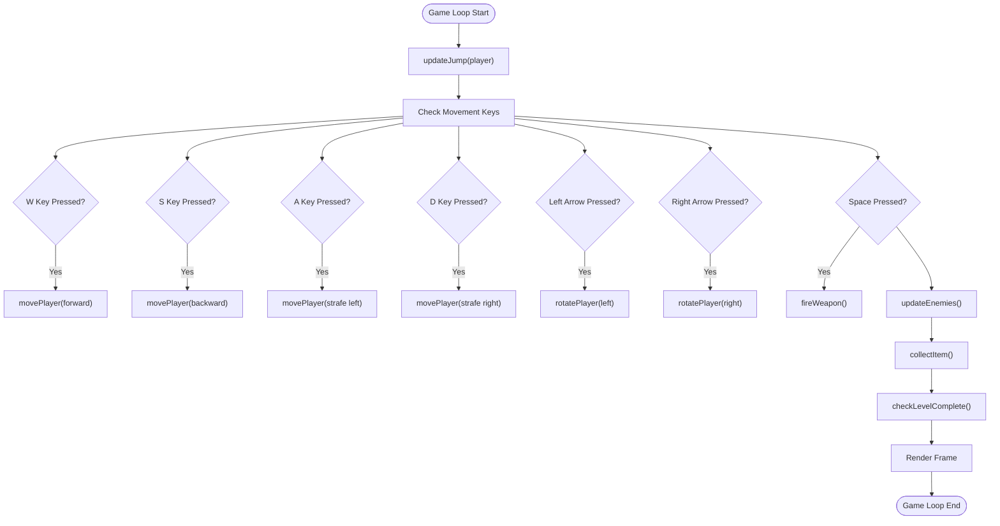
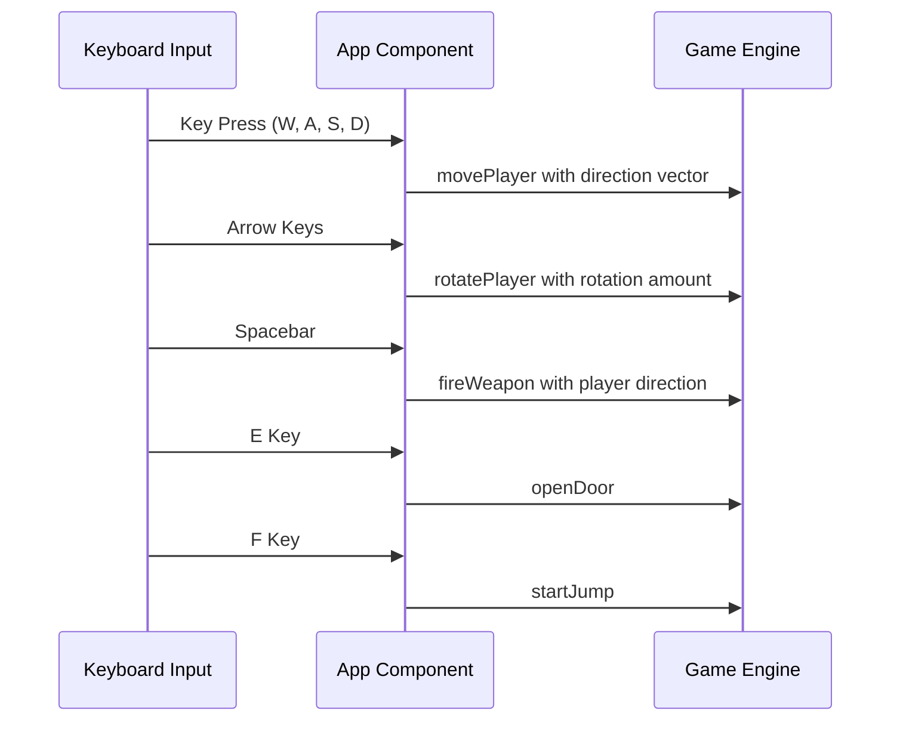
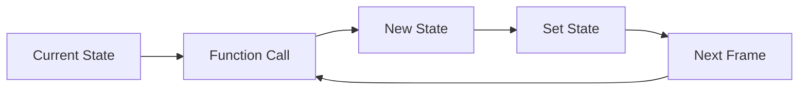
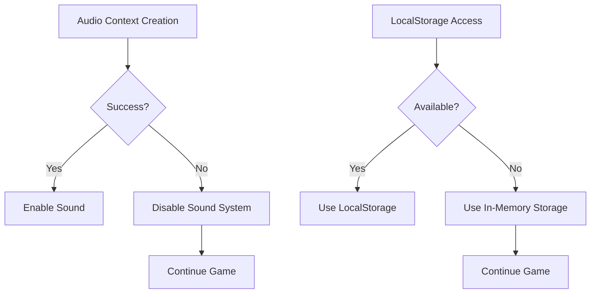
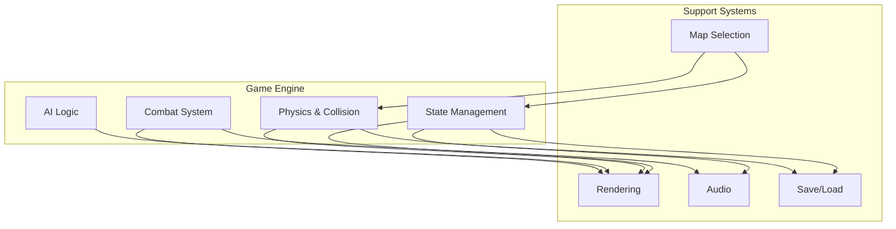

# Game Engine API

<cite>
**Referenced Files in This Document**   
- [gameEngine.ts](file://src/gameEngine.ts)
- [types.ts](file://src/types.ts)
- [App.tsx](file://src/App.tsx)
- [soundSystem.ts](file://src/soundSystem.ts)
- [mapSelectionSystem.ts](file://src/mapSelectionSystem.ts)
- [raycasting.ts](file://src/raycasting.ts)
- [saveLoadSystem.ts](file://src/saveLoadSystem.ts)
</cite>

## Update Summary
**Changes Made**   
- Updated collectItem function documentation to reflect new parameters and return values
- Added documentation for new collected items tracking system in GameState
- Updated createInitialGameState and loadNextLevel function documentation to include item tracking initialization
- Added new section on Items Collection System to explain the new tracking functionality
- Updated section sources to reflect changes in gameEngine.ts and types.ts

## Table of Contents
1. [Introduction](#introduction)
2. [Core Gameplay Functions](#core-gameplay-functions)
3. [Data Models](#data-models)
4. [Integration with Main App](#integration-with-main-app)
5. [Integration Patterns](#integration-patterns)
6. [Performance Considerations](#performance-considerations)
7. [Error Handling Strategies](#error-handling-strategies)
8. [System Relationships](#system-relationships)
9. [Items Collection System](#items-collection-system)
10. [Conclusion](#conclusion)

## Introduction
This document provides comprehensive API documentation for the game engine's public interfaces in gameEngine.ts. It details all exported functions including movePlayer, checkCollision, handleCombat, and other core gameplay functions. The documentation explains the GameState, Player, Enemy, and Item data models defined in types.ts, including their properties and relationships. It also covers integration patterns, performance considerations, error handling, and the relationship between the game engine and other systems like rendering, audio, and save/load.

## Core Gameplay Functions

### movePlayer
Moves the player in the game world while checking for collisions with walls and decorative objects.

**Parameters:**
- `player`: Player - The current player state
- `moveX`: number - Horizontal movement amount
- `moveY`: number - Vertical movement amount
- `tiles`: number[][] - The game map tiles
- `decorativeObjects`: DecorativeObject[] - Array of decorative objects in the current map

**Returns:** Player - Updated player state with new position if movement was successful

**Usage Example:** Called in the game loop when player presses movement keys (W, A, S, D) to update player position based on direction and collision detection.

**Section sources**
- [gameEngine.ts](file://src/gameEngine.ts#L201-L239)

### checkCollision
Determines if a position collides with walls in the game map.

**Parameters:**
- `x`: number - X coordinate to check
- `y`: number - Y coordinate to check
- `tiles`: number[][] - The game map tiles

**Returns:** boolean - True if collision detected, false otherwise

**Usage Example:** Used by movePlayer to prevent players from walking through walls. Returns true when the specified coordinates intersect with wall tiles (non-zero values).

**Section sources**
- [gameEngine.ts](file://src/gameEngine.ts#L133-L142)

### fireWeapon
Handles weapon firing mechanics, including ammo management and enemy damage calculation.

**Parameters:**
- `player`: Player - The current player state
- `enemies`: Enemy[] - Array of enemies in the current level
- `playerDirX`: number - Player's direction X component
- `playerDirY`: number - Player's direction Y component

**Returns:** Object containing:
- `player`: Updated player state (ammo reduced)
- `enemies`: Updated enemies array (health reduced if hit)
- `hit`: boolean indicating if an enemy was hit
- `enemyHit`: Reference to the enemy that was hit
- `outOfAmmo`: boolean indicating if the weapon is out of ammo

**Usage Example:** Called when player presses spacebar to fire current weapon. Checks line of sight to enemies within weapon range and applies damage to the closest valid target.

**Section sources**
- [gameEngine.ts](file://src/gameEngine.ts#L459-L513)

### collectItem
Processes item collection when player is near an item, with enhanced tracking of collected items in the current level.

**Parameters:**
- `player`: Player - The current player state
- `items`: Item[] - Array of items in the current level
- `collectedItemsInLevel`: number - Current count of collected items in the level

**Returns:** Object containing:
- `player`: Updated player state (health, ammo, weapons, or score increased)
- `notification`: Optional string with feedback message about what was collected
- `newCollectedItemsInLevel`: Updated count of collected items in the level

**Usage Example:** Called in the game loop to check if player is within 0.7 units of any uncollected item. Applies appropriate effects based on item type (health restoration, ammo addition, weapon acquisition) and increments the collected items counter.

**Section sources**
- [gameEngine.ts](file://src/gameEngine.ts#L517-L581)

### updateEnemies
Updates all enemies in the current level, handling AI movement, attacks, and door interactions.

**Parameters:**
- `enemies`: Enemy[] - Array of enemies to update
- `player`: Player - Current player state for targeting
- `tiles`: number[][] - Game map tiles for pathfinding
- `deltaTime`: number - Time since last update for smooth movement
- `difficulty`: Difficulty - Current difficulty level affecting enemy behavior
- `decorativeObjects`: DecorativeObject[] - Array of decorative objects for collision

**Returns:** Object containing:
- `enemies`: Updated enemies array
- `player`: Updated player state (if damaged)
- `tilesUpdated`: Optional updated tiles array (if enemies opened doors)

**Usage Example:** Called in the game loop to advance enemy AI. Enemies pursue player when within 15 units, attack when within 1.5 units, and can open doors (except dogs).

**Section sources**
- [gameEngine.ts](file://src/gameEngine.ts#L381-L457)

### createInitialGameState
Creates a new game state with initial player, enemies, and map based on selected difficulty, including initialization of item collection tracking.

**Parameters:**
- `difficulty`: Difficulty - The selected difficulty level (EASY, NORMAL, HARD)

**Returns:** GameState - A fully initialized game state with player health, weapons, starting position, and item tracking counters

**Usage Example:** Called when starting a new game from the main menu. Sets up player with appropriate health based on difficulty, loads the first level with map variant selection, and initializes item collection counters (totalItemsInLevel and collectedItemsInLevel).

**Section sources**
- [gameEngine.ts](file://src/gameEngine.ts#L49-L91)

### loadNextLevel
Progresses the game to the next level, loading appropriate map variant and resetting game elements, including resetting the collected items counter.

**Parameters:**
- `gameState`: GameState - Current game state to be updated

**Returns:** GameState - Updated state with new level, enemies, items, player position, and reset collected items counter

**Usage Example:** Called when all enemies in current level are defeated. Loads the next level with map variant selection, adds 25 health to player, resets the collected items counter to zero, and updates the total items count for the new level.

**Section sources**
- [gameEngine.ts](file://src/gameEngine.ts#L587-L634)

### openDoor
Attempts to open a door in front of the player.

**Parameters:**
- `player`: Player - Current player state for position and direction
- `tiles`: number[][] - Current map tiles
- `enemies`: Enemy[] - Array of enemies to check for exit door requirements

**Returns:** Object containing:
- `tiles`: Updated tiles array with door removed (if normal door opened)
- `doorOpened`: boolean indicating if a door was successfully opened
- `isExitDoor`: boolean indicating if the door was an exit door

**Usage Example:** Called when player presses 'E' key. Checks multiple positions in front of player for doors. Normal doors (value 2) open immediately, while exit doors (value 3) only open when all enemies are defeated.

**Section sources**
- [gameEngine.ts](file://src/gameEngine.ts#L636-L709)

### startJump
Initiates player jump animation and mechanics.

**Parameters:**
- `player`: Player - Current player state

**Returns:** Player - Updated player state with jump flags set

**Usage Example:** Called when player presses 'F' key. Sets isJumping flag and jump timing variables if player is not already jumping.

**Section sources**
- [gameEngine.ts](file://src/gameEngine.ts#L242-L253)

### updateJump
Updates the player's jump state for animation and physics.

**Parameters:**
- `player`: Player - Current player state

**Returns:** Player - Updated player state with jump completed if duration elapsed

**Usage Example:** Called in the game loop to manage jump duration. After 400ms, resets jump state to allow another jump.

**Section sources**
- [gameEngine.ts](file://src/gameEngine.ts#L256-L270)

### rotatePlayer
Rotates the player by a specified amount.

**Parameters:**
- `player`: Player - Current player state
- `rotation`: number - Amount to rotate player (radians)

**Returns:** Player - Player with updated direction

**Usage Example:** Called when player uses arrow keys to turn left or right in the game world.

**Section sources**
- [gameEngine.ts](file://src/gameEngine.ts#L272-L275)

### checkLevelComplete
Checks if all enemies in the current level have been defeated.

**Parameters:**
- `enemies`: Enemy[] - Array of enemies in current level

**Returns:** boolean - True if all enemies are not alive, false otherwise

**Usage Example:** Called in the game loop to determine when to show "All enemies defeated" notification and allow progression to next level.

**Section sources**
- [gameEngine.ts](file://src/gameEngine.ts#L583-L585)

## Data Models

### GameState
Represents the complete state of the game at any point, with enhanced tracking of item collection progress.

**Properties:**
- `player`: Player - Current player state
- `currentLevel`: number - Current level index (0-based)
- `currentVariant`: number - Selected map variant for current level
- `difficulty`: Difficulty - Game difficulty setting
- `isPaused`: boolean - Whether game is currently paused
- `isGameOver`: boolean - Whether game has ended
- `enemies`: Enemy[] - Array of enemies in current level
- `items`: Item[] - Array of items in current level
- `currentMap`: GameMap - Current map data
- `totalItemsInLevel`: number - Total number of items in the current level (for progress tracking)
- `collectedItemsInLevel`: number - Number of items collected in the current level (for progress tracking)
- `gameStartTime`: number - Timestamp when game started
- `lastItemNotification`: Optional notification about recently collected item
- `allEnemiesDefeatedNotification`: Optional notification when level is complete

**Section sources**
- [types.ts](file://src/types.ts#L143-L164)

### Player
Represents the player character in the game.

**Properties:**
- `x`, `y`: number - Position coordinates
- `direction`: number - Facing direction in radians
- `health`, `maxHealth`: number - Current and maximum health points
- `currentWeapon`: WeaponType - Currently selected weapon
- `weapons`: WeaponType[] - Array of weapons player has acquired
- `ammo`: Record of ammunition for each weapon type
- `score`: number - Current score
- `collectedItems`: Record of collected items by type
- `killedEnemies`: Record of enemies killed by type
- `isJumping`: boolean - Whether player is currently jumping
- `jumpStartTime`, `jumpDuration`: number - Timing variables for jump animation

**Section sources**
- [types.ts](file://src/types.ts#L126-L141)

### Enemy
Represents an enemy character in the game.

**Properties:**
- `id`: string - Unique identifier
- `type`: EnemyType - Enemy classification
- `x`, `y`: number - Position coordinates
- `health`, `maxHealth`: number - Current and maximum health
- `damage`: number - Damage dealt to player
- `speed`: number - Movement speed
- `state`: 'alive' | 'dying' | 'dead' - Current state
- `direction`: number - Facing direction
- `lastAttackTime`: number - Timestamp of last attack
- `attackCooldown`: number - Minimum time between attacks
- `texture`: CanvasImageSource - Visual representation

**Section sources**
- [types.ts](file://src/types.ts#L34-L50)

### Item
Represents a collectible item in the game.

**Properties:**
- `id`: string - Unique identifier
- `type`: ItemType - Classification of item
- `x`, `y`: number - Position coordinates
- `collected`: boolean - Whether item has been collected
- `weaponType`: Optional WeaponType for weapon items
- `value`: Optional numeric value (health amount, score, ammo count)

**Section sources**
- [types.ts](file://src/types.ts#L60-L68)

### DecorativeObject
Represents non-interactive decorative elements in the game world.

**Properties:**
- `id`: string - Unique identifier
- `type`: DecorativeObjectType - Type of decorative object
- `x`, `y`: number - Position coordinates
- `colorVariant`: number - Color modulation value (0.0-1.0)
- `collisionRadius`: number - Radius for collision detection
- `renderHeight`: Optional number - Specific render height
- `parentId`: Optional string - ID of parent object (for objects on others)

**Section sources**
- [types.ts](file://src/types.ts#L102-L111)

### GameMap
Represents a complete game level.

**Properties:**
- `width`, `height`: number - Map dimensions
- `tiles`: number[][] - 2D array representing walls (1), floors (0), doors (2, 3)
- `enemies`: Enemy[] - Array of enemies in this map
- `items`: Item[] - Array of items in this map
- `wallPictures`: WallPicture[] - Decorative wall elements
- `decorativeObjects`: DecorativeObject[] - Floor-level decorative objects
- `playerStartX`, `playerStartY`: number - Player spawn position
- `playerStartDirection`: number - Player starting direction

**Section sources**
- [types.ts](file://src/types.ts#L113-L124)

## Integration with Main App

### Game Loop Integration
The game engine functions are integrated into the main App component through a game loop that runs at approximately 60 FPS.

**Diagram sources**
- [App.tsx](file://src/App.tsx#L300-L450)

### Event Handling
The main App component handles keyboard events and translates them into game engine function calls.

**Diagram sources**
- [App.tsx](file://src/App.tsx#L200-L300)

## Integration Patterns

### State Management Pattern
The game engine follows a functional pattern where functions take state as input and return new state, avoiding direct mutation.

**Diagram sources**
- [App.tsx](file://src/App.tsx#L450-L500)

### Dependency Injection
The game engine receives necessary data from the main component rather than accessing global state directly.

**Section sources**
- [App.tsx](file://src/App.tsx#L350-L400)

## Performance Considerations

### Game Loop Optimization
The game engine functions are designed to be called in the game loop with performance in mind.

**Key Optimizations:**
- Collision detection uses squared distance to avoid expensive square root calculations
- Sprite rendering uses view frustum culling to skip off-screen objects
- Texture loading is pre-cached to prevent frame drops
- Map history operations are batched and limited in size

**Section sources**
- [raycasting.ts](file://src/raycasting.ts#L200-L229)
- [mapSelectionSystem.ts](file://src/mapSelectionSystem.ts#L150-L200)

### Memory Management
The engine minimizes memory allocations during gameplay by reusing objects and avoiding unnecessary copying.

**Section sources**
- [gameEngine.ts](file://src/gameEngine.ts#L50-L89)

## Error Handling Strategies

### Graceful Degradation
The game engine implements fallback mechanisms when certain features are unavailable.

**Diagram sources**
- [soundSystem.ts](file://src/soundSystem.ts#L3-L20)
- [mapSelectionSystem.ts](file://src/mapSelectionSystem.ts#L20-L50)

### Input Validation
Functions include validation to prevent invalid state transitions.

**Section sources**
- [gameEngine.ts](file://src/gameEngine.ts#L636-L709)

## System Relationships

### Game Engine Architecture
The game engine serves as the central component that coordinates various game systems.

**Diagram sources**
- [gameEngine.ts](file://src/gameEngine.ts#L1-L710)
- [App.tsx](file://src/App.tsx#L1-L800)

### Audio System Integration
The game engine triggers sound effects through the soundSystem module.

**Section sources**
- [soundSystem.ts](file://src/soundSystem.ts#L126-L126)

### Save/Load System Integration
The game engine state is serialized and persisted through the saveLoadSystem.

**Section sources**
- [saveLoadSystem.ts](file://src/saveLoadSystem.ts#L1-L65)

## Items Collection System
The game engine now includes a comprehensive system for tracking item collection progress within levels.

### Item Collection Tracking
The system maintains two key counters in the GameState to track item collection progress:
- `totalItemsInLevel`: The total number of items in the current level, initialized when loading a new level
- `collectedItemsInLevel`: The current count of items collected in the level, which increments as items are collected

These counters enable the game to display progress information to players and potentially unlock achievements or rewards based on collection milestones.

### collectItem Function Updates
The collectItem function has been enhanced to support the new tracking system:

**New Parameters:**
- `collectedItemsInLevel`: The current count of collected items, passed from the game state

**New Return Values:**
- `newCollectedItemsInLevel`: The updated count after processing any new item collections

The function now increments the `newCollectedItemsInLevel` counter whenever an item is collected, and returns this updated value to the caller.

### Initialization and Reset
The item collection counters are properly initialized and reset by key game functions:

**createInitialGameState**: When starting a new game, initializes:
- `totalItemsInLevel` to the length of the items array in the initial level
- `collectedItemsInLevel` to 0

**loadNextLevel**: When progressing to a new level, updates:
- `totalItemsInLevel` to the length of the items array in the new level
- `collectedItemsInLevel` to 0 (resetting the counter for the new level)

This ensures accurate tracking of item collection progress for each level independently.

**Section sources**
- [gameEngine.ts](file://src/gameEngine.ts#L517-L581)
- [types.ts](file://src/types.ts#L143-L164)

## Conclusion
The game engine API provides a comprehensive set of functions for managing gameplay mechanics in the Egor game. The core functions handle player movement, combat, enemy AI, and level progression, while the data models define the structure of game entities. The engine is designed for efficient integration with the main App component through a well-defined game loop and event handling system. Performance optimizations ensure smooth gameplay, while error handling strategies provide robustness against environmental limitations. The modular design allows for clear separation of concerns between the game logic, rendering, audio, and persistence systems. Recent updates have enhanced the item collection system with comprehensive tracking of collection progress within levels, providing better feedback and potential for new gameplay features based on collection milestones.