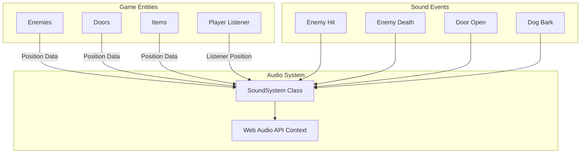
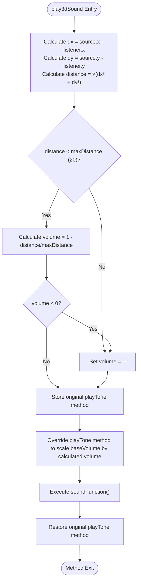
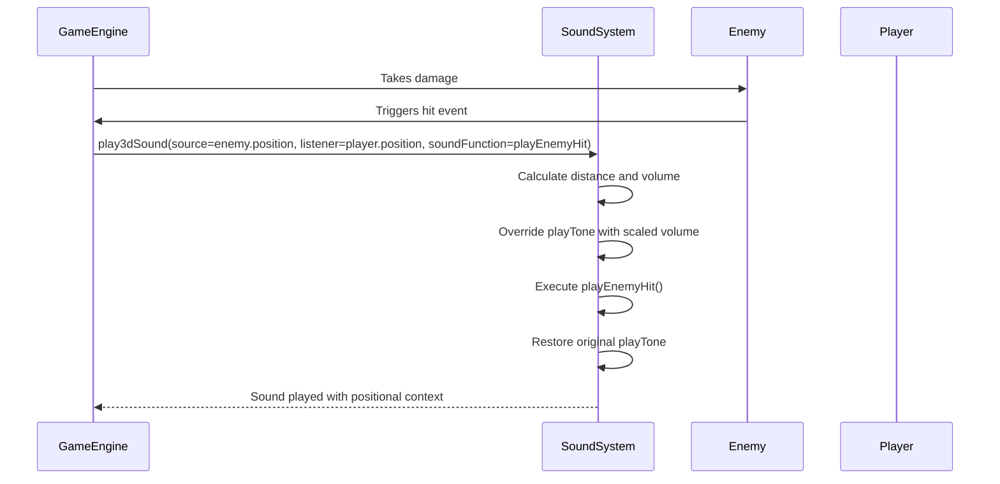

# 3D Positional Audio

<cite>
**Referenced Files in This Document**   
- [soundSystem.ts](file://src/soundSystem.ts)
- [gameEngine.ts](file://src/gameEngine.ts)
</cite>

## Table of Contents
1. [Introduction](#introduction)
2. [Core Components](#core-components)
3. [Architecture Overview](#architecture-overview)
4. [Detailed Component Analysis](#detailed-component-analysis)
5. [Integration Points](#integration-points)
6. [Limitations and Considerations](#limitations-and-considerations)
7. [Best Practices](#best-practices)
8. [Performance Implications](#performance-implications)

## Introduction
The 3D positional audio system provides spatial sound effects based on the relative positions of sound sources and the player listener within the game environment. This implementation creates an immersive audio experience by dynamically adjusting sound volume according to distance, allowing players to perceive the direction and proximity of in-game events such as enemy movements, door openings, and item interactions. The system leverages the Web Audio API to generate tones and applies distance-based attenuation to simulate realistic spatial audio in a 2D environment.

**Section sources**
- [soundSystem.ts](file://src/soundSystem.ts#L3-L124)

## Core Components

The 3D positional audio system is implemented through two primary components: the `SoundSystem` class that manages audio generation and the `play3dSound` method that handles spatial calculations. The system uses a singleton pattern with the exported `soundSystem` instance, providing global access to audio functionality throughout the game. Key methods include `playTone` for basic sound generation and specialized methods like `playEnemyHit` and `playEnemyDeath` for specific game events.

The core functionality revolves around calculating Euclidean distance between sound sources and the listener, then applying a linear attenuation model to determine volume levels. When a sound source is within the maximum audible range, the volume is scaled proportionally to its distance from the listener, creating the perception of spatial positioning.

**Section sources**
- [soundSystem.ts](file://src/soundSystem.ts#L3-L124)
- [soundSystem.ts](file://src/soundSystem.ts#L97-L119)

## Architecture Overview

**Diagram sources**
- [soundSystem.ts](file://src/soundSystem.ts#L3-L124)
- [gameEngine.ts](file://src/gameEngine.ts#L378-L421)

## Detailed Component Analysis

### play3dSound Method Implementation

The `play3dSound` method is the core of the 3D positional audio system, responsible for calculating distance-based volume attenuation. The method takes three parameters: the source coordinates, listener coordinates, and a callback function containing the sound to be played.

**Diagram sources**
- [soundSystem.ts](file://src/soundSystem.ts#L97-L119)

**Section sources**
- [soundSystem.ts](file://src/soundSystem.ts#L97-L119)

#### Distance Calculation Algorithm

The system implements a Euclidean distance algorithm to determine the straight-line distance between sound sources and the player listener. The calculation uses the standard distance formula: √((x₂-x₁)² + (y₂-y₁)²), where the source coordinates serve as (x₁,y₁) and the listener coordinates as (x₂,y₂). This geometric approach provides accurate distance measurements in the 2D game space, forming the foundation for spatial audio perception.

The calculated distance directly affects perceived loudness through a linear attenuation model. As distance increases, volume decreases proportionally until reaching the maximum audible threshold of 20 units, beyond which sounds are completely attenuated (volume = 0). This creates a realistic audio falloff effect where nearby sounds are heard clearly while distant sounds fade out gradually.

**Section sources**
- [soundSystem.ts](file://src/soundSystem.ts#L100-L105)

#### Volume Scaling Mechanism

The volume scaling mechanism temporarily overrides the `playTone` method to apply distance-based attenuation. When `play3dSound` is called, it captures the original `playTone` method reference, then replaces it with a wrapper function that multiplies the base volume by the calculated distance factor. This approach allows existing sound methods to work seamlessly with positional audio without requiring modifications to their implementations.

After executing the sound function, the original `playTone` method is restored, ensuring subsequent non-positional sounds maintain their intended volume levels. This temporary method override pattern provides a clean separation between positional and non-positional audio while minimizing code duplication.

**Section sources**
- [soundSystem.ts](file://src/soundSystem.ts#L108-L117)

### Entity-Specific Sound Implementations

#### Enemy Sound Integration

Enemy hit and death sounds are integrated with the 3D positional system through direct calls to `play3dSound`. When an enemy is damaged or killed, the game engine triggers the appropriate sound method with the enemy's position as the source and the player's position as the listener. This implementation allows players to spatially locate combat events, enhancing situational awareness.

**Diagram sources**
- [soundSystem.ts](file://src/soundSystem.ts#L48-L52)
- [gameEngine.ts](file://src/gameEngine.ts#L378-L421)

**Section sources**
- [soundSystem.ts](file://src/soundSystem.ts#L48-L52)

#### Door and Item Sound Integration

Doors and items utilize the same 3D audio framework, with their world coordinates serving as sound sources. When a door opens or an item is collected, the system calculates the distance between the entity and player to determine appropriate volume levels. This consistent approach ensures uniform spatial audio behavior across different entity types, creating a cohesive auditory experience.

The integration occurs through the game engine's interaction systems, which call `play3dSound` with appropriate parameters when door or item events are triggered. For example, when a player opens a door, the game engine passes the door's coordinates as the source and the player's coordinates as the listener to create realistic positional audio.

**Section sources**
- [soundSystem.ts](file://src/soundSystem.ts#L88-L91)
- [gameEngine.ts](file://src/gameEngine.ts#L378-L421)

## Integration Points

The 3D positional audio system integrates with the game engine at multiple points where spatial sound effects enhance gameplay. The primary integration occurs in the `updateEnemies` function, where enemy behaviors trigger positional sounds based on proximity to the player. For example, dog enemies randomly bark with positional audio, allowing players to locate them even when not in direct line of sight.

Additional integration points include combat systems (enemy hit/death), interaction systems (door opening), and collection mechanics (item pickup). Each integration follows the same pattern: obtaining the source entity's position, the player's position, and calling `play3dSound` with the appropriate sound function. This modular design allows new entity types to easily incorporate positional audio by following the established pattern.

**Section sources**
- [gameEngine.ts](file://src/gameEngine.ts#L378-L421)
- [soundSystem.ts](file://src/soundSystem.ts#L97-L119)

## Limitations and Considerations

The current implementation uses a simplified stereo panning approach based solely on distance attenuation, which differs from true binaural audio systems that simulate head-related transfer functions (HRTFs) for more realistic 3D sound localization. While effective for basic spatial awareness, this approach cannot accurately represent elevation or complex environmental acoustics.

The system also lacks occlusion and reverb effects that would account for walls and room geometry, meaning sounds can be heard through obstacles without attenuation. Additionally, the linear volume falloff model, while computationally efficient, doesn't perfectly mimic real-world sound propagation, which follows an inverse-square law.

These limitations represent trade-offs between audio realism and performance, with the current implementation prioritizing low computational overhead and simplicity over acoustic accuracy.

**Section sources**
- [soundSystem.ts](file://src/soundSystem.ts#L105-L107)

## Best Practices

When implementing 3D audio with different entity types, developers should maintain consistent maximum distance thresholds to ensure predictable audio behavior. Sound sources should use appropriate base volumes in their sound functions, as these are scaled by the distance factor. For example, loud events like explosions might use higher base volumes than subtle sounds like footsteps.

Entity positions should be updated accurately in the game state to ensure correct spatial calculations. Developers should also consider the frequency of sound triggers to avoid audio clutter, particularly with entities that generate sounds randomly (like the dog barking). The temporary method override pattern used in `play3dSound` provides a template for extending positional audio to new sound types without modifying existing code.

**Section sources**
- [soundSystem.ts](file://src/soundSystem.ts#L97-L119)

## Performance Implications

The 3D positional audio system has minimal performance impact due to its efficient distance calculation and lightweight volume scaling. The Euclidean distance computation involves basic arithmetic operations that execute quickly even with multiple concurrent sound sources. The temporary method override approach avoids the need for complex audio routing or additional Web Audio API nodes.

However, performance considerations arise with multiple concurrent positional sounds, as each requires distance calculation and method manipulation. The system currently processes sounds synchronously, which could lead to audio glitches if many sounds trigger simultaneously. Future optimizations could include sound prioritization, pooling of audio resources, or limiting the number of concurrent positional sounds based on distance from the listener.

The use of `setTimeout` in compound sounds (like enemy death sequences) introduces additional JavaScript runtime overhead, though this is generally negligible compared to other game systems. Overall, the implementation strikes a balance between audio quality and performance, making it suitable for real-time gameplay.

**Section sources**
- [soundSystem.ts](file://src/soundSystem.ts#L97-L119)
- [soundSystem.ts](file://src/soundSystem.ts#L52-L56)