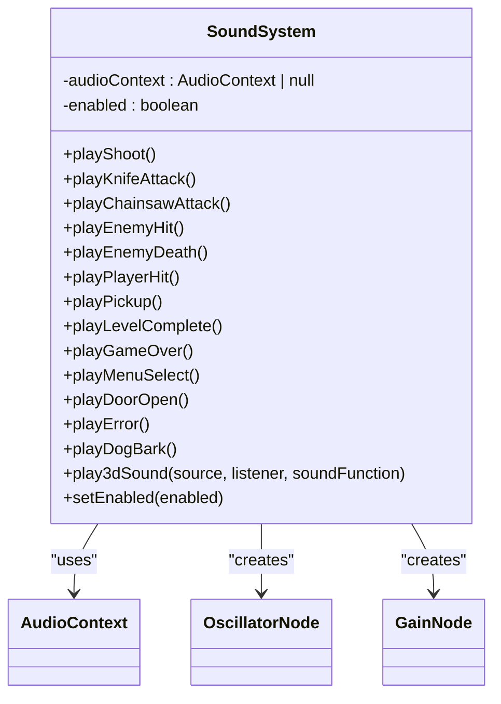
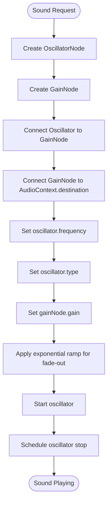
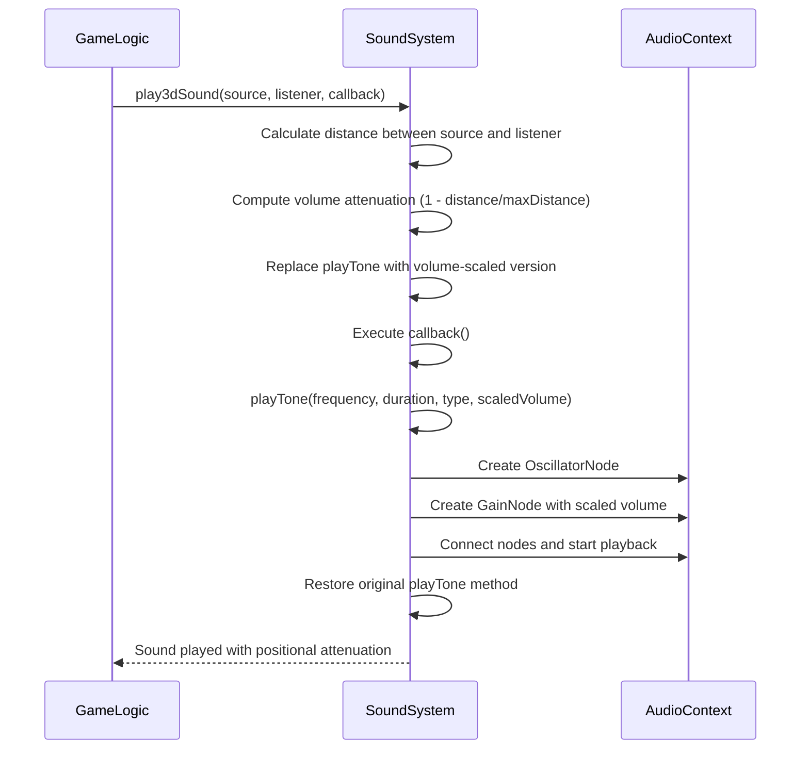
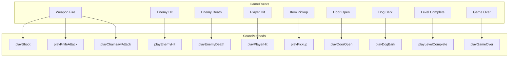

# Audio System

<cite>
**Referenced Files in This Document**   
- [soundSystem.ts](file://src/soundSystem.ts)
- [gameEngine.ts](file://src/gameEngine.ts)
- [weapons.ts](file://src/weapons.ts)
</cite>

## Table of Contents
1. [Introduction](#introduction)
2. [Sound System Architecture](#sound-system-architecture)
3. [Procedural Sound Generation](#procedural-sound-generation)
4. [3D Positional Audio System](#3d-positional-audio-system)
5. [Sound Categories and Game Events](#sound-categories-and-game-events)
6. [Performance Considerations](#performance-considerations)

## Introduction

The audio system in this game implements a comprehensive sound solution using the Web Audio API for procedural sound generation without relying on external audio files. This approach enables dynamic sound creation through mathematical waveforms, providing a lightweight and flexible audio experience. The system is designed as a singleton pattern with centralized audio context management, handling various sound effects including weapon fire, enemy interactions, environmental events, and player actions. The implementation features a 3D positional audio system that adjusts sound panning and volume based on spatial relationships between the player and sound sources.

**Section sources**
- [soundSystem.ts](file://src/soundSystem.ts#L3-L126)

## Sound System Architecture

The sound system is implemented as a singleton class that manages a single AudioContext instance throughout the application lifecycle. This architectural pattern ensures centralized control over audio resources and prevents multiple competing audio contexts from being created, which could lead to performance issues and audio conflicts.

The SoundSystem class encapsulates the Web Audio API functionality, providing a clean interface for sound playback while handling the underlying complexity of audio node creation and management. The system maintains an AudioContext instance as a private property, which is initialized in the constructor. Error handling is implemented to gracefully degrade functionality if the audio context cannot be created, setting an internal enabled flag to false and preventing further sound operations.

**Diagram sources**
- [soundSystem.ts](file://src/soundSystem.ts#L3-L126)

**Section sources**
- [soundSystem.ts](file://src/soundSystem.ts#L3-L126)

## Procedural Sound Generation

The audio system generates all sounds procedurally using the Web Audio API's oscillator nodes, eliminating the need for external audio files. Each sound effect is created by configuring oscillator parameters such as frequency, duration, waveform type, and volume to produce distinctive audio signatures for different game events.

The core sound generation is handled by the private `playTone` method, which creates an oscillator node connected to a gain node for volume control. The gain node uses exponential ramping to create natural-sounding attack and release envelopes, preventing audible clicks and pops. Different waveform types (sine, square, sawtooth, triangle) are selected based on the desired timbre for each sound effect.

Weapon sounds are differentiated by frequency and waveform characteristics. The pistol shot uses a higher frequency (800Hz) with a square wave for a sharp, percussive quality, while the chainsaw employs lower frequencies (200-250Hz) with sawtooth waves to create a rumbling, mechanical texture. Melee weapons like the knife use mid-range frequencies with sawtooth or triangle waves to convey impact.

**Diagram sources**
- [soundSystem.ts](file://src/soundSystem.ts#L15-L45)

**Section sources**
- [soundSystem.ts](file://src/soundSystem.ts#L15-L45)
- [weapons.ts](file://src/weapons.ts#L3-L65)

## 3D Positional Audio System

The system implements a 3D positional audio model that simulates spatial sound based on the relative positions of sound sources and the player (listener). This is achieved through a distance-based attenuation system that calculates volume levels according to the separation between source and listener coordinates.

The `play3dSound` method serves as the primary interface for positional audio, accepting source and listener position objects along with a callback function containing the actual sound playback logic. The method calculates the Euclidean distance between source and listener, then applies a linear attenuation model where volume decreases proportionally with distance up to a maximum range of 20 units. Beyond this range, sounds are completely attenuated (volume = 0).

A key implementation detail is the temporary modification of the `playTone` method within the 3D sound context. The method replaces the original playTone function with a wrapper that scales the base volume by the calculated distance factor, ensuring all sounds played within the callback are properly attenuated. After the callback execution, the original playTone method is restored, maintaining encapsulation and preventing unintended side effects.

**Diagram sources**
- [soundSystem.ts](file://src/soundSystem.ts#L97-L119)
- [gameEngine.ts](file://src/gameEngine.ts#L381-L457)

**Section sources**
- [soundSystem.ts](file://src/soundSystem.ts#L97-L119)

## Sound Categories and Game Events

The audio system categorizes sounds based on game events and triggers appropriate sound effects through direct method calls from game logic components. These categories include weapon sounds, enemy interactions, player actions, environmental events, and UI feedback.

Weapon fire sounds are triggered by the `fireWeapon` function in the game engine, which calls the corresponding play method based on the current weapon type. Enemy hit and death sounds are played when enemies take damage or are defeated, providing audio feedback for combat effectiveness. Player actions such as taking damage trigger the `playPlayerHit` method with a lower frequency triangle wave to convey vulnerability.

Environmental interactions include door opening sounds played when the player or enemies open doors, and dog barks that occur randomly when dog enemies are active in the level. The system also handles game state transitions with distinct audio cues: level completion triggers a three-note ascending melody, while game over produces a descending three-note sequence with decreasing frequencies.

The integration between game events and sound playback is achieved through direct imports of the soundSystem singleton. For example, the `updateEnemies` function calls `soundSystem.play3dSound` with `soundSystem.playDogBark()` as the callback when a dog enemy is present, ensuring spatially accurate bark sounds. Similarly, the `openDoor` function in the game engine triggers door opening sounds with proper 3D positioning.

**Diagram sources**
- [soundSystem.ts](file://src/soundSystem.ts#L47-L95)
- [gameEngine.ts](file://src/gameEngine.ts#L459-L513)

**Section sources**
- [soundSystem.ts](file://src/soundSystem.ts#L47-L95)
- [gameEngine.ts](file://src/gameEngine.ts#L459-L513)

## Performance Considerations

The audio system is designed with performance optimization in mind, particularly regarding audio processing overhead and memory usage. By generating sounds procedurally rather than loading audio files, the system significantly reduces memory footprint and eliminates loading times associated with audio assets.

The singleton pattern ensures only one AudioContext exists at any time, preventing resource duplication and potential audio glitches from multiple competing contexts. The system also implements graceful degradation by catching AudioContext creation errors and disabling sound functionality rather than crashing, maintaining gameplay continuity even in environments where audio is not supported.

A potential performance consideration is the use of `setTimeout` for sequential sounds in methods like `playChainsawAttack` and `playLevelComplete`. While effective for creating rhythmic patterns, these timeouts operate outside the AudioContext's timing system, which could lead to slight timing inaccuracies under heavy load. A more precise approach would use the AudioContext's currentTime for scheduling, but the current implementation provides adequate results for the game's requirements.

The 3D audio implementation temporarily overrides the `playTone` method, which while functional, represents a fragile pattern that could be disrupted by concurrent sound calls. A more robust approach might use a dedicated gain node with distance-based gain values, but the current solution effectively meets the game's spatial audio needs with minimal complexity.

**Section sources**
- [soundSystem.ts](file://src/soundSystem.ts#L3-L126)