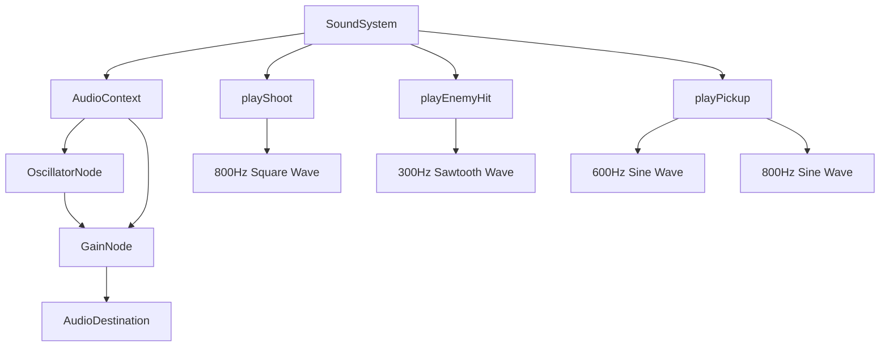
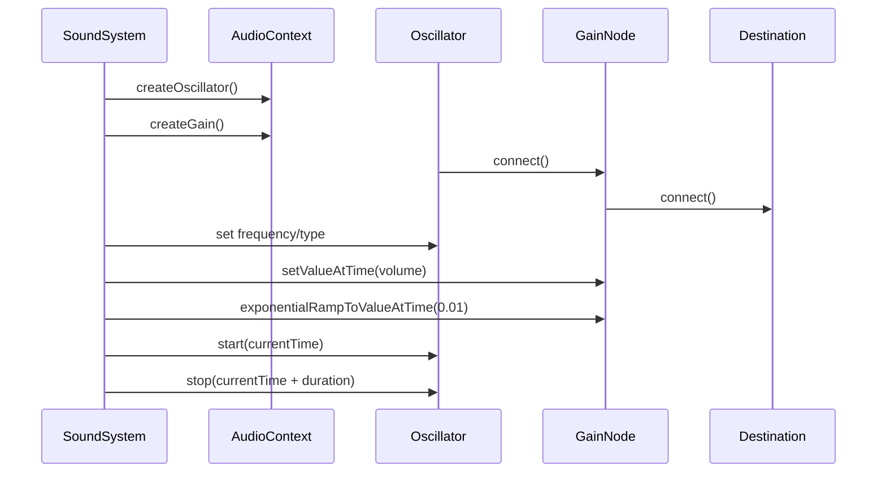
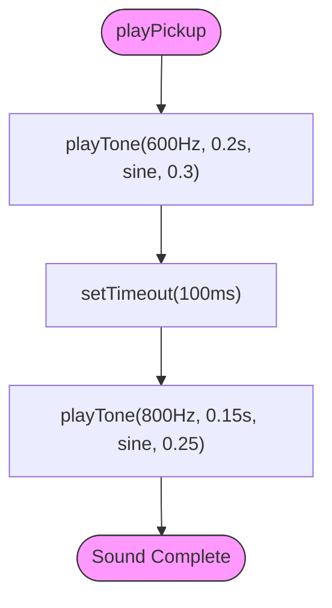

# Procedural Sound Generation

<cite>
**Referenced Files in This Document**  
- [soundSystem.ts](file://src/soundSystem.ts)
</cite>

## Table of Contents
1. [Introduction](#introduction)
2. [Core Components](#core-components)
3. [Architecture Overview](#architecture-overview)
4. [Detailed Component Analysis](#detailed-component-analysis)
5. [Performance Considerations](#performance-considerations)
6. [Creating New Procedural Sounds](#creating-new-procedural-sounds)
7. [Conclusion](#conclusion)

## Introduction

The procedural sound generation system in this game leverages the Web Audio API to create dynamic audio effects without relying on external sound files. This approach enables lightweight audio feedback that is fully generated in real-time using oscillators and gain nodes. The `SoundSystem` class serves as the central audio engine, providing methods for playing various sound effects such as weapon fire, enemy impacts, and item pickups. By synthesizing tones programmatically, the system ensures consistent audio behavior across platforms while minimizing asset loading requirements.

## Core Components

The procedural sound generation system is built around the `SoundSystem` class, which encapsulates all audio functionality. This class manages the Web Audio API context and provides high-level methods for triggering specific sound effects. The core mechanism relies on the `playTone` method, which creates and configures oscillator and gain nodes to produce tones with specific characteristics. Sound effects are constructed by combining multiple tones with precise timing and parameter variations, creating distinctive auditory feedback for different game events.

**Section sources**
- [soundSystem.ts](file://src/soundSystem.ts#L3-L124)

## Architecture Overview

The sound system follows a procedural synthesis architecture where all audio is generated algorithmically at runtime. At initialization, the system creates an `AudioContext` instance, which serves as the foundation for all audio operations. When a sound effect is triggered, the system creates temporary audio nodes (oscillators and gain nodes), connects them into a signal chain, schedules their playback, and automatically releases them after completion. This eliminates the need for manual memory management while ensuring efficient resource utilization.

**Diagram sources**
- [soundSystem.ts](file://src/soundSystem.ts#L3-L124)

## Detailed Component Analysis

### SoundSystem Class Analysis

The `SoundSystem` class implements a procedural audio engine that generates all sound effects using the Web Audio API's oscillator capabilities. The system is initialized with an `AudioContext`, which may fail to create in certain browser environments, triggering a graceful degradation mode.

#### Tone Generation Mechanism

**Diagram sources**
- [soundSystem.ts](file://src/soundSystem.ts#L16-L33)

#### Sound Effect Construction
The system constructs complex sound effects by combining multiple tones with precise timing. The `setTimeout` function sequences multi-tone effects, creating layered audio patterns that simulate real-world sounds.

**Diagram sources**
- [soundSystem.ts](file://src/soundSystem.ts#L61-L64)

### Weapon and Impact Sounds

The sound system implements distinct audio signatures for different game events by varying frequency, duration, waveform type, and volume parameters. Weapon fire sounds use higher frequencies and square waves for sharp, percussive effects, while impact sounds employ lower frequencies and sawtooth waves for more aggressive tones.

**Section sources**
- [soundSystem.ts](file://src/soundSystem.ts#L35-L37)
- [soundSystem.ts](file://src/soundSystem.ts#L48-L50)
- [soundSystem.ts](file://src/soundSystem.ts#L61-L64)

## Performance Considerations

The procedural sound system is designed with performance optimization in mind. Audio nodes are created on-demand and automatically garbage collected after playback completes, preventing memory leaks. The `AudioContext` is instantiated once and reused for all sound operations, minimizing initialization overhead. The system gracefully handles environments where Web Audio API is unavailable by disabling audio functionality without crashing. Volume calculations for 3D positional audio are optimized with simple distance-based attenuation, avoiding computationally expensive spatialization algorithms.

The exponential decay envelope implemented with `exponentialRampToValueAtTime` creates natural-sounding fades while being computationally efficient. By using short durations (typically 0.1–0.5 seconds) and moderate volumes, the system ensures that audio operations have minimal impact on overall game performance. The temporary override pattern used in `play3dSound` allows for dynamic volume adjustment without requiring complex audio graph modifications.

**Section sources**
- [soundSystem.ts](file://src/soundSystem.ts#L16-L33)
- [soundSystem.ts](file://src/soundSystem.ts#L107-L119)

## Creating New Procedural Sounds

Developers can create new procedural sounds by understanding the parameter space available in the `playTone` method. Frequency (in Hz) controls pitch, with higher values producing sharper sounds suitable for alerts and lower values creating heavier impacts. Duration (in seconds) affects the perceived weight of the sound, with shorter durations feeling more percussive. The waveform type significantly shapes the timbre:

- **Sine**: Smooth, pure tones for positive feedback
- **Square**: Bright, digital sounds for weapon effects  
- **Sawtooth**: Aggressive, buzzy tones for damage and warnings
- **Triangle**: Mellow, rounded sounds for subtle interactions

Volume levels between 0.2–0.4 provide appropriate loudness without overwhelming other game audio. Multi-tone effects can be created by chaining `playTone` calls with `setTimeout`, allowing for arpeggiated sequences or layered sounds. For example, a power-up sound might combine a rising frequency sequence, while an explosion could layer multiple low-frequency sawtooth waves with slight timing offsets.

**Section sources**
- [soundSystem.ts](file://src/soundSystem.ts#L16-L33)

## Conclusion

The procedural sound generation system demonstrates an effective approach to creating rich audio feedback without external assets. By leveraging the Web Audio API's oscillator capabilities, the system produces distinctive sounds for various game events while maintaining excellent performance characteristics. The modular design of the `SoundSystem` class makes it easy to extend with new sound effects, and the parameter-driven approach allows for fine-tuned audio design. This implementation serves as a robust foundation for games requiring lightweight, dynamic audio that can be easily customized and optimized.