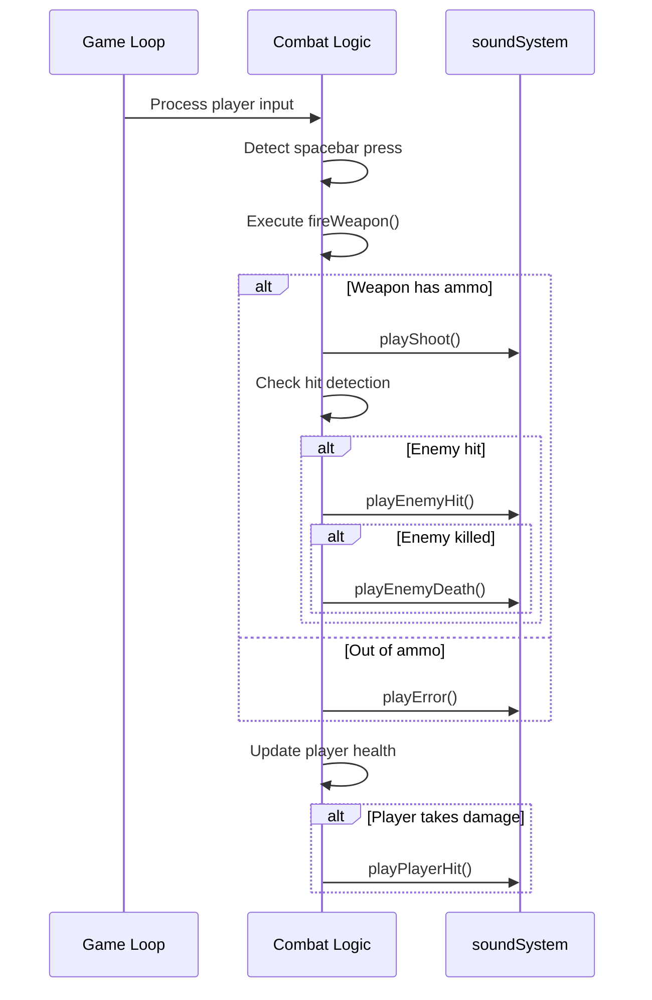
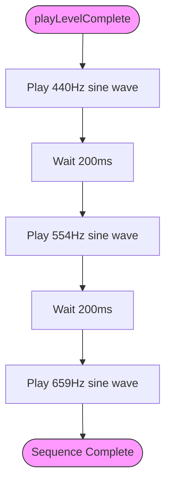

# Sound Effects Library

<cite>
**Referenced Files in This Document**  
- [soundSystem.ts](file://src/soundSystem.ts)
- [App.tsx](file://src/App.tsx)
</cite>

## Table of Contents
1. [Introduction](#introduction)
2. [Sound System Architecture](#sound-system-architecture)
3. [Core Sound Effects Reference](#core-sound-effects-reference)
4. [Acoustic Design Principles](#acoustic-design-principles)
5. [Game Event Integration](#game-event-integration)
6. [Complex Sound Sequencing](#complex-sound-sequencing)
7. [Sound Categorization and Organization](#sound-categorization-and-organization)
8. [Volume Balancing Strategy](#volume-balancing-strategy)
9. [Conclusion](#conclusion)

## Introduction

The SoundSystem class implements a comprehensive audio feedback system for the game, utilizing the Web Audio API to generate procedural sound effects through oscillator synthesis. This documentation details the implementation, design principles, and integration of the sound effects library, focusing on how audio cues enhance gameplay feedback and user experience. The system is designed to be lightweight and efficient, generating sounds programmatically rather than relying on pre-recorded audio files.

**Section sources**
- [soundSystem.ts](file://src/soundSystem.ts#L3-L126)

## Sound System Architecture

The SoundSystem class serves as a singleton audio manager that handles all sound generation through the Web Audio API. It initializes an AudioContext upon construction and provides a private `playTone` method that serves as the foundation for all sound effects. The architecture follows a layered approach where higher-level sound methods build upon the basic tone generation functionality.

```mermaid
classDiagram
class SoundSystem {
-audioContext : AudioContext | null
-enabled : boolean
+constructor()
-playTone(frequency : number, duration : number, type : OscillatorType, volume : number)
+playShoot()
+playEnemyHit()
+playLevelComplete()
+playDoorOpen()
+play3dSound(source : {x : number, y : number}, listener : {x : number, y : number}, soundFunction : () => void)
+setEnabled(enabled : boolean)
}
SoundSystem --> AudioContext : "uses"
SoundSystem --> OscillatorNode : "creates"
SoundSystem --> GainNode : "creates"
```

**Diagram sources**
- [soundSystem.ts](file://src/soundSystem.ts#L3-L126)

**Section sources**
- [soundSystem.ts](file://src/soundSystem.ts#L3-L126)

## Core Sound Effects Reference

The following table provides a comprehensive reference of all sound effects implemented in the SoundSystem, including their technical parameters and gameplay context:

| Sound Effect | Waveform | Frequency (Hz) | Duration (s) | Volume | Gameplay Context | Method Name |
|--------------|----------|----------------|--------------|--------|------------------|-------------|
| Weapon Fire | Square | 800 | 0.1 | 0.2 | Player shooting | playShoot() |
| Enemy Hit | Sawtooth | 300 | 0.2 | 0.3 | Enemy taking damage | playEnemyHit() |
| Level Complete | Sine | 440, 554, 659 | 0.2, 0.2, 0.4 | 0.3 | Level completion | playLevelComplete() |
| Door Open | Sine | 300, 350 | 0.15, 0.2 | 0.25, 0.2 | Door interaction | playDoorOpen() |
| Knife Attack | Sawtooth | 400 | 0.15 | 0.25 | Melee combat | playKnifeAttack() |
| Chainsaw Attack | Sawtooth | 200, 250 | 0.2, 0.15 | 0.3, 0.25 | Melee combat | playChainsawAttack() |
| Player Hit | Triangle | 150 | 0.3 | 0.4 | Player taking damage | playPlayerHit() |
| Pickup | Sine | 600, 800 | 0.2, 0.15 | 0.3, 0.25 | Item collection | playPickup() |
| Game Over | Sawtooth | 400, 300, 200 | 0.3, 0.3, 0.5 | 0.3 | Game completion | playGameOver() |
| Menu Select | Square | 500 | 0.1 | 0.2 | UI interaction | playMenuSelect() |
| Error | Sawtooth | 150, 100 | 0.2, 0.15 | 0.3, 0.25 | Invalid action | playError() |
| Dog Bark | Sawtooth | 600, 550 | 0.1, 0.1 | 0.2, 0.15 | Environmental | playDogBark() |

**Section sources**
- [soundSystem.ts](file://src/soundSystem.ts#L35-L124)

## Acoustic Design Principles

The sound effects library employs specific waveform choices to create distinct auditory signatures that correspond to different gameplay contexts. These design decisions enhance player feedback and create an intuitive audio language within the game.

Square waves are used for weapon fire sounds (playShoot) and menu selections (playMenuSelect) due to their bright, assertive character that cuts through other audio elements. This makes critical feedback like shooting and UI interactions immediately noticeable to the player.

Sawtooth waves are employed for damage-related sounds including enemy hits (playEnemyHit), player hits (playPlayerHit), and error notifications (playError). The harsh, buzzy quality of sawtooth waves effectively communicates negative events and creates an appropriate sense of urgency or discomfort.

Sine waves are reserved for positive events and environmental interactions. The pure, smooth quality of sine waves is used for the level completion melody (playLevelComplete), door opening (playDoorOpen), and item pickups (playPickup). This creates a pleasing auditory reward that contrasts with the more aggressive sounds of combat.

The volume levels are carefully balanced to ensure critical feedback remains audible while preventing audio fatigue. Combat sounds are generally louder (volume 0.3-0.4) to emphasize their importance, while UI and environmental sounds are softer (volume 0.2-0.25) to avoid overwhelming the player.

**Section sources**
- [soundSystem.ts](file://src/soundSystem.ts#L35-L124)

## Game Event Integration

The sound effects are triggered by game events in App.tsx through the exported soundSystem singleton. This integration follows a clean separation of concerns where gameplay logic determines when sounds should play, while the SoundSystem handles the audio generation.



**Diagram sources**
- [App.tsx](file://src/App.tsx#L320-L366)
- [soundSystem.ts](file://src/soundSystem.ts#L35-L50)

**Section sources**
- [App.tsx](file://src/App.tsx#L320-L366)
- [soundSystem.ts](file://src/soundSystem.ts#L35-L50)

## Complex Sound Sequencing

The SoundSystem implements sophisticated sequencing techniques for sounds that require multiple tones or precise timing. These complex sounds use JavaScript's setTimeout function to create rhythmic patterns and melodic sequences that enhance their auditory impact.

The playLevelComplete method demonstrates this sequencing by playing three ascending sine wave tones (440Hz, 554Hz, and 659Hz) with 200ms delays between each note, creating a triumphant arpeggio that signals level completion. Similarly, playDoorOpen uses a two-tone sequence with a 100ms delay to simulate the mechanical action of a door unlocking and opening.

The most complex sequencing is found in playGameOver, which plays three descending sawtooth wave tones (400Hz, 300Hz, and 200Hz) with 300ms delays, creating a dramatic falling cadence that emphasizes the finality of game over. The playChainsawAttack method uses a 50ms delay between two slightly different frequencies to create a vibrating, mechanical quality appropriate for the weapon.

These sequencing techniques transform simple tone generation into expressive audio events that convey more information than single tones could achieve.



**Diagram sources**
- [soundSystem.ts](file://src/soundSystem.ts#L66-L70)
- [soundSystem.ts](file://src/soundSystem.ts#L82-L85)
- [soundSystem.ts](file://src/soundSystem.ts#L77-L80)

**Section sources**
- [soundSystem.ts](file://src/soundSystem.ts#L66-L85)

## Sound Categorization and Organization

The sound effects are implicitly categorized by gameplay context, which improves code maintainability and helps developers understand the audio feedback system. This organization follows three primary categories:

Combat sounds include weapon effects (playShoot, playKnifeAttack, playChainsawAttack), damage feedback (playEnemyHit, playEnemyDeath, playPlayerHit), and error states (playError). These sounds use more aggressive waveforms (square and sawtooth) and are designed to be immediately noticeable during intense gameplay moments.

UI and progression sounds encompass menu interactions (playMenuSelect), level completion (playLevelComplete), and game over states (playGameOver). These sounds provide feedback on game state changes and use more melodic sequences to create emotional responses.

Environmental and interaction sounds include door operations (playDoorOpen) and special effects (playDogBark, playPickup). These sounds enhance immersion and provide feedback on player interactions with the game world.

This categorization allows for systematic volume balancing and makes it easier to modify or extend the sound system. When adding new sound effects, developers can follow these established patterns to maintain consistency in the audio design.

**Section sources**
- [soundSystem.ts](file://src/soundSystem.ts#L35-L124)

## Volume Balancing Strategy

The sound system implements a sophisticated volume balancing strategy to ensure critical feedback remains audible while preventing audio overload. Each sound effect is assigned a volume level between 0.2 and 0.4 based on its importance and context.

Combat sounds have higher volume levels (0.3-0.4) to ensure they cut through other audio during intense gameplay. The player hit sound (playPlayerHit) has the highest volume at 0.4, emphasizing its importance as critical feedback for player health.

UI and progression sounds use moderate volumes (0.3) to provide clear feedback without being intrusive. The level completion and game over sequences use consistent volume levels across their notes to maintain a balanced auditory experience.

Environmental sounds have the lowest volumes (0.2-0.25) to avoid distracting from gameplay while still providing necessary feedback. The door opening sound uses a decreasing volume pattern (0.25 then 0.2) to simulate the mechanical action fading away.

The system also includes a 3D sound positioning method (play3dSound) that dynamically adjusts volume based on distance between the sound source and listener, further enhancing the spatial audio experience and natural volume balancing.

**Section sources**
- [soundSystem.ts](file://src/soundSystem.ts#L14-L33)
- [soundSystem.ts](file://src/soundSystem.ts#L35-L124)

## Conclusion

The SoundSystem class provides a comprehensive and well-organized audio feedback system that enhances the gameplay experience through carefully designed procedural sound effects. By leveraging the Web Audio API's oscillator capabilities, the system generates all sounds programmatically, resulting in a lightweight implementation that doesn't require external audio assets.

The thoughtful acoustic design, with specific waveform choices for different gameplay contexts, creates an intuitive audio language that helps players understand game events through sound alone. The clear categorization of sounds by context improves code maintainability and provides a consistent framework for future audio additions.

The integration between gameplay events in App.tsx and sound triggers in SoundSystem demonstrates a clean separation of concerns, where game logic determines when sounds should play while the audio system handles the technical implementation. This architecture ensures that audio feedback remains tightly coupled to gameplay while maintaining code organization and readability.