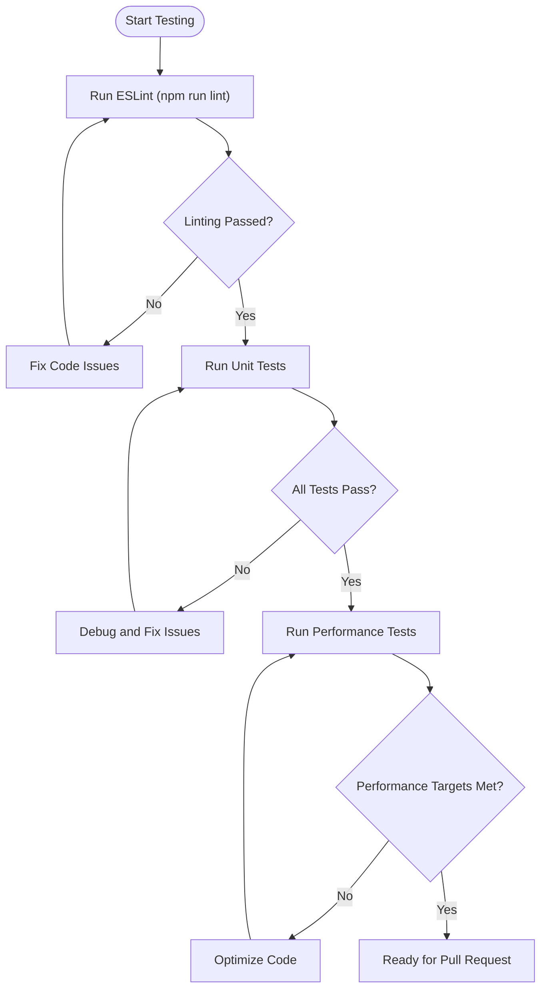
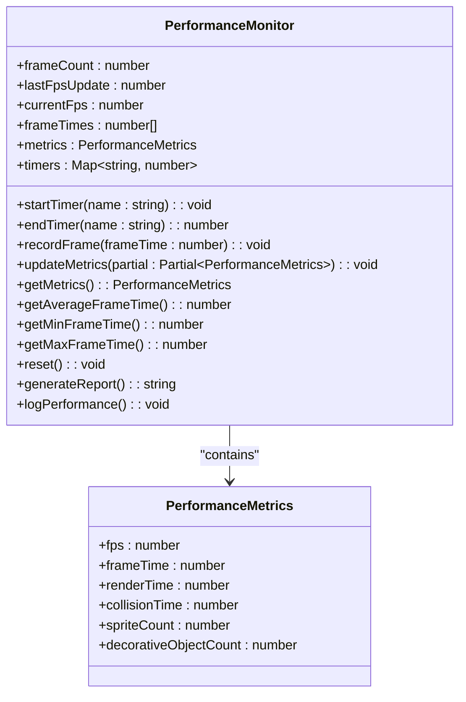

# Contributing

<cite>
**Referenced Files in This Document**   
- [eslint.config.js](file://eslint.config.js)
- [tsconfig.json](file://tsconfig.json)
- [package.json](file://package.json)
- [vite.config.ts](file://vite.config.ts)
- [src/performanceMonitor.ts](file://src/performanceMonitor.ts)
- [src/backwardCompatibilityTests.ts](file://src/backwardCompatibilityTests.ts)
- [docs/TESTING.md](file://docs/TESTING.md)
- [docs/PERFORMANCE_OPTIMIZATION.md](file://docs/PERFORMANCE_OPTIMIZATION.md)
- [docs/LEVEL-EDITOR-README.md](file://docs/LEVEL-EDITOR-README.md)
- [docs/LEVEL-EDITOR-SUMMARY.md](file://docs/LEVEL-EDITOR-SUMMARY.md)
- [docs/LEVEL-EDITOR-QUICK-REFERENCE.md](file://docs/LEVEL-EDITOR-QUICK-REFERENCE.md)
- [docs/LEVEL-EDITOR-KONZEPT.md](file://docs/LEVEL-EDITOR-KONZEPT.md)
- [editor-server.mjs](file://editor-server.mjs)
- [vite.editor.config.ts](file://vite.editor.config.ts)
</cite>

## Table of Contents
1. [Code Style Guidelines](#code-style-guidelines)
2. [Pull Request Process](#pull-request-process)
3. [Issue Reporting](#issue-reporting)
4. [Testing Procedures](#testing-procedures)
5. [Development Tools](#development-tools)
6. [Backward Compatibility and Performance](#backward-compatibility-and-performance)
7. [Versioning and Release Process](#versioning-and-release-process)

## Code Style Guidelines

The egor project enforces consistent code style through ESLint and TypeScript configurations. All contributions must adhere to these standards to ensure code quality and maintainability.

The project uses ESLint with the following configuration in `eslint.config.js`:
- TypeScript ESLint for type-aware linting
- React Hooks plugin for enforcing React best practices
- React Refresh plugin for Vite integration
- JavaScript recommended rules from ESLint
- Browser globals environment

TypeScript is configured through `tsconfig.json` with project references to separate app and node configurations, ensuring proper type checking across the codebase.

All code must follow these conventions:
- Use TypeScript interfaces and types for all data structures
- Follow React best practices for component design
- Use consistent naming conventions (camelCase for variables, PascalCase for components)
- Maintain proper file organization within the src directory
- Include JSDoc comments for complex functions and components

**Section sources**
- [eslint.config.js](file://eslint.config.js#L1-L24)
- [tsconfig.json](file://tsconfig.json#L1-L8)
- [package.json](file://package.json#L1-L40)

## Pull Request Process

The pull request process for the egor project follows a standardized workflow from fork to merge:

1. Fork the repository and create a feature branch with a descriptive name
2. Implement your changes following the code style guidelines
3. Ensure all tests pass before submission
4. Commit your changes with clear, descriptive messages
5. Push your branch to your fork
6. Create a pull request with a detailed description of the changes
7. Address any feedback from code reviewers
8. Once approved, the pull request will be merged by a maintainer

Branch naming conventions should follow the pattern `feature/descriptive-name` for new features, `bugfix/issue-description` for bug fixes, and `docs/update-description` for documentation changes.

All pull requests require at least one approval from a project maintainer before merging. The CI/CD pipeline automatically runs tests and linting on all pull requests to ensure code quality.

**Section sources**
- [package.json](file://package.json#L1-L40)

## Issue Reporting

The project uses GitHub Issues for tracking bugs, feature requests, and enhancements. When reporting issues, please use the appropriate template to ensure all necessary information is provided.

For bug reports, include:
- Steps to reproduce the issue
- Expected behavior
- Actual behavior
- Browser and operating system information
- Any relevant error messages or screenshots

For feature requests, include:
- Detailed description of the proposed feature
- Use cases and benefits
- Any design considerations or implementation suggestions
- Priority level if applicable

The issue tracker is regularly monitored, and the team aims to respond to all new issues within 48 hours. Please search existing issues before creating a new one to avoid duplicates.

**Section sources**
- [README.md](file://README.md#L1-L186)

## Testing Procedures

The egor project includes comprehensive testing procedures to ensure code quality and functionality. All contributions should include appropriate tests and pass existing test suites.

Automated tests that should be run before submission include:
- ESLint for code style validation (`npm run lint`)
- Backward compatibility tests to ensure existing functionality is preserved
- Performance tests to verify optimization standards are met

The project includes specialized testing files:
- `src/backwardCompatibilityTests.ts` contains tests for maintaining compatibility with previous versions
- `docs/TESTING.md` provides detailed guidance on running and understanding test results
- `run-compatibility-tests.mjs` enables CLI-based testing

For browser-based testing, start the development server with `npm run dev` and navigate to the test pages. For CLI testing, use the provided scripts to run tests in Node.js environment.

All tests must pass before a pull request can be merged. New features should include corresponding test cases to verify functionality and prevent regressions.

**Diagram sources **
- [package.json](file://package.json#L1-L40)
- [docs/TESTING.md](file://docs/TESTING.md#L1-L144)
- [src/backwardCompatibilityTests.ts](file://src/backwardCompatibilityTests.ts#L1-L504)

**Section sources**
- [docs/TESTING.md](file://docs/TESTING.md#L1-L144)
- [src/backwardCompatibilityTests.ts](file://src/backwardCompatibilityTests.ts#L1-L504)

## Development Tools

The egor project utilizes several development tools to enhance productivity and maintain code quality.

### React Compiler Plugin
The project includes the React compiler plugin configured in `vite.config.ts`. This plugin enables advanced React optimizations and features during development. It's integrated with Vite through the React plugin configuration, allowing for efficient compilation and hot module replacement.

### Level Editor
The project includes a visual level editor for creating and editing game levels without writing code. The editor can be started with `npm run editor`, which launches both the frontend (on port 3000) and backend server (on port 3001). The editor provides:
- Visual 2D level editing with interactive canvas
- Load and save functionality for level files
- Entity placement and editing (enemies, items, decorative objects)
- Tile type modification
- Player start position setting
- Level dimension resizing
- Undo/redo functionality
- Keyboard shortcuts for common actions

The editor is excluded from production builds and only runs in development mode. It consists of a React frontend and an Express.js backend that provides file system access to the `src/levels/` directory.

### Build Tools
The project uses Vite as the build tool with the following scripts:
- `npm run dev`: Start the development server
- `npm run build`: Create a production build
- `npm run preview`: Preview the production build
- `npm run editor`: Start the level editor

**Section sources**
- [vite.config.ts](file://vite.config.ts#L1-L14)
- [package.json](file://package.json#L1-L40)
- [editor-server.mjs](file://editor-server.mjs)
- [vite.editor.config.ts](file://vite.editor.config.ts)
- [docs/LEVEL-EDITOR-README.md](file://docs/LEVEL-EDITOR-README.md#L1-L399)
- [docs/LEVEL-EDITOR-SUMMARY.md](file://docs/LEVEL-EDITOR-SUMMARY.md#L1-L251)

## Backward Compatibility and Performance

The egor project places strong emphasis on maintaining backward compatibility and performance standards.

### Backward Compatibility
The project includes comprehensive backward compatibility tests in `src/backwardCompatibilityTests.ts` that verify:
- Compatibility with old savegame formats
- Proper handling of map history across sessions
- Graceful degradation with corrupted data
- Fallback mechanisms when LocalStorage is unavailable
- Proper initialization of empty history
- Correct map variant selection logic

These tests ensure that new features and changes do not break existing functionality or user data. The backward compatibility suite is automatically run as part of the testing process.

### Performance Standards
The project maintains high performance standards with several optimization techniques:
- View frustum culling to render only visible sprites
- Texture caching with LRU eviction policy
- Optimized collision detection with early exit conditions
- Efficient rendering algorithms

Performance is monitored using the `performanceMonitor` utility in `src/performanceMonitor.ts`, which tracks key metrics such as FPS, frame time, render time, and collision time. The performance monitor provides detailed reports and status indicators.

The project aims to maintain 60+ FPS on modern browsers, even with complex levels containing numerous objects. Performance tests are included in the test suite to verify these standards are met.

**Diagram sources **
- [src/performanceMonitor.ts](file://src/performanceMonitor.ts#L1-L146)
- [docs/PERFORMANCE_OPTIMIZATION.md](file://docs/PERFORMANCE_OPTIMIZATION.md#L1-L168)

**Section sources**
- [src/performanceMonitor.ts](file://src/performanceMonitor.ts#L1-L146)
- [src/backwardCompatibilityTests.ts](file://src/backwardCompatibilityTests.ts#L1-L504)
- [docs/PERFORMANCE_OPTIMIZATION.md](file://docs/PERFORMANCE_OPTIMIZATION.md#L1-L168)

## Versioning and Release Process

The egor project follows semantic versioning (SemVer) for its release process. The current version is specified in `package.json` as 0.2.3.

The versioning scheme follows the pattern MAJOR.MINOR.PATCH:
- MAJOR version for incompatible API changes
- MINOR version for backward-compatible functionality additions
- PATCH version for backward-compatible bug fixes

The release process includes the following steps:
1. Ensure all tests pass and code quality standards are met
2. Update the version number in `package.json` according to SemVer rules
3. Create a release branch from the main development branch
4. Generate release notes documenting changes, new features, and bug fixes
5. Create a git tag for the release version
6. Publish the release on GitHub
7. Deploy the production build to the hosting platform

Production builds are created using the `npm run build` command, which runs TypeScript compilation and Vite build processes. The build output is optimized for production with minification and bundling.

Regular releases are planned based on feature completion and bug fix cycles. The project maintains a changelog to document all changes between versions.

**Section sources**
- [package.json](file://package.json#L1-L40)