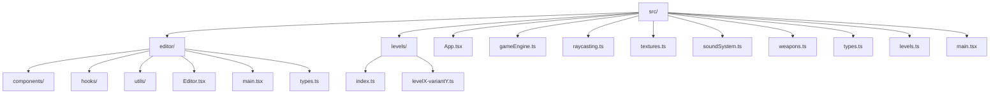
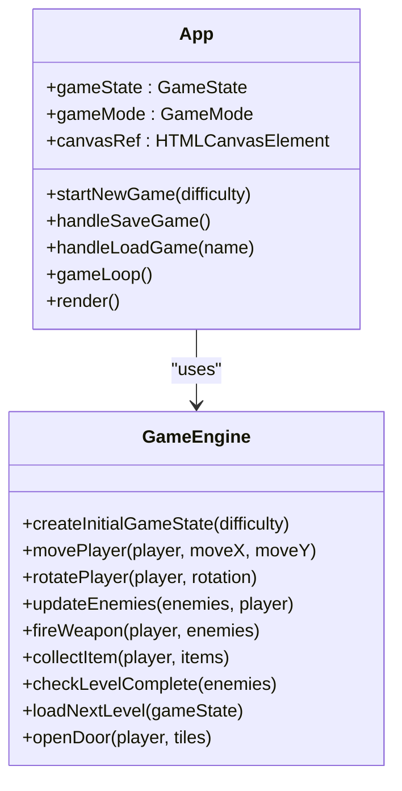
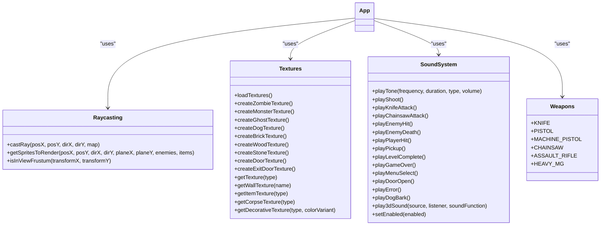
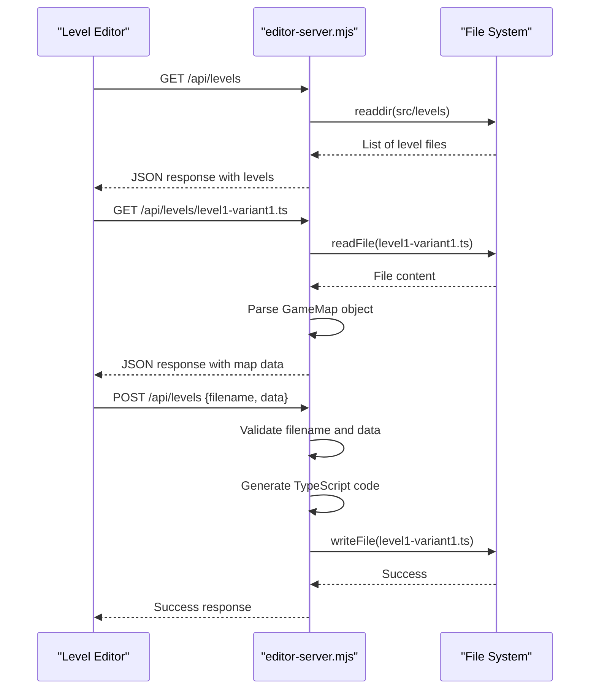

# Directory Structure

<cite>
**Referenced Files in This Document**   
- [App.tsx](file://src/App.tsx)
- [gameEngine.ts](file://src/gameEngine.ts)
- [raycasting.ts](file://src/raycasting.ts)
- [textures.ts](file://src/textures.ts)
- [soundSystem.ts](file://src/soundSystem.ts)
- [weapons.ts](file://src/weapons.ts)
- [types.ts](file://src/types.ts)
- [levels.ts](file://src/levels.ts)
- [main.tsx](file://src/main.tsx)
- [editor/Editor.tsx](file://src/editor/Editor.tsx)
- [editor/main.tsx](file://src/editor/main.tsx)
- [editor/types.ts](file://src/editor/types.ts)
- [levels/index.ts](file://src/levels/index.ts)
- [vite.config.ts](file://vite.config.ts)
- [vite.editor.config.ts](file://vite.editor.config.ts)
- [editor-server.mjs](file://editor-server.mjs)
</cite>

## Table of Contents
1. [Project Structure Overview](#project-structure-overview)
2. [Game Code Organization](#game-code-organization)
3. [Editor Code Organization](#editor-code-organization)
4. [Levels Directory Structure](#levels-directory-structure)
5. [Core Utility Files](#core-utility-files)
6. [Configuration Files](#configuration-files)
7. [Editor Backend Server](#editor-backend-server)
8. [Architectural Reasoning](#architectural-reasoning)

## Project Structure Overview

The project follows a modular architecture with a clear separation between game code and editor functionality. The directory structure is organized to maintain this separation while providing a scalable framework for level management and game development.



**Diagram sources**
- [src/](file://src/)
- [src/editor/](file://src/editor/)
- [src/levels/](file://src/levels/)

**Section sources**
- [src/](file://src/)

## Game Code Organization

The game code is located in the root of the src/ directory and contains all the core functionality for the game runtime. This includes the main application component, game engine, rendering utilities, and game assets.

The primary game entry point is App.tsx, which serves as the main React component for the game interface. This component manages game state, handles user input, and coordinates rendering through the canvas element. The game engine (gameEngine.ts) contains the core game logic including player movement, enemy AI, combat mechanics, and level progression.



**Diagram sources**
- [src/App.tsx](file://src/App.tsx#L0-L799)
- [src/gameEngine.ts](file://src/gameEngine.ts#L0-L704)

**Section sources**
- [src/App.tsx](file://src/App.tsx)
- [src/gameEngine.ts](file://src/gameEngine.ts)
- [src/main.tsx](file://src/main.tsx)

## Editor Code Organization

The editor code is contained within the src/editor/ directory, providing a complete level editing environment separate from the game runtime. This separation allows for independent development and deployment of the editor functionality.

The editor is implemented as a React application with a component-based architecture. The main Editor.tsx component serves as the container for all editor functionality, coordinating between various UI components and state management hooks. The editor includes a comprehensive set of components for level manipulation, including MapCanvas for visual editing, ContextMenu for right-click actions, and various dialog components for entity management.

```mermaid
classDiagram
class Editor {
+currentLevel : number
+currentVariant : number
+contextMenu : ContextMenuState
+entityDialog : EntityDialogType
+newLevelDialog : NewLevelDialogType
+handleLevelLoad(level, variant)
+handleContextMenu(event, x, y)
+handleSave()
+handleNewLevel()
+handleEntityDialogSave(data)
}
class MapCanvas {
+canvasRef : HTMLCanvasElement
+hoverTile : {x, y}
+renderMap(ctx, mapData)
+handleMouseMove(event)
+handleClick(event)
+handleContextMenuClick(event)
}
class ContextMenu {
+x : number
+y : number
+options : ContextMenuOption[]
+handleOptionClick(option)
}
class EntityDialog {
+type : EntityDialogType
+entity : any
+position : {x, y}
+onSave(data)
+onCancel()
}
Editor --> MapCanvas : "contains"
Editor --> ContextMenu : "contains"
Editor --> EntityDialog : "contains"
Editor --> Toolbar : "contains"
Editor --> LevelSelector : "contains"
```

**Diagram sources**
- [src/editor/Editor.tsx](file://src/editor/Editor.tsx#L0-L799)
- [src/editor/components/MapCanvas.tsx](file://src/editor/components/MapCanvas.tsx#L0-L144)
- [src/editor/components/ContextMenu.tsx](file://src/editor/components/ContextMenu.tsx)
- [src/editor/components/EntityDialog.tsx](file://src/editor/components/EntityDialog.tsx)

**Section sources**
- [src/editor/Editor.tsx](file://src/editor/Editor.tsx)
- [src/editor/main.tsx](file://src/editor/main.tsx)
- [src/editor/types.ts](file://src/editor/types.ts)

## Levels Directory Structure

The levels/ directory contains 35 level variants organized across 7 difficulty levels, with 5 variants per level. This structure enables procedural level selection and replayability by providing multiple configurations for each difficulty tier.

Each level variant is stored in a separate TypeScript file following the naming convention levelX-variantY.ts, where X represents the level number (1-7) and Y represents the variant number (1-5). The index.ts file in the levels directory serves as a barrel file, re-exporting all level variants for convenient import elsewhere in the application.

```mermaid
graph TD
A[levels/] --> B[index.ts]
A --> C[level1-variant1.ts]
A --> D[level1-variant2.ts]
A --> E[level1-variant3.ts]
A --> F[level1-variant4.ts]
A --> G[level1-variant5.ts]
A --> H[level2-variant1.ts]
A --> I[level2-variant2.ts]
A --> J[level2-variant3.ts]
A --> K[level2-variant4.ts]
A --> L[level2-variant5.ts]
A --> M[level3-variant1.ts]
A --> N[level3-variant2.ts]
A --> O[level3-variant3.ts]
A --> P[level3-variant4.ts]
A --> Q[level3-variant5.ts]
A --> R[level4-variant1.ts]
A --> S[level4-variant2.ts]
A --> T[level4-variant3.ts]
A --> U[level4-variant4.ts]
A --> V[level4-variant5.ts]
A --> W[level5-variant1.ts]
A --> X[level5-variant2.ts]
A --> Y[level5-variant3.ts]
A --> Z[level5-variant4.ts]
AA[level5-variant5.ts]
AB[level6-variant1.ts]
AC[level6-variant2.ts]
AD[level6-variant3.ts]
AE[level6-variant4.ts]
AF[level6-variant5.ts]
AG[level7-variant1.ts]
AH[level7-variant2.ts]
AI[level7-variant3.ts]
AJ[level7-variant4.ts]
AK[level7-variant5.ts]
```



**Diagram sources**
- [src/levels/](file://src/levels/)
- [src/levels/index.ts](file://src/levels/index.ts#L0-L48)

**Section sources**
- [src/levels/index.ts](file://src/levels/index.ts)
- [src/levels/level1-variant1.ts](file://src/levels/level1-variant1.ts)

## Core Utility Files

The src/ directory contains several core utility files that provide essential functionality for both the game and editor. These files are designed to be reusable across different components of the application.

The raycasting.ts file implements the core rendering algorithm for the game's 3D-like perspective, using the Digital Differential Analysis (DDA) algorithm to cast rays from the player's position and determine wall distances. The textures.ts file manages all visual assets, creating canvas-based textures for enemies, items, and environmental elements.



**Diagram sources**
- [src/raycasting.ts](file://src/raycasting.ts#L0-L229)
- [src/textures.ts](file://src/textures.ts#L0-L799)
- [src/soundSystem.ts](file://src/soundSystem.ts#L0-L127)
- [src/weapons.ts](file://src/weapons.ts)

**Section sources**
- [src/raycasting.ts](file://src/raycasting.ts)
- [src/textures.ts](file://src/textures.ts)
- [src/soundSystem.ts](file://src/soundSystem.ts)
- [src/weapons.ts](file://src/weapons.ts)
- [src/types.ts](file://src/types.ts)

## Configuration Files

The project includes two Vite configuration files that define the build and development settings for the game and editor applications. The vite.config.ts file configures the main game application, while vite.editor.config.ts provides specific settings for the editor environment.

The main configuration (vite.config.ts) sets up the React plugin with the React compiler for optimal performance. The editor configuration (vite.editor.config.ts) extends this with additional settings specific to the editor, including a custom build entry point and server configuration that opens the editor.html page by default.

```mermaid
graph TD
A[vite.config.ts] --> B[defineConfig]
B --> C[plugins: react]
C --> D[babel: plugins: [['babel-plugin-react-compiler']]]
E[vite.editor.config.ts] --> F[defineConfig]
F --> G[plugins: react]
G --> H[babel: plugins: [['babel-plugin-react-compiler']]]
F --> I[root: '.']
F --> J[build: input: editor.html]
F --> K[server: port: 3000, open: '/editor.html']
```

**Diagram sources**
- [vite.config.ts](file://vite.config.ts#L0-L13)
- [vite.editor.config.ts](file://vite.editor.config.ts#L0-L23)

**Section sources**
- [vite.config.ts](file://vite.config.ts)
- [vite.editor.config.ts](file://vite.editor.config.ts)

## Editor Backend Server

The editor-server.mjs file implements a Node.js/Express backend server that provides API endpoints for level management operations. This server enables the editor to read, write, and manage level files on the filesystem.

The server exposes a RESTful API with endpoints for listing, reading, and saving level files. It includes security measures to prevent path traversal attacks by validating that all file operations occur within the src/levels directory. The server also includes functionality to generate TypeScript code for level files based on JSON data from the editor.



**Diagram sources**
- [editor-server.mjs](file://editor-server.mjs#L0-L350)

**Section sources**
- [editor-server.mjs](file://editor-server.mjs)

## Architectural Reasoning

The modular organization of this project separates game logic from editor functionality to enable independent development, testing, and deployment of each component. This architectural decision provides several key benefits:

1. **Separation of Concerns**: The game runtime focuses exclusively on gameplay mechanics and rendering, while the editor provides a dedicated environment for level creation and modification.

2. **Independent Development**: Changes to the editor interface or functionality can be made without affecting the game code, and vice versa.

3. **Security**: The editor backend server is isolated from the game runtime, reducing the attack surface of the main game application.

4. **Scalability**: The level management system can be extended with additional variants or difficulty levels without modifying the core game engine.

5. **Maintainability**: Each component has a clear responsibility, making the codebase easier to understand and maintain.

The directory structure reflects this architectural philosophy, with clear boundaries between game code (src/), editor code (src/editor/), and shared assets (src/levels/). Configuration files are separated to accommodate the different requirements of the game and editor environments, while utility files are shared where appropriate to avoid code duplication.

**Section sources**
- [src/](file://src/)
- [src/editor/](file://src/editor/)
- [src/levels/](file://src/levels/)
- [vite.config.ts](file://vite.config.ts)
- [vite.editor.config.ts](file://vite.editor.config.ts)
- [editor-server.mjs](file://editor-server.mjs)