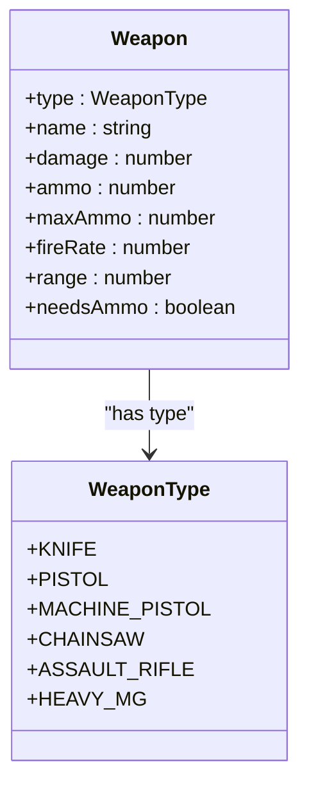
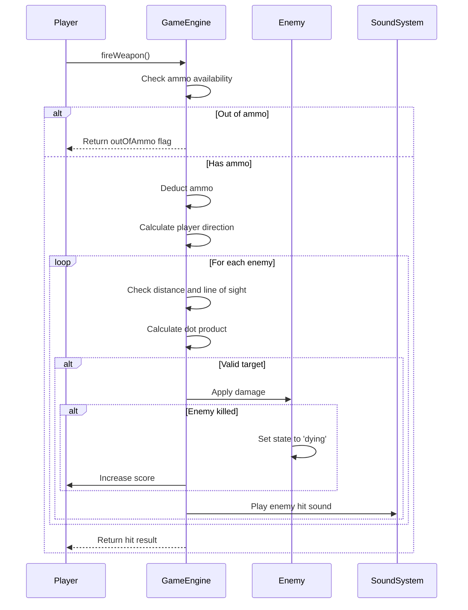
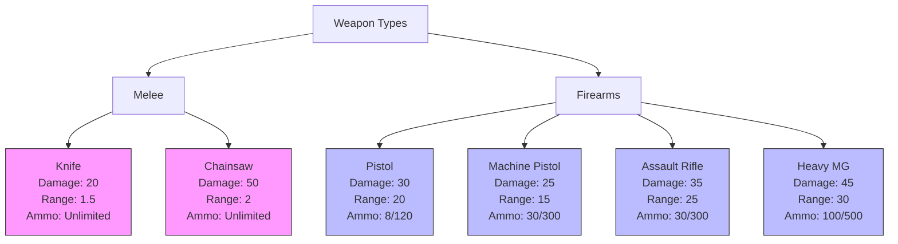
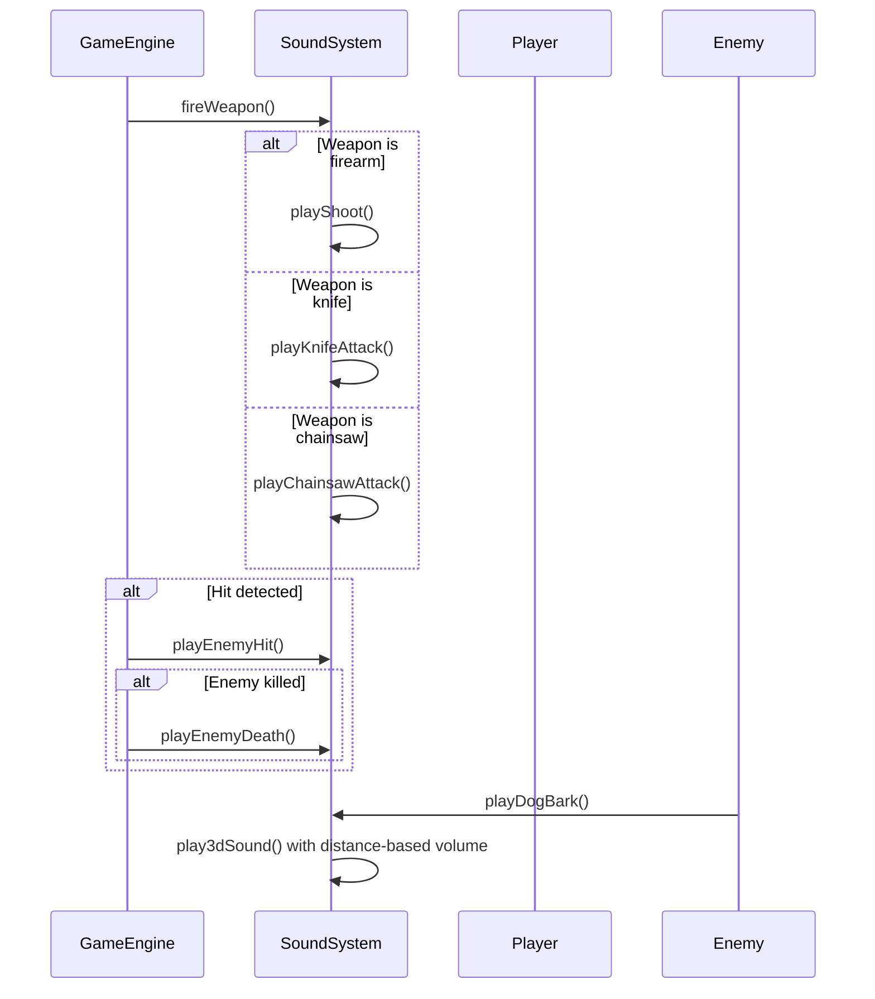

# Combat Mechanics

<cite>
**Referenced Files in This Document**   
- [types.ts](file://src/types.ts)
- [gameEngine.ts](file://src/gameEngine.ts)
- [weapons.ts](file://src/weapons.ts)
- [soundSystem.ts](file://src/soundSystem.ts)
</cite>

## Table of Contents
1. [Introduction](#introduction)
2. [Core Combat Components](#core-combat-components)
3. [Weapon System Architecture](#weapon-system-architecture)
4. [Firing Mechanics and Hit Detection](#firing-mechanics-and-hit-detection)
5. [Ammo Management System](#ammo-management-system)
6. [Weapon Types and Characteristics](#weapon-types-and-characteristics)
7. [Combat Integration with Audio System](#combat-integration-with-audio-system)
8. [Combat Processing in Game Loop](#combat-processing-in-game-loop)
9. [Common Combat Issues and Solutions](#common-combat-issues-and-solutions)
10. [Extending the Combat System](#extending-the-combat-system)

## Introduction

The combat mechanics system forms the core gameplay loop in this first-person shooter game, handling all aspects of weapon usage, enemy engagement, and player survival. The system is designed with a modular architecture that separates weapon definitions, firing logic, damage calculation, and audio feedback into distinct components that work together seamlessly. This documentation provides a comprehensive analysis of the combat system's implementation, focusing on the key components that enable weapon firing, damage calculation, ammo management, and hit detection. The system is built around a clear data model defined in types, with game logic implemented in the game engine and weapon specifications stored in dedicated configuration files.

## Core Combat Components

The combat system is composed of several interconnected components that work together to deliver a responsive and engaging gameplay experience. The primary components include the Weapon interface and WeaponType enum that define the data model for all weapons in the game, the fireWeapon function that handles the core firing logic and hit detection, the WEAPONS constant that stores the configuration for each weapon type, and the soundSystem that provides audio feedback for combat actions. These components are tightly integrated, with the game engine serving as the central coordinator that connects player input with weapon behavior, enemy state changes, and audio output. The system is designed to be extensible, allowing for easy addition of new weapons or modification of existing combat parameters without requiring changes to the core game logic.

**Section sources**
- [types.ts](file://src/types.ts#L7-L25)
- [gameEngine.ts](file://src/gameEngine.ts#L459-L513)
- [weapons.ts](file://src/weapons.ts#L2-L63)
- [soundSystem.ts](file://src/soundSystem.ts#L2-L127)

## Weapon System Architecture

The weapon system is built around a well-defined interface and enumeration that provide a consistent structure for all weapons in the game. The Weapon interface defines the essential properties that every weapon must have, including type, name, damage, ammo capacity, fire rate, range, and whether the weapon requires ammunition. This interface ensures that all weapons can be treated uniformly by the game engine, regardless of their specific characteristics. The WeaponType enum provides a type-safe way to reference different weapon types throughout the codebase, preventing errors that could occur with string literals. This architectural approach enables the game to easily support multiple weapons while maintaining type safety and code clarity.

**Diagram sources**
- [types.ts](file://src/types.ts#L7-L25)

**Section sources**
- [types.ts](file://src/types.ts#L7-L25)

## Firing Mechanics and Hit Detection

The fireWeapon function implements the core logic for weapon firing and hit detection, determining whether a shot hits an enemy and applying the appropriate damage. The function takes the current player state, the list of enemies, and the player's direction vector as inputs, and returns an updated game state along with information about the shot result. The hit detection algorithm uses a combination of distance checks and directional validation to ensure accurate targeting. First, it verifies that the player has sufficient ammunition for weapons that require it. Then, it iterates through all living enemies, calculating the distance to each one and checking whether the enemy is within the weapon's effective range.

The directional validation is performed using a dot product calculation between the player's facing direction and the direction to the enemy. This mathematical operation determines the angle between the two vectors, with values closer to 1.0 indicating that the enemy is directly in front of the player. The threshold of 0.9 ensures that only enemies nearly in the player's line of sight can be hit, preventing shots from hitting targets at extreme angles. Among all valid targets, the function selects the closest enemy to the player, simulating the behavior of a raycast that hits the nearest object. When a hit is confirmed, the enemy's health is reduced by the weapon's damage value, and if the health drops to zero or below, the enemy's state is changed to 'dying' and the player's score is increased.

**Diagram sources**
- [gameEngine.ts](file://src/gameEngine.ts#L459-L513)

**Section sources**
- [gameEngine.ts](file://src/gameEngine.ts#L459-L513)

## Ammo Management System

The ammo management system tracks ammunition for each weapon type separately and handles the logic for ammunition consumption and out-of-ammo conditions. The player's ammo state is stored as a Record mapping each WeaponType to its current ammunition count. Weapons that do not require ammunition, such as the knife and chainsaw, have their ammo values set to -1, indicating an unlimited supply. When a player fires a weapon that requires ammunition, the system first checks whether the current ammo count is greater than zero. If the player is out of ammunition, the fireWeapon function returns an outOfAmmo flag, which can be used by the game UI to display an appropriate message or prevent further firing attempts.

For weapons with limited ammunition, the system deducts one round from the player's ammo count each time the weapon is fired. The ammo property in the Weapon interface specifies the starting ammunition for each weapon, while maxAmmo defines the maximum amount that can be carried. This system allows for different ammunition behaviors across weapon types, supporting both limited-fire weapons like the pistol and machine pistol, and unlimited-use melee weapons like the knife and chainsaw. The design ensures that ammunition management is handled consistently across all weapons while allowing for weapon-specific behaviors through the needsAmmo flag.

**Section sources**
- [types.ts](file://src/types.ts#L16-L25)
- [gameEngine.ts](file://src/gameEngine.ts#L459-L513)
- [weapons.ts](file://src/weapons.ts#L2-L63)

## Weapon Types and Characteristics

The game features six distinct weapon types, each with unique characteristics that provide different tactical advantages and gameplay experiences. These weapons are defined in the WEAPONS constant, which maps each WeaponType enum value to a Weapon object containing the specific properties for that weapon. The knife is a melee weapon with moderate damage and unlimited use, designed for close-quarters combat. The pistol serves as the starting weapon with balanced damage and a limited ammunition supply. The machine pistol offers a high fire rate and larger magazine capacity, making it effective in sustained firefights.

The chainsaw is a powerful melee weapon with high damage output and unlimited use, ideal for close-range encounters. The assault rifle provides a good balance of damage, range, and magazine capacity, making it a versatile choice for various combat situations. The heavy machine gun is the most powerful firearm in the game, featuring the highest damage, longest range, and largest magazine capacity, but with a slower handling speed implied by its characteristics. Each weapon's properties are carefully tuned to create a rock-paper-scissors dynamic where different weapons are optimal for different situations, encouraging players to adapt their tactics based on the combat scenario.

**Diagram sources**
- [weapons.ts](file://src/weapons.ts#L2-L63)

**Section sources**
- [weapons.ts](file://src/weapons.ts#L2-L63)

## Combat Integration with Audio System

The combat system is tightly integrated with the audio system to provide immediate auditory feedback for all combat actions, enhancing the player's immersion and situational awareness. The soundSystem class implements a collection of methods for playing different sound effects, each corresponding to a specific combat event. When a player fires a weapon, the appropriate sound effect is triggered based on the weapon type: playShoot for firearms, playKnifeAttack for the knife, and playChainsawAttack for the chainsaw. When an enemy is hit, the playEnemyHit method is called to provide feedback that the shot was successful. If an enemy is killed, the more dramatic playEnemyDeath sound is played to signal the elimination of a threat.

The audio system also implements 3D spatialization through the play3dSound method, which adjusts the volume of sounds based on the distance between the sound source (e.g., an enemy barking) and the player's position. This creates a more immersive audio experience where sounds are louder when the source is nearby and quieter when distant. The integration between combat and audio is handled through direct function calls from the game engine to the sound system, ensuring that sound effects are played at the precise moment the corresponding combat event occurs. This tight coupling between visual and auditory feedback creates a cohesive and responsive combat experience.

**Diagram sources**
- [gameEngine.ts](file://src/gameEngine.ts#L459-L513)
- [soundSystem.ts](file://src/soundSystem.ts#L2-L127)

**Section sources**
- [gameEngine.ts](file://src/gameEngine.ts#L459-L513)
- [soundSystem.ts](file://src/soundSystem.ts#L2-L127)

## Combat Processing in Game Loop

Combat interactions are processed within the game loop through a series of coordinated function calls that handle player input, weapon firing, enemy state updates, and audio feedback. When the player triggers a weapon fire event (typically through a mouse click or key press), the game engine calls the fireWeapon function with the current player state, enemy list, and player direction. The fireWeapon function processes the shot, determines if an enemy was hit, applies damage, and returns the updated game state. Based on the result, the game engine then triggers the appropriate sound effects through the sound system and updates the UI to reflect changes in ammunition or score.

The game loop also handles enemy attacks on the player, with the updateEnemies function checking for close-range encounters and applying damage when enemies are near the player. This function also manages enemy movement and pathfinding, ensuring that enemies actively pursue the player and can open doors to reach them. The combat system is designed to be frame-rate independent through the use of deltaTime in movement calculations, ensuring consistent gameplay across different hardware configurations. The integration of combat mechanics into the game loop creates a responsive and dynamic combat experience where player actions have immediate consequences.

**Section sources**
- [gameEngine.ts](file://src/gameEngine.ts#L459-L513)
- [gameEngine.ts](file://src/gameEngine.ts#L345-L457)

## Common Combat Issues and Solutions

Several common issues can arise in the combat system, particularly related to hit detection accuracy and weapon switching behavior. One potential issue is inaccurate hit detection when the dot product threshold is too strict or too lenient, causing shots to miss targets that appear to be in the player's line of sight or hit targets that are at extreme angles. This can be addressed by fine-tuning the dot product threshold value (currently set to 0.9) through playtesting to find the optimal balance between accuracy and fairness.

Another potential issue is weapon switching bugs where the player's current weapon does not update correctly in the UI or the wrong weapon sound is played. This can occur if the currentWeapon property in the player state is not properly synchronized with the UI state. The solution is to ensure that all weapon switches go through a single, well-defined function that updates both the player state and any UI components that display weapon information. Performance issues can also arise when processing large numbers of enemies, which can be mitigated by optimizing the hit detection loop to exit early when a valid target is found or by implementing spatial partitioning to reduce the number of enemies that need to be checked for each shot.

**Section sources**
- [gameEngine.ts](file://src/gameEngine.ts#L459-L513)
- [types.ts](file://src/types.ts#L16-L25)

## Extending the Combat System

The combat system is designed to be easily extensible, allowing developers to add new weapons or modify existing combat parameters without requiring significant changes to the core game logic. To add a new weapon, developers can simply add a new entry to the WeaponType enum and then define the weapon's properties in the WEAPONS constant, following the existing pattern. The type-safe design ensures that the new weapon will be properly integrated with the rest of the system without introducing runtime errors.

Modifying existing combat parameters is equally straightforward, as all weapon characteristics are defined in the centralized WEAPONS configuration. Adjusting values like damage, fire rate, range, or ammunition capacity can be done by editing the corresponding properties in the weapon definition. The system's modular design also allows for the addition of new combat features, such as weapon reload mechanics, burst fire modes, or secondary fire functions, by extending the Weapon interface and updating the fireWeapon logic accordingly. This extensibility ensures that the combat system can evolve over time to support new gameplay features while maintaining code quality and consistency.

**Section sources**
- [types.ts](file://src/types.ts#L7-L25)
- [weapons.ts](file://src/weapons.ts#L2-L63)
- [gameEngine.ts](file://src/gameEngine.ts#L459-L513)