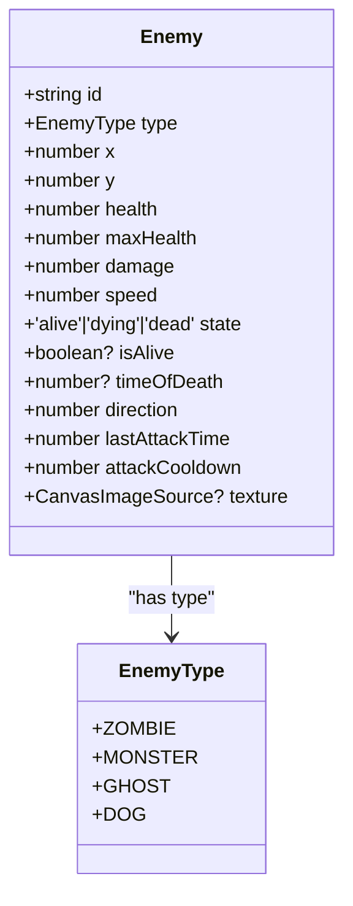
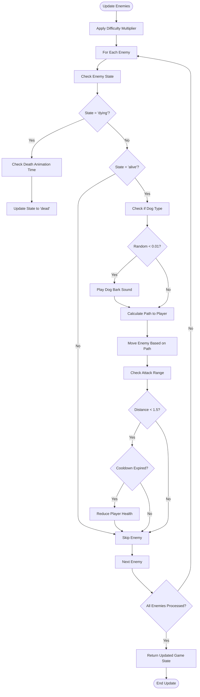
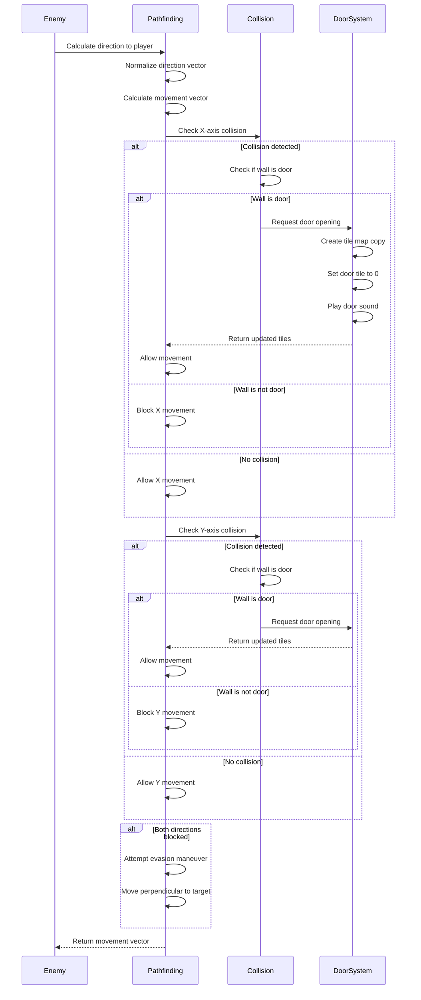
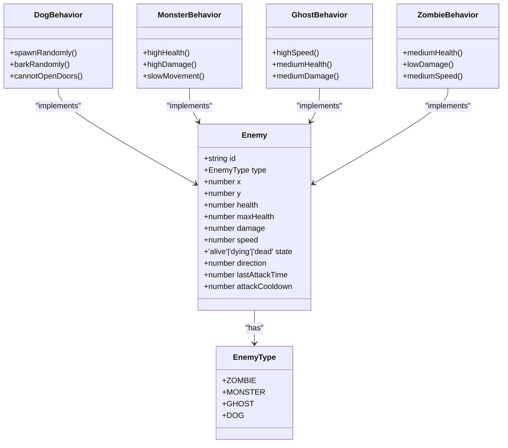
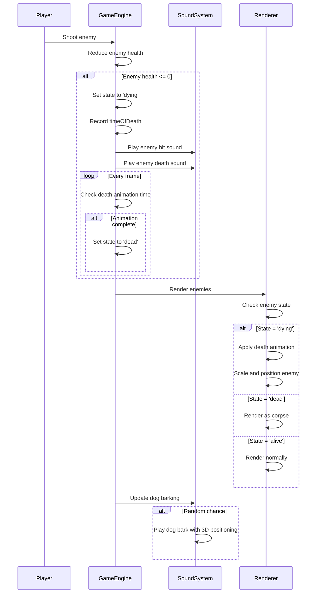

# Enemy AI

<cite>
**Referenced Files in This Document**   
- [types.ts](file://src/types.ts)
- [gameEngine.ts](file://src/gameEngine.ts)
- [soundSystem.ts](file://src/soundSystem.ts)
- [textures.ts](file://src/textures.ts)
- [raycasting.ts](file://src/raycasting.ts)
</cite>

## Table of Contents
1. [Introduction](#introduction)
2. [Enemy Interface Definition](#enemy-interface-definition)
3. [Enemy State Management](#enemy-state-management)
4. [Enemy Update Cycle](#enemy-update-cycle)
5. [Pathfinding and Navigation](#pathfinding-and-navigation)
6. [Attack Patterns and Cooldowns](#attack-patterns-and-cooldowns)
7. [Enemy Types and Special Behaviors](#enemy-types-and-special-behaviors)
8. [Visual and Audio Feedback](#visual-and-audio-feedback)
9. [Common Issues and Solutions](#common-issues-and-solutions)
10. [Integration with Game Systems](#integration-with-game-systems)
11. [Extending the Enemy AI System](#extending-the-enemy-ai-system)

## Introduction

The enemy AI system in this game implements a comprehensive behavior framework that governs how enemies track, pursue, attack, and interact with the environment and player. The system is designed with modularity in mind, allowing for different enemy types with unique behaviors while maintaining a consistent interface and update pattern. This documentation provides a detailed analysis of the enemy AI implementation, covering pathfinding algorithms, state management, attack mechanics, and integration with audio and rendering systems.

**Section sources**
- [types.ts](file://src/types.ts#L34-L50)
- [gameEngine.ts](file://src/gameEngine.ts#L381-L457)

## Enemy Interface Definition

The Enemy interface defines the core properties and state for all enemy entities in the game. Each enemy has fundamental attributes including position (x, y), health values (health, maxHealth), offensive capabilities (damage), movement speed (speed), and visual representation (texture). The interface also includes behavioral properties such as direction (facing angle), attack timing (lastAttackTime, attackCooldown), and identification (id, type).

Enemy states are strictly typed with three possible values: 'alive', 'dying', and 'dead'. This state system controls the enemy's behavior and visual representation throughout its lifecycle. The optional isAlive boolean and timeOfDeath timestamp provide additional state tracking for animation and game logic purposes.

**Diagram sources**
- [types.ts](file://src/types.ts#L34-L50)

**Section sources**
- [types.ts](file://src/types.ts#L34-L50)

## Enemy State Management

The enemy state system follows a three-phase lifecycle: alive, dying, and dead. When an enemy is first created, its state is set to 'alive', allowing it to move, attack, and interact with the environment. When the enemy's health reaches zero, its state transitions to 'dying', which triggers visual and audio effects while preventing further AI processing.

The dying state has a fixed duration of 500 milliseconds, during which the enemy remains visible but cannot perform actions. After this period, the state automatically transitions to 'dead', at which point the enemy is no longer processed in the game loop. This state management ensures consistent behavior across all enemy types and provides a clear animation sequence for enemy elimination.

The state system is implemented in the updateEnemies function, which checks the current state at the beginning of each update cycle and handles state transitions appropriately. Enemies in the 'dying' state are processed only for animation purposes, while enemies in the 'dead' state are completely inert.

**Section sources**
- [gameEngine.ts](file://src/gameEngine.ts#L381-L388)
- [App.tsx](file://src/App.tsx#L613-L638)

## Enemy Update Cycle

The enemy update cycle is managed by the updateEnemies function, which processes all enemies in the current game state during each frame. The update process begins by applying a difficulty-based multiplier that affects enemy speed and damage output. This multiplier scales enemy performance according to the selected difficulty level (Easy: 0.7, Normal: 1.0, Hard: 1.5).

During the update cycle, each enemy is processed individually. The system first checks for state transitions, particularly from 'dying' to 'dead'. For alive enemies, the system calculates the distance to the player and determines appropriate behavior based on proximity. Enemies within 15 units of the player will attempt to navigate toward them using the pathfinding algorithm, while enemies within 1.5 units will attempt to attack if their attack cooldown has expired.

The update cycle also handles special behaviors for specific enemy types, such as the random barking sound emitted by dogs. The function returns an updated game state that may include modified enemy positions, player health changes, and updated tile maps when doors have been opened.

**Diagram sources**
- [gameEngine.ts](file://src/gameEngine.ts#L381-L457)

**Section sources**
- [gameEngine.ts](file://src/gameEngine.ts#L381-L457)

## Pathfinding and Navigation

The enemy pathfinding system uses a ray direction-based approach combined with collision detection to navigate the game world. The findPathToPlayer function calculates the direction vector from the enemy to the player and attempts to move the enemy along this vector. The system checks for collisions with walls and decorative objects, and when a collision is detected with a door (tile value 2), it attempts to open the door.

The pathfinding algorithm works by first testing movement in the X direction, then in the Y direction. If movement is blocked in both directions, the system attempts an evasion maneuver by moving perpendicular to the primary direction of travel. This prevents enemies from becoming completely stuck when direct paths are blocked.

Enemies can open regular doors (tile value 2) but cannot open exit doors (tile value 3). The door opening mechanism creates a deep copy of the tile map to avoid direct mutation, changes the door tile to a passable state (value 0), and triggers a door opening sound effect. The updated tile map is then propagated back to the game state.

The system also considers decorative objects when calculating collisions, using predefined collision radii for each object type. This prevents enemies from passing through furniture and other environmental elements.

**Diagram sources**
- [gameEngine.ts](file://src/gameEngine.ts#L316-L379)
- [gameEngine.ts](file://src/gameEngine.ts#L278-L313)

**Section sources**
- [gameEngine.ts](file://src/gameEngine.ts#L316-L379)
- [gameEngine.ts](file://src/gameEngine.ts#L278-L313)

## Attack Patterns and Cooldowns

Enemy attacks are governed by a cooldown-based system that prevents continuous damage output. Each enemy has an attackCooldown property that defines the minimum time in milliseconds between attacks. When an enemy is within attack range of the player (less than 1.5 units), the system checks whether the time since the last attack exceeds the cooldown period.

If the cooldown has expired, the enemy performs an attack by reducing the player's health by the enemy's damage value multiplied by the difficulty multiplier. The lastAttackTime is then updated to the current timestamp, resetting the cooldown timer. This system ensures that enemies cannot overwhelm the player with instant attacks while still maintaining pressure based on proximity.

The attack range and cooldown values are configurable per enemy type, allowing for different attack patterns. For example, faster enemies might have shorter cooldowns but lower damage, while slower enemies might have higher damage with longer cooldowns. This creates varied combat experiences and strategic considerations for the player.

**Section sources**
- [gameEngine.ts](file://src/gameEngine.ts#L448-L454)

## Enemy Types and Special Behaviors

The game features four distinct enemy types: ZOMBIE, MONSTER, GHOST, and DOG. Each type has unique characteristics in terms of health, damage, speed, and special behaviors. The DOG type has a special spawning mechanism and audio behavior that distinguishes it from other enemies.

Dogs are spawned randomly on valid map tiles at the beginning of each level through the createDog function. This function searches for free tiles (value 0) and places the dog on a random valid position. Dogs have relatively low health (50) but moderate speed (0.04) and damage (15).

The most distinctive behavior of dogs is their random barking sound. During the enemy update cycle, dogs have a 1% chance per frame to emit a barking sound. This uses the 3D sound positioning system to play the bark at the dog's location, creating an immersive audio experience that helps players locate dogs even when not in direct view.

Other enemy types have different statistical profiles, with MONSTER enemies typically having high health and damage but lower speed, while GHOST enemies have higher speed but lower health. These variations create diverse tactical challenges for the player.

**Diagram sources**
- [gameEngine.ts](file://src/gameEngine.ts#L109-L131)
- [gameEngine.ts](file://src/gameEngine.ts#L411-L415)

**Section sources**
- [gameEngine.ts](file://src/gameEngine.ts#L109-L131)
- [gameEngine.ts](file://src/gameEngine.ts#L411-L415)

## Visual and Audio Feedback

The enemy AI system integrates closely with both visual and audio systems to provide feedback for enemy states and actions. When an enemy enters the 'dying' state, a death animation is triggered that plays a specific sound effect through the sound system. After 500 milliseconds, the enemy's state transitions to 'dead', and its visual representation changes to a corpse texture.

The rendering system handles the visual transition by checking the enemy's state and applying appropriate transformations. Dying enemies are rendered with animation effects that make them appear to collapse, while dead enemies are rendered as static corpses. This is managed through the getSpritesToRender function in the raycasting system, which includes both living and dead enemies in the render list but applies different visual treatments based on state.

Audio feedback is provided through the soundSystem module, which plays different sounds for various enemy events. When an enemy is hit, a hit sound is played. When an enemy dies, a death sound is triggered. Dogs emit barking sounds at random intervals. These sounds use 3D positioning to create spatial audio effects that help players locate enemies based on sound.

**Diagram sources**
- [App.tsx](file://src/App.tsx#L320-L366)
- [soundSystem.ts](file://src/soundSystem.ts#L50-L60)
- [raycasting.ts](file://src/raycasting.ts#L123-L166)

**Section sources**
- [App.tsx](file://src/App.tsx#L320-L366)
- [soundSystem.ts](file://src/soundSystem.ts#L50-L60)
- [raycasting.ts](file://src/raycasting.ts#L123-L166)

## Common Issues and Solutions

Several common issues can occur with the enemy AI system, particularly related to navigation and pathfinding. One frequent problem is enemies getting stuck in corners or against walls, especially when direct paths to the player are blocked. The current implementation addresses this with an evasion maneuver that attempts perpendicular movement when both primary directions are blocked.

Another issue is enemies failing to open doors, which can occur when multiple enemies attempt to open the same door simultaneously or when the door opening logic doesn't properly update the shared tile map. The system mitigates this by creating a deep copy of the tile map when a door is opened and propagating the updated map back to the game state.

Performance considerations include the computational cost of collision detection with both walls and decorative objects. The system optimizes this by using early distance checks and only calculating square roots for nearby objects. Additionally, the random barking behavior for dogs uses a simple probability check rather than a timer-based system, reducing computational overhead.

For future improvements, implementing a more sophisticated pathfinding algorithm like A* could help enemies find optimal paths around complex obstacles. Adding memory of door locations could prevent repeated door-opening attempts. Improving the evasion maneuvers with more intelligent direction selection could reduce instances of enemies becoming stuck.

**Section sources**
- [gameEngine.ts](file://src/gameEngine.ts#L316-L379)
- [gameEngine.ts](file://src/gameEngine.ts#L133-L142)
- [gameEngine.ts](file://src/gameEngine.ts#L144-L154)

## Integration with Game Systems

The enemy AI system integrates with multiple game systems to create a cohesive gameplay experience. The primary integration points include the game loop, audio system, rendering system, and level management system.

In the main game loop (App.tsx), the updateEnemies function is called every frame with the current game state, player input, and timing information. The results of enemy updates, including player health changes and tile map modifications, are immediately applied to the game state.

The audio system integration occurs through the soundSystem module, which provides 3D positional audio for enemy sounds. When enemies attack or die, appropriate sound effects are triggered with spatial positioning based on the enemy's location relative to the player.

The rendering system integration happens through the raycasting module, which transforms enemy positions into screen coordinates for rendering. The system renders enemies based on their distance from the player and sorts them for proper visual layering. Different textures are used for different enemy states, with special handling for corpses.

The level management system integration occurs at level initialization, where enemies are loaded from level data and dogs are added randomly. The system also handles enemy persistence across level transitions and difficulty scaling.

**Section sources**
- [App.tsx](file://src/App.tsx#L320-L366)
- [gameEngine.ts](file://src/gameEngine.ts#L101-L154)
- [raycasting.ts](file://src/raycasting.ts#L123-L166)
- [soundSystem.ts](file://src/soundSystem.ts#L70-L80)

## Extending the Enemy AI System

The enemy AI system is designed to be extensible, allowing for the addition of new enemy types and behaviors. To add a new enemy type, developers should first extend the EnemyType enum in types.ts, then create appropriate textures in the textures module, and finally configure the default properties for the new type.

New behaviors can be implemented by adding conditional logic in the updateEnemies function based on the enemy type. For example, a flying enemy might ignore certain obstacles, or a ranged enemy might maintain distance from the player. The state management system provides a consistent framework that new enemy types can leverage without requiring changes to the core update logic.

Modifying existing AI behaviors can be accomplished by adjusting the parameters in the Enemy interface instances, such as changing speed, damage, or attack cooldown values. More complex modifications, like changing the pathfinding algorithm or adding new states, would require updates to the core functions in gameEngine.ts.

When extending the system, developers should maintain consistency with the existing code patterns, particularly regarding state management and collision detection. The use of the difficulty multiplier should be preserved for any new damage or speed calculations to ensure balanced gameplay across difficulty levels.

**Section sources**
- [types.ts](file://src/types.ts#L34-L50)
- [gameEngine.ts](file://src/gameEngine.ts#L381-L457)
- [textures.ts](file://src/textures.ts#L1006-L1008)