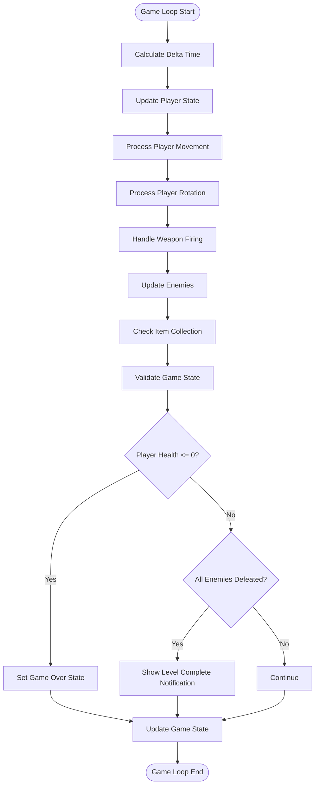
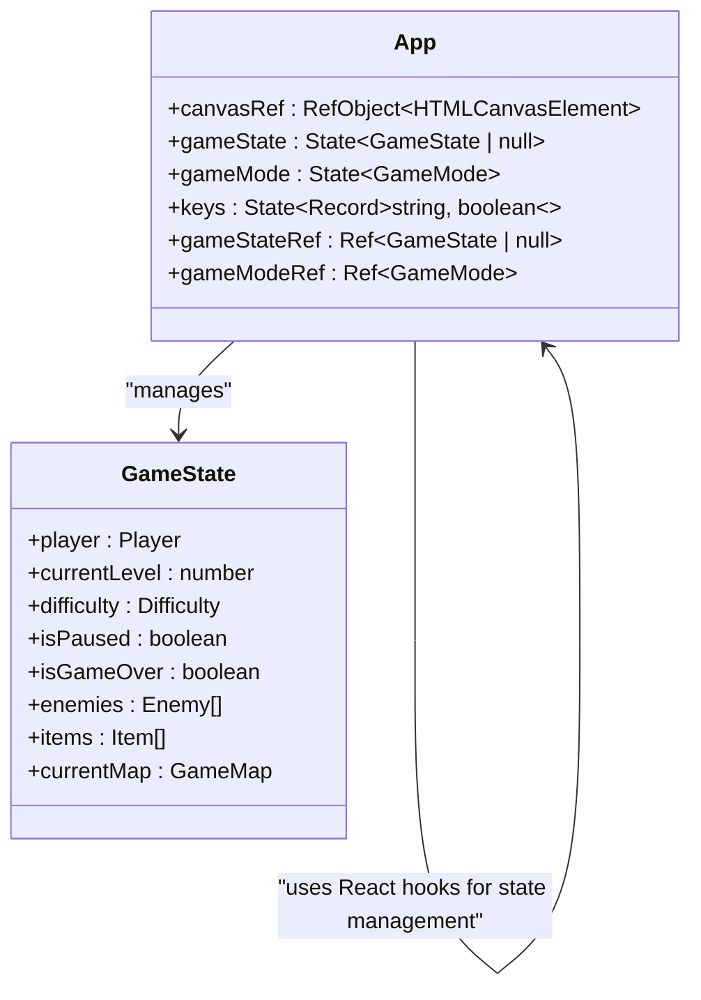
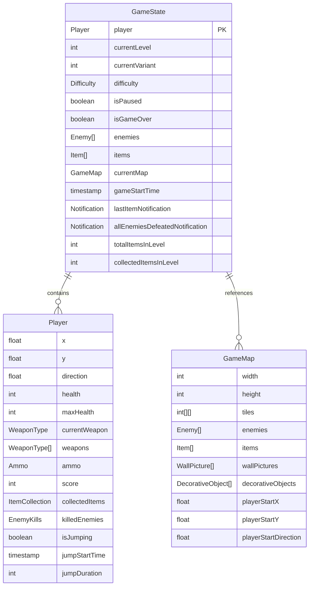
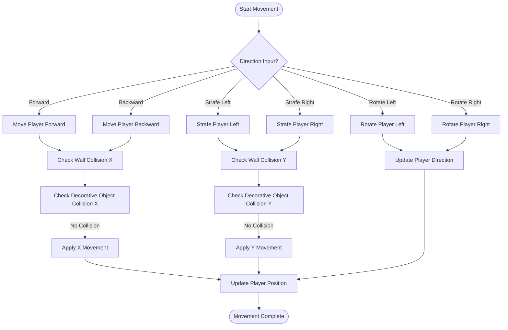
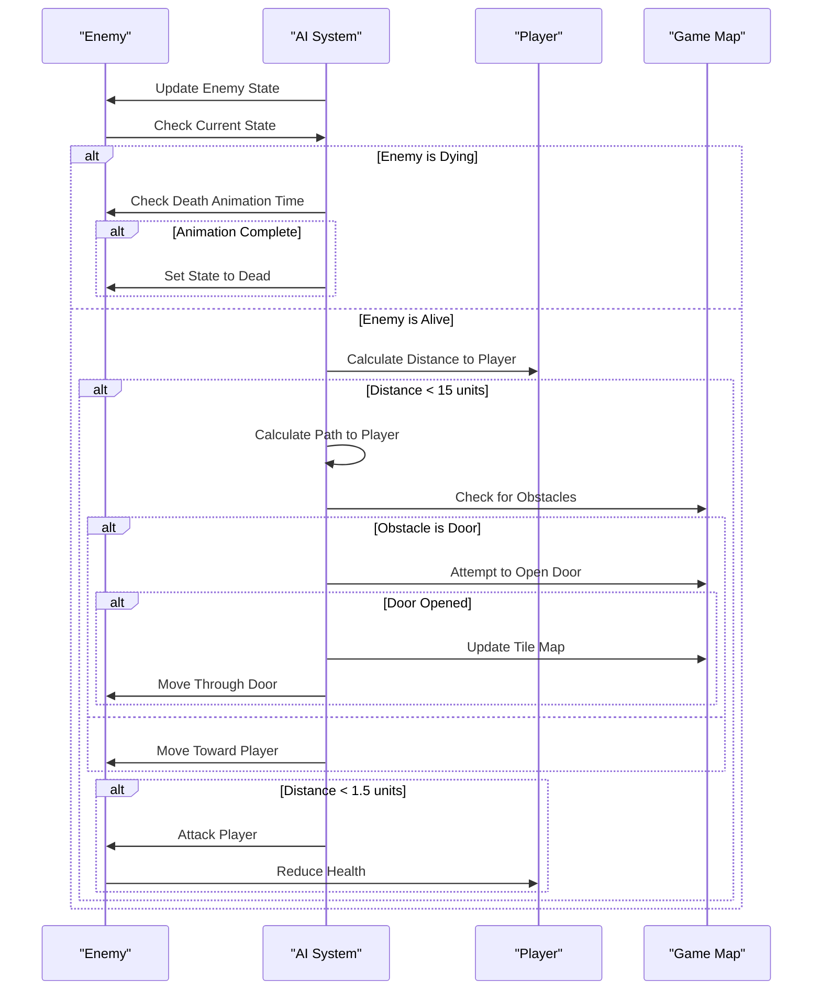
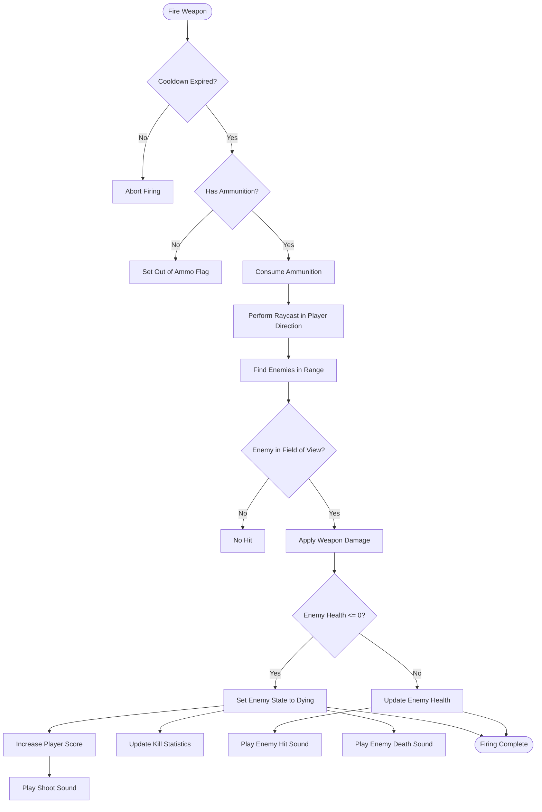
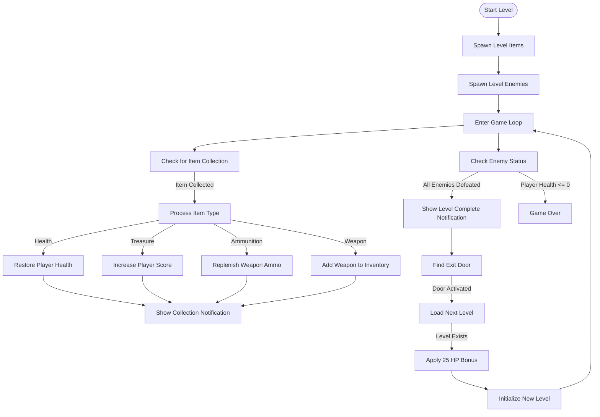
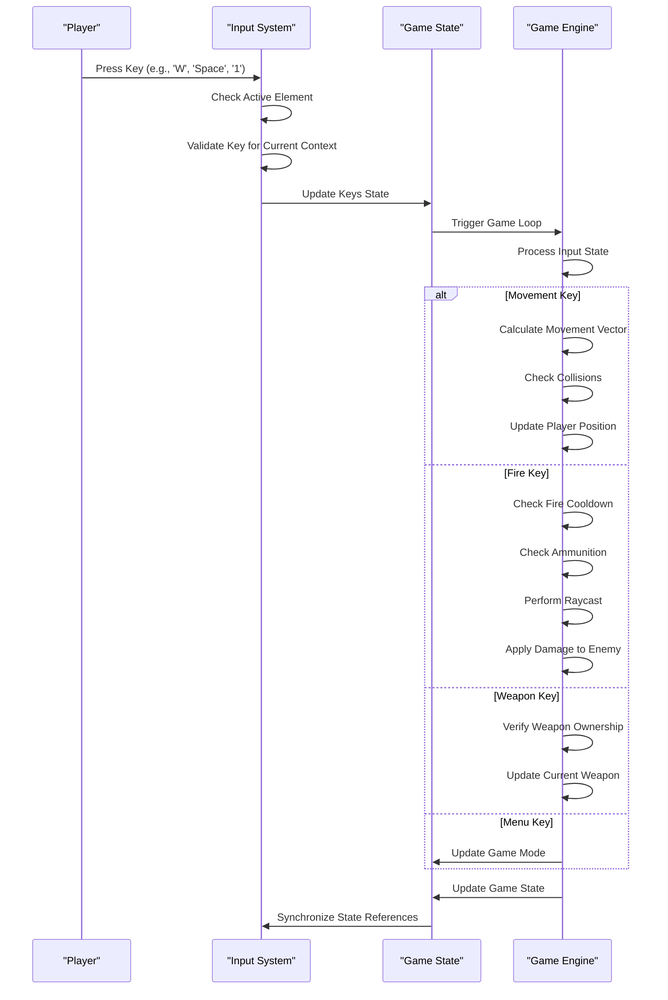
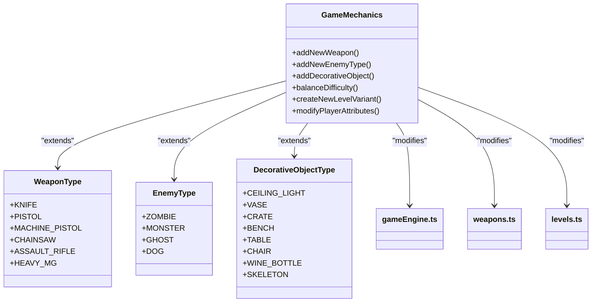

# Game Engine

<cite>
**Referenced Files in This Document**   
- [App.tsx](file://src/App.tsx) - *Updated in recent commit*
- [gameEngine.ts](file://src/gameEngine.ts) - *Updated in recent commit*
- [types.ts](file://src/types.ts) - *Updated in recent commit*
- [raycasting.ts](file://src/raycasting.ts)
- [levels.ts](file://src/levels.ts)
- [mapSelectionSystem.ts](file://src/mapSelectionSystem.ts)
- [saveLoadSystem.ts](file://src/saveLoadSystem.ts)
</cite>

## Update Summary
**Changes Made**   
- Added documentation for new item collection tracking system with `totalItemsInLevel` and `collectedItemsInLevel` properties
- Updated GameState Data Model section to include new item tracking fields
- Enhanced Item Collection and Level Progression section with details about item counter functionality
- Updated code examples and diagrams to reflect new item collection logic
- Added sources for all modified files with update annotations

## Table of Contents
1. [Core Game Loop Architecture](#core-game-loop-architecture)
2. [State Management with React Hooks](#state-management-with-react-hooks)
3. [GameState Data Model](#gamestate-data-model)
4. [Player Movement and Collision Detection](#player-movement-and-collision-detection)
5. [Enemy AI Implementation](#enemy-ai-implementation)
6. [Combat Mechanics](#combat-mechanics)
7. [Item Collection and Level Progression](#item-collection-and-level-progression)
8. [Input Handling and Game Logic Integration](#input-handling-and-game-logic-integration)
9. [Game State Transitions](#game-state-transitions)
10. [Performance Considerations](#performance-considerations)
11. [Extending the Game Engine](#extending-the-game-engine)

## Core Game Loop Architecture

The game engine implements a continuous game loop that drives all gameplay mechanics. The loop is managed through React's `useCallback` and `useEffect` hooks, ensuring optimal performance and proper cleanup. The game loop runs at approximately 60 FPS, with delta time normalization to maintain consistent gameplay across different devices.

The core loop consists of several sequential phases: player input processing, player movement and rotation, weapon firing, enemy updates, item collection, and game state validation. Each phase operates on a copy of the current game state, which is then updated via React's `setGameState` function. This approach ensures that all game logic is processed in a single frame before rendering occurs.

The loop is conditionally executed based on the current game mode, pause state, and game over status. When the game is paused or in a menu state, the loop is suspended to conserve resources. The rendering function is tightly coupled with the game loop, ensuring that visual updates occur immediately after game state changes.



**Diagram sources**
- [App.tsx](file://src/App.tsx#L28-L791)
- [gameEngine.ts](file://src/gameEngine.ts#L381-L457)

**Section sources**
- [App.tsx](file://src/App.tsx#L28-L791)
- [gameEngine.ts](file://src/gameEngine.ts#L381-L457)

## State Management with React Hooks

The game engine leverages React's state management system to maintain and update the game state efficiently. The primary game state is stored in a `useState` hook within the `App` component, which holds the complete `GameState` object. This state is updated through various game mechanics and user interactions.

To optimize performance and prevent unnecessary re-renders, the game state is synchronized with a `useRef` reference. This allows the game loop to access the current state without triggering React's re-rendering mechanism on every frame. The `gameStateRef.current` reference is updated whenever the state changes, ensuring that the game loop always operates on the most recent data.

The game mode is managed through a separate state variable, allowing the application to switch between different UI states such as menu, playing, paused, save, and load screens. This separation of concerns ensures that game logic and UI presentation are decoupled, making the codebase more maintainable and easier to extend.

Keyboard input is handled through a `useState` hook that tracks the current state of all pressed keys. This approach allows for smooth movement and responsive controls, as the game loop can check the current key states without relying on event callbacks during gameplay.



**Diagram sources**
- [App.tsx](file://src/App.tsx#L28-L791)

**Section sources**
- [App.tsx](file://src/App.tsx#L28-L791)

## GameState Data Model

The `GameState` interface defines the complete state of the game at any given moment. It serves as the central data structure that connects all game systems, from player attributes to level progression. The model is designed to be serializable, enabling save and load functionality through browser localStorage.

The player object contains all player-specific attributes including position, health, weapons, ammunition, and score. The player's inventory is tracked through collections of collected items and killed enemies, providing statistics for gameplay progression. The directional orientation is stored as a radian value, which is used in raycasting calculations for rendering and collision detection.

Level progression is managed through the `currentLevel` and `currentVariant` properties, which track the player's position in the game world. The engine supports multiple variants of each level, selected based on play history to enhance replayability. The difficulty setting affects various game parameters, including enemy behavior and player health.

The game state also includes transient notification data, such as recent item pickups or level completion messages. These notifications are timestamped to enable time-based display and automatic dismissal, enhancing the user experience without cluttering the interface.

The game state now includes two new properties for tracking item collection progress: `totalItemsInLevel` and `collectedItemsInLevel`. These properties provide a complete picture of the player's progress in collecting all available items within the current level. The `totalItemsInLevel` property is initialized with the total number of items in the level when the level is loaded, while `collectedItemsInLevel` is incremented each time the player collects an item.



**Updated** Added documentation for new item collection tracking properties in GameState

**Diagram sources**
- [types.ts](file://src/types.ts#L143-L164)

**Section sources**
- [types.ts](file://src/types.ts#L143-L164)
- [gameEngine.ts](file://src/gameEngine.ts#L49-L89)

## Player Movement and Collision Detection

Player movement is implemented through a combination of raycasting-based rendering and collision detection systems. The movement system processes input in four cardinal directions (forward, backward, strafe left, strafe right) and rotation (left, right). Each movement operation is validated against both wall tiles and decorative objects to prevent the player from passing through obstacles.

The collision detection system uses a two-phase approach: first checking for wall collisions using the tile map, then checking for collisions with decorative objects. The wall collision detection uses a simple grid-based system where non-zero tile values represent solid walls. The decorative object collision system employs distance-based checks with configurable collision radii for different object types.

During movement, the system applies a collision margin to prevent the player from getting stuck on corners. This margin creates a small buffer zone around the player, allowing smooth navigation through doorways and narrow passages. The system also implements jump mechanics, temporarily disabling decorative object collision detection during jumps to allow players to leap over small obstacles.

The movement system is tightly integrated with the rendering engine, using the same coordinate system and units. This ensures that visual feedback matches player movement precisely, creating a responsive and immersive gameplay experience.



**Diagram sources**
- [gameEngine.ts](file://src/gameEngine.ts#L201-L239)
- [gameEngine.ts](file://src/gameEngine.ts#L133-L142)
- [gameEngine.ts](file://src/gameEngine.ts#L157-L199)

**Section sources**
- [gameEngine.ts](file://src/gameEngine.ts#L201-L239)
- [gameEngine.ts](file://src/gameEngine.ts#L133-L142)
- [gameEngine.ts](file://src/gameEngine.ts#L157-L199)

## Enemy AI Implementation

The enemy AI system implements a sophisticated pathfinding algorithm that allows enemies to pursue the player while navigating around obstacles. The AI operates on a per-frame basis, calculating movement vectors based on the player's position relative to the enemy. The system uses a modified DDA (Digital Differential Analysis) algorithm to determine optimal paths while avoiding walls and decorative objects.

Enemy behavior is influenced by difficulty settings, which modify movement speed and attack frequency through a multiplier system. On higher difficulties, enemies move faster and attack more frequently, creating a more challenging gameplay experience. The AI also includes special behaviors for different enemy types, such as the dog enemy which emits random barking sounds.

The pathfinding system includes collision avoidance for both static obstacles and dynamic elements like doors. Enemies can open doors to reach the player, but certain enemy types (like dogs) are restricted from this ability. When a door is opened, the tile map is updated, and the change is reflected in both gameplay and rendering.

Enemy states are managed through a finite state system with three states: alive, dying, and dead. The dying state triggers a 500ms animation before transitioning to the dead state, providing visual feedback and preventing immediate re-spawn exploitation. This state management ensures that enemies cannot be attacked while in the dying animation.



**Diagram sources**
- [gameEngine.ts](file://src/gameEngine.ts#L381-L457)

**Section sources**
- [gameEngine.ts](file://src/gameEngine.ts#L381-L457)

## Combat Mechanics

The combat system implements a weapon-based attack mechanism that allows players to eliminate enemies and progress through levels. The system supports multiple weapon types, each with unique characteristics including damage, fire rate, range, and ammunition requirements. Weapons are managed through a player inventory system that tracks current weapon selection and ammunition counts.

Weapon firing is controlled through a cooldown system that prevents rapid firing beyond the weapon's specified fire rate. When the player presses the fire button, the system checks if sufficient time has elapsed since the last shot. If the cooldown period has passed, a raycast is performed in the player's direction to detect enemies within range.

The targeting system uses vector mathematics to determine if an enemy is within the player's field of view. A dot product calculation between the player's direction vector and the vector to the enemy ensures that only enemies directly in front of the player can be hit. This creates a realistic targeting mechanic that requires players to aim carefully.

When an enemy is hit, damage is applied to its health. If the damage reduces the enemy's health to zero or below, the enemy enters the dying state and eventually transitions to the dead state. The player receives score points for each enemy killed, and statistics are updated to track enemy kills by type.



**Diagram sources**
- [gameEngine.ts](file://src/gameEngine.ts#L459-L513)

**Section sources**
- [gameEngine.ts](file://src/gameEngine.ts#L459-L513)
- [weapons.ts](file://src/weapons.ts#L1-L65)

## Item Collection and Level Progression

The item collection system enables players to gather various power-ups and resources throughout the game world. Items are positioned on the map and remain in place until collected by the player. When the player moves within a 0.7 unit radius of an item, it is automatically collected and removed from the game world.

Different item types provide various benefits to the player. Health items restore player health up to their maximum, treasure items increase the player's score, and ammunition items replenish weapon supplies. Weapon items add new weapons to the player's inventory or provide additional ammunition if the weapon is already possessed.

The game engine now includes a comprehensive item tracking system that monitors both the total number of items in the current level and the number of items the player has collected. This information is stored in the `GameState` object with two new properties: `totalItemsInLevel` and `collectedItemsInLevel`. The `totalItemsInLevel` property is initialized when a level is loaded, setting its value to the length of the items array in the current map. The `collectedItemsInLevel` property starts at zero and is incremented each time the player collects an item.

This tracking system enables the game to display progress information to the player, such as the percentage of items collected or the number of remaining items to find. The implementation is handled in the `collectItem` function in `gameEngine.ts`, which returns both the updated player state and the new count of collected items. The game loop in `App.tsx` then updates the `collectedItemsInLevel` property in the game state with this new count.

Level progression is triggered when all enemies in the current level have been defeated. The system checks for this condition after each enemy update and displays a notification when the level is complete. Players can then find and interact with an exit door to progress to the next level. When advancing to a new level, the player receives a 25 HP bonus to encourage continued progression.

The level selection system incorporates a history-based variant selection algorithm that ensures players experience different level layouts across multiple playthroughs. The system tracks which level variants have been played and prioritizes unplayed variants, enhancing replayability and preventing repetitive gameplay experiences.



**Updated** Added documentation for new item collection tracking system

**Diagram sources**
- [gameEngine.ts](file://src/gameEngine.ts#L515-L577)
- [gameEngine.ts](file://src/gameEngine.ts#L583-L628)

**Section sources**
- [gameEngine.ts](file://src/gameEngine.ts#L515-L577)
- [gameEngine.ts](file://src/gameEngine.ts#L583-L628)
- [levels.ts](file://src/levels.ts#L1-L89)

## Input Handling and Game Logic Integration

The input handling system bridges user interactions with game logic through a comprehensive keyboard event management system. Key presses are captured and stored in a state object that tracks the current state of all relevant keys. This approach allows the game loop to poll key states rather than relying on event callbacks, ensuring consistent input processing regardless of event timing.

The system distinguishes between gameplay keys (WASD, arrow keys, spacebar) and menu/navigation keys (H, M, L, P, E, T, G, F, 1-6). Gameplay keys directly influence player movement, rotation, and combat actions, while menu keys control game state transitions and UI interactions. The system also checks if the user is interacting with input fields to prevent unintended gameplay actions during text entry.

Weapon selection is implemented through number keys (1-6), which correspond to different weapon types in the player's inventory. When a weapon key is pressed, the system verifies that the player possesses the requested weapon before switching the current weapon selection. This creates an intuitive weapon switching mechanism that is both responsive and reliable.

The integration between input handling and game logic is facilitated through React's state management system. Input events modify the game state, which triggers re-renders and updates the game loop's behavior. This unidirectional data flow ensures that all game changes are predictable and traceable, making debugging and maintenance more straightforward.



**Diagram sources**
- [App.tsx](file://src/App.tsx#L28-L791)

**Section sources**
- [App.tsx](file://src/App.tsx#L28-L791)

## Game State Transitions

The game engine implements a comprehensive state management system that handles transitions between different game modes and scenarios. The primary states include menu, difficulty selection, playing, paused, save, load, help, and level complete. These states are managed through the `gameMode` state variable, which controls which UI components are displayed and which game systems are active.

Starting a new game begins with the difficulty selection screen, where players choose between easy, normal, and hard modes. Each difficulty level configures the player's maximum health and enemy behavior through difficulty multipliers. When a difficulty is selected, the `createInitialGameState` function initializes a new game state with the appropriate parameters and loads the first level.

Loading a saved game involves retrieving serialized game state data from localStorage and restoring it to the application state. The system includes migration logic to handle older save formats, such as adding missing `currentVariant` properties to legacy saves. This ensures backward compatibility and prevents save game corruption.

Progressing through levels is handled by the `loadNextLevel` function, which advances the `currentLevel` counter, selects an appropriate level variant based on play history, and initializes the new level's enemies, items, and map layout. The player receives a health bonus when advancing to a new level, providing positive reinforcement for progression.

```mermaid
stateDiagram-v2
[*] --> Menu
Menu --> Difficulty : "Start New Game"
Menu --> Load : "Load Game"
Menu --> Help : "Help"
Difficulty --> Playing : "Select Difficulty"
Load --> Playing : "Select Save Game"
Help --> Menu : "Back"
state Playing {
Playing --> Paused : "Press P"
Paused --> Playing : "Press P"
Playing --> Save : "Press M"
Save --> Playing : "Save Complete"
Playing --> Load : "Press L"
Load --> Playing : "Load Complete"
Playing --> LevelComplete : "All Enemies Defeated"
LevelComplete --> Playing : "Continue to Next Level"
Playing --> GameOver : "Player Health <= 0"
GameOver --> Menu : "Restart"
}
LevelComplete --> Menu : "Quit"
GameOver --> Menu : "Quit"
```

**Diagram sources**
- [App.tsx](file://src/App.tsx#L28-L791)
- [gameEngine.ts](file://src/gameEngine.ts#L49-L89)
- [saveLoadSystem.ts](file://src/saveLoadSystem.ts#L1-L65)

**Section sources**
- [App.tsx](file://src/App.tsx#L28-L791)
- [gameEngine.ts](file://src/gameEngine.ts#L49-L89)
- [saveLoadSystem.ts](file://src/saveLoadSystem.ts#L1-L65)

## Performance Considerations

The game engine incorporates several optimization techniques to maintain smooth performance at 60 FPS. The rendering system uses a z-buffer to determine sprite visibility and implements view frustum culling to avoid processing sprites that are outside the player's field of view. This significantly reduces the number of sprites that need to be transformed and rendered each frame.

The collision detection system includes optimizations such as early exit conditions and distance-based filtering. For decorative object collisions, the system first checks if objects are within a reasonable distance (3 units) before performing more expensive distance calculations. The implementation uses squared distance comparisons to avoid computationally expensive square root operations when possible.

Memory management is optimized through the use of object pooling and careful state updates. The game loop operates on a copy of the game state rather than modifying it directly, preventing race conditions and ensuring consistent frame updates. Texture loading is handled asynchronously during startup to prevent blocking the main thread.

The AI system includes optimizations for enemy updates, skipping processing for enemies that are in dying or dead states. The pathfinding algorithm includes early termination conditions and avoids unnecessary calculations when enemies are far from the player. These optimizations ensure that performance remains stable even with multiple enemies on screen.

```mermaid
flowchart TD
StartOptimize([Performance Optimization]) --> Rendering["Rendering Optimizations"]
StartOptimize --> Collision["Collision Detection Optimizations"]
StartOptimize --> Memory["Memory Management"]
StartOptimize --> AI["AI System Optimizations"]
Rendering --> ZBuffer["Implement Z-Buffer for Depth Testing"]
Rendering --> Frustum["Implement View Frustum Culling"]
Rendering --> SpriteSorting["Sort Sprites by Distance"]
Rendering --> TextureCaching["Cache Texture References"]
Collision --> EarlyExit["Implement Early Exit Conditions"]
Collision --> DistanceFilter["Filter by Distance Before Detailed Checks"]
Collision --> SquaredDistance["Use Squared Distance to Avoid sqrt()"]
Collision --> CollisionMargin["Use Collision Margin for Smooth Movement"]
Memory --> StateImmutability["Use Immutable State Updates"]
Memory --> ObjectPooling["Implement Object Pooling for Reusable Objects"]
Memory --> AsyncLoading["Load Resources Asynchronously"]
Memory --> Cleanup["Clean Up Animation Frames on Unmount"]
AI --> StateSkipping["Skip Processing for Dead/Dying Enemies"]
AI --> DistanceCulling["Skip Distant Enemies"]
AI --> CooldownOptimization["Optimize Attack Cooldown Checks"]
AI --> PathfindingCache["Cache Pathfinding Results When Possible"]
ZBuffer --> PerformanceGain["Improved Rendering Performance"]
Frustum --> PerformanceGain
SpriteSorting --> PerformanceGain
TextureCaching --> PerformanceGain
EarlyExit --> PerformanceGain
DistanceFilter --> PerformanceGain
SquaredDistance --> PerformanceGain
CollisionMargin --> PerformanceGain
StateImmutability --> PerformanceGain
ObjectPooling --> PerformanceGain
AsyncLoading --> PerformanceGain
Cleanup --> PerformanceGain
StateSkipping --> PerformanceGain
DistanceCulling --> PerformanceGain
CooldownOptimization --> PerformanceGain
PathfindingCache --> PerformanceGain
```



**Diagram sources**
- [App.tsx](file://src/App.tsx#L28-L791)
- [raycasting.ts](file://src/raycasting.ts#L1-L229)
- [gameEngine.ts](file://src/gameEngine.ts#L157-L199)
- [gameEngine.ts](file://src/gameEngine.ts#L381-L457)

**Section sources**
- [App.tsx](file://src/App.tsx#L28-L791)
- [raycasting.ts](file://src/raycasting.ts#L1-L229)
- [gameEngine.ts](file://src/gameEngine.ts#L157-L199)
- [gameEngine.ts](file://src/gameEngine.ts#L381-L457)

## Extending the Game Engine

The game engine is designed with extensibility in mind, allowing developers to add new game mechanics and balance gameplay elements through modular components. New weapons can be added by extending the `WeaponType` enum and adding corresponding entries to the `WEAPONS` record in `weapons.ts`. Each weapon definition includes parameters for damage, fire rate, range, and ammunition, enabling fine-tuned balance adjustments.

New enemy types can be implemented by adding to the `EnemyType` enum and creating appropriate AI behaviors in the `updateEnemies` function. The state-based enemy system makes it easy to add new states or modify existing ones, allowing for complex enemy behaviors and animations. Decorative objects with custom collision radii can be added by extending the `DecorativeObjectType` enum and defining appropriate collision values.

Gameplay balance can be adjusted through difficulty multipliers in the `updateEnemies` function, which scale enemy speed and damage based on the selected difficulty level. Player attributes such as health and starting weapons are configured in the `createInitialPlayer` function, providing centralized control over player capabilities.

The level system supports multiple variants of each level, which can be expanded by adding new map configurations in the `levels` directory. The map selection system automatically incorporates new variants into its rotation algorithm, ensuring that all variants are played with equal frequency over time. This modular design allows for easy content expansion without modifying core game systems.



**Diagram sources**
- [types.ts](file://src/types.ts#L1-L175)
- [weapons.ts](file://src/weapons.ts#L1-L65)
- [levels.ts](file://src/levels.ts#L1-L89)

**Section sources**
- [types.ts](file://src/types.ts#L1-L175)
- [weapons.ts](file://src/weapons.ts#L1-L65)
- [levels.ts](file://src/levels.ts#L1-L89)
- [gameEngine.ts](file://src/gameEngine.ts#L1-L704)