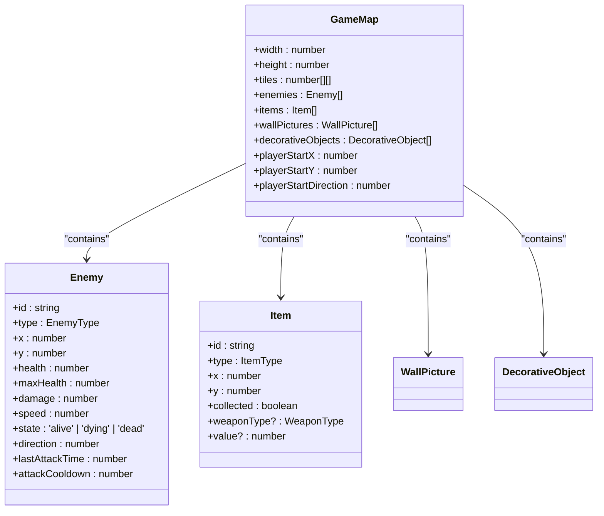
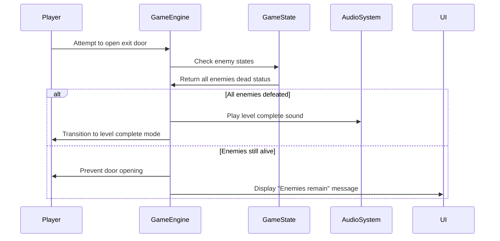
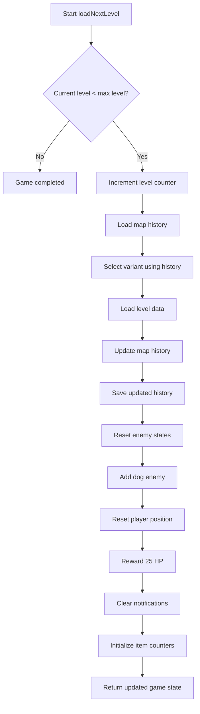
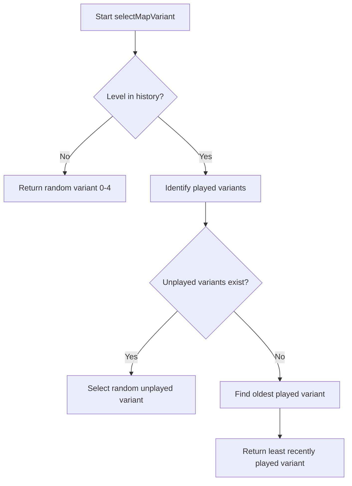
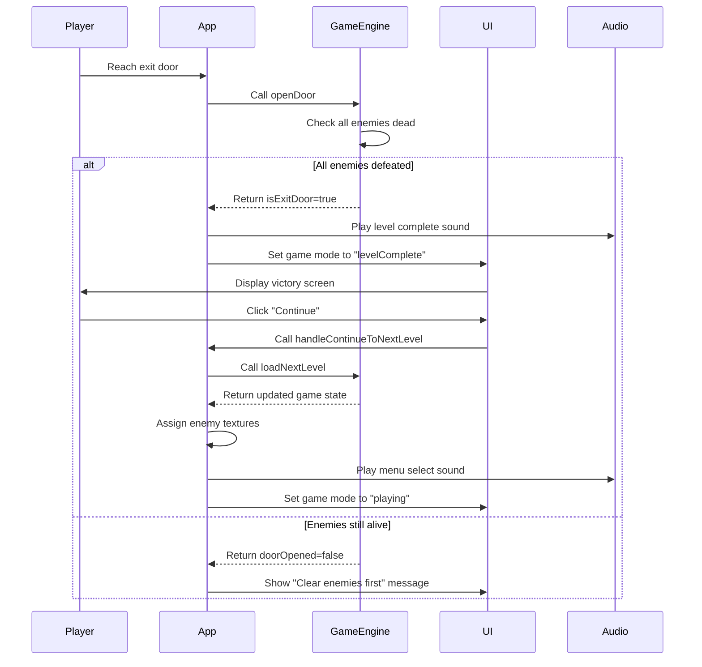
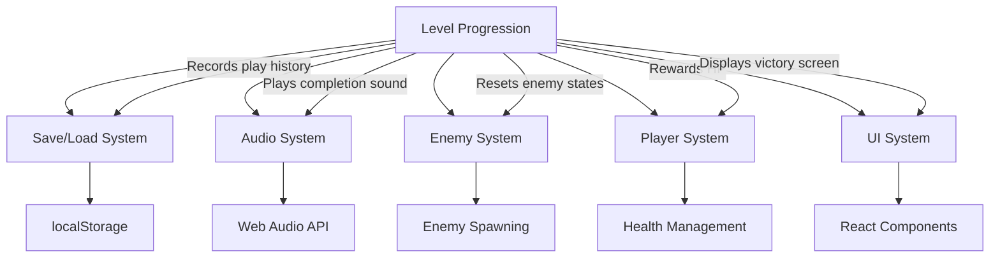

# Level Progression

<cite>
**Referenced Files in This Document**   
- [types.ts](file://src/types.ts) - *Updated with item tracking properties*
- [gameEngine.ts](file://src/gameEngine.ts) - *Modified to initialize item counters in loadNextLevel and createInitialGameState*
- [mapSelectionSystem.ts](file://src/mapSelectionSystem.ts)
- [App.tsx](file://src/App.tsx)
- [soundSystem.ts](file://src/soundSystem.ts)
- [levels/index.ts](file://src/levels/index.ts)
</cite>

## Update Summary
**Changes Made**   
- Added documentation for item tracking system initialization in level progression
- Updated loadNextLevel function description to include item counter initialization
- Added information about totalItemsInLevel and collectedItemsInLevel properties in GameState
- Updated createInitialGameState function documentation to reflect item counter initialization
- Enhanced section sources to reflect updated files and line ranges

## Table of Contents
1. [Introduction](#introduction)
2. [GameMap Interface Definition](#gamemap-interface-definition)
3. [Level Completion Detection](#level-completion-detection)
4. [Loading the Next Level](#loading-the-next-level)
5. [Level Variant Selection System](#level-variant-selection-system)
6. [Level Progression in Game Loop](#level-progression-in-game-loop)
7. [Integration with Other Systems](#integration-with-other-systems)
8. [Common Issues and Solutions](#common-issues-and-solutions)
9. [Extending the Level Progression System](#extending-the-level-progression-system)
10. [Conclusion](#conclusion)

## Introduction
The level progression system in the Egor game manages the transition between levels, ensuring smooth gameplay flow and enhanced replayability through a variant-based level selection mechanism. This system coordinates level completion detection, next level loading, variant selection, player state updates, audio feedback, and UI notifications. The implementation supports 8 main levels with 5 unique variants each, providing diverse layouts and challenges. The system integrates tightly with game state management, save/load functionality, and audio systems to deliver a cohesive player experience.

## GameMap Interface Definition

The `GameMap` interface in types.ts defines the structure and properties of each game level. It serves as the blueprint for all level data and contains essential gameplay elements.



**Diagram sources**
- [types.ts](file://src/types.ts#L113-L124)

**Section sources**
- [types.ts](file://src/types.ts#L113-L124)

### Core Properties of GameMap
The GameMap interface includes several key properties that define a level's structure and content:

- **tiles**: A 2D array representing the level layout where different values indicate floor (0), walls (1), doors (2), and exit doors (3)
- **enemies**: An array of Enemy objects that defines enemy positions, types, and initial states for the level
- **items**: An array of Item objects specifying the location and type of collectible items in the level
- **playerStartX/playerStartY**: Coordinates where the player character spawns at the beginning of the level
- **playerStartDirection**: The initial facing direction of the player character in radians
- **wallPictures**: Array of decorative wall elements that enhance visual variety
- **decorativeObjects**: Environmental objects that add visual detail and can affect collision detection

The interface ensures consistent data structure across all levels and variants, enabling the game engine to process any level using the same logic and rendering pipeline.

## Level Completion Detection

The level completion system determines when a player has successfully cleared a level by defeating all enemies. This detection occurs when the player attempts to open an exit door, triggering a validation check.



**Diagram sources**
- [gameEngine.ts](file://src/gameEngine.ts#L579-L581)
- [App.tsx](file://src/App.tsx#L170-L177)
- [soundSystem.ts](file://src/soundSystem.ts#L87-L89)

**Section sources**
- [gameEngine.ts](file://src/gameEngine.ts#L579-L581)
- [App.tsx](file://src/App.tsx#L170-L177)

### checkLevelComplete Function Implementation
The `checkLevelComplete` function in gameEngine.ts is responsible for determining whether all enemies in the current level have been defeated. The function evaluates the state property of each enemy in the current level:

```typescript
export function checkLevelComplete(enemies: Enemy[]): boolean {
  return enemies.every((enemy) => enemy.state !== 'alive');
}
```

This implementation uses the Array.every() method to verify that no enemy remains in the 'alive' state. Enemies can exist in three states: 'alive', 'dying', or 'dead'. The function returns true only when every enemy has transitioned from the 'alive' state, indicating complete clearance of hostiles. This simple yet effective approach allows for gradual enemy elimination rather than requiring simultaneous defeat.

The level completion check is integrated into the door opening mechanism, specifically for exit doors (represented by tile value 3). When a player attempts to open an exit door, the game checks if all enemies are defeated before allowing progression. This design ensures players must fully clear each level before advancing, maintaining the game's challenge and structure.

## Loading the Next Level

The `loadNextLevel` function orchestrates the transition to subsequent levels, handling state updates, variant selection, and player rewards. This function is central to the game's progression mechanics.



**Diagram sources**
- [gameEngine.ts](file://src/gameEngine.ts#L583-L628)
- [mapSelectionSystem.ts](file://src/mapSelectionSystem.ts#L187-L213)

**Section sources**
- [gameEngine.ts](file://src/gameEngine.ts#L583-L628)

### loadNextLevel Function Workflow
The `loadNextLevel` function in gameEngine.ts manages the entire process of advancing to the next level. The function follows a comprehensive sequence:

1. **Level Boundary Check**: The function first determines if the player has reached the final level by comparing the current level against the maximum available level derived from LEVEL_VARIANTS. If the player is at or beyond the maximum level, the function returns the current game state without changes, effectively ending the game.

2. **Next Level Calculation**: For valid progression, the function increments the current level by one to determine the next level index.

3. **Variant Selection**: The function loads the map history from persistent storage and uses it to select an appropriate variant for the next level through the `selectMapVariant` function.

4. **Level Data Retrieval**: Using the selected level and variant, the function retrieves the corresponding GameMap data via the `getMap` function.

5. **History Update**: The function records the current level and variant selection in the map history and saves the updated history to maintain tracking across sessions.

6. **State Initialization**: The function updates the game state with the new level data, including:
   - Setting the current level and variant
   - Loading the new map layout
   - Initializing enemies from the level definition
   - Adding a dog enemy at a random valid position
   - Resetting all enemy states to 'alive' and assigning textures
   - Initializing items from the level definition
   - Positioning the player at the designated start coordinates

7. **Player Reward**: The player receives a health bonus of 25 HP, capped at their maximum health limit, as a reward for completing the level.

8. **Notification Cleanup**: Any previous item collection notifications are cleared to provide a clean interface for the new level.

9. **Item Counter Initialization**: The function initializes two new properties in the game state:
   - **totalItemsInLevel**: Set to the length of the items array in the new level, representing the total number of items available
   - **collectedItemsInLevel**: Reset to 0 to track the player's progress in collecting items in the new level

This comprehensive approach ensures a seamless transition between levels while maintaining game state integrity and providing appropriate feedback to the player.

## Level Variant Selection System

The level variant system enhances replayability by offering 5 different layouts for each of the 8 levels. The selection algorithm prioritizes unplayed variants and falls back to the least recently played variant when all options have been experienced.



**Diagram sources**
- [mapSelectionSystem.ts](file://src/mapSelectionSystem.ts#L106-L154)
- [mapSelectionSystem.ts](file://src/mapSelectionSystem.ts#L19-L71)

**Section sources**
- [mapSelectionSystem.ts](file://src/mapSelectionSystem.ts#L106-L154)

### Variant Selection Algorithm
The `selectMapVariant` function implements a sophisticated algorithm that balances randomness with replayability considerations:

1. **History Filtering**: The function first filters the complete map history to extract entries relevant to the target level.

2. **New Player Handling**: If no history exists for the level (first-time player), the function returns a randomly selected variant (0-4).

3. **Unplayed Variant Priority**: The algorithm identifies which variants have not been played by creating a set of played variants and checking against all possible variants (0-4). Unplayed variants are prioritized to ensure players experience all available layouts.

4. **Random Selection Among Unplayed**: When multiple unplayed variants exist, one is selected randomly to maintain unpredictability.

5. **Least Recently Played Fallback**: Once all variants have been played, the algorithm determines which variant was played the longest time ago by comparing timestamps in the history entries.

6. **Oldest Variant Selection**: The variant with the earliest timestamp (oldest play date) is selected to maximize the time between repeated experiences of the same layout.

The system uses persistent storage (localStorage) to maintain a history of level plays, with each entry containing the level number, variant number, and timestamp. This history is limited to 1000 entries using a FIFO (first-in, first-out) approach to prevent excessive storage usage. An in-memory fallback ensures functionality even when localStorage is unavailable.

## Level Progression in Game Loop

The level progression system integrates with the game's main loop and UI components to provide a cohesive player experience. The flow from level completion to advancement is carefully orchestrated across multiple components.



**Diagram sources**
- [App.tsx](file://src/App.tsx#L170-L177)
- [App.tsx](file://src/App.tsx#L941-L976)
- [App.tsx](file://src/App.tsx#L98-L134)
- [soundSystem.ts](file://src/soundSystem.ts#L87-L89)

**Section sources**
- [App.tsx](file://src/App.tsx#L170-L177)
- [App.tsx](file://src/App.tsx#L941-L976)

### Game Loop Integration Points
The level progression system interacts with the game loop at several critical points:

1. **Exit Door Interaction**: When a player attempts to open a door (space bar press), the `openDoor` function checks if it's an exit door (tile value 3). If so, it verifies that all enemies are defeated before allowing progression.

2. **Level Complete UI**: Upon successful level completion, the game mode transitions to 'levelComplete', displaying a victory screen with statistics including the level number, variant, and current score.

3. **Continue Mechanism**: The "Continue" button on the victory screen triggers `handleContinueToNextLevel`, which calls `loadNextLevel` to prepare the subsequent level.

4. **Player Rewards**: The system awards 25 HP when loading the next level, providing tangible benefits for progression.

5. **Visual Feedback**: The UI clearly displays the current level and variant information, helping players track their progress through the game's structure.

This integration ensures that level progression feels like a natural part of gameplay rather than an abrupt transition, maintaining immersion and providing appropriate feedback at each stage.

## Integration with Other Systems

The level progression system seamlessly integrates with various game components to create a cohesive experience. These integrations ensure data consistency, provide appropriate feedback, and maintain game state across sessions.



**Diagram sources**
- [mapSelectionSystem.ts](file://src/mapSelectionSystem.ts#L19-L96)
- [soundSystem.ts](file://src/soundSystem.ts#L87-L89)
- [gameEngine.ts](file://src/gameEngine.ts#L583-L628)
- [App.tsx](file://src/App.tsx#L941-L976)

**Section sources**
- [mapSelectionSystem.ts](file://src/mapSelectionSystem.ts#L19-L96)
- [soundSystem.ts](file://src/soundSystem.ts#L87-L89)

### Save/Load System Integration
The level progression system maintains continuity across gaming sessions through integration with the save/load system. The map selection algorithm uses persistent storage to track which level variants have been played:

- **History Persistence**: The `loadMapHistory` and `saveMapHistory` functions use localStorage to store and retrieve play history, ensuring that variant selection preferences persist between sessions.

- **Data Validation**: The system includes robust error handling for corrupted or invalid storage data, automatically cleaning entries and providing fallback mechanisms.

- **Migration Support**: The save system includes migration logic for older save formats, such as automatically setting a default currentVariant value when loading legacy saves.

- **Storage Limits**: The history is capped at 1000 entries to prevent excessive browser storage usage while maintaining sufficient data for the selection algorithm.

### Audio System Integration
Audio feedback enhances the level progression experience through carefully timed sound effects:

- **Completion Sound**: The `playLevelComplete` function in soundSystem.ts plays a triumphant three-note sequence (A4, C#5, E5) when a level is completed, providing positive reinforcement.

- **Menu Navigation**: The `playMenuSelect` sound provides auditory feedback when navigating from the victory screen to the next level.

- **Error Indication**: If a player attempts to exit without clearing all enemies, no special sound plays, creating a silent negative feedback that encourages further exploration.

These audio cues create an emotional arc that celebrates achievements and guides player behavior through non-visual channels.

## Common Issues and Solutions

Several potential issues can arise in the level progression system, primarily related to state management, variant selection, and edge cases in the game logic.

### Incorrect Level Loading
**Issue**: Players may encounter situations where the wrong level or variant loads, or progression seems blocked.

**Solutions**:
- Verify that LEVEL_VARIANTS contains correctly indexed entries matching the expected level structure
- Ensure the level indexing accounts for the 0-based currentLevel vs 1-based LEVEL_VARIANTS keys
- Implement fallback mechanisms in getMap that default to level 1 variant 1 when invalid indices are provided
- Validate that map history entries are properly recorded after each level completion

**Section sources**
- [mapSelectionSystem.ts](file://src/mapSelectionSystem.ts#L187-L213)

### Variant Selection Bugs
**Issue**: The variant selection algorithm may not properly prioritize unplayed variants or may repeat variants too frequently.

**Solutions**:
- Verify that the selectMapVariant function correctly identifies unplayed variants by checking against a complete set (0-4)
- Ensure timestamps are properly compared to identify the oldest played variant
- Test the history filtering logic to confirm it only considers entries for the current level
- Implement logging to track variant selection decisions for debugging purposes

**Section sources**
- [mapSelectionSystem.ts](file://src/mapSelectionSystem.ts#L106-L154)

### State Initialization Problems
**Issue**: Enemies may not properly reset to 'alive' state, or player position may not update correctly when loading new levels.

**Solutions**:
- Ensure deep cloning of level data using JSON.parse(JSON.stringify()) to prevent reference sharing
- Verify that all enemies have their state property reset to 'alive' and textures assigned
- Confirm player coordinates are set to the level's playerStartX and playerStartY properties
- Check that the dog enemy is properly added at a valid position on the map

**Section sources**
- [gameEngine.ts](file://src/gameEngine.ts#L583-L628)

### Storage-Related Issues
**Issue**: Map history may not persist or may become corrupted, affecting variant selection.

**Solutions**:
- Implement the in-memory fallback mechanism when localStorage is unavailable
- Add data validation to clean corrupted entries from storage
- Ensure proper error handling when localStorage quota is exceeded
- Verify that history entries are properly timestamped and structured

**Section sources**
- [mapSelectionSystem.ts](file://src/mapSelectionSystem.ts#L19-L96)

## Extending the Level Progression System

The current level progression system can be extended in several ways to enhance gameplay, add features, or improve the player experience.

### Adding New Levels
To add new levels to the game:

1. Create new level variant files in the src/levels directory following the naming convention (e.g., level8-variant1.ts, level8-variant2.ts, etc.)

2. Define the GameMap data structure in each file with appropriate tiles, enemies, items, and player start positions

3. Import and export the new level variants in src/levels/index.ts:

```typescript
// Level 8 Variants
export { LEVEL_8_VARIANT_1 } from './level8-variant1.ts';
export { LEVEL_8_VARIANT_2 } from './level8-variant2.ts';
// ... continue for all variants
```

4. Ensure the LEVEL_VARIANTS object in levels.ts includes the new level data under the appropriate key

The system will automatically recognize the new levels due to its dynamic level counting mechanism that uses Object.keys(LEVEL_VARIANTS).

**Section sources**
- [levels/index.ts](file://src/levels/index.ts)
- [gameEngine.ts](file://src/gameEngine.ts#L583-L585)

### Modifying the Selection Algorithm
The variant selection algorithm can be customized to implement different replayability strategies:

1. **Difficulty-Based Selection**: Modify selectMapVariant to consider player performance metrics, selecting more challenging variants for skilled players.

2. **Thematic Sequencing**: Implement logic that creates narrative or thematic connections between consecutive levels.

3. **Streak Prevention**: Enhance the algorithm to prevent the same variant from repeating within a certain number of plays, even if it's the oldest.

4. **Player Preferences**: Add a configuration option that allows players to choose between different selection strategies (random, rotation, etc.).

5. **Seasonal Variants**: Implement time-based variant selection that features special layouts during holidays or events.

These modifications would primarily involve enhancing the selectMapVariant function while maintaining compatibility with the existing history tracking system.

## Conclusion
The level progression system in Egor provides a robust framework for managing player advancement through the game's content. By combining level completion detection, intelligent variant selection, and seamless state management, the system creates a replayable experience that rewards both skill and exploration. The integration of persistent history tracking ensures that players encounter diverse layouts across multiple playthroughs, while the health reward system provides tangible benefits for progression. The modular design allows for straightforward extension with new levels and variants, and the comprehensive error handling ensures stability across different browser environments. This system effectively balances structured progression with procedural variety, creating an engaging gameplay loop that encourages repeated play while maintaining a coherent narrative structure.