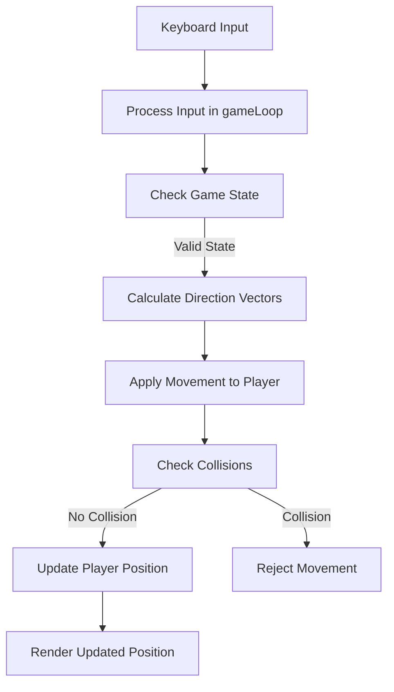
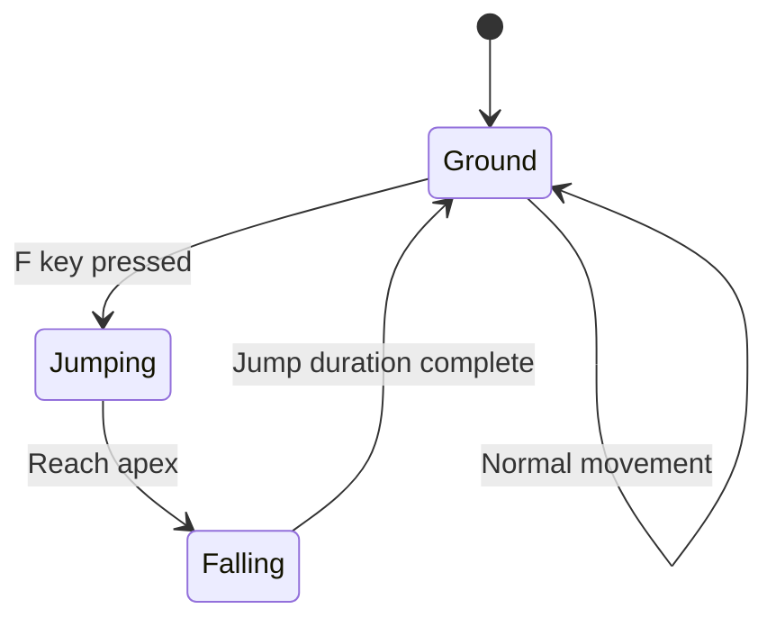
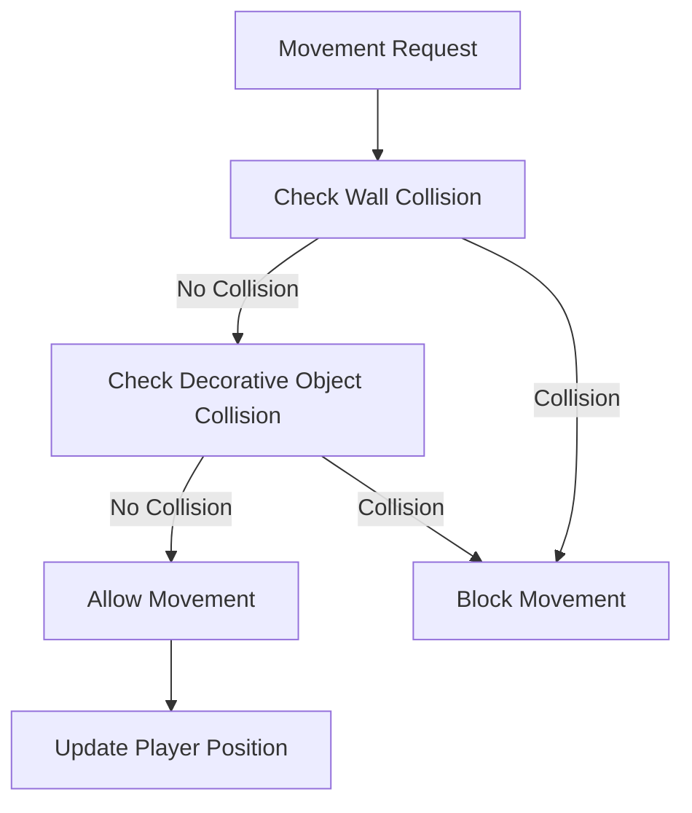
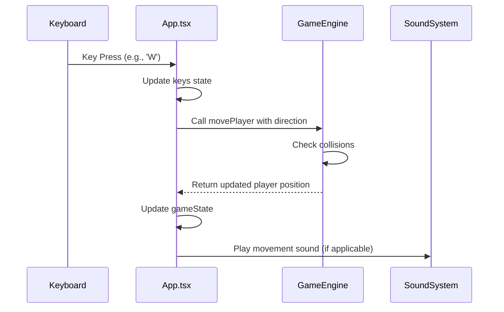
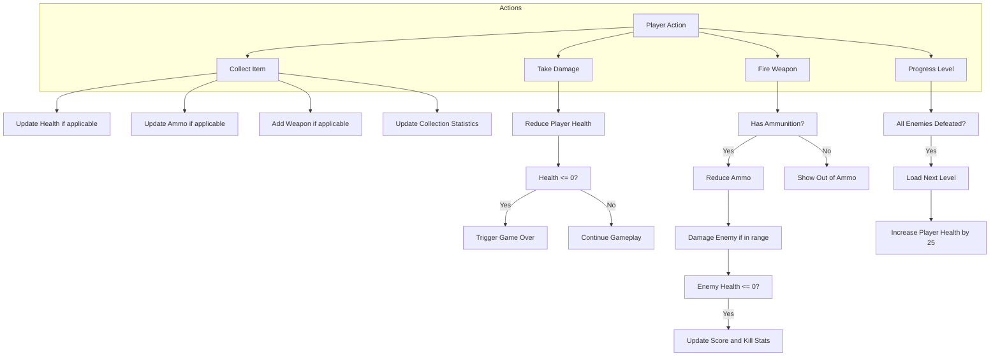
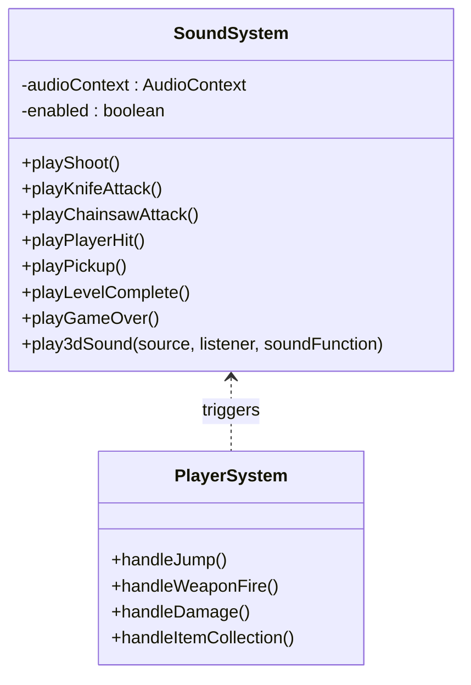

# Player System

<cite>
**Referenced Files in This Document**  
- [App.tsx](file://src/App.tsx)
- [types.ts](file://src/types.ts)
- [gameEngine.ts](file://src/gameEngine.ts)
- [soundSystem.ts](file://src/soundSystem.ts)
</cite>

## Table of Contents
1. [Player Interface and State Management](#player-interface-and-state-management)
2. [Movement and Rotation Mechanics](#movement-and-rotation-mechanics)
3. [Jumping Implementation](#jumping-implementation)
4. [Collision Detection System](#collision-detection-system)
5. [Input Handling in Game Loop](#input-handling-in-game-loop)
6. [Player Actions and State Updates](#player-actions-and-state-updates)
7. [Audio Integration](#audio-integration)
8. [Extensibility and Customization](#extensibility-and-customization)

## Player Interface and State Management

The Player interface in types.ts defines the complete state structure for the player character, encompassing health, weapons, position, and various gameplay statistics. The player state is managed as part of the overall GameState, which maintains the player object as a central component.

The Player interface includes essential properties such as position coordinates (x, y), direction (in radians), health tracking with both current and maximum values, weapon inventory with current selection, ammunition counts for each weapon type, and various gameplay statistics including score, collected items, and killed enemies. The interface also includes optional properties for jumping mechanics (isJumping, jumpStartTime, jumpDuration) that are used to manage the visual and physical aspects of the jump animation.

Player state is initialized through the createInitialPlayer function in gameEngine.ts, which sets default values based on the selected difficulty level. The health values are determined by the difficulty setting, with Easy providing 150 HP, Normal providing 100 HP, and Hard providing 75 HP. The player starts with a knife and pistol as default weapons, with corresponding ammunition values.

The GameState interface has been enhanced with two new properties for tracking item collection progress: totalItemsInLevel and collectedItemsInLevel. These properties are initialized in the createInitialGameState function when starting a new game, with totalItemsInLevel set to the length of the level's items array and collectedItemsInLevel initialized to 0. When progressing to the next level via loadNextLevel, these values are reset accordingly, with totalItemsInLevel updated to reflect the new level's item count.

**Section sources**
- [types.ts](file://src/types.ts#L126-L141)
- [gameEngine.ts](file://src/gameEngine.ts#L0-L47)
- [types.ts](file://src/types.ts#L153-L154) - *Updated in recent commit*
- [gameEngine.ts](file://src/gameEngine.ts#L49-L91) - *Updated in recent commit*
- [gameEngine.ts](file://src/gameEngine.ts#L587-L634) - *Updated in recent commit*

## Movement and Rotation Mechanics

Player movement is implemented through a combination of directional input processing and collision detection. The movement system uses a raycasting-based approach where player input is translated into directional vectors that are applied to the player's position.

The movement mechanics are handled in the gameLoop function within App.tsx, which processes keyboard input and updates the player position accordingly. The system uses normalized directional vectors derived from the player's current facing direction to calculate movement in four cardinal directions (forward, backward, strafe left, strafe right). The movement speed is normalized to 60 FPS to ensure consistent movement regardless of actual frame rate.

Forward and backward movement is calculated using the player's direction vector (dirX, dirY), while strafe movement uses a perpendicular vector (planeX, planeY) that is rotated 90 degrees from the direction vector. This creates the classic "tank controls" movement system commonly found in first-person games.

Rotation is implemented by directly modifying the player's direction property, which is stored in radians. The rotation speed is also normalized to 60 FPS to maintain consistent rotation speed across different frame rates.

**Diagram sources**
- [App.tsx](file://src/App.tsx#L255-L323)
- [gameEngine.ts](file://src/gameEngine.ts#L201-L239)

**Section sources**
- [App.tsx](file://src/App.tsx#L255-L323)
- [gameEngine.ts](file://src/gameEngine.ts#L201-L239)

## Jumping Implementation

The jumping mechanic is implemented as a temporary state change that affects both the visual representation and collision behavior of the player. When the player initiates a jump by pressing the F key, the startJump function is called, which sets the isJumping flag to true and records the jump start time and duration.

The jump animation is handled in the rendering system, where the jump offset is calculated based on the elapsed time since the jump began. The offset follows a parabolic curve using a sine function, creating a natural-looking jump motion that rises and falls smoothly. The maximum jump height is 80 pixels, achieved at the midpoint of the 400ms jump duration.

During the jump, the player's collision behavior changes to allow passing through decorative objects that would normally block movement. This is implemented by checking the isJumping flag in the movePlayer function and temporarily ignoring collisions with decorative objects. This allows players to jump over small obstacles like crates or vases.

The jump state is updated each frame by the updateJump function, which checks whether the jump duration has elapsed. Once the jump is complete, the isJumping flag is reset to false, and the jump timing properties are cleared.

**Diagram sources**
- [App.tsx](file://src/App.tsx#L179-L211)
- [gameEngine.ts](file://src/gameEngine.ts#L242-L270)

**Section sources**
- [App.tsx](file://src/App.tsx#L179-L211)
- [gameEngine.ts](file://src/gameEngine.ts#L242-L270)

## Collision Detection System

The collision detection system implements a two-tier approach that checks for collisions with both structural walls and decorative objects. The system uses a grid-based representation of the game world where walls are represented by non-zero values in a 2D array.

Wall collision detection is performed by checking the tile value at the player's intended new position. The checkCollision function converts the player's floating-point coordinates to integer grid coordinates and checks if the corresponding tile value is non-zero, indicating a wall. A collision margin of 0.2 units is used to prevent the player from getting too close to walls.

Decorative object collision detection is implemented in the optimized checkDecorativeObjectCollision function, which uses several performance optimizations. The function first checks if there are any decorative objects to avoid unnecessary processing. It then uses a distance-based culling system that only checks objects within a 3-unit radius of the player, reducing the number of collision checks.

For objects within range, the function uses squared distance comparison to avoid expensive square root calculations until necessary. Each decorative object type has a predefined collision radius, but objects can override this with their own collisionRadius property. Some objects, like ceiling lights, have a collision radius of zero, making them non-collidable.

The collision system handles edge cases by checking both primary and secondary collision points. For example, when moving horizontally, the system checks not only the direct X position but also positions slightly above and below the player's Y coordinate to prevent getting stuck on corners.

**Diagram sources**
- [gameEngine.ts](file://src/gameEngine.ts#L156-L199)
- [gameEngine.ts](file://src/gameEngine.ts#L201-L239)

**Section sources**
- [gameEngine.ts](file://src/gameEngine.ts#L156-L199)
- [gameEngine.ts](file://src/gameEngine.ts#L201-L239)

## Input Handling in Game Loop

Player input is processed through a comprehensive keyboard event system that captures key presses and releases and translates them into game actions. The input handling is implemented in App.tsx using React's useEffect hook to attach event listeners to the window object.

The system maintains a keys state object that tracks the current state of all relevant keys. When a key is pressed, its corresponding entry in the keys object is set to true; when released, it is set to false. This allows the game loop to check the current state of multiple keys simultaneously, enabling smooth diagonal movement and other multi-key combinations.

The input system handles several categories of player actions:
- Movement: WASD keys and arrow keys for directional movement
- Weapon switching: Number keys 1-6 to select different weapons
- Special actions: F key for jumping, E key for opening doors
- Interface controls: H for help, M for save menu, L for load menu, P for pause

Each input action is processed with appropriate context checks, such as verifying that the player is not typing in an input field before processing game controls. The system also provides audio feedback for most actions through the soundSystem, enhancing the player experience.

**Diagram sources**
- [App.tsx](file://src/App.tsx#L98-L211)
- [App.tsx](file://src/App.tsx#L255-L323)

**Section sources**
- [App.tsx](file://src/App.tsx#L98-L211)
- [App.tsx](file://src/App.tsx#L255-L323)

## Player Actions and State Updates

Player actions are processed through a series of dedicated functions that update the player state and trigger appropriate game responses. These actions include collecting items, taking damage from enemies, firing weapons, and progressing through levels.

Item collection is handled by the collectItem function, which checks the distance between the player and uncollected items. When an item is within 0.7 units of the player, it is marked as collected and the player's state is updated accordingly. Health items restore health up to the maximum, ammunition items replenish weapon ammo, and weapon items add new weapons to the player's inventory. The collectItem function now returns a newCollectedItemsInLevel value that is used to update the GameState, incrementing the count each time an item is collected.

The player takes damage when enemies are within attack range (1.5 units). The damage amount is multiplied by a difficulty-based multiplier, making enemies more dangerous on higher difficulty settings. When the player's health reaches zero, the game over state is triggered.

Level progression occurs when all enemies in the current level are defeated. The system displays a notification and allows the player to proceed to the next level, where the player's health is increased by 25 points as a reward. The loadNextLevel function now properly initializes the item tracking system for the new level, setting totalItemsInLevel to the count of items in the new level and resetting collectedItemsInLevel to 0.

**Section sources**
- [gameEngine.ts](file://src/gameEngine.ts#L515-L577)
- [gameEngine.ts](file://src/gameEngine.ts#L381-L457)
- [gameEngine.ts](file://src/gameEngine.ts#L459-L513)
- [gameEngine.ts](file://src/gameEngine.ts#L587-L634) - *Updated in recent commit*

## Audio Integration

The player system is integrated with the audio system to provide feedback for various actions and events. The soundSystem class implements a Web Audio API-based sound engine that generates tones with different frequencies, durations, and waveforms to create distinct audio cues.

Each player action triggers specific sound effects:
- Movement and jumping: The jump action plays a "pickup" sound
- Weapon firing: Different weapons have distinct firing sounds (shoot, knife attack, chainsaw attack)
- Damage: The player hit sound uses a triangle wave at 150Hz for 0.3 seconds
- Item collection: A two-tone "pickup" sound indicates successful collection
- Level events: Distinct sounds for level completion and game over

The audio system also implements 3D positional audio for certain sounds, such as the dog barking, where the volume is attenuated based on the distance between the sound source and the player. This creates a more immersive experience by providing spatial audio cues.

**Diagram sources**
- [soundSystem.ts](file://src/soundSystem.ts#L0-L127)
- [App.tsx](file://src/App.tsx#L320-L366)

**Section sources**
- [soundSystem.ts](file://src/soundSystem.ts#L0-L127)
- [App.tsx](file://src/App.tsx#L320-L366)

## Extensibility and Customization

The player system is designed with extensibility in mind, allowing for the addition of new abilities and modification of existing mechanics. The modular architecture separates concerns between input handling, state management, collision detection, and rendering, making it easier to extend functionality without affecting other systems.

To add new abilities, developers can follow the existing pattern of state flags and corresponding rendering logic. For example, adding a crouching ability would involve adding a isCrouching boolean to the Player interface, creating crouch and uncrouch functions, modifying the movement and collision logic to account for the crouched state, and updating the rendering system to adjust the player's vertical position.

Weapon mechanics can be extended by adding new entries to the WeaponType enum and corresponding weapon definitions in the WEAPONS constant. The fireWeapon function already supports different weapon types with varying damage, fire rate, and ammunition requirements, making it easy to balance new weapons.

The collision system's design allows for easy addition of new decorative object types with custom collision radii. Developers can add new types to the DecorativeObjectType enum and define appropriate collision radii in the DECORATIVE_OBJECT_COLLISION_RADII constant.

The audio system's modular design makes it straightforward to add new sound effects by implementing additional methods in the SoundSystem class, following the established pattern of tone generation with specific frequencies, durations, and waveforms.

**Section sources**
- [types.ts](file://src/types.ts#L126-L141)
- [gameEngine.ts](file://src/gameEngine.ts#L201-L270)
- [soundSystem.ts](file://src/soundSystem.ts#L0-L127)