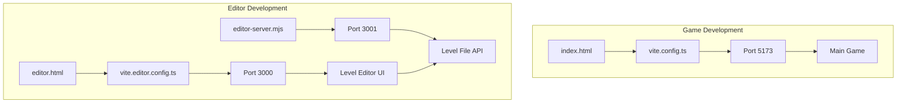
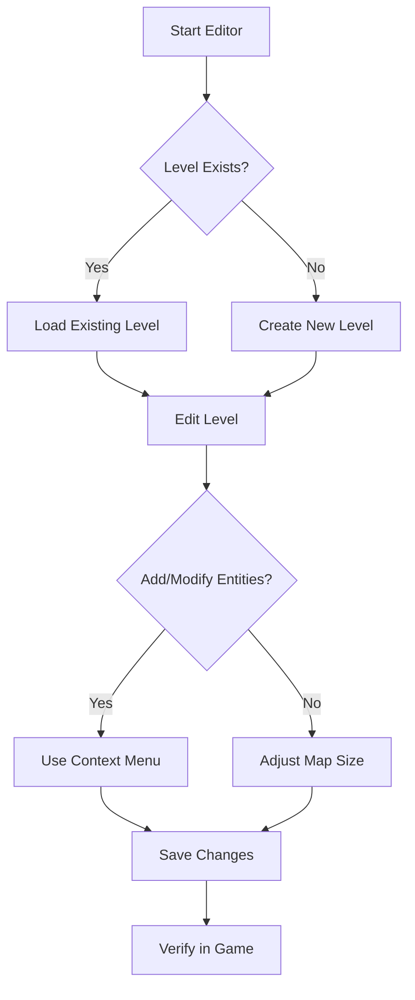

# Getting Started

<cite>
**Referenced Files in This Document**   
- [package.json](file://package.json)
- [README.md](file://README.md)
- [vite.config.ts](file://vite.config.ts)
- [vite.editor.config.ts](file://vite.editor.config.ts)
- [index.html](file://index.html)
- [editor.html](file://editor.html)
- [main.tsx](file://src/main.tsx)
- [editor/main.tsx](file://src/editor/main.tsx)
- [editor-server.mjs](file://editor-server.mjs)
- [docs/LEVEL-EDITOR-README.md](file://docs/LEVEL-EDITOR-README.md)
- [docs/LEVEL-EDITOR-QUICK-REFERENCE.md](file://docs/LEVEL-EDITOR-QUICK-REFERENCE.md)
</cite>

## Table of Contents
1. [Prerequisites](#prerequisites)
2. [Installation](#installation)
3. [Running the Game](#running-the-game)
4. [Running the Level Editor](#running-the-level-editor)
5. [Development Server Configuration](#development-server-configuration)
6. [Environment Requirements](#environment-requirements)
7. [Basic Usage](#basic-usage)
8. [Troubleshooting](#troubleshooting)

## Prerequisites

Before setting up the egor project, ensure your development environment meets the following requirements:

- **Node.js**: Version 18.0.0 or higher (LTS recommended)
- **npm**: Version 8.0.0 or higher (typically included with Node.js)
- **Browser**: Modern browser with ES6+ support (Chrome, Firefox, Edge, or Safari)
- **Operating System**: Windows, macOS, or Linux

The project uses modern JavaScript features and build tools that require a recent Node.js version. The application is designed to run entirely in the browser without requiring any additional backend services for gameplay.

**Section sources**
- [README.md](file://README.md#L1-L185)
- [package.json](file://package.json#L0-L39)

## Installation

To install the egor project and its dependencies, follow these steps:

1. Clone the repository or download the source code
2. Navigate to the project root directory in your terminal
3. Install all dependencies using npm:

```bash
npm install
```

This command reads the `package.json` file and installs all required dependencies, including:
- React 19 with TypeScript for the frontend framework
- Vite as the build tool and development server
- React compiler plugin for optimized rendering
- ESLint for code linting and quality checks
- Concurrently for running multiple processes simultaneously

The installation process will create a `node_modules` directory containing all dependencies and update the `package-lock.json` file to lock dependency versions.

**Section sources**
- [package.json](file://package.json#L0-L39)
- [README.md](file://README.md#L158-L163)

## Running the Game

To start the game development server, use the following command:

```bash
npm run dev
```

This command executes the `dev` script defined in `package.json`, which runs Vite with the default configuration (`vite.config.ts`). The development server will start and provide the following information:

- Local server address: `http://localhost:5173`
- Network address (if available): `http://[your-ip]:5173`

The game will automatically open in your default browser. The entry point for the game is `index.html`, which loads the React application from `src/main.tsx`. The application renders the main game component (`App.tsx`) into the `#root` element.

To stop the development server, press `Ctrl+C` in the terminal.

**Section sources**
- [package.json](file://package.json#L6-L10)
- [vite.config.ts](file://vite.config.ts#L1-L13)
- [index.html](file://index.html#L1-L14)
- [src/main.tsx](file://src/main.tsx#L1-L9)

## Running the Level Editor

The egor project includes a visual level editor for creating and modifying game levels. To start the editor, use the following command:

```bash
npm run editor
```

This command runs two processes simultaneously using the `concurrently` package:
1. `npm run editor:frontend` - Starts the editor frontend on port 3000
2. `npm run editor:backend` - Starts the editor backend server on port 3001

The editor frontend is served from `editor.html` and loads the editor application from `src/editor/main.tsx`. The backend server (`editor-server.mjs`) provides a REST API for reading and writing level files in the `src/levels/` directory.

After starting, the editor will automatically open at `http://localhost:3000`. The backend server will display its status in the terminal, confirming it's running on port 3001 and serving files from the `src/levels/` directory.

**Section sources**
- [package.json](file://package.json#L11-L17)
- [vite.editor.config.ts](file://vite.editor.config.ts#L1-L23)
- [editor.html](file://editor.html#L1-L13)
- [src/editor/main.tsx](file://src/editor/main.tsx#L1-L11)
- [editor-server.mjs](file://editor-server.mjs#L1-L350)

## Development Server Configuration

The egor project uses two separate Vite configurations for the game and the level editor:

### Game Development Server
The main game uses `vite.config.ts` which:
- Uses the default Vite port (5173)
- Serves the application from `index.html`
- Entry point is `src/main.tsx`
- Includes React plugin with React compiler
- No special build options required

### Level Editor Development Server
The level editor uses `vite.editor.config.ts` which:
- Configures the server to run on port 3000
- Sets the root directory to the project root
- Configures the build to use `editor.html` as the entry point
- Opens the browser to `/editor.html` when starting
- Uses the same React plugin configuration as the main game

The dual-server setup allows the level editor to have its own isolated development environment while sharing the same codebase and dependencies as the main game.



**Diagram sources**
- [vite.config.ts](file://vite.config.ts#L1-L13)
- [vite.editor.config.ts](file://vite.editor.config.ts#L1-L23)
- [editor-server.mjs](file://editor-server.mjs#L1-L350)

**Section sources**
- [vite.config.ts](file://vite.config.ts#L1-L13)
- [vite.editor.config.ts](file://vite.editor.config.ts#L1-L23)
- [editor-server.mjs](file://editor-server.mjs#L1-L350)

## Environment Requirements

### Node.js Version
The project requires Node.js version 18.0.0 or higher. This is necessary because:
- The project uses ES modules (indicated by `"type": "module"` in package.json)
- Vite 7+ requires modern Node.js features
- Some development dependencies have Node.js version requirements

### Browser Compatibility
The game is compatible with modern browsers that support:
- HTML5 Canvas for rendering
- Web Audio API for sound effects
- ES6+ JavaScript features
- CSS Flexbox and Grid for layout

Tested browsers include:
- Google Chrome (latest)
- Mozilla Firefox (latest)
- Microsoft Edge (latest)
- Apple Safari (latest)

### Port Requirements
The development setup requires the following ports to be available:
- **5173**: Main game development server
- **3000**: Level editor frontend server
- **3001**: Level editor backend API server

If these ports are already in use, you can modify the configuration files to use different ports.

**Section sources**
- [package.json](file://package.json#L0-L39)
- [vite.config.ts](file://vite.config.ts#L1-L13)
- [vite.editor.config.ts](file://vite.editor.config.ts#L1-L23)

## Basic Usage

### Game Navigation
Once the game is running at `http://localhost:5173`, you can interact with it using the following controls:

**Menu Navigation:**
- Press **H** to show/hide the help screen
- Press **P** to pause the game
- Press **M** to save your current game state
- Press **L** to load a saved game state
- Press **T** to view statistics (items collected, enemies killed)

**Starting a New Game:**
1. Launch the game with `npm run dev`
2. Use the keyboard to navigate the menu
3. Select your desired difficulty level
4. The game will start with the player at the designated starting position
5. Use movement keys (W, A, S, D) to navigate the level

### Level Editor Interface
The level editor provides a visual interface for creating and modifying game levels:

**Accessing the Editor:**
1. Start the editor with `npm run editor`
2. The editor will open at `http://localhost:3000`
3. Use the toolbar to select existing levels or create new ones

**Editor Workflow:**
1. **Select Level**: Use the dropdown menus to choose a level and variant
2. **Edit Map**: Click on tiles to open context menus for editing
3. **Add Entities**: Right-click on floor tiles to add enemies, items, or decorative objects
4. **Set Player Start**: Designate the player's starting position and direction
5. **Save Changes**: Press `Ctrl+S` or click the save button to write changes to the level file

**Keyboard Shortcuts:**
- `Ctrl+S`: Save current level
- `Ctrl+Z`: Undo last change
- `Ctrl+Y`: Redo last change
- `Delete`: Remove selected entity
- `Escape`: Close dialogs or deselect entities



**Diagram sources**
- [docs/LEVEL-EDITOR-README.md](file://docs/LEVEL-EDITOR-README.md#L1-L398)
- [docs/LEVEL-EDITOR-QUICK-REFERENCE.md](file://docs/LEVEL-EDITOR-QUICK-REFERENCE.md#L1-L160)

**Section sources**
- [README.md](file://README.md#L1-L185)
- [docs/LEVEL-EDITOR-README.md](file://docs/LEVEL-EDITOR-README.md#L1-L398)

## Troubleshooting

### Common Setup Issues

**Missing Dependencies:**
If you encounter errors about missing packages when running `npm run dev`:
1. Ensure you're in the correct project directory
2. Run `npm install` again to install all dependencies
3. Check your internet connection if packages fail to download
4. Clear npm cache with `npm cache clean --force` if issues persist

**Port Conflicts:**
If the development server fails to start due to port conflicts:
- For the main game (port 5173): Stop any other Vite or development servers
- For the editor frontend (port 3000): Close applications using this port
- For the editor backend (port 3001): Ensure no other Node.js servers are using this port

To change the ports, modify the respective configuration files:
- Main game: Edit Vite's default port in `vite.config.ts` (not directly configurable)
- Editor frontend: Change `server.port` in `vite.editor.config.ts`
- Editor backend: Change `PORT` constant in `editor-server.mjs`

**File Permission Errors:**
When using the level editor, you might encounter file permission errors:
- Ensure the `src/levels/` directory exists and is writable
- On Unix-like systems, check directory permissions with `ls -la src/levels/`
- Run `chmod 755 src/levels/` if needed to set proper permissions
- On Windows, ensure you have write permissions to the project directory

### Editor-Specific Issues

**Cannot Save Levels:**
If the editor fails to save level files:
1. Verify the backend server is running (check for "Level Editor API server running" message)
2. Ensure the filename follows the pattern `levelX-variantY.ts`
3. Check that all required fields are filled in for entities
4. Verify the map dimensions are valid (positive integers)

**Changes Not Appearing in Game:**
If edited levels don't appear in the game:
1. Restart the main game development server (`npm run dev`)
2. Clear your browser cache or do a hard refresh (Ctrl+F5)
3. Verify the level file was actually saved by checking its modification time
4. Ensure you're loading the correct level variant in the game

**Backend Server Not Starting:**
If the editor backend fails to start:
1. Check that Node.js is properly installed and in your PATH
2. Verify you have read/write permissions to the `src/levels/` directory
3. Ensure no other process is using port 3001
4. Check for error messages in the terminal output

**Section sources**
- [README.md](file://README.md#L1-L185)
- [editor-server.mjs](file://editor-server.mjs#L1-L350)
- [docs/LEVEL-EDITOR-README.md](file://docs/LEVEL-EDITOR-README.md#L1-L398)