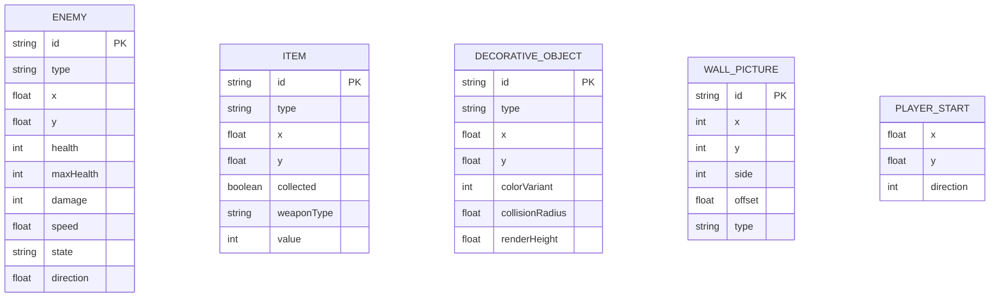
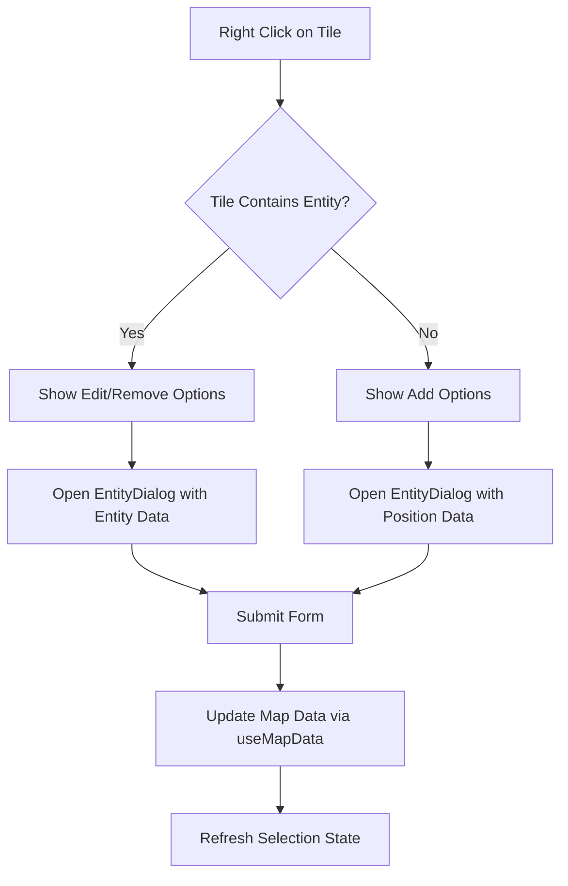
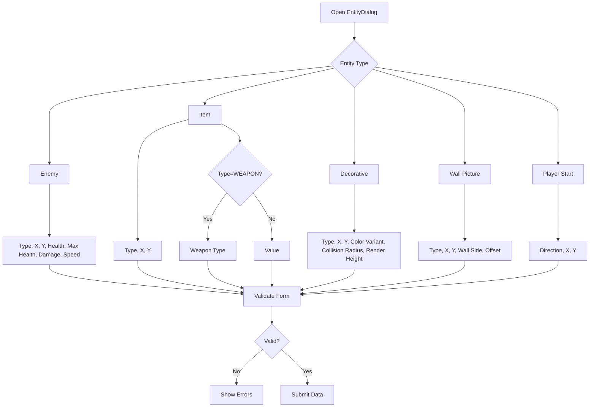

# Entity Management

<cite>
**Referenced Files in This Document**   
- [ContextMenu.tsx](file://src/editor/components/ContextMenu.tsx)
- [EntityDialog.tsx](file://src/editor/components/EntityDialog.tsx)
- [useSelection.ts](file://src/editor/hooks/useSelection.ts)
- [useMapData.ts](file://src/editor/hooks/useMapData.ts)
- [types.ts](file://src/types.ts)
</cite>

## Table of Contents
1. [Introduction](#introduction)
2. [Domain Model](#domain-model)
3. [Entity Lifecycle Management](#entity-lifecycle-management)
4. [Context Menu Implementation](#context-menu-implementation)
5. [Entity Dialog Form System](#entity-dialog-form-system)
6. [Selection State Management](#selection-state-management)
7. [Data Update Mechanism](#data-update-mechanism)
8. [Common Issues and Solutions](#common-issues-and-solutions)
9. [Conclusion](#conclusion)

## Introduction

The Level Editor's entity management system provides a comprehensive interface for creating, modifying, and removing game entities within the map environment. This system enables users to manipulate various entity types including enemies, items, decorative objects, wall pictures, and the player start position through intuitive context menus and dialog forms. The implementation leverages React hooks for state management, ensuring a responsive and consistent user experience while maintaining data integrity throughout editing operations.

**Section sources**
- [ContextMenu.tsx](file://src/editor/components/ContextMenu.tsx)
- [EntityDialog.tsx](file://src/editor/components/EntityDialog.tsx)

## Domain Model

The entity management system is built upon a well-defined domain model that categorizes game entities with specific properties and behaviors. Each entity type serves a distinct purpose within the game environment and contains properties tailored to its functionality.

### Enemy Entities
Enemy entities represent hostile characters in the game with combat capabilities. Each enemy has attributes including health, damage output, movement speed, and AI behavior parameters. The system supports multiple enemy types such as Zombie, Monster, Ghost, and Dog, each with different statistical profiles.

### Item Entities
Item entities provide resources or equipment to the player. These include health pickups (small and large), treasure, ammunition, and weapons. Weapon items have an associated weapon type (Knife, Pistol, Machine Pistol, Chainsaw, Assault Rifle, Heavy MG) and may include a value parameter for non-weapon items.

### Decorative Objects
Decorative objects enhance the visual environment without gameplay impact. These include ceiling lights, vases, crates, benches, tables, chairs, wine bottles, and skeletons. Each decorative object has configurable properties including color variant, collision radius, and render height.

### Wall Pictures
Wall pictures are decorative elements placed on walls with specific positioning parameters. They can be portraits, landscapes, or abstract art. Placement is determined by wall side (north/south or east/west) and offset position along the wall (0.0 to 1.0).

### Player Start Position
The player start position defines the initial location and orientation of the player character. It includes X and Y coordinates on the map grid and a direction value in degrees (0-359), where 0° represents east, 90° south, 180° west, and 270° north.

**Diagram sources**
- [types.ts](file://src/types.ts#L34-L50)
- [types.ts](file://src/types.ts#L60-L68)
- [types.ts](file://src/types.ts#L82-L89)
- [types.ts](file://src/types.ts#L102-L111)
- [types.ts](file://src/types.ts#L113-L124)

**Section sources**
- [types.ts](file://src/types.ts#L34-L124)

## Entity Lifecycle Management

The entity lifecycle management system provides a complete workflow for adding, editing, and removing game entities through the Level Editor interface. Users interact with the system primarily through right-click context menus on the map canvas, which present appropriate options based on the current tile and entity state.

### Adding Entities
To add a new entity, users right-click on a map tile to open the context menu. The menu displays options for adding different entity types at the clicked position. Selecting an option opens the EntityDialog with pre-filled coordinates and default values for the chosen entity type. The dialog form includes validation to ensure data integrity before submission.

### Editing Entities
Existing entities can be edited by right-clicking on a tile containing an entity. The context menu provides an "Edit" option that opens the EntityDialog pre-populated with the entity's current data. The form displays all configurable properties with appropriate input controls and validation rules specific to the entity type.

### Removing Entities
Entities can be removed through the context menu when right-clicking on a tile containing an entity. The menu includes a "Remove" option that triggers a confirmation and then deletes the entity from the map data structure. This operation is integrated with the undo/redo system to allow recovery of accidentally deleted entities.

**Section sources**
- [ContextMenu.tsx](file://src/editor/components/ContextMenu.tsx)
- [EntityDialog.tsx](file://src/editor/components/EntityDialog.tsx)

## Context Menu Implementation

The ContextMenu component provides a right-click interface that dynamically generates options based on the current tile and entity state. This contextual approach ensures users only see relevant actions for their current editing context.

### Dynamic Option Generation
The context menu options are generated based on whether the clicked tile contains existing entities. When clicking on an empty tile, options include adding various entity types. When clicking on a tile with an existing entity, options include editing or removing that entity, in addition to adding other entity types that can coexist on the same tile.

### User Interaction Handling
The component implements multiple interaction patterns to enhance usability:
- Clicking outside the menu or pressing the Escape key closes the menu
- Menu positioning is adjusted to prevent overflow beyond the viewport
- Visual feedback is provided on hover states for menu options
- The menu is dismissed after an option is selected

### Integration with Entity System
The context menu integrates with the broader entity management system by passing entity data and position information to the EntityDialog when edit or add operations are initiated. It also coordinates with the useSelection hook to update the active selection state when entities are clicked.

**Diagram sources**
- [ContextMenu.tsx](file://src/editor/components/ContextMenu.tsx#L8-L140)

**Section sources**
- [ContextMenu.tsx](file://src/editor/components/ContextMenu.tsx#L8-L140)

## Entity Dialog Form System

The EntityDialog component provides a form-based interface for configuring entity properties with comprehensive validation and user guidance.

### Dynamic Form Rendering
The dialog renders different form fields based on the entity type being created or edited. Each entity type has a tailored form layout with appropriate input controls:
- Dropdown selects for entity types and categories
- Number inputs for coordinates, health, damage, and other numeric properties
- Specialized inputs with step values for precise positioning (0.5 increments)

### Conditional Field Display
Certain fields are conditionally displayed based on other field values. For example, when creating a weapon item, the weapon type dropdown appears. When creating health, treasure, or ammo items, a value field is shown instead.

### Form Validation
The system implements client-side validation with immediate feedback:
- Coordinate values cannot be negative
- Health values must be positive and health cannot exceed max health
- Speed values must be greater than zero
- Wall picture offsets must be between 0 and 1
- Player direction must be between 0 and 359 degrees

Validation errors are displayed beneath the relevant fields, and the save button is disabled until all validation passes.

**Diagram sources**
- [EntityDialog.tsx](file://src/editor/components/EntityDialog.tsx#L17-L523)

**Section sources**
- [EntityDialog.tsx](file://src/editor/components/EntityDialog.tsx#L17-L523)

## Selection State Management

The useSelection hook manages the active selection state within the Level Editor, coordinating between user interactions, the context menu, and editing dialogs.

### Selection Types
The system supports multiple selection types:
- Tile selection (x, y coordinates)
- Enemy selection (by ID)
- Item selection (by ID)
- Decorative object selection (by ID)
- Wall picture selection (by ID)
- Player start position selection

### Entity Detection Logic
When a user clicks on a tile, the handleTileClick function determines what entity, if any, occupies that position:
- First checks if the player start position is at the coordinates
- Then checks for enemies, items, decorative objects, and wall pictures
- Uses floor operations on floating-point coordinates to match grid positions
- Returns the appropriate selection type based on what is found

### Integration with Editing Workflow
The selection state is tightly integrated with the editing workflow:
- Context menu options are determined by the current selection
- EntityDialog can operate in add mode (based on position) or edit mode (based on selected entity)
- Selection changes trigger UI updates to reflect the currently selected entity

**Section sources**
- [useSelection.ts](file://src/editor/hooks/useSelection.ts#L4-L94)

## Data Update Mechanism

The entity management system uses a robust data update mechanism centered around the useMapData hook's updateMapData function, which ensures data consistency and provides undo/redo functionality.

### Immutable Update Pattern
The updateMapData function follows an immutable update pattern, requiring a callback function that returns a new map data object. This approach prevents direct mutation of state and enables reliable change tracking.

### Command Pattern Implementation
The system implements a command pattern for undo/redo functionality:
- Each update operation creates a command with execute and undo functions
- Commands are stored in an undo stack with a maximum history size of 50 operations
- Performing a new action clears the redo stack (standard undo/redo behavior)
- The system tracks whether the current state differs from the last saved state

### Data Consistency
The update mechanism ensures data consistency by:
- Validating all changes before application
- Maintaining referential integrity between entities
- Preserving the overall map structure during modifications
- Providing visual feedback when changes are unsaved

**Section sources**
- [useMapData.ts](file://src/editor/hooks/useMapData.ts#L31-L147)

## Common Issues and Solutions

### Incorrect Entity Placement
**Issue**: Entities may appear to be placed incorrectly due to coordinate rounding or grid alignment issues.

**Solution**: The system uses floor operations when detecting entities at tile positions, ensuring consistent alignment with the grid. Users should be aware that entity coordinates are stored as floating-point values but are aligned to half-tile increments (0.5) for precise placement.

### Coordinate Rounding Errors
**Issue**: Floating-point precision errors can accumulate during coordinate calculations.

**Solution**: The system implements validation rules that enforce appropriate step values (0.5 for most coordinates) and range constraints. The EntityDialog uses number inputs with specified step attributes to prevent invalid values.

### Data Consistency Problems
**Issue**: Concurrent edits or improper state updates can lead to data inconsistency.

**Solution**: The useMapData hook's immutable update pattern and command system prevent direct state mutation. The undo/redo stacks maintain a consistent history, and the system tracks dirty state to prevent accidental data loss.

### Performance Considerations
For large maps with many entities, the selection detection algorithm has linear complexity based on the number of entities. The system mitigates this by:
- Using efficient array find methods
- Short-circuiting when an entity is found
- Debouncing rapid click events
- Implementing virtualization in the map rendering system

**Section sources**
- [useSelection.ts](file://src/editor/hooks/useSelection.ts#L4-L94)
- [useMapData.ts](file://src/editor/hooks/useMapData.ts#L31-L147)

## Conclusion

The entity management system in the Level Editor provides a comprehensive and user-friendly interface for manipulating game entities. By combining the ContextMenu for contextual actions, the EntityDialog for detailed configuration, and the useSelection hook for state management, the system offers an intuitive workflow for level designers. The underlying useMapData hook ensures data integrity with its immutable update pattern and undo/redo functionality. This architecture balances usability with robustness, enabling efficient level creation while preventing data corruption. The well-defined domain model and validation rules ensure that all created levels adhere to the game's technical requirements and design constraints.