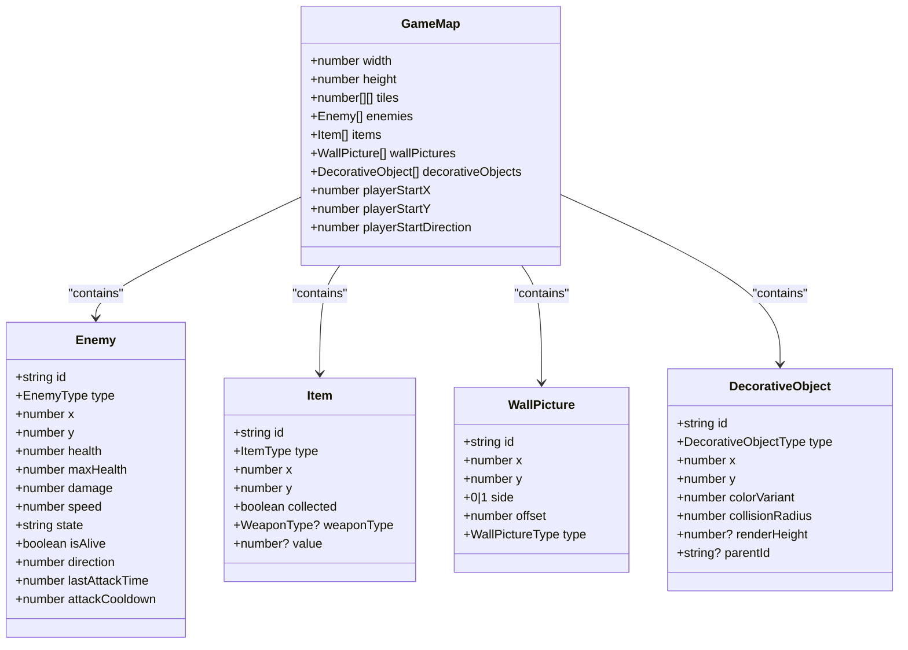
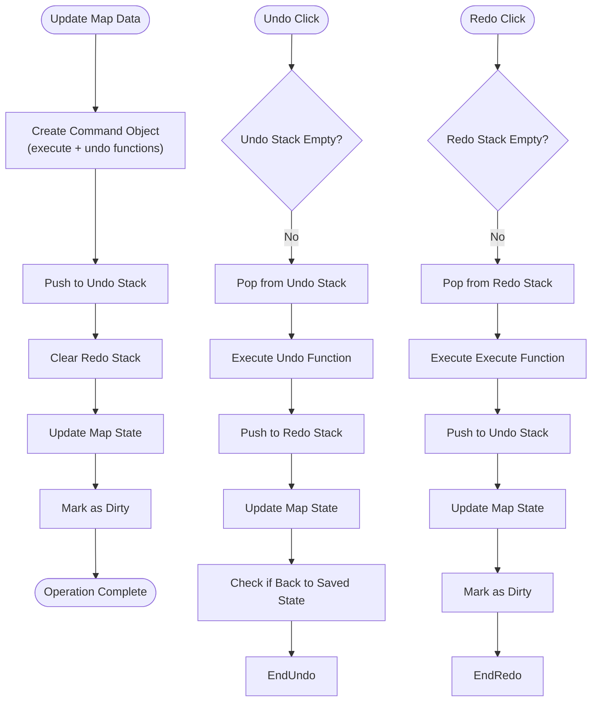
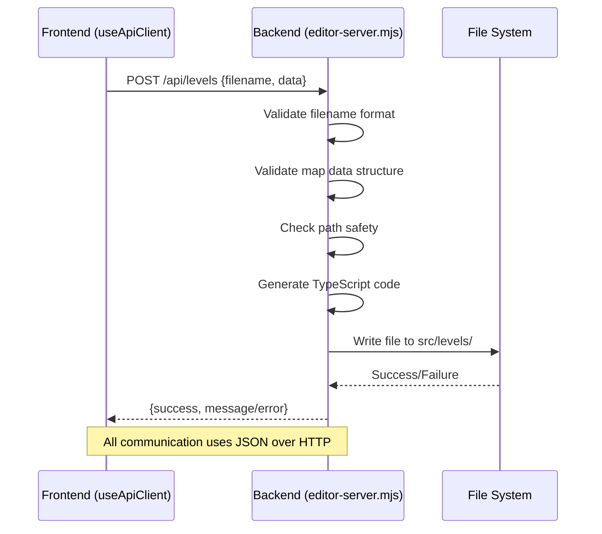

# Level Creation Workflow

<cite>
**Referenced Files in This Document**  
- [NewLevelDialog.tsx](file://src/editor/components/NewLevelDialog.tsx)
- [useApiClient.ts](file://src/editor/hooks/useApiClient.ts)
- [useMapData.ts](file://src/editor/hooks/useMapData.ts)
- [editor-server.mjs](file://editor-server.mjs)
- [types.ts](file://src/types.ts)
</cite>

## Table of Contents
1. [Introduction](#introduction)
2. [New Level Initialization](#new-level-initialization)
3. [Level Data Structure](#level-data-structure)
4. [Undo/Redo System](#undoredo-system)
5. [Backend Communication](#backend-communication)
6. [Level Saving Process](#level-saving-process)
7. [Common Workflow Issues](#common-workflow-issues)
8. [Conclusion](#conclusion)

## Introduction
This document details the complete level creation workflow in the Level Editor, from initializing a new level to saving it through the backend server. The process involves several key components: the NewLevelDialog for capturing level parameters, the useMapData hook for managing map state with undo/redo capabilities, and the useApiClient hook for communicating with the editor-server.mjs backend API. The workflow ensures that new levels are created with proper boundary walls and player start positions, and that all modifications are safely persisted to the levels/ directory as TypeScript modules.

## New Level Initialization

The level creation process begins with the NewLevelDialog component, which captures the level and variant numbers from the user. This dialog is presented when users choose to create either a completely new level or a new variant of an existing level.

When initializing a new level, the dialog provides default values and enforces validation rules:
- Level numbers must be between 1 and 999
- Variant numbers must be between 1 and 999
- The dialog displays information about the default map configuration

Upon successful validation, the dialog triggers the creation of a new GameMap structure with the following default properties:
- Dimensions: 20x20 tiles
- Outer boundary walls on all edges
- Floor tiles in the interior
- Player start position at coordinates (2, 2)

The dialog supports two modes:
1. **New Level mode**: Creates a level with a specified level number and variant number
2. **New Variant mode**: Creates a variant of an existing level, pre-populating the level number

**Section sources**
- [NewLevelDialog.tsx](file://src/editor/components/NewLevelDialog.tsx#L12-L172)

## Level Data Structure

The GameMap interface defines the structure of level data in the system. Each level contains comprehensive information about the game environment, including layout, entities, and player starting conditions.

**Diagram sources**
- [types.ts](file://src/types.ts#L113-L124)

**Section sources**
- [types.ts](file://src/types.ts#L113-L124)

## Undo/Redo System

The useMapData hook implements a robust undo/redo system that enables non-destructive editing of level layouts. This system uses the Command pattern to track changes and allow users to navigate through their editing history.

Key features of the undo/redo system include:
- History stacks for both undo and redo operations
- Command pattern implementation with execute and undo methods
- Maximum history size of 50 entries to prevent memory issues
- Automatic clearing of the redo stack when new actions are performed
- Dirty state tracking to indicate unsaved changes

The system works by:
1. Creating a command object for each modification that contains both the forward action and its inverse
2. Storing these commands in the undo stack
3. Clearing the redo stack when new changes are made
4. Moving commands between undo and redo stacks during undo/redo operations

The dirty state is determined by comparing the current map data with the last saved state using JSON serialization. This ensures that users are notified when they have unsaved changes.

**Diagram sources**
- [useMapData.ts](file://src/editor/hooks/useMapData.ts#L31-L147)

**Section sources**
- [useMapData.ts](file://src/editor/hooks/useMapData.ts#L31-L147)

## Backend Communication

The useApiClient hook manages all communication between the frontend editor and the backend server. It provides a clean API for fetching, loading, and saving level data with built-in error handling and retry logic.

The communication system includes:
- Retry mechanism with exponential backoff for network resilience
- Loading state management for user feedback
- Comprehensive error handling with descriptive messages
- Type-safe API endpoints with proper TypeScript interfaces

The hook exposes three main functions:
1. `fetchLevels()`: Retrieves a list of all available level files
2. `loadLevel(filename)`: Loads a specific level file from the server
3. `saveLevel(filename, data)`: Saves level data to a file on the server

Each API call includes proper headers and JSON serialization, with error responses being parsed and presented in a user-friendly format.

**Diagram sources**
- [useApiClient.ts](file://src/editor/hooks/useApiClient.ts#L33-L159)

**Section sources**
- [useApiClient.ts](file://src/editor/hooks/useApiClient.ts#L33-L159)

## Level Saving Process

The level saving process involves converting the GameMap data structure into a TypeScript module and writing it to the filesystem. This process is handled by the editor-server.mjs backend server.

When a level is saved, the following steps occur:
1. The frontend sends a POST request to `/api/levels` with the filename and map data
2. The server validates the filename format (must match `levelX-variantY.ts`)
3. The server validates the map data structure and dimensions
4. The server generates TypeScript code with proper imports and constant naming
5. The generated code is written to the `src/levels/` directory

The generated TypeScript module includes:
- Proper imports for all required types and enums
- A named constant following the pattern `LEVEL_X_VARIANT_Y`
- Complete serialization of all map properties including tiles, enemies, items, and decorative objects
- Proper formatting with indentation and line breaks for readability

The server implements security measures to prevent path traversal attacks by validating that all file operations remain within the designated levels directory.

**Section sources**
- [editor-server.mjs](file://editor-server.mjs#L1-L350)

## Common Workflow Issues

Several common issues can occur during the level creation workflow, each with specific debugging strategies and error handling techniques.

### File Naming Conflicts
When attempting to save a level with an existing filename, the server will overwrite the existing file without warning. To prevent accidental overwrites:
- Implement a filename availability check before saving
- Add confirmation dialogs when overwriting existing files
- Maintain a cache of existing level filenames for quick validation

### Server Connection Errors
Network issues can prevent communication with the backend server:
- The useApiClient hook includes retry logic with a 1-second delay and 3 retry attempts
- Users should verify that the server is running on port 3001
- Check browser console for CORS or network errors
- Ensure the API base URL matches the server configuration

### Data Serialization Problems
Issues can arise when serializing complex objects:
- Validate all required fields before saving
- Ensure array dimensions match the specified width and height
- Handle special cases like undefined optional properties
- Use proper TypeScript types to catch serialization issues at compile time

### Debugging Strategies
Effective debugging techniques include:
- Checking the server console output for error messages
- Verifying file permissions in the levels directory
- Using browser developer tools to inspect API requests and responses
- Validating the generated TypeScript code for syntax correctness
- Testing with simple level configurations first

## Conclusion
The level creation workflow in the Level Editor provides a comprehensive system for creating, editing, and saving game levels. The process begins with the NewLevelDialog to capture level parameters, creates a properly structured GameMap with default boundaries and player position, and leverages the undo/redo system in useMapData for non-destructive editing. Communication with the backend server through useApiClient ensures reliable persistence of level data as TypeScript modules in the levels directory. The system includes robust error handling and validation to prevent common issues, making it a reliable tool for level creation.