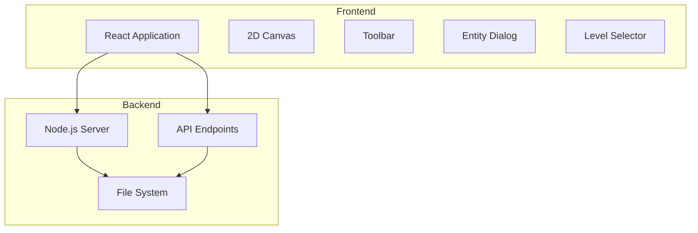
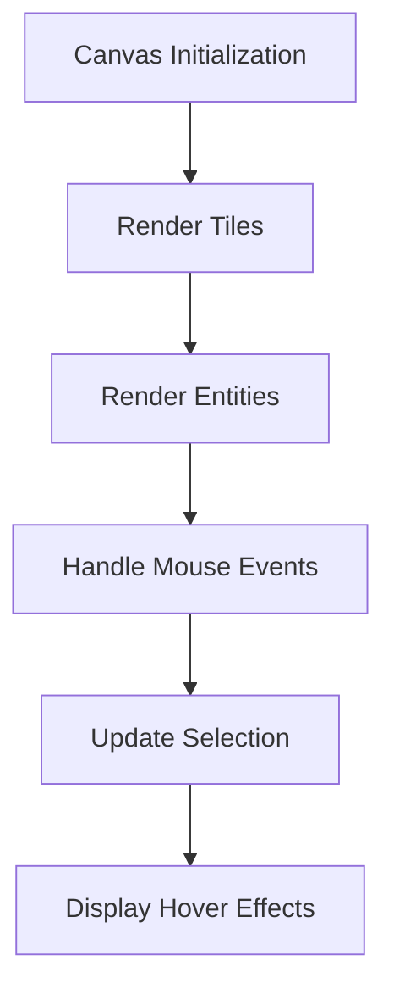
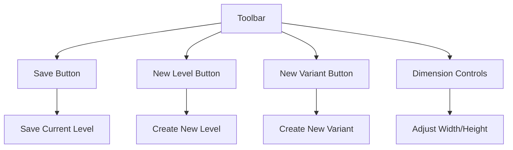
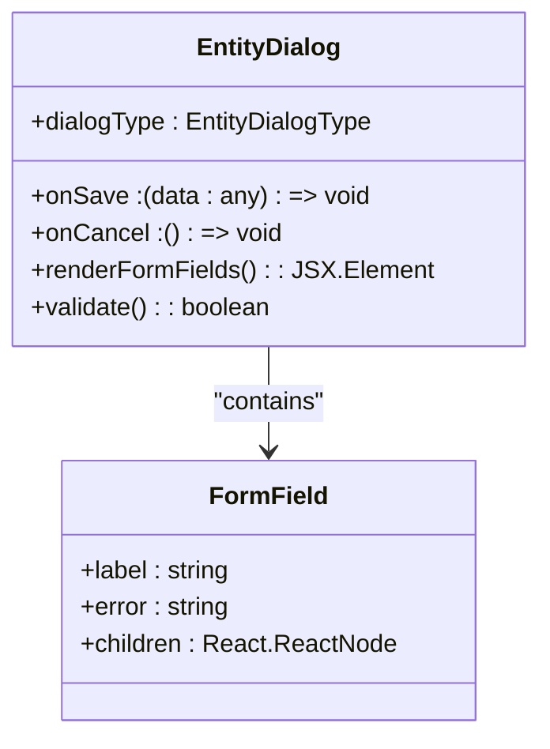
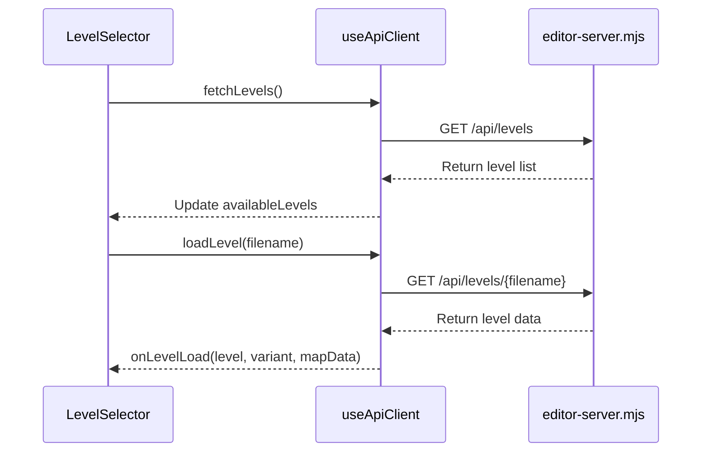
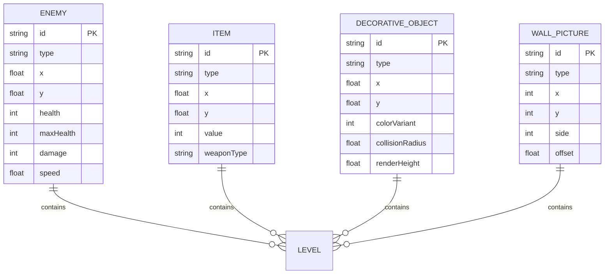
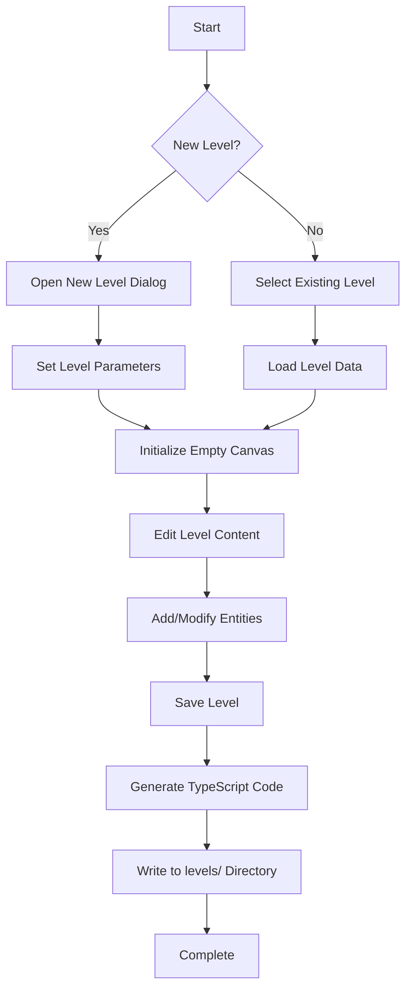
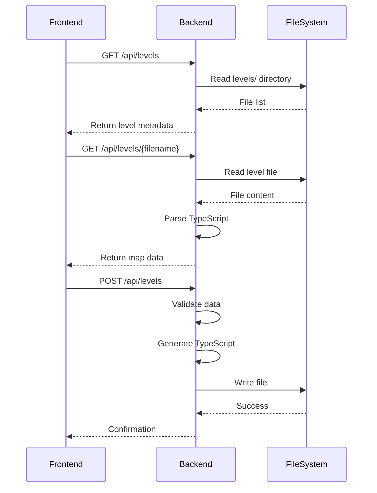
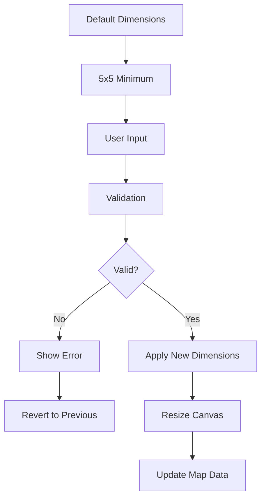

# Level Editor

<cite>
**Referenced Files in This Document**   
- [editor-server.mjs](file://editor-server.mjs)
- [MapCanvas.tsx](file://src/editor/components/MapCanvas.tsx)
- [Toolbar.tsx](file://src/editor/components/Toolbar.tsx)
- [EntityDialog.tsx](file://src/editor/components/EntityDialog.tsx)
- [LevelSelector.tsx](file://src/editor/components/LevelSelector.tsx)
- [useApiClient.ts](file://src/editor/hooks/useApiClient.ts)
- [useMapData.ts](file://src/editor/hooks/useMapData.ts)
- [mapRenderer.ts](file://src/editor/utils/mapRenderer.ts)
- [types.ts](file://src/editor/types.ts)
</cite>

## Table of Contents
1. [Introduction](#introduction)
2. [Full-Stack Architecture](#full-stack-architecture)
3. [User Interface Components](#user-interface-components)
4. [Entity Management System](#entity-management-system)
5. [Level Creation Workflow](#level-creation-workflow)
6. [Frontend-Backend Communication](#frontend-backend-communication)
7. [Coordinate Systems and Grid Snapping](#coordinate-systems-and-grid-snapping)
8. [Level Dimension Configuration](#level-dimension-configuration)
9. [Best Practices for Level Design](#best-practices-for-level-design)
10. [Common Pitfalls and Solutions](#common-pitfalls-and-solutions)

## Introduction
The Level Editor is a comprehensive visual tool for creating and modifying game levels in a React frontend with a Node.js backend. This document provides detailed information about the editor's architecture, user interface components, entity management system, and workflow for level creation. The editor enables users to design levels by placing various entities such as enemies, items, and decorative objects on a 2D canvas, with all changes saved to the levels/ directory through a dedicated API server.

## Full-Stack Architecture
The Level Editor employs a client-server architecture with a React-based frontend and a Node.js backend. The frontend provides a rich user interface for level creation, while the backend handles file operations and serves as an API endpoint for level data management.



**Diagram sources**
- [editor-server.mjs](file://editor-server.mjs#L1-L350)
- [MapCanvas.tsx](file://src/editor/components/MapCanvas.tsx#L12-L143)

**Section sources**
- [editor-server.mjs](file://editor-server.mjs#L1-L350)
- [MapCanvas.tsx](file://src/editor/components/MapCanvas.tsx#L12-L143)

## User Interface Components
The Level Editor features several key UI components that work together to provide an intuitive level creation experience.

### 2D Canvas
The 2D canvas is the primary workspace where users create and edit levels. It displays the current level with visual representations of all entities and supports interactive editing through mouse events.



**Diagram sources**
- [MapCanvas.tsx](file://src/editor/components/MapCanvas.tsx#L12-L143)
- [mapRenderer.ts](file://src/editor/utils/mapRenderer.ts#L1-L440)

**Section sources**
- [MapCanvas.tsx](file://src/editor/components/MapCanvas.tsx#L12-L143)
- [mapRenderer.ts](file://src/editor/utils/mapRenderer.ts#L1-L440)

### Toolbar
The toolbar provides essential controls for level management, including save, new level, and dimension adjustment functions.



**Diagram sources**
- [Toolbar.tsx](file://src/editor/components/Toolbar.tsx#L14-L253)

**Section sources**
- [Toolbar.tsx](file://src/editor/components/Toolbar.tsx#L14-L253)

### Entity Dialog
The entity dialog allows users to add or edit specific entities with detailed property configuration.



**Diagram sources**
- [EntityDialog.tsx](file://src/editor/components/EntityDialog.tsx#L17-L523)

**Section sources**
- [EntityDialog.tsx](file://src/editor/components/EntityDialog.tsx#L17-L523)

### Level Selector
The level selector enables users to load existing levels or variants from the available collection.



**Diagram sources**
- [LevelSelector.tsx](file://src/editor/components/LevelSelector.tsx#L18-L170)
- [useApiClient.ts](file://src/editor/hooks/useApiClient.ts#L33-L159)

**Section sources**
- [LevelSelector.tsx](file://src/editor/components/LevelSelector.tsx#L18-L170)
- [useApiClient.ts](file://src/editor/hooks/useApiClient.ts#L33-L159)

## Entity Management System
The entity management system handles the placement and editing of various game entities including enemies, items, and decorative objects.

### Entity Types
The editor supports multiple entity types, each with specific properties and behaviors:



**Diagram sources**
- [types.ts](file://src/editor/types.ts#L1-L30)
- [EntityDialog.tsx](file://src/editor/components/EntityDialog.tsx#L17-L523)

**Section sources**
- [types.ts](file://src/editor/types.ts#L1-L30)
- [EntityDialog.tsx](file://src/editor/components/EntityDialog.tsx#L17-L523)

## Level Creation Workflow
The level creation process follows a structured workflow from initialization to saving.



**Diagram sources**
- [Toolbar.tsx](file://src/editor/components/Toolbar.tsx#L14-L253)
- [useMapData.ts](file://src/editor/hooks/useMapData.ts#L31-L147)
- [editor-server.mjs](file://editor-server.mjs#L1-L350)

**Section sources**
- [Toolbar.tsx](file://src/editor/components/Toolbar.tsx#L14-L253)
- [useMapData.ts](file://src/editor/hooks/useMapData.ts#L31-L147)
- [editor-server.mjs](file://editor-server.mjs#L1-L350)

## Frontend-Backend Communication
The editor communicates with the backend server through a REST API implemented in editor-server.mjs.



**Diagram sources**
- [useApiClient.ts](file://src/editor/hooks/useApiClient.ts#L33-L159)
- [editor-server.mjs](file://editor-server.mjs#L1-L350)

**Section sources**
- [useApiClient.ts](file://src/editor/hooks/useApiClient.ts#L33-L159)
- [editor-server.mjs](file://editor-server.mjs#L1-L350)

## Coordinate Systems and Grid Snapping
The editor uses a coordinate system based on tile units with grid snapping for precise placement.

```mermaid
flowchart TD
A[Screen Coordinates] --> B[Pixel Values]
B --> C[screenToMapCoordinates()]
C --> D[Tile Coordinates]
D --> E[Integer X,Y]
E --> F[Grid Snapping]
F --> G[Entity Placement]
H[Entity Properties] --> I[Float X,Y]
I --> J[Sub-tile Positioning]
J --> K[Visual Representation]
```

**Diagram sources**
- [mapRenderer.ts](file://src/editor/utils/mapRenderer.ts#L1-L440)
- [MapCanvas.tsx](file://src/editor/components/MapCanvas.tsx#L12-L143)

**Section sources**
- [mapRenderer.ts](file://src/editor/utils/mapRenderer.ts#L1-L440)
- [MapCanvas.tsx](file://src/editor/components/MapCanvas.tsx#L12-L143)

## Level Dimension Configuration
Level dimensions can be configured through the toolbar interface with validation rules.



**Diagram sources**
- [Toolbar.tsx](file://src/editor/components/Toolbar.tsx#L14-L253)
- [useMapData.ts](file://src/editor/hooks/useMapData.ts#L31-L147)

**Section sources**
- [Toolbar.tsx](file://src/editor/components/Toolbar.tsx#L14-L253)
- [useMapData.ts](file://src/editor/hooks/useMapData.ts#L31-L147)

## Best Practices for Level Design
Following these best practices will help create effective and balanced levels.

### Design Principles
- Maintain balanced enemy placement
- Ensure adequate item distribution
- Create clear visual pathways
- Use decorative objects for atmosphere
- Test player start positions

### Performance Considerations
- Limit entity density
- Optimize wall picture placement
- Use appropriate level dimensions
- Minimize overlapping entities
- Test rendering performance

**Section sources**
- [mapRenderer.ts](file://src/editor/utils/mapRenderer.ts#L1-L440)
- [EntityDialog.tsx](file://src/editor/components/EntityDialog.tsx#L17-L523)

## Common Pitfalls and Solutions
This section addresses common issues encountered during level creation.

### Data Validation Errors
- Invalid filename format: Ensure levelX-variantY.ts pattern
- Missing required fields: Verify all map data properties
- Dimension mismatches: Check tiles array dimensions

### Rendering Issues
- Canvas size problems: Verify TILE_SIZE constant
- Entity overlap: Adjust positioning values
- Color scheme inconsistencies: Check COLORS object

### Workflow Problems
- Unsaved changes: Monitor dirty state indicator
- Loading failures: Verify file existence
- API connection issues: Check server status

**Section sources**
- [editor-server.mjs](file://editor-server.mjs#L1-L350)
- [useApiClient.ts](file://src/editor/hooks/useApiClient.ts#L33-L159)
- [useMapData.ts](file://src/editor/hooks/useMapData.ts#L31-L147)