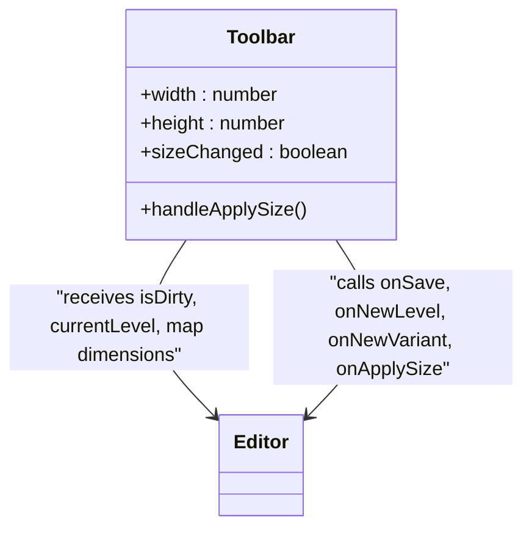
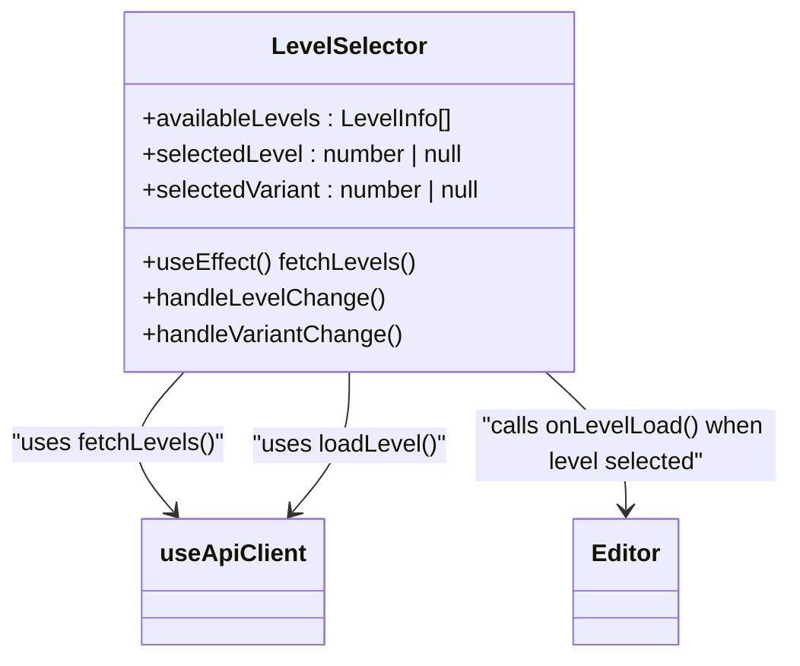
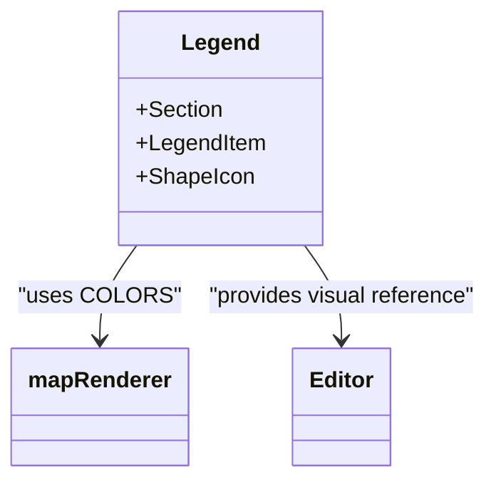
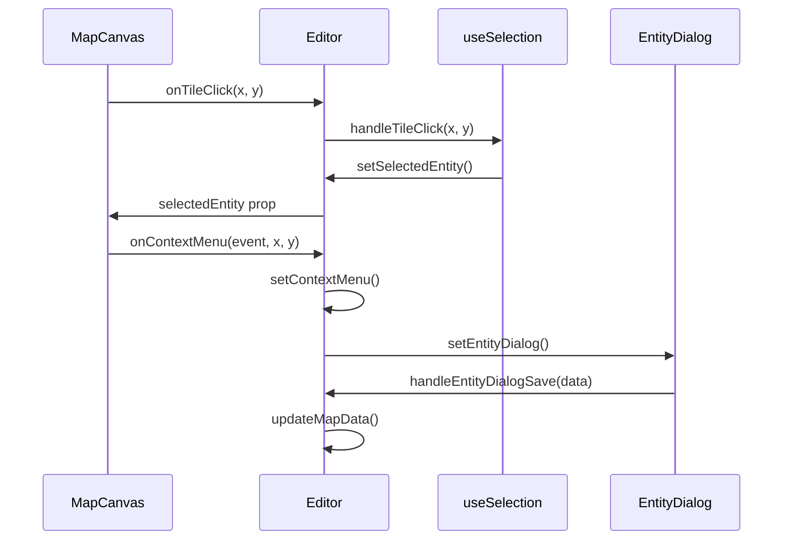
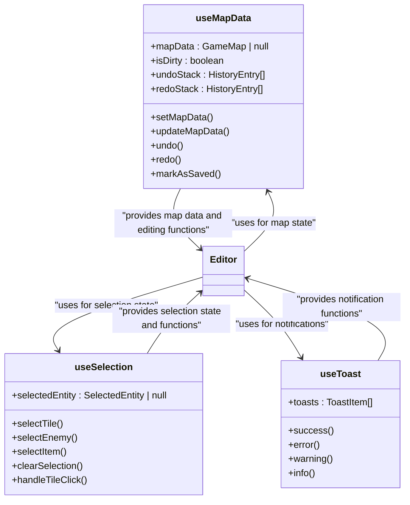
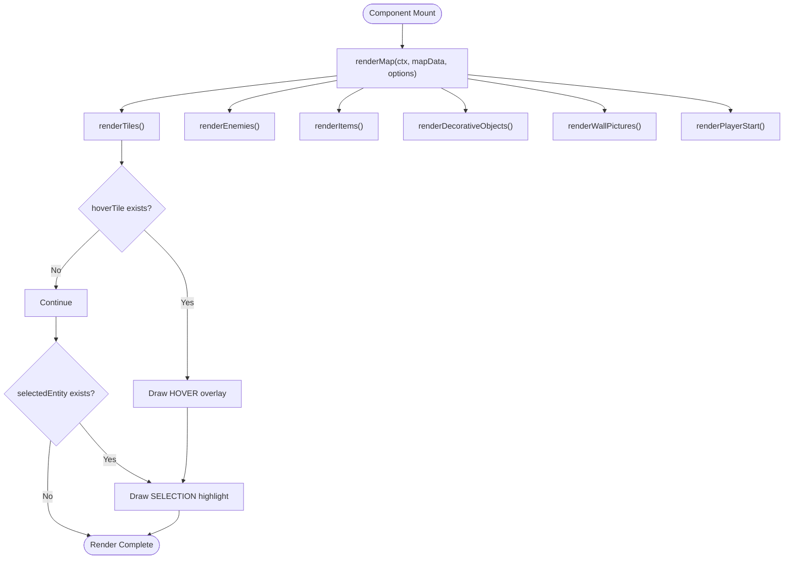
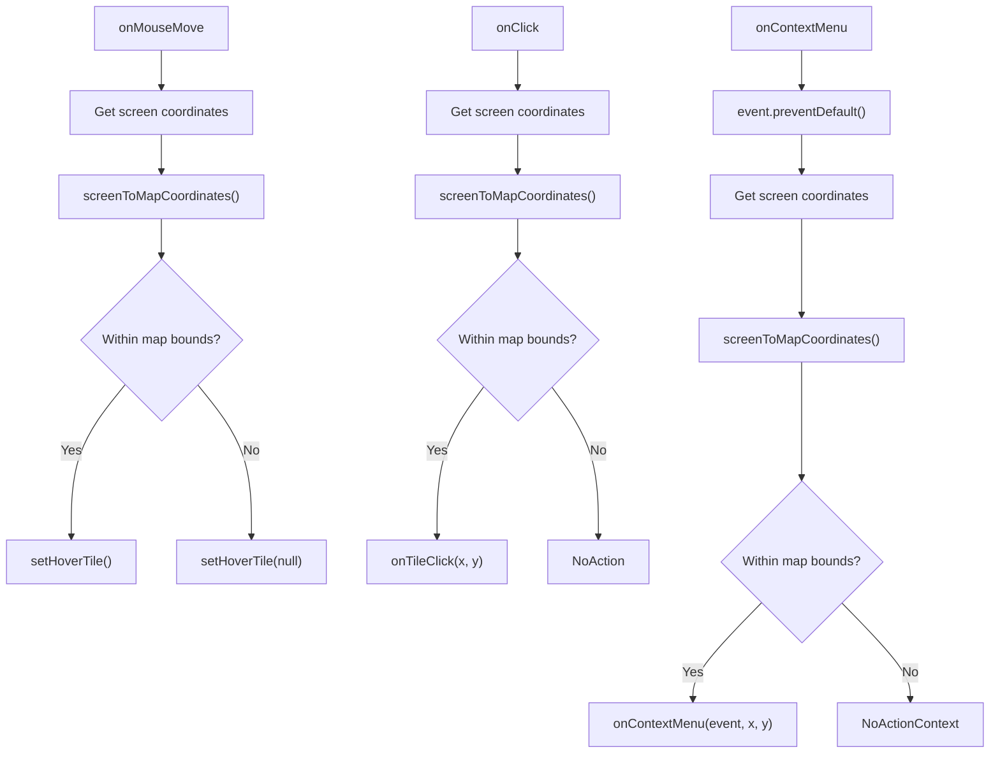

# User Interface

<cite>
**Referenced Files in This Document**   
- [MapCanvas.tsx](file://src/editor/components/MapCanvas.tsx)
- [Toolbar.tsx](file://src/editor/components/Toolbar.tsx)
- [LevelSelector.tsx](file://src/editor/components/LevelSelector.tsx)
- [Legend.tsx](file://src/editor/components/Legend.tsx)
- [mapRenderer.ts](file://src/editor/utils/mapRenderer.ts)
- [useSelection.ts](file://src/editor/hooks/useSelection.ts)
- [Editor.tsx](file://src/editor/Editor.tsx)
- [useMapData.ts](file://src/editor/hooks/useMapData.ts)
- [useToast.ts](file://src/editor/hooks/useToast.ts)
- [types.ts](file://src/editor/types.ts)
</cite>

## Table of Contents
1. [Introduction](#introduction)
2. [Core UI Components](#core-ui-components)
3. [Component Interaction and State Management](#component-interaction-and-state-management)
4. [MapCanvas Rendering and Performance](#mapcanvas-rendering-and-performance)
5. [Coordinate Translation and Input Handling](#coordinate-translation-and-input-handling)
6. [Accessibility and Responsive Design](#accessibility-and-responsive-design)
7. [Troubleshooting Common UI Issues](#troubleshooting-common-ui-issues)
8. [Conclusion](#conclusion)

## Introduction

The Level Editor's user interface is designed to provide an intuitive and efficient environment for creating and modifying game levels. The interface consists of several key components that work together to enable visual level editing, map manipulation, level management, and entity visualization. This document provides a comprehensive analysis of these UI components, their integration, and their interaction through React state and props. The system leverages React's component-based architecture to create a responsive and interactive editing experience, with careful attention to performance optimization and user accessibility.

**Section sources**
- [Editor.tsx](file://src/editor/Editor.tsx#L1-L50)

## Core UI Components

### MapCanvas

The MapCanvas component serves as the primary visual editing surface for level creation. It renders the game map using the HTML5 Canvas API, providing visual feedback for hover and selection states. The component handles mouse interactions including movement, clicks, and right-click context menus, translating screen coordinates to map coordinates for precise editing. When no level is loaded, it displays a placeholder message to guide the user.

```mermaid
classDiagram
class MapCanvas {
+canvasRef : RefObject<HTMLCanvasElement>
+hoverTile : { x : number; y : number } | null
+useEffect() renderMap()
+handleMouseMove()
+handleMouseLeave()
+handleClick()
+handleContextMenuClick()
}
MapCanvas --> mapRenderer : "uses renderMap()"
MapCanvas --> mapRenderer : "uses screenToMapCoordinates()"
MapCanvas --> mapRenderer : "uses calculateCanvasSize()"
```

**Diagram sources**
- [MapCanvas.tsx](file://src/editor/components/MapCanvas.tsx#L12-L143)
- [mapRenderer.ts](file://src/editor/utils/mapRenderer.ts#L51-L78)

**Section sources**
- [MapCanvas.tsx](file://src/editor/components/MapCanvas.tsx#L12-L143)

### Toolbar

The Toolbar component provides controls for map size adjustments and save operations. It includes buttons for saving the current level, creating new levels and variants, and applying map dimension changes. The toolbar displays visual indicators for unsaved changes and uses React state to manage local dimension inputs before applying them to the map data. Button states are dynamically updated based on the current editing context.



**Diagram sources**
- [Toolbar.tsx](file://src/editor/components/Toolbar.tsx#L14-L253)

**Section sources**
- [Toolbar.tsx](file://src/editor/components/Toolbar.tsx#L14-L253)

### LevelSelector

The LevelSelector component enables users to load existing levels from the server. It fetches available levels on mount and provides dropdown menus for selecting level numbers and variants. The component handles asynchronous loading states and displays a loading spinner during network operations. Selection changes trigger level loading through callback functions, and the component manages its own state for selected level and variant.



**Diagram sources**
- [LevelSelector.tsx](file://src/editor/components/LevelSelector.tsx#L18-L170)
- [useApiClient.ts](file://src/editor/hooks/useApiClient.ts#L33-L159)

**Section sources**
- [LevelSelector.tsx](file://src/editor/components/LevelSelector.tsx#L18-L170)

### Legend

The Legend component provides a comprehensive reference for entity type visualization. It displays a fixed-position panel with color-coded entries for different map elements including tiles, enemies, items, and decorative objects. The legend includes visual representations of each entity type using shapes and icons, and provides documentation for keyboard shortcuts. This component enhances usability by helping users understand the visual language of the editor.



**Diagram sources**
- [Legend.tsx](file://src/editor/components/Legend.tsx#L2-L207)
- [mapRenderer.ts](file://src/editor/utils/mapRenderer.ts#L14-L37)

**Section sources**
- [Legend.tsx](file://src/editor/components/Legend.tsx#L2-L207)

## Component Interaction and State Management

### State Flow and Event Propagation

The Level Editor's components interact through a well-defined system of React state and props. The Editor component serves as the central state manager, holding the current map data, selection state, and editing status. This state is then passed down to child components as props, while child components communicate changes back to the parent through callback functions.



**Diagram sources**
- [Editor.tsx](file://src/editor/Editor.tsx#L150-L868)
- [useSelection.ts](file://src/editor/hooks/useSelection.ts#L10-L95)
- [MapCanvas.tsx](file://src/editor/components/MapCanvas.tsx#L12-L143)

**Section sources**
- [Editor.tsx](file://src/editor/Editor.tsx#L150-L868)
- [useSelection.ts](file://src/editor/hooks/useSelection.ts#L10-L95)

### State Management Architecture

The editor employs a sophisticated state management system using React hooks to handle complex editing operations. The useMapData hook implements an undo/redo pattern with command history, allowing users to revert changes. The useSelection hook manages entity selection state and provides utility functions for selecting different entity types. The useToast hook handles user notifications, providing feedback for save operations and errors.



**Diagram sources**
- [useMapData.ts](file://src/editor/hooks/useMapData.ts#L31-L147)
- [useSelection.ts](file://src/editor/hooks/useSelection.ts#L10-L95)
- [useToast.ts](file://src/editor/hooks/useToast.ts#L9-L35)

**Section sources**
- [useMapData.ts](file://src/editor/hooks/useMapData.ts#L31-L147)
- [useSelection.ts](file://src/editor/hooks/useSelection.ts#L10-L95)
- [useToast.ts](file://src/editor/hooks/useToast.ts#L9-L35)

## MapCanvas Rendering and Performance

### Rendering Lifecycle

The MapCanvas component implements an efficient rendering lifecycle that updates the visual representation whenever the map data or interaction state changes. The rendering process is triggered by React's useEffect hook, which monitors changes to the mapData, hoverTile, and selectedEntity dependencies. The actual rendering is performed by the renderMap function from the mapRenderer utility, which draws tiles, entities, and interactive elements on the canvas.



**Diagram sources**
- [MapCanvas.tsx](file://src/editor/components/MapCanvas.tsx#L12-L143)
- [mapRenderer.ts](file://src/editor/utils/mapRenderer.ts#L51-L78)

**Section sources**
- [MapCanvas.tsx](file://src/editor/components/MapCanvas.tsx#L12-L143)
- [mapRenderer.ts](file://src/editor/utils/mapRenderer.ts#L51-L78)

### Performance Optimizations

The MapCanvas component employs several performance optimizations to ensure smooth interaction even with large maps. The HTML5 Canvas API is used for efficient pixel-level rendering, avoiding the performance overhead of DOM manipulation for individual map elements. The rendering is optimized by only redrawing when necessary, leveraging React's dependency tracking in the useEffect hook. The canvas uses the 'pixelated' imageRendering property to maintain crisp visuals at different zoom levels.

Additional optimizations include:
- Batched rendering operations to minimize canvas context operations
- Efficient coordinate calculations using the TILE_SIZE constant
- Selective rendering of only visible elements
- Use of requestAnimationFrame for smooth animations

**Section sources**
- [MapCanvas.tsx](file://src/editor/components/MapCanvas.tsx#L12-L143)
- [mapRenderer.ts](file://src/editor/utils/mapRenderer.ts#L51-L78)

## Coordinate Translation and Input Handling

### Screen to Map Coordinate Translation

A critical aspect of the MapCanvas component is the translation between screen coordinates (pixels) and map coordinates (tile indices). This conversion is handled by the screenToMapCoordinates function, which divides the screen coordinates by the TILE_SIZE constant and uses Math.floor to determine the corresponding tile. This translation is performed for all mouse interactions, including hover effects, clicks, and context menus.

```mermaid
flowchart LR
Screen["Screen Coordinates (px)"] --> |screenX / TILE_SIZE| X["Map X Coordinate"]
Screen --> |screenY / TILE_SIZE| Y["Map Y Coordinate"]
X --> |Math.floor()| TileX["Tile X Index"]
Y --> |Math.floor()| TileY["Tile Y Index"]
TileX --> Bounds{"Within Map Bounds?"}
TileY --> Bounds
Bounds --> |Yes| Valid["Valid Tile Coordinates"]
Bounds --> |No| Invalid["Null/No Action"]
```

**Diagram sources**
- [mapRenderer.ts](file://src/editor/utils/mapRenderer.ts#L418-L426)
- [MapCanvas.tsx](file://src/editor/components/MapCanvas.tsx#L12-L143)

**Section sources**
- [mapRenderer.ts](file://src/editor/utils/mapRenderer.ts#L418-L426)
- [MapCanvas.tsx](file://src/editor/components/MapCanvas.tsx#L12-L143)

### Input Event Handling

The MapCanvas component implements comprehensive input event handling to support various editing operations. Mouse movement triggers hover effects, with the handleMouseMove function calculating the corresponding map tile and updating the hoverTile state. Click events are processed to select entities or tiles, while right-click events open context menus for editing operations. The component also handles mouse leave events to clear hover states when the cursor exits the canvas.



**Diagram sources**
- [MapCanvas.tsx](file://src/editor/components/MapCanvas.tsx#L12-L143)

**Section sources**
- [MapCanvas.tsx](file://src/editor/components/MapCanvas.tsx#L12-L143)

## Accessibility and Responsive Design

### Keyboard Navigation and Shortcuts

The Level Editor implements comprehensive keyboard accessibility to support users who prefer keyboard navigation over mouse interaction. The system captures keyboard events through a useEffect hook in the Editor component, which listens for keydown events on the document level. This enables global keyboard shortcuts that work regardless of which component currently has focus.

Key shortcuts include:
- Ctrl+S: Save the current level
- Ctrl+Z: Undo the last action
- Ctrl+Y or Ctrl+Shift+Z: Redo the last undone action
- Delete: Remove the selected entity
- Escape: Close dialogs and deselect the current selection

The implementation includes safeguards to prevent shortcuts from interfering with text input fields, checking the event target to determine if the user is currently editing text in an input, textarea, or select element.

**Section sources**
- [Editor.tsx](file://src/editor/Editor.tsx#L150-L868)

### Responsive Layout Design

The UI components are designed with responsive layouts that adapt to different screen sizes and window dimensions. The MapCanvas component is centered within its container with flexible padding, ensuring it remains visible and accessible regardless of viewport size. The Toolbar uses flexbox with flexWrap to accommodate different screen widths, allowing buttons and controls to wrap to multiple lines when necessary.

The Legend component uses a fixed position on the right side of the screen with transform to center it vertically, ensuring it remains accessible without obstructing the main editing area. Its maxHeight and overflowY properties enable scrolling when content exceeds available vertical space, making it usable on smaller screens.

**Section sources**
- [MapCanvas.tsx](file://src/editor/components/MapCanvas.tsx#L12-L143)
- [Toolbar.tsx](file://src/editor/components/Toolbar.tsx#L14-L253)
- [Legend.tsx](file://src/editor/components/Legend.tsx#L2-L207)

## Troubleshooting Common UI Issues

### Rendering Glitches

Rendering glitches in the MapCanvas can occur due to several factors. The most common cause is an out-of-sync between the React component state and the canvas rendering state. This can be resolved by ensuring that the useEffect dependency array in MapCanvas includes all relevant state variables (mapData, hoverTile, selectedEntity) that affect rendering.

Another potential issue is related to canvas scaling and pixelation. The 'pixelated' imageRendering property is used to maintain crisp visuals, but this may not be supported in all browsers. As a fallback, ensure that canvas dimensions are integer values and avoid fractional scaling.

### Input Handling Problems

Input handling issues typically stem from coordinate translation errors or event propagation problems. Ensure that the screenToMapCoordinates function is correctly calculating tile indices by verifying the TILE_SIZE constant and the coordinate transformation logic. Issues with hover effects not appearing can often be traced to incorrect bounds checking in the handleMouseMove function.

Context menu issues may occur if the event.preventDefault() call is missing or if the coordinate translation fails. Verify that the onContextMenu callback is properly receiving and processing the event and coordinates.

### Performance Optimization Issues

If the editor experiences performance issues with large maps, consider the following optimizations:
- Implement canvas scaling and panning to reduce the visible area
- Add debouncing to frequent rendering operations
- Optimize the renderMap function by batching canvas operations
- Consider implementing a virtual canvas that only renders visible portions of large maps

The current implementation already includes several performance optimizations, but additional measures may be necessary for very large maps or complex scenes.

**Section sources**
- [MapCanvas.tsx](file://src/editor/components/MapCanvas.tsx#L12-L143)
- [mapRenderer.ts](file://src/editor/utils/mapRenderer.ts#L51-L78)

## Conclusion

The Level Editor's user interface represents a well-architected React application that effectively combines visual editing capabilities with robust state management and user interaction. The component-based design promotes reusability and maintainability, while the centralized state management ensures consistency across the application. The use of the HTML5 Canvas API for rendering provides excellent performance for visual editing tasks, and the comprehensive keyboard accessibility enhances usability for all users.

The integration between components through React props and callbacks creates a cohesive editing experience, with clear data flow and event propagation. The inclusion of features like undo/redo, visual legends, and context-sensitive controls demonstrates attention to user experience and productivity. This documentation provides a comprehensive understanding of the UI architecture, enabling effective maintenance, troubleshooting, and future enhancements to the Level Editor.