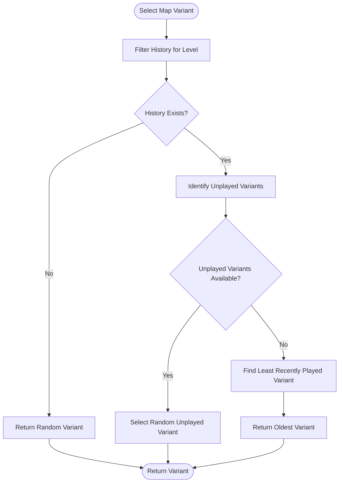
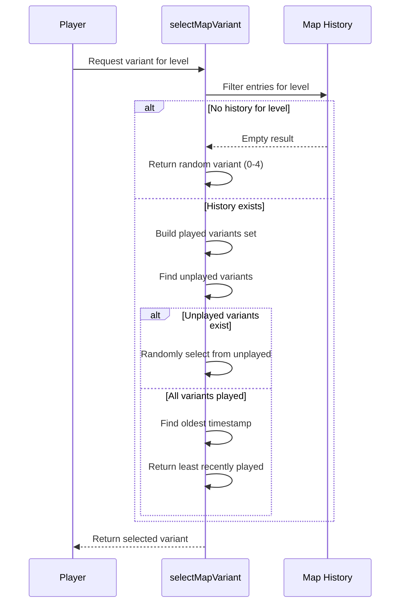
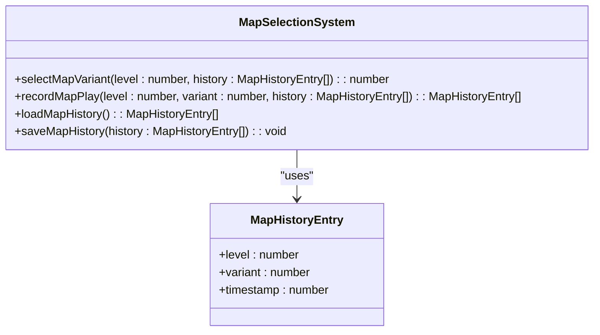

# Dynamic Selection Algorithm

<cite>
**Referenced Files in This Document**   
- [mapSelectionSystem.ts](file://src/mapSelectionSystem.ts)
- [types.ts](file://src/types.ts)
- [levels.ts](file://src/levels.ts)
</cite>

## Table of Contents
1. [Introduction](#introduction)
2. [Core Selection Strategy](#core-selection-strategy)
3. [Two-Phase Selection Algorithm](#two-phase-selection-algorithm)
4. [History Management System](#history-management-system)
5. [Data Structure Definitions](#data-structure-definitions)
6. [Map Retrieval and Validation](#map-retrieval-and-validation)
7. [Performance Considerations](#performance-considerations)
8. [Edge Case Handling](#edge-case-handling)
9. [Integration with Game System](#integration-with-game-system)

## Introduction

The dynamic level selection algorithm implements an intelligent system for choosing map variants that maximizes content variety and prevents immediate repetition. This document details the implementation of the `selectMapVariant` function and its supporting components, which work together to create a balanced player experience by prioritizing unplayed content and strategically recycling completed variants. The system maintains a persistent history of played maps and uses timestamp-based selection to ensure diverse gameplay across multiple sessions.

**Section sources**
- [mapSelectionSystem.ts](file://src/mapSelectionSystem.ts#L106-L154)

## Core Selection Strategy

The algorithm employs a two-phase strategy to select map variants based on player history. When a player progresses to a new level, the system first checks which variants of that level have been previously played. The primary goal is to expose players to all available content before repeating any specific variant. This approach enhances replayability by ensuring players experience the full range of level designs before encountering repeats.

The selection process begins by filtering the complete play history to isolate entries relevant to the current level. This filtered dataset forms the basis for determining which variants remain unplayed. By prioritizing unplayed variants, the algorithm maximizes content diversity during the early stages of gameplay.

**Diagram sources**
- [mapSelectionSystem.ts](file://src/mapSelectionSystem.ts#L106-L154)

**Section sources**
- [mapSelectionSystem.ts](file://src/mapSelectionSystem.ts#L106-L154)

## Two-Phase Selection Algorithm

The `selectMapVariant` function implements a two-phase selection strategy that adapts to the player's progression through the game content. The algorithm first attempts to select from unplayed variants, and only when all variants have been experienced does it fall back to selecting the least recently played variant.

In the first phase, the algorithm identifies all variants (0-4) that have not appeared in the player's history for the current level. These unplayed variants are collected into an array, and one is selected randomly to maintain unpredictability while ensuring new content exposure. This phase dominates the early gameplay experience, systematically introducing players to the different configurations of each level.

When all five variants have been played at least once, the algorithm transitions to its second phase. It analyzes timestamp data to determine which variant was played the longest time ago. This ensures that when repetition becomes necessary, the system selects the variant that has been absent from gameplay for the greatest duration, minimizing the perception of immediate repetition.

**Diagram sources**
- [mapSelectionSystem.ts](file://src/mapSelectionSystem.ts#L106-L154)

**Section sources**
- [mapSelectionSystem.ts](file://src/mapSelectionSystem.ts#L106-L154)

## History Management System

The map selection algorithm relies on a robust history management system that persists player progress across sessions. The system uses LocalStorage as its primary storage mechanism, with an in-memory fallback for environments where persistent storage is unavailable or corrupted. This dual-layer approach ensures reliable operation across different browser configurations and device capabilities.

The `loadMapHistory` function retrieves and validates stored history data, performing comprehensive integrity checks to handle potential data corruption. It verifies that the stored data is a properly structured array and that each entry contains valid level, variant, and timestamp values within acceptable ranges. If invalid entries are detected, they are filtered out and the cleaned data is saved back to storage.

The `saveMapHistory` function implements a FIFO (First-In, First-Out) strategy to limit the history size to 1,000 entries. This prevents unbounded growth while maintaining sufficient data for meaningful selection decisions. When storage errors occur, the system seamlessly transitions to in-memory storage, ensuring uninterrupted gameplay at the cost of persistence across browser sessions.

**Section sources**
- [mapSelectionSystem.ts](file://src/mapSelectionSystem.ts#L19-L96)
- [mapSelectionSystem.ts](file://src/mapSelectionSystem.ts#L164-L176)

## Data Structure Definitions

The selection system operates on well-defined data structures that ensure type safety and consistency throughout the application. The `MapHistoryEntry` interface defines the structure of each history record, containing the level number, variant index, and timestamp of play. This standardized format enables reliable filtering, sorting, and analysis of player history.

The history storage follows a simple but effective schema where each entry captures the essential information needed for intelligent selection. The level and variant fields use zero-based indexing, while the timestamp is stored as a Unix epoch value from `Date.now()`. This design allows for efficient chronological comparisons and ensures compatibility with JavaScript's date handling system.

**Diagram sources**
- [types.ts](file://src/types.ts#L164-L168)
- [mapSelectionSystem.ts](file://src/mapSelectionSystem.ts#L5-L9)

**Section sources**
- [types.ts](file://src/types.ts#L164-L168)
- [mapSelectionSystem.ts](file://src/mapSelectionSystem.ts#L5-L9)

## Map Retrieval and Validation

The `getMap` function serves as the final link in the selection chain, retrieving the actual map data based on the chosen level and variant. This function includes comprehensive validation to handle edge cases such as invalid level indices or corrupted variant data. When invalid parameters are detected, the function implements graceful fallback mechanisms to prevent game-breaking errors.

Level indices are validated against the `LEVEL_VARIANTS` record, which maps level numbers (1-7) to arrays of their respective variants. The function accounts for the difference between zero-based indexing in the selection system and one-based indexing in the LEVEL_VARIANTS structure by incrementing the level parameter. If an invalid level is requested, the function falls back to the first level's first variant.

Variant validation ensures the requested variant index falls within the bounds of available variants for the specified level. If the variant index is out of range, the function defaults to variant 0 rather than throwing an error. This defensive programming approach maintains gameplay continuity even when unexpected values are passed to the function.

**Section sources**
- [mapSelectionSystem.ts](file://src/mapSelectionSystem.ts#L187-L213)
- [levels.ts](file://src/levels.ts#L59-L67)

## Performance Considerations

The selection algorithm is designed with performance efficiency in mind, particularly regarding history filtering and timestamp comparisons. The `selectMapVariant` function performs a single pass through the relevant history entries to build the set of played variants, resulting in O(n) time complexity where n is the number of history entries for the current level.

The use of a `Set` data structure for tracking played variants enables O(1) lookup operations when checking whether a variant has been played, significantly improving performance compared to array-based searches. The algorithm avoids unnecessary computations by short-circuiting to the random selection phase when no history exists for the current level.

History filtering represents the most significant performance consideration, as the complete history array may grow over time. However, the 1,000-entry limit imposed by the `saveMapHistory` function ensures that this growth is bounded. The filtering operation is optimized by processing only entries relevant to the current level, reducing the effective dataset size for most selection operations.

**Section sources**
- [mapSelectionSystem.ts](file://src/mapSelectionSystem.ts#L106-L154)
- [mapSelectionSystem.ts](file://src/mapSelectionSystem.ts#L77-L96)

## Edge Case Handling

The selection system implements comprehensive error handling and fallback mechanisms to address various edge cases that may arise during gameplay. These safeguards ensure robust operation even when confronted with invalid data, storage failures, or unexpected usage patterns.

For empty or missing history, the algorithm defaults to random variant selection, providing a sensible starting point for new players. When LocalStorage is unavailable or corrupted, the system switches to in-memory storage, preserving functionality at the cost of persistence. Data validation during loading filters out malformed entries, preventing corrupted data from affecting selection decisions.

The `getMap` function handles invalid level and variant indices through defensive programming, falling back to default values rather than failing catastrophically. This approach ensures that gameplay can continue even when incorrect parameters are passed to the function, whether due to programming errors or data corruption.

Timestamp comparison logic includes safeguards against potential clock issues, treating the oldest timestamp as the least recently played regardless of absolute time values. This makes the system resilient to system clock changes between gaming sessions.

**Section sources**
- [mapSelectionSystem.ts](file://src/mapSelectionSystem.ts#L19-L96)
- [mapSelectionSystem.ts](file://src/mapSelectionSystem.ts#L187-L213)

## Integration with Game System

The dynamic selection algorithm integrates seamlessly with the broader game system through well-defined interfaces and data structures. The `LEVEL_VARIANTS` constant in levels.ts provides the complete catalog of available maps, organized by level number and variant index. This structure serves as the source of truth for all map data and enables the selection system to validate its choices against available content.

The `recordMapPlay` function creates a feedback loop by adding new entries to the history after each level completion, ensuring that subsequent selections reflect the most up-to-date play data. This function uses immutable patterns by returning a new history array rather than modifying the existing one, promoting predictable state management.

External components such as the game engine and compatibility tests reference the selection system's functions and data structures, demonstrating its central role in the game's progression mechanics. The system's design allows for easy integration while maintaining clear separation of concerns between selection logic, data storage, and map retrieval.

**Section sources**
- [levels.ts](file://src/levels.ts#L59-L67)
- [mapSelectionSystem.ts](file://src/mapSelectionSystem.ts#L164-L176)