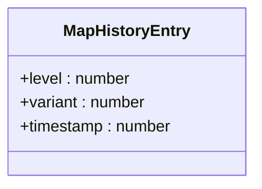
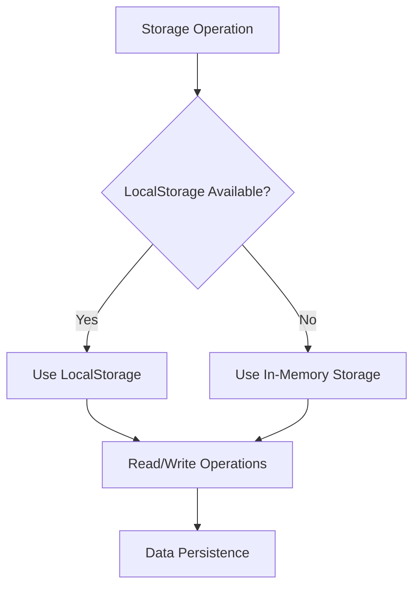
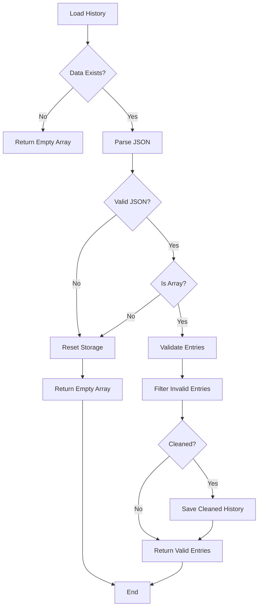
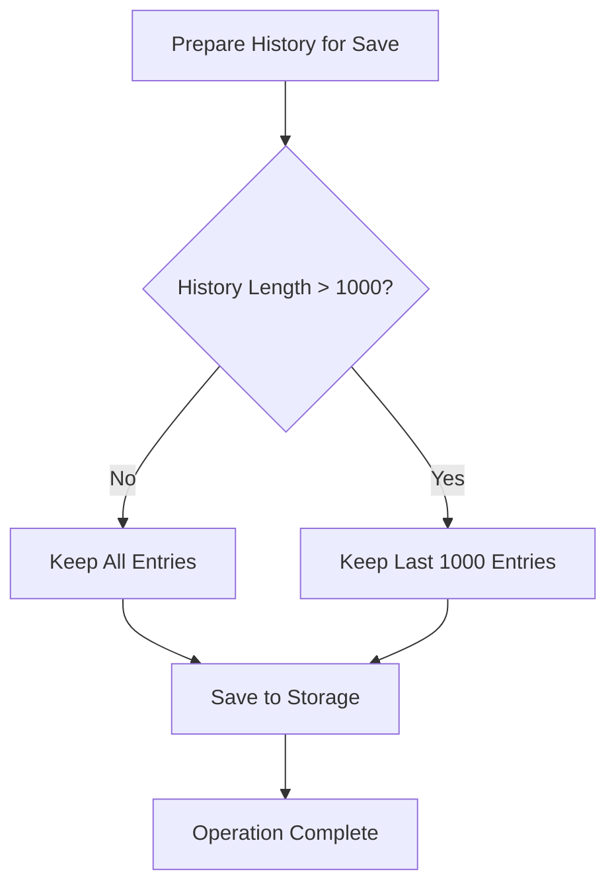
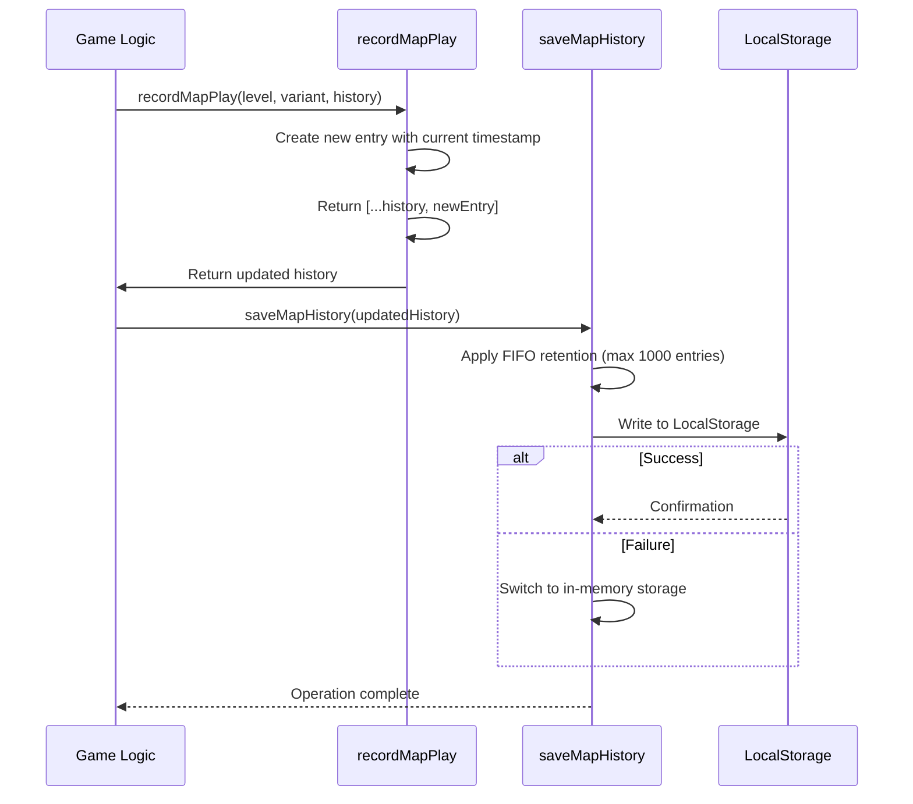
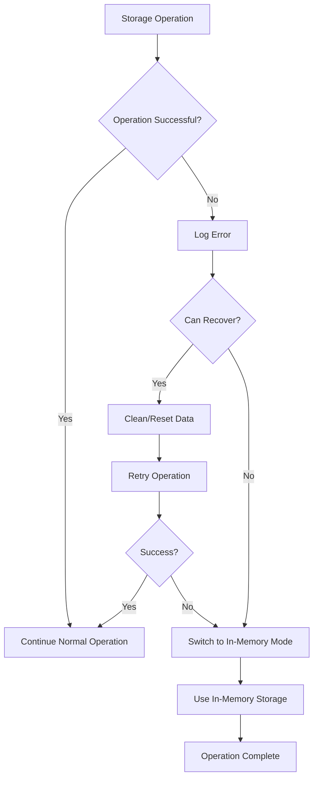

# History Tracking

<cite>
**Referenced Files in This Document**   
- [mapSelectionSystem.ts](file://src/mapSelectionSystem.ts)
- [types.ts](file://src/types.ts)
- [backwardCompatibilityTests.ts](file://src/backwardCompatibilityTests.ts)
</cite>

## Table of Contents
1. [Introduction](#introduction)
2. [Core Data Structure](#core-data-structure)
3. [Storage Implementation](#storage-implementation)
4. [Data Validation and Integrity](#data-validation-and-integrity)
5. [History Retention Policy](#history-retention-policy)
6. [Play Session Recording](#play-session-recording)
7. [Security Considerations](#security-considerations)
8. [Error Handling and Fallbacks](#error-handling-and-fallbacks)
9. [Session Persistence](#session-persistence)
10. [Conclusion](#conclusion)

## Introduction

The history tracking system in the Egor game maintains a record of player interactions with different level variants across play sessions. This system enables intelligent map selection by tracking which variants have been played and when, allowing the game to prioritize unplayed content and cycle through completed variants based on recency. The implementation combines persistent storage with robust error handling to ensure reliable operation across different browser environments and conditions.

**Section sources**
- [mapSelectionSystem.ts](file://src/mapSelectionSystem.ts#L1-L20)

## Core Data Structure

The `MapHistoryEntry` interface defines the structure for each recorded play session, capturing essential metadata about the player's interaction with a specific level variant. Each entry contains three properties: `level` (the zero-indexed level number), `variant` (the variant index between 0-4), and `timestamp` (a Unix timestamp in milliseconds representing when the level was played).

This structure enables the system to track player progression through the game's content and make informed decisions about future level selection. The interface is defined in multiple locations within the codebase, ensuring type consistency across different modules that interact with the history data.

**Diagram sources**
- [types.ts](file://src/types.ts#L164-L168)
- [mapSelectionSystem.ts](file://src/mapSelectionSystem.ts#L5-L9)

**Section sources**
- [types.ts](file://src/types.ts#L164-L168)
- [mapSelectionSystem.ts](file://src/mapSelectionSystem.ts#L5-L9)

## Storage Implementation

The history tracking system implements a dual-storage strategy that prioritizes `LocalStorage` for persistence while maintaining an in-memory fallback for environments where persistent storage is unavailable or restricted. The system uses a designated storage key (`egor_map_history`) to isolate its data from other applications sharing the same domain.

When `LocalStorage` is accessible, the system reads from and writes to this persistent storage mechanism, ensuring that play history survives browser restarts and page reloads. The implementation includes comprehensive error handling that detects storage unavailability and automatically switches to the in-memory storage mode, maintaining functionality even in restricted environments.

**Diagram sources**
- [mapSelectionSystem.ts](file://src/mapSelectionSystem.ts#L10-L20)
- [backwardCompatibilityTests.ts](file://src/backwardCompatibilityTests.ts#L10-L11)

**Section sources**
- [mapSelectionSystem.ts](file://src/mapSelectionSystem.ts#L10-L20)
- [backwardCompatibilityTests.ts](file://src/backwardCompatibilityTests.ts#L10-L11)

## Data Validation and Integrity

The system implements rigorous data validation to ensure the integrity of stored history entries and prevent corruption from propagating through the application. When loading history from `LocalStorage`, the system performs multiple validation checks: verifying that the stored data is an array, confirming each entry has the correct structure, and validating that numeric values fall within acceptable ranges (level ≥ 0, variant between 0-4).

If validation detects corrupted or malformed data, the system cleans the history by filtering out invalid entries and automatically saves the cleaned version back to storage. This self-healing capability ensures that partial corruption doesn't permanently compromise the entire history. The validation process also handles edge cases like invalid JSON or non-array data by resetting the storage and returning an empty history array.

**Diagram sources**
- [mapSelectionSystem.ts](file://src/mapSelectionSystem.ts#L21-L64)

**Section sources**
- [mapSelectionSystem.ts](file://src/mapSelectionSystem.ts#L21-L64)
- [backwardCompatibilityTests.ts](file://src/backwardCompatibilityTests.ts#L117-L151)

## History Retention Policy

The system implements a FIFO (first-in, first-out) retention policy that limits the history to the most recent 1,000 entries, as defined by the `MAX_HISTORY_ENTRIES` constant. This policy prevents unbounded growth of the storage data while maintaining a comprehensive record of recent gameplay activity.

When saving history, the system checks the length of the history array and applies the retention policy by slicing the array to keep only the most recent entries. This operation occurs before any storage attempt, ensuring that only the appropriate number of entries is written to `LocalStorage`. The limit of 1,000 entries provides a substantial history window while remaining well below typical browser storage quotas.

**Diagram sources**
- [mapSelectionSystem.ts](file://src/mapSelectionSystem.ts#L77-L80)
- [mapSelectionSystem.ts](file://src/mapSelectionSystem.ts#L3-L3)

**Section sources**
- [mapSelectionSystem.ts](file://src/mapSelectionSystem.ts#L77-L80)

## Play Session Recording

The `recordMapPlay` function updates the history after each level completion by creating a new `MapHistoryEntry` with the current level number, variant index, and timestamp. The function follows a functional programming pattern by returning a new array that includes all existing history entries plus the new entry, rather than modifying the original array in place.

This immutability approach ensures predictable behavior and prevents unintended side effects when multiple components interact with the history data. The timestamp is captured using `Date.now()`, providing millisecond precision for determining the recency of play sessions. The updated history is then passed to the `saveMapHistory` function to persist the changes to storage.

**Diagram sources**
- [mapSelectionSystem.ts](file://src/mapSelectionSystem.ts#L164-L176)
- [mapSelectionSystem.ts](file://src/mapSelectionSystem.ts#L77-L96)

**Section sources**
- [mapSelectionSystem.ts](file://src/mapSelectionSystem.ts#L164-L176)

## Security Considerations

The history tracking system addresses several security considerations related to `LocalStorage` usage. The data stored is limited to non-sensitive gameplay metadata (level numbers, variant indices, and timestamps) without any personally identifiable information, reducing privacy risks. The storage key (`egor_map_history`) is specifically chosen to avoid conflicts with other applications while remaining descriptive for debugging purposes.

The implementation follows the principle of least privilege by storing only the minimum necessary data to achieve the functionality. Since the data is used solely for client-side gameplay decisions and doesn't influence game mechanics or provide competitive advantages, the security impact of potential tampering is minimal. The system also includes validation that would detect and clean any manually modified or corrupted data.

**Section sources**
- [mapSelectionSystem.ts](file://src/mapSelectionSystem.ts#L2-L3)
- [backwardCompatibilityTests.ts](file://src/backwardCompatibilityTests.ts#L10-L11)

## Error Handling and Fallbacks

The system implements comprehensive error handling to maintain functionality even when storage operations fail. When `saveMapHistory` encounters an error (such as quota exceeded or storage disabled), it catches the exception, logs an error message, and automatically switches to in-memory storage mode by setting the `useInMemoryFallback` flag.

Similarly, `loadMapHistory` includes try-catch blocks around all `LocalStorage` operations, with fallback logic that attempts to clear corrupted data and, if that fails, switches to the in-memory storage mode. The backward compatibility tests verify this fallback behavior by mocking a non-functional `localStorage` object and confirming that the system continues to operate using in-memory storage.

**Diagram sources**
- [mapSelectionSystem.ts](file://src/mapSelectionSystem.ts#L85-L96)
- [mapSelectionSystem.ts](file://src/mapSelectionSystem.ts#L45-L64)
- [backwardCompatibilityTests.ts](file://src/backwardCompatibilityTests.ts#L328-L408)

**Section sources**
- [mapSelectionSystem.ts](file://src/mapSelectionSystem.ts#L85-L96)
- [mapSelectionSystem.ts](file://src/mapSelectionSystem.ts#L45-L64)

## Session Persistence

The history tracking system maintains data integrity across browser sessions through reliable persistence mechanisms and thorough testing. The backward compatibility tests verify that history data survives save/load cycles, with test cases confirming that entries are preserved exactly as stored, including their timestamps and metadata.

When `LocalStorage` is available, history persists across browser restarts, tab closures, and page reloads. In the fallback in-memory mode, history persists only for the duration of the current page session but is still maintained across different parts of the application. The system's design ensures that users receive a consistent experience regardless of whether they return to the game after minutes or months.

**Section sources**
- [backwardCompatibilityTests.ts](file://src/backwardCompatibilityTests.ts#L59-L115)
- [mapSelectionSystem.ts](file://src/mapSelectionSystem.ts#L19-L71)

## Conclusion

The history tracking system provides a robust solution for maintaining player progression data across sessions with comprehensive safeguards against data corruption and storage failures. By combining persistent `LocalStorage` with an in-memory fallback, rigorous data validation, and intelligent retention policies, the system ensures reliable operation in diverse browser environments. The implementation demonstrates careful consideration of edge cases and failure modes, with extensive testing validating both the primary functionality and recovery mechanisms. This approach balances persistence needs with performance considerations and security best practices, creating a seamless experience for players as they progress through the game's content.