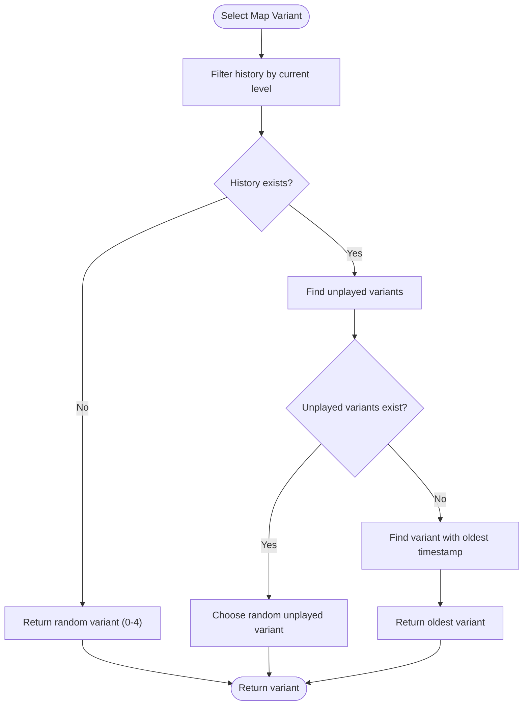
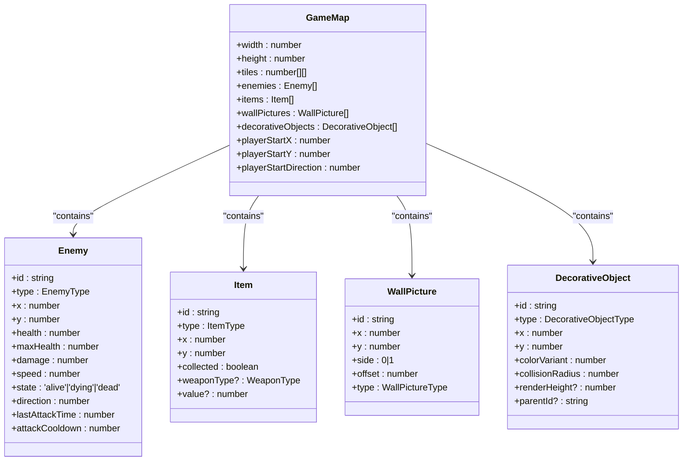
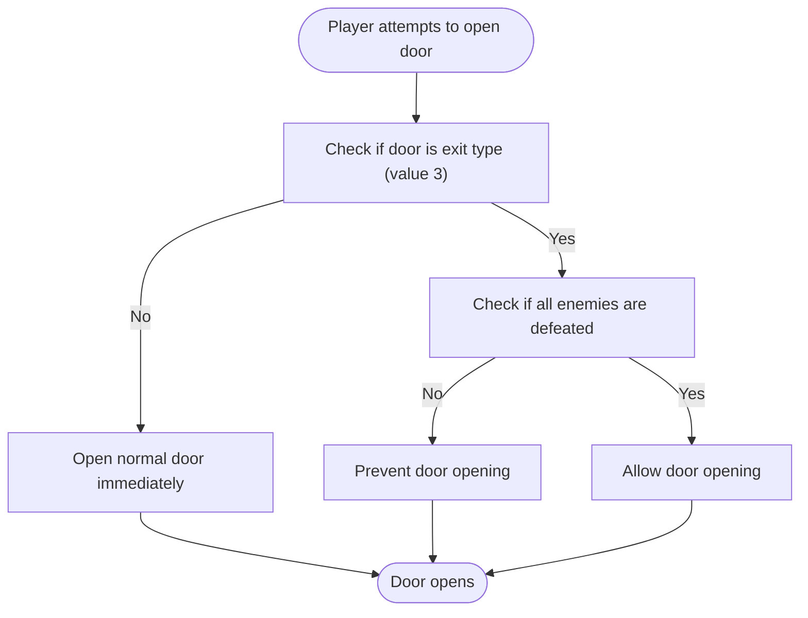

# Level System

<cite>
**Referenced Files in This Document**   
- [GameMap](file://src/types.ts#L113-L124)
- [mapSelectionSystem.ts](file://src/mapSelectionSystem.ts)
- [gameEngine.ts](file://src/gameEngine.ts#L579-L628)
- [levels.ts](file://src/levels.ts#L59-L67)
- [level1-variant1.ts](file://src/levels/level1-variant1.ts)
- [types.ts](file://src/types.ts)
</cite>

## Table of Contents
1. [Level Data Structure](#level-data-structure)
2. [Dynamic Level Selection Algorithm](#dynamic-level-selection-algorithm)
3. [Level History Tracking System](#level-history-tracking-system)
4. [GameMap Data Structure](#gamemap-data-structure)
5. [Level Completion Logic](#level-completion-logic)
6. [Progression System](#progression-system)
7. [Level Design Guidelines](#level-design-guidelines)

## Level Data Structure

The level system organizes game environments through structured data definitions that include walls, doors, enemies, items, and decorative objects. Each level variant is defined as a `GameMap` object containing a 2D tile grid and entity arrays. Walls are represented by value 1 in the tiles array, while free space uses value 0. Normal doors are marked with value 2 and exit doors with value 3, which only open when all enemies are eliminated.

Enemy entities are defined with properties including position, health, damage, speed, and state (alive, dying, or dead). Items include health pickups, ammunition, treasure, and weapons, each with specific values and collection mechanics. Decorative objects enhance visual appeal and include ceiling lights, vases, crates, benches, tables, chairs, wine bottles, and skeletons, each with collision radius properties that affect player movement.

Wall pictures add environmental detail and are positioned on specific wall tiles with orientation and offset parameters. The player's starting position and direction are explicitly defined for each level to ensure consistent gameplay experiences.

**Section sources**
- [level1-variant1.ts](file://src/levels/level1-variant1.ts#L1-L152)
- [types.ts](file://src/types.ts#L113-L124)

## Dynamic Level Selection Algorithm

The level selection system implements a sophisticated algorithm that rotates through multiple variants for each difficulty level to enhance replayability. For each of the 7 difficulty levels, 5 distinct variants are available, providing a total of 35 unique level configurations. The selection process prioritizes unplayed variants before recycling previously experienced ones.

When selecting a map variant, the system first checks the player's history for the current level. If unplayed variants exist, one is chosen randomly from this pool. Once all variants have been played, the system selects the variant with the oldest timestamp, ensuring the longest possible interval between repetitions. This approach balances variety with fairness, preventing immediate repetition while maintaining unpredictability.



**Diagram sources **
- [mapSelectionSystem.ts](file://src/mapSelectionSystem.ts#L149-L203)

**Section sources**
- [mapSelectionSystem.ts](file://src/mapSelectionSystem.ts#L149-L203)

## Level History Tracking System

The level history tracking system prevents immediate repetition of level variants by maintaining a persistent record of played maps using browser LocalStorage. The system stores entries containing the level number, variant index, and timestamp of each play session. This history enables the selection algorithm to make informed decisions about which variants to present to the player.

Each time a level is completed and a new one is loaded, the system records the current level and variant combination with a timestamp. The history is limited to 1000 entries using a FIFO (first-in, first-out) approach to prevent excessive storage usage. If LocalStorage becomes unavailable, the system gracefully falls back to in-memory storage to maintain functionality.

The history data structure is validated upon loading to ensure integrity, with corrupted or invalid entries being filtered out and cleaned versions saved. This robust approach ensures reliable tracking across sessions while handling potential storage issues gracefully.

```mermaid
classDiagram
class MapHistoryEntry {
+level : number
+variant : number
+timestamp : number
}
class mapSelectionSystem {
+loadMapHistory() : MapHistoryEntry[]
+saveMapHistory(history : MapHistoryEntry[]) : void
+selectMapVariant(level : number, history : MapHistoryEntry[]) : number
+recordMapPlay(level : number, variant : number, history : MapHistoryEntry[]) : MapHistoryEntry[]
+getMap(level : number, variant : number, levelsWithVariants : Record<number, GameMap[]>) : GameMap
}
MapHistoryEntry --> mapSelectionSystem : "stored in"
mapSelectionSystem --> "LocalStorage" : "persists to"
```

**Diagram sources **
- [mapSelectionSystem.ts](file://src/mapSelectionSystem.ts#L1-L214)

**Section sources**
- [mapSelectionSystem.ts](file://src/mapSelectionSystem.ts#L1-L214)

## GameMap Data Structure

The `GameMap` interface defines the comprehensive data structure for level representation, serving as the foundation for the 2D tile-based environment. This structure includes dimensions (width and height), a 2D array of tiles representing the navigable space, and arrays for various entities including enemies, items, wall pictures, and decorative objects.

The tile-based representation uses integer values to denote different terrain types: 0 for walkable space, 1 for walls, 2 for standard doors, and 3 for exit doors. This simple yet effective system enables efficient collision detection and pathfinding calculations. The player's starting coordinates and initial direction are explicitly defined to ensure consistent level entry points.

Entity arrays contain objects with specific properties that govern their behavior and appearance. Enemies have health, damage, speed, and state properties that determine their gameplay characteristics. Items include type, position, and value attributes that define their purpose and benefits. Decorative objects enhance visual fidelity with properties like color variant, collision radius, and render height.



**Diagram sources **
- [types.ts](file://src/types.ts#L113-L124)

**Section sources**
- [types.ts](file://src/types.ts#L113-L124)
- [level1-variant1.ts](file://src/levels/level1-variant1.ts#L1-L152)

## Level Completion Logic

Level completion is determined by two primary conditions: the elimination of all enemies and the availability of the exit door. The system evaluates completion status through the `checkLevelComplete` function, which verifies that no enemies remain in the 'alive' state. This function iterates through the enemies array and returns true only when every enemy has transitioned to either 'dying' or 'dead' state.

The exit door (represented by tile value 3) remains impassable until all enemies are defeated. When the player attempts to open a door, the system checks whether the targeted door is an exit door and verifies the status of all enemies. If any enemy remains alive, the exit door cannot be opened, preventing progression to the next level. This mechanic ensures that players must fully clear each level before advancing.

Standard doors (tile value 2) can be opened at any time and do not have completion requirements. These doors serve to control exploration and create strategic pathways within the level layout. The distinction between door types creates a clear progression mechanic where exploration is encouraged, but advancement is gated by combat objectives.



**Diagram sources **
- [gameEngine.ts](file://src/gameEngine.ts#L630-L678)

**Section sources**
- [gameEngine.ts](file://src/gameEngine.ts#L579-L581)
- [gameEngine.ts](file://src/gameEngine.ts#L630-L678)

## Progression System

The progression system guides players through 7 difficulty levels, with advancement triggered by completing each level's objectives. Upon completing a level, players receive a reward of 25 HP, which is added to their current health up to their maximum health capacity. This incremental healing provides a tangible benefit for progression and helps offset damage accumulated during gameplay.

Level advancement occurs through the `loadNextLevel` function, which increments the current level counter and loads the appropriate map variant based on the dynamic selection algorithm. The system prevents progression beyond level 7, which represents the final challenge in the game. Player statistics, including score, collected items, and defeated enemies, persist across levels to maintain a continuous gameplay experience.

The difficulty progression is structured to gradually increase challenge, with later levels featuring more complex layouts, additional enemies, and strategic item placement. While the current implementation shows level 1 as the starting point, the system is designed to scale through all 7 levels, providing a comprehensive progression arc. The combination of health rewards and increasing difficulty creates a balanced progression curve that rewards skill development and strategic play.

**Section sources**
- [gameEngine.ts](file://src/gameEngine.ts#L583-L628)
- [levels.ts](file://src/levels.ts#L59-L67)

## Level Design Guidelines

Creating balanced level layouts requires careful consideration of several key factors to ensure engaging and fair gameplay experiences. Level designers should focus on creating varied layouts across the 5 variants for each difficulty level to maximize replayability and prevent predictability. Each variant should offer distinct navigational challenges, enemy placements, and item distributions while maintaining consistent thematic elements.

When configuring level parameters, designers should balance enemy density with player mobility, ensuring that combat encounters are challenging but not overwhelming. The placement of health pickups should provide meaningful recovery opportunities without making the game too easy. Strategic positioning of ammunition and weapon pickups can guide player progression and reward exploration.

Decorative objects should be used to enhance visual interest and create environmental storytelling, but their collision properties must be carefully configured to avoid frustrating movement restrictions. Wall pictures add atmospheric detail and can be used to break up large wall sections, improving visual appeal without affecting gameplay.

Exit door placement should require meaningful exploration, typically positioned in areas that necessitate navigating through significant portions of the level. This encourages thorough exploration and ensures players engage with the level's content before progression. The relationship between enemy placement and exit door location should create natural tension, requiring players to manage threats while working toward their objective.

For optimal performance, level designs should maintain the 20x20 tile grid dimensions used throughout the system. This consistency ensures compatibility with existing pathfinding algorithms and rendering systems. When adding new level variants, designers should follow the established pattern of exporting named constants (e.g., LEVEL_X_VARIANT_Y) and ensure they are properly referenced in the LEVEL_VARIANTS record.

**Section sources**
- [level1-variant1.ts](file://src/levels/level1-variant1.ts)
- [types.ts](file://src/types.ts)
- [levels.ts](file://src/levels.ts)