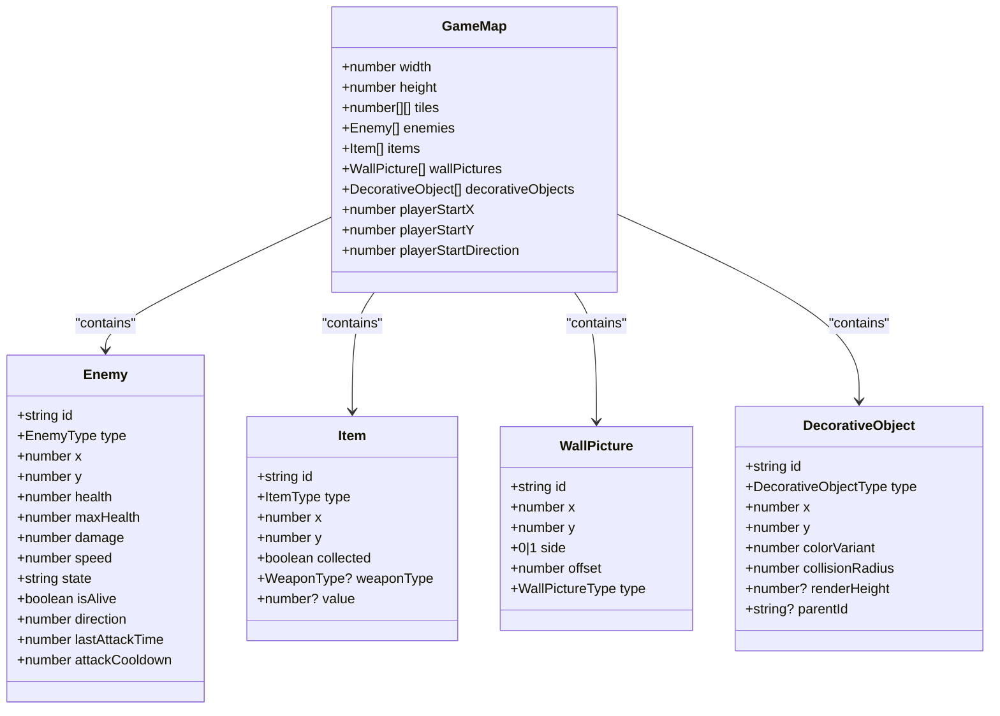
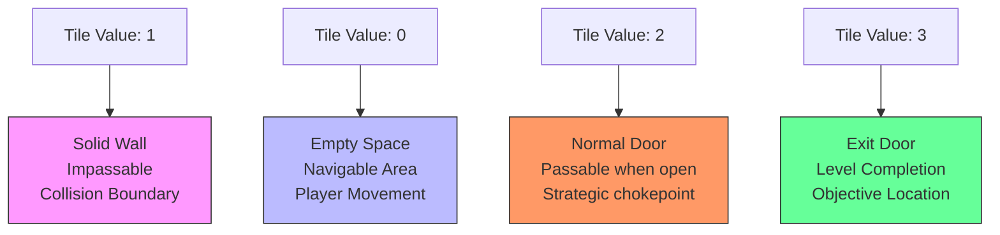

# Level Variants

<cite>
**Referenced Files in This Document**   
- [types.ts](file://src/types.ts)
- [level1-variant1.ts](file://src/levels/level1-variant1.ts)
- [level1-variant2.ts](file://src/levels/level1-variant2.ts)
- [level1-variant3.ts](file://src/levels/level1-variant3.ts)
- [level1-variant4.ts](file://src/levels/level1-variant4.ts)
- [level1-variant5.ts](file://src/levels/level1-variant5.ts)
- [level2-variant1.ts](file://src/levels/level2-variant1.ts)
- [level2-variant2.ts](file://src/levels/level2-variant2.ts)
- [level2-variant3.ts](file://src/levels/level2-variant3.ts)
- [level3-variant1.ts](file://src/levels/level3-variant1.ts)
- [level3-variant2.ts](file://src/levels/level3-variant2.ts)
- [level3-variant3.ts](file://src/levels/level3-variant3.ts)
- [level4-variant1.ts](file://src/levels/level4-variant1.ts)
- [level4-variant2.ts](file://src/levels/level4-variant2.ts)
- [level4-variant3.ts](file://src/levels/level4-variant3.ts)
- [level5-variant1.ts](file://src/levels/level5-variant1.ts)
- [level5-variant2.ts](file://src/levels/level5-variant2.ts)
</cite>

## Table of Contents
1. [Introduction](#introduction)
2. [Level Variant System Overview](#level-variant-system-overview)
3. [GameMap Interface Structure](#gamemap-interface-structure)
4. [Tile-Based Map Representation](#tile-based-map-representation)
5. [Variant Diversity and Replayability](#variant-diversity-and-replayability)
6. [Balancing Level Variants](#balancing-level-variants)
7. [Common Issues and Validation](#common-issues-and-validation)
8. [Conclusion](#conclusion)

## Introduction
The level variants system provides a robust framework for creating diverse gameplay experiences across seven difficulty levels, each with five distinct map configurations. This system enhances replayability by offering unique layouts, enemy placements, item distributions, and decorative configurations for each variant, preventing players from memorizing optimal paths and strategies. The implementation leverages a tile-based 2D map representation with standardized data structures to ensure consistency while allowing for creative variation in level design.

**Section sources**
- [types.ts](file://src/types.ts#L113-L124)
- [level1-variant1.ts](file://src/levels/level1-variant1.ts#L2-L151)

## Level Variant System Overview
Each level from 1 to 7 contains five unique variants, providing a total of 35 distinct maps in the game. These variants share the same fundamental structure and objectives but differ significantly in their spatial configuration, enemy placement, item distribution, and decorative elements. The system is implemented through individual TypeScript files for each variant, exported through the index.ts file in the levels directory.

The variants progress in complexity and challenge as both the level number and variant number increase. For example, Level 1 variants feature simpler layouts with basic zombie enemies, while Level 5 variants introduce more complex nested room structures with enhanced monsters and ghost enemies. This progression ensures a smooth difficulty curve while maintaining player engagement through novel configurations.

Each variant maintains consistent entry and exit points, player starting positions, and core gameplay mechanics, ensuring that players can transfer their learned skills across variants while still facing new strategic challenges. The system supports difficulty scaling through increased enemy health, damage, and speed, as well as more sophisticated enemy placement patterns that require advanced navigation and combat strategies.

**Section sources**
- [index.ts](file://src/levels/index.ts#L1-L48)
- [level1-variant1.ts](file://src/levels/level1-variant1.ts#L2-L151)
- [level5-variant1.ts](file://src/levels/level5-variant1.ts#L2-L89)

## GameMap Interface Structure
The GameMap interface defines the complete structure for all level variants, containing all necessary components for gameplay. The interface includes the following key properties:

- **width** and **height**: Define the dimensions of the map in tiles
- **tiles**: A 2D array representing the wall layout and navigable spaces
- **enemies**: Array of Enemy objects with positions, health, and behavior parameters
- **items**: Array of Item objects including health packs, ammunition, weapons, and treasures
- **wallPictures**: Decorative wall elements with positioning and type information
- **decorativeObjects**: Environmental props such as furniture, lights, and skeletons
- **playerStartX**, **playerStartY**, **playerStartDirection**: Initial player position and orientation

The interface ensures consistency across all variants while allowing for variation in content. Each property serves a specific gameplay purpose, from the tiles array that defines collision boundaries to the decorativeObjects array that enhances visual interest without affecting gameplay mechanics.

**Diagram sources**
- [types.ts](file://src/types.ts#L113-L124)
- [level1-variant1.ts](file://src/levels/level1-variant1.ts#L2-L151)

**Section sources**
- [types.ts](file://src/types.ts#L113-L124)

## Tile-Based Map Representation
The tile system uses numeric values to represent different map elements in a 2D grid:
- **1** = Wall (impassable barrier)
- **0** = Empty space (navigable area)
- **2** = Normal door (passable barrier that can be opened)
- **3** = Exit door (level completion point)

This tile-based approach allows for efficient map rendering and collision detection. The 20x20 or 22x22 grid systems provide a balanced playing field that is large enough for strategic movement but small enough to maintain performance and player orientation. The outer boundary consistently uses wall tiles (1) to define the map perimeter, while internal layouts vary significantly between variants.

For example, Level 1 Variant 1 features a symmetrical layout with central corridors and side rooms, while Level 1 Variant 2 creates a more linear progression with multiple doorways. The tile patterns demonstrate how simple numeric representations can generate complex and varied spatial configurations that impact gameplay strategies.

The system supports both integer coordinates for tile-based elements and floating-point coordinates for precise positioning of enemies, items, and decorative objects, allowing for fine-tuned placement within the tile grid. This hybrid approach combines the efficiency of grid-based design with the flexibility of free-positioning for non-structural elements.

**Diagram sources**
- [level1-variant1.ts](file://src/levels/level1-variant1.ts#L2-L151)
- [level2-variant1.ts](file://src/levels/level2-variant1.ts#L2-L191)

**Section sources**
- [level1-variant1.ts](file://src/levels/level1-variant1.ts#L2-L151)
- [level2-variant1.ts](file://src/levels/level2-variant1.ts#L2-L191)

## Variant Diversity and Replayability
The five variants per level significantly enhance replayability by providing distinct experiences that prevent memorization and encourage adaptive strategies. Each variant differs in several key aspects:

**Layout Configuration**: Variants employ different architectural patterns, including symmetrical designs, linear progressions, maze-like structures, and central chamber layouts. For instance, Level 3 Variant 1 features a cross-shaped central area with radiating corridors, while Level 3 Variant 2 uses a more segmented approach with isolated rooms connected by narrow passages.

**Enemy Placement**: The positioning, density, and composition of enemies vary between variants. Some variants cluster enemies in specific danger zones, while others distribute them more evenly throughout the map. Higher-level variants introduce mixed enemy types that require different combat approaches, such as positioning against zombies versus evasive maneuvers against faster ghosts.

**Item Distribution**: The placement of health packs, ammunition, and weapons follows different patterns across variants. Some prioritize rewarding exploration with items placed in side areas, while others place critical resources along the main path to support progression. Treasure locations vary significantly, encouraging players to explore different routes in each playthrough.

**Decorative Configuration**: While decorative elements don't affect gameplay, their arrangement contributes to the unique atmosphere of each variant. Ceiling light patterns, furniture placement, and wall picture locations create distinct visual identities that help players differentiate between variants and form spatial memories based on environmental cues rather than pure layout memorization.

This diversity ensures that players must adapt their strategies for each variant, promoting skill development and preventing the game from becoming repetitive. The system effectively balances familiarity (consistent mechanics and objectives) with novelty (unique configurations), creating an engaging experience that rewards both mastery and exploration.

**Section sources**
- [level1-variant1.ts](file://src/levels/level1-variant1.ts#L2-L151)
- [level1-variant2.ts](file://src/levels/level1-variant2.ts#L2-L175)
- [level3-variant1.ts](file://src/levels/level3-variant1.ts#L2-L235)
- [level3-variant2.ts](file://src/levels/level3-variant2.ts#L2-L228)

## Balancing Level Variants
Creating balanced variants requires careful consideration of several interrelated factors to ensure fair and engaging gameplay:

**Difficulty Progression**: Variants within each level should show a gradual increase in challenge. This is achieved through:
- Increasing enemy density and health pools
- Strategic placement of enemies to create challenging encounters
- Appropriate distribution of resources to match difficulty
- Complex layouts that require advanced navigation skills

**Enemy Density**: The number of enemies should be proportional to the map size and player capabilities. Level 1 variants typically contain 3-5 enemies, while Level 5 variants may have 8-9 enemies. The placement should create meaningful challenges without overwhelming the player, with consideration for line-of-sight, chokepoints, and escape routes.

**Reward Placement**: Items should be distributed to encourage exploration while providing necessary resources for survival. Key principles include:
- Placing health packs in high-risk areas or after challenging encounters
- Positioning weapon upgrades in locations that allow players to immediately utilize their new capabilities
- Distributing ammunition to support sustained combat
- Locating treasures in areas that reward thorough exploration

**Resource Distribution**: The balance between risk and reward is crucial. High-value items should be placed in more dangerous locations, while essential survival resources should be more accessible. The system ensures that players always have a viable path to critical resources, even in the most challenging variants.

**Environmental Balance**: Decorative elements should enhance the atmosphere without obstructing gameplay or creating unfair advantages/disadvantages. Collision radii are carefully set to prevent unintended blocking of movement, and visual elements are arranged to support spatial orientation rather than confusion.

The balancing process involves iterative testing to ensure that all variants are solvable with appropriate skill and strategy, providing a satisfying challenge that rewards player improvement without causing frustration through unfair design.

**Section sources**
- [level1-variant1.ts](file://src/levels/level1-variant1.ts#L2-L151)
- [level4-variant1.ts](file://src/levels/level4-variant1.ts#L2-L296)
- [level5-variant1.ts](file://src/levels/level5-variant1.ts#L2-L89)

## Common Issues and Validation
When creating level variants, several common issues must be addressed to ensure playable and enjoyable experiences:

**Solvability Verification**: Every variant must be thoroughly tested to confirm that it can be completed using legitimate gameplay mechanics. This includes verifying that:
- All enemies can be defeated with available weapons and resources
- The exit door is reachable from the player start position
- No impassable barriers block the path to completion
- Required items can be collected without requiring impossible maneuvers

**Player Start Position Validation**: The player starting position must be carefully validated to ensure:
- It is placed on a navigable tile (value 0)
- It provides a clear line of sight to the immediate environment
- It doesn't place the player in immediate danger without opportunity to react
- The starting direction faces a logical path of progression

**Map Integrity Checks**: Automated and manual checks should verify:
- Consistent outer wall boundaries
- Proper door placement (only on wall tiles)
- No floating items or enemies in walls
- Correct tile values throughout the grid
- Appropriate spacing between elements to prevent clipping

**Performance Considerations**: Large numbers of decorative objects and enemies can impact performance, so variants should:
- Limit the total number of entities to maintain smooth gameplay
- Distribute processing load evenly across the map
- Avoid clustering too many interactive elements in small areas

**Accessibility**: Variants should be designed with consideration for:
- Clear visual cues for important elements
- Reasonable pathfinding requirements
- Adequate lighting and visibility
- Intuitive spatial organization

Regular validation through both automated testing and human playtesting ensures that all variants meet quality standards and provide consistent, enjoyable experiences across the entire level progression.

**Section sources**
- [level1-variant1.ts](file://src/levels/level1-variant1.ts#L2-L151)
- [level2-variant1.ts](file://src/levels/level2-variant1.ts#L2-L191)
- [types.ts](file://src/types.ts#L113-L124)

## Conclusion
The level variants system provides a comprehensive framework for creating diverse and engaging gameplay experiences through its structured approach to map design. By implementing five distinct variants for each of the seven levels, the system successfully enhances replayability and prevents memorization, encouraging players to develop adaptive strategies rather than relying on rote learning.

The GameMap interface offers a robust and extensible structure that supports consistent implementation across all variants while allowing for creative variation in layout, enemy placement, item distribution, and decorative configuration. The tile-based representation system efficiently encodes complex spatial relationships using simple numeric values, enabling both human readability and computational processing.

The success of this system lies in its balance between consistency and variation—maintaining core gameplay mechanics and progression while introducing meaningful differences in each variant. This approach supports a smooth difficulty curve that challenges players appropriately as they advance through the levels, with increasing complexity in both map design and enemy behavior.

Future development could extend this system by introducing procedural elements that generate additional variants, or by implementing dynamic difficulty adjustment based on player performance. The existing framework provides a solid foundation for such enhancements while already delivering a rich and varied gameplay experience through its carefully crafted manual designs.