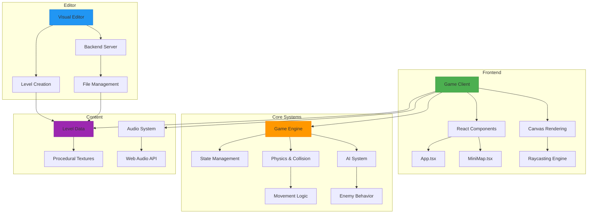
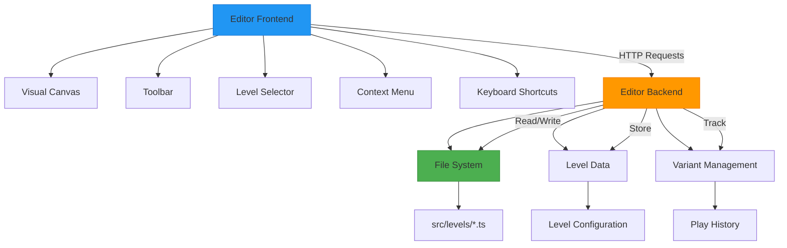

# Project Overview

<cite>
**Referenced Files in This Document**   
- [README.md](file://README.md)
- [App.tsx](file://src/App.tsx)
- [gameEngine.ts](file://src/gameEngine.ts)
- [raycasting.ts](file://src/raycasting.ts)
- [levels.ts](file://src/levels.ts)
- [saveLoadSystem.ts](file://src/saveLoadSystem.ts)
- [textures.ts](file://src/textures.ts)
- [types.ts](file://src/types.ts)
- [weapons.ts](file://src/weapons.ts)
- [mapSelectionSystem.ts](file://src/mapSelectionSystem.ts)
- [soundSystem.ts](file://src/soundSystem.ts)
- [editor-server.mjs](file://editor-server.mjs)
- [vite.editor.config.ts](file://vite.editor.config.ts)
- [package.json](file://package.json)
</cite>

## Table of Contents
1. [Introduction](#introduction)
2. [Core Features](#core-features)
3. [Target Audience](#target-audience)
4. [Application Architecture](#application-architecture)
5. [Game Client Components](#game-client-components)
6. [Editor Backend Components](#editor-backend-components)
7. [Key Technical Systems](#key-technical-systems)
8. [Integration and Cohesion](#integration-and-cohesion)

## Introduction

The egor project is a retro-style first-person shooter inspired by the classic Wolfenstein 3D, implemented with modern web technologies using React and TypeScript. This project recreates the authentic raycasting experience that defined early 3D gaming while leveraging contemporary web development practices to deliver a smooth, accessible gaming experience directly in the browser. The application serves dual purposes: as a fully playable game with seven levels of increasing difficulty and as a visual level editor that allows users to create and modify game levels without writing code.

Built as a homage to the pioneering first-person shooter genre, egor maintains the core gameplay mechanics that made Wolfenstein 3D revolutionary while introducing modern enhancements. The game features a sophisticated raycasting engine that renders 3D environments from a 2D map, creating the illusion of three-dimensional space through mathematical calculations rather than polygon-based rendering. This approach pays tribute to the technical ingenuity of early 3D games while demonstrating how these classic techniques can be effectively implemented in modern web applications.

The project is designed to be self-contained, running entirely in the browser without requiring a backend server for gameplay. All game assets, including textures and level data, are generated procedurally using JavaScript, eliminating the need for external image files. This approach not only reduces loading times but also showcases the computational capabilities of modern browsers. The game includes comprehensive features such as multiple weapon types, diverse enemy AI, interactive doors, and a sophisticated level progression system, all implemented with clean, maintainable TypeScript code.

**Section sources**
- [README.md](file://README.md#L1-L20)
- [package.json](file://package.json#L1-L10)

## Core Features

egor delivers a comprehensive retro gaming experience with a rich set of features that capture the essence of classic first-person shooters while introducing modern enhancements. The game's core mechanic is its 3D raycasting engine, which creates the illusion of three-dimensional space by casting rays from the player's viewpoint and calculating wall distances and heights. This technique, pioneered in Wolfenstein 3D, is implemented with optimizations for modern browsers, including view frustum culling to improve performance by only rendering visible sprites.

The game features eight levels with increasing difficulty, each level offering multiple variants that are automatically rotated to provide replayability. When players complete a level by defeating all enemies, they can access the next level through a special green "next level" door. Each new level rewards players with 25 additional health points (up to their maximum), encouraging progression through the game. The level design includes various interactive elements such as brown doors that can be opened with the 'E' key and decorative objects like vases, crates, benches, tables, chairs, wine bottles, skeletons, and ceiling lights that add visual interest and can affect gameplay through collision detection.

Players have access to six different weapons that are unlocked progressively as they advance through the levels: knife (starting weapon), pistol (starting weapon), machine pistol (levels 2-3), chainsaw (level 3), assault rifle (levels 4-6), and heavy machine gun (levels 5-7). If a player misses obtaining a weapon in an earlier level, backup weapons are available in later levels. When players pick up a weapon they already possess, they receive 30 rounds of ammunition for all weapons instead. The game features four enemy types with distinct AI behaviors: zombies (green, moderate speed), monsters (red, high health), ghosts (white, fast and difficult to hit), and dogs (brown, fast and aggressive).

Additional gameplay mechanics include a jump feature (activated with 'F') that allows players to overcome obstacles like tables and chairs to reach items, with visual camera movement to enhance the effect. The game includes a statistics system (accessible with 'T') that tracks collected items and defeated enemies, providing players with feedback on their performance. For accessibility and convenience, the game supports both keyboard and mouse controls, with intuitive key mappings for movement, weapon selection, and interaction.

**Section sources**
- [README.md](file://README.md#L21-L100)
- [App.tsx](file://src/App.tsx#L1-L100)
- [gameEngine.ts](file://src/gameEngine.ts#L1-L100)

## Target Audience

The egor project is designed for multiple audiences interested in game development, rendering techniques, and full-stack web applications. Game developers and hobbyists will find the project particularly valuable as a comprehensive example of implementing classic 3D rendering techniques in a modern web environment. The codebase demonstrates how to create a raycasting engine from scratch using JavaScript and Canvas, providing insights into the mathematical foundations of 3D graphics and optimization techniques for real-time rendering.

Students studying computer science, game development, or web technologies will benefit from the project's educational value. The implementation of the Digital Differential Analysis (DDA) algorithm for raycasting, sprite rendering with depth sorting, and collision detection systems serve as practical examples of computer graphics concepts. The project's use of React and TypeScript showcases modern frontend development practices, including component architecture, state management, and type safety, making it an excellent learning resource for web development students.

The project also appeals to enthusiasts of retro gaming who appreciate the nostalgic value of Wolfenstein 3D-style gameplay. By recreating the authentic experience of early first-person shooters with modern enhancements, egor bridges the gap between classic gaming and contemporary technology. The inclusion of a visual level editor expands the audience to include level designers and content creators who want to experiment with game design without programming knowledge.

For full-stack web developers, the project demonstrates how to create a cohesive application with both client and server components, even though the primary gameplay runs entirely in the browser. The separation between the game client and editor backend illustrates architectural patterns for applications with multiple modes or interfaces, providing insights into how to structure complex web applications.

**Section sources**
- [README.md](file://README.md#L101-L120)
- [package.json](file://package.json#L1-L10)

## Application Architecture

The egor project follows a modular architecture that separates concerns between the game client and editor backend, while maintaining a cohesive codebase. The application is built with React 19 and TypeScript, using Vite as the build tool for fast development and optimized production builds. The architecture is designed to support both the playable game and the visual level editor, with shared components and utilities that promote code reuse and consistency.

The game client is structured around a main App component that manages the game state, rendering loop, and user interface. The core gameplay systems are implemented as separate modules that handle specific aspects of the game: gameEngine.ts manages game logic and state updates, raycasting.ts implements the 3D rendering engine, and soundSystem.ts handles audio effects using the Web Audio API. The game state is represented by TypeScript interfaces defined in types.ts, providing type safety and clear documentation of the data structures used throughout the application.

The editor backend provides a separate development environment for creating and modifying game levels. When started with the "npm run editor" command, it launches a frontend interface on port 3000 and a backend server on port 3001. The editor allows users to visually create levels by placing walls, enemies, items, and decorative objects on a 2D grid, with changes saved directly to TypeScript files in the src/levels/ directory. This dual-mode architecture allows developers to work on both gameplay and content creation within the same codebase, with the editor excluded from production builds to keep the final game lightweight.

The project uses a component-based architecture for the user interface, with React components handling different aspects of the game display. The main game view is rendered on a Canvas element using the raycasting engine, while UI elements like menus, statistics, and notifications are implemented as React components. The MiniMap component provides a real-time overview of the player's position and surroundings, enhancing situational awareness. The architecture supports responsive design and accessibility, with keyboard navigation and clear visual feedback for game events.

**Diagram sources **
- [App.tsx](file://src/App.tsx#L1-L50)
- [gameEngine.ts](file://src/gameEngine.ts#L1-L30)
- [raycasting.ts](file://src/raycasting.ts#L1-L20)
- [editor-server.mjs](file://editor-server.mjs#L1-L15)

**Section sources**
- [README.md](file://README.md#L121-L150)
- [App.tsx](file://src/App.tsx#L1-L50)
- [gameEngine.ts](file://src/gameEngine.ts#L1-L30)
- [raycasting.ts](file://src/raycasting.ts#L1-L20)
- [editor-server.mjs](file://editor-server.mjs#L1-L15)

## Game Client Components

The game client of the egor project consists of several interconnected components that work together to deliver a seamless gaming experience. At the heart of the client is the App component, which serves as the main container for the game interface and manages the overall game state, including player health, current level, weapon selection, and game mode (playing, paused, menu, etc.). This component orchestrates the interaction between the rendering system, game logic, and user interface elements.

The rendering system is implemented through a combination of React components and direct Canvas manipulation. The main game view is rendered on a Canvas element using a raycasting algorithm that calculates wall distances and heights based on the player's position and direction. This approach creates the illusion of 3D space by projecting vertical wall slices onto the 2D screen, with sprite objects (enemies, items, decorative objects) rendered on top with proper depth sorting. The MiniMap component provides a top-down view of the current level, showing the player's position, enemy locations, and level layout, enhancing spatial awareness.

Game logic is handled by the gameEngine module, which implements the core mechanics including player movement, enemy AI, combat systems, and level progression. Player movement uses raycasting-based collision detection to prevent walking through walls, with support for strafing and rotation. The enemy AI system features different behavior patterns for each enemy type, with pathfinding that allows enemies to navigate around obstacles and open doors (except dogs). Combat mechanics include weapon switching, ammunition management, and damage calculation, with visual and audio feedback for hits and kills.

The user interface includes several React components that provide menus, notifications, and game information. The menu system allows players to start a new game, load saved games, adjust difficulty settings, and access help information. Notifications appear when players collect items or defeat enemies, providing immediate feedback. The statistics panel (accessible with 'T') displays detailed information about collected items and defeated enemies, allowing players to track their progress. The UI is designed to be intuitive and accessible, with clear visual indicators for game states and events.

**Section sources**
- [App.tsx](file://src/App.tsx#L1-L500)
- [MiniMap.tsx](file://src/MiniMap.tsx#L1-L80)
- [gameEngine.ts](file://src/gameEngine.ts#L1-L300)

## Editor Backend Components

The editor backend of the egor project provides a visual interface for creating and modifying game levels without writing code. This development-only feature is excluded from production builds but significantly enhances the development workflow by allowing designers to create levels through direct manipulation rather than manual coding. The editor consists of a frontend interface built with React and a backend server that handles file operations, running on separate ports (3000 for frontend, 3001 for backend) during development.

The editor frontend features a 2D canvas where users can visually design levels by placing tiles, enemies, items, and decorative objects. Interactive tools allow users to select different tile types (walls, doors, floors), set the player's starting position and direction, and place various game entities. The interface includes a toolbar with icons for different object types, a context menu for editing object properties, and a level selector for switching between existing levels. Keyboard shortcuts like Ctrl+S for saving and Ctrl+Z/Y for undo/redo enhance productivity and provide a familiar editing experience.

The backend server, implemented in editor-server.mjs, handles file operations such as reading and writing level data to the src/levels/ directory. When a user saves a level, the server converts the visual representation into TypeScript code that defines the level's layout, enemy positions, item locations, and other properties. This approach ensures that level data remains compatible with the game client while allowing for visual editing. The server also manages level history and variant selection, tracking which level variants have been played to ensure balanced rotation during gameplay.

The editor includes features for advanced level design, such as resizing level dimensions, creating new levels and variants, and setting specific properties for objects like color variants for decorative items. The integration between frontend and backend is seamless, with real-time feedback on changes and automatic saving to prevent data loss. Documentation for the editor is comprehensive, including a complete guide, quick reference for keyboard shortcuts, and implementation summary, making it accessible to users with varying levels of technical expertise.

**Diagram sources **
- [editor-server.mjs](file://editor-server.mjs#L1-L50)
- [vite.editor.config.ts](file://vite.editor.config.ts#L1-L20)

**Section sources**
- [README.md](file://README.md#L151-L180)
- [editor-server.mjs](file://editor-server.mjs#L1-L50)
- [vite.editor.config.ts](file://vite.editor.config.ts#L1-L20)

## Key Technical Systems

The egor project implements several sophisticated technical systems that work together to create an authentic retro gaming experience with modern web technologies. The raycasting engine, implemented in raycasting.ts, is the foundation of the 3D rendering system. It uses the Digital Differential Analysis (DDA) algorithm to cast rays from the player's position in the direction of view, calculating intersections with walls to determine distances and heights. This approach creates the illusion of three-dimensional space by projecting vertical wall slices onto the 2D screen, with proper perspective and depth.

The game features a dynamic level variant system that enhances replayability by rotating through multiple versions of each level. Implemented in mapSelectionSystem.ts, this system tracks which level variants have been played and prioritizes unplayed variants, falling back to the least recently played variant when all options have been experienced. This ensures that players encounter fresh layouts on subsequent playthroughs, maintaining engagement and preventing memorization of level designs. The system uses localStorage to persist play history across sessions, with fallback mechanisms for handling corrupted data or unavailable storage.

Texture generation is handled procedurally through the textures.ts module, which creates all visual assets using JavaScript Canvas operations rather than external image files. This approach reduces loading times and bandwidth usage while allowing for dynamic texture variations. The system generates detailed textures for enemies, items, walls, and doors using gradients, patterns, and shading to create visually distinct and recognizable assets. For example, zombie textures include facial features, torn clothing, and blood stains, while weapon textures feature metallic highlights and mechanical details.

The game implements a comprehensive save/load system that allows players to save their progress at any time. Using localStorage, the system serializes the complete game state including player position, health, inventory, and level progression, enabling seamless continuation of gameplay across sessions. The implementation includes backward compatibility features that handle older save formats, ensuring that players can load games created with previous versions of the application. Performance optimizations such as view frustum culling and efficient collision detection ensure smooth gameplay at 60 FPS on modern browsers.

**Section sources**
- [raycasting.ts](file://src/raycasting.ts#L1-L230)
- [mapSelectionSystem.ts](file://src/mapSelectionSystem.ts#L1-L215)
- [textures.ts](file://src/textures.ts#L1-L800)
- [saveLoadSystem.ts](file://src/saveLoadSystem.ts#L1-L66)

## Integration and Cohesion

The egor project demonstrates excellent integration and cohesion between its various systems, creating a seamless experience that feels like a unified application rather than a collection of disparate components. The game client and editor backend, while serving different purposes, share the same codebase and data structures, ensuring consistency between level design and gameplay. Level data created in the visual editor is immediately compatible with the game client, as both use the same TypeScript interfaces and file formats defined in the shared modules.

The application's architecture promotes code reuse and maintainability through well-defined interfaces and modular design. The types.ts file defines TypeScript interfaces for game entities like Player, Enemy, Item, and GameState, which are used consistently across all components. This type safety ensures that data passed between systems is valid and properly structured, reducing bugs and making the codebase easier to understand and extend. The separation of concerns between rendering, game logic, and user interface allows for independent development and testing of each component.

Data flow within the application follows a predictable pattern, with the App component serving as the central state manager that coordinates updates between systems. When player input is detected, the gameEngine updates the game state, which triggers re-renders of both the 3D view and UI components. The raycasting engine receives the updated player position and direction to recalculate the visual representation, while the MiniMap component updates to reflect the new position. This reactive architecture ensures that all parts of the interface remain synchronized with the current game state.

The project's build system, configured through Vite, supports both the game client and editor with separate configuration files (vite.config.ts for the game, vite.editor.config.ts for the editor). This allows for optimized production builds of the game while providing a rich development environment for the editor. The package.json scripts make it easy to switch between modes, with "npm run dev" launching the game and "npm run editor" starting both the editor frontend and backend. This cohesive development workflow enhances productivity and ensures that changes to shared components are immediately reflected in both the game and editor.

**Section sources**
- [App.tsx](file://src/App.tsx#L1-L1253)
- [types.ts](file://src/types.ts#L1-L176)
- [vite.config.ts](file://vite.config.ts#L1-L10)
- [vite.editor.config.ts](file://vite.editor.config.ts#L1-L20)