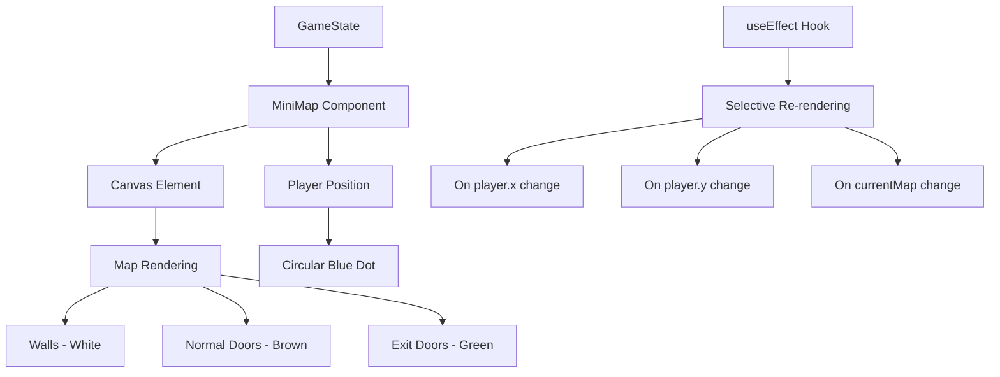
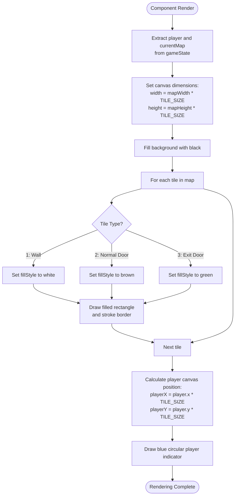
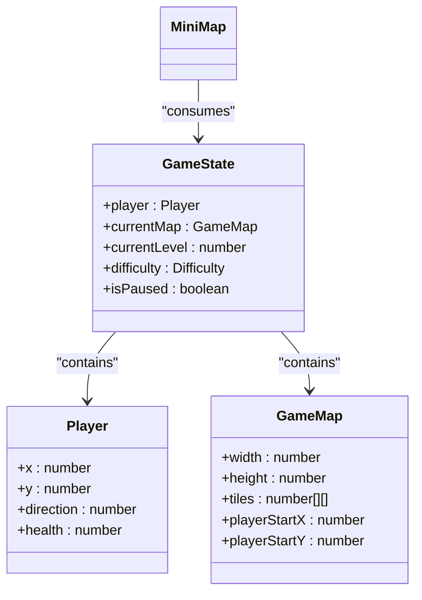
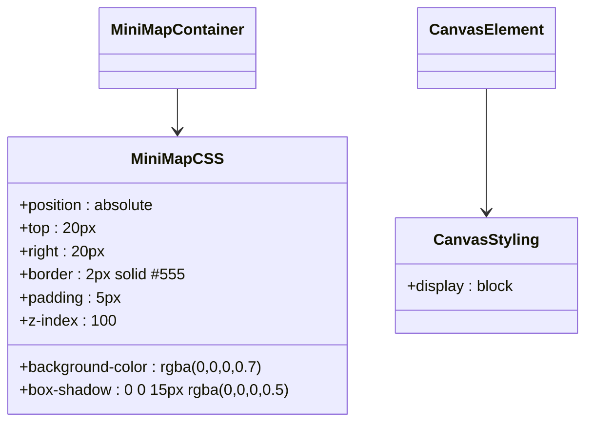
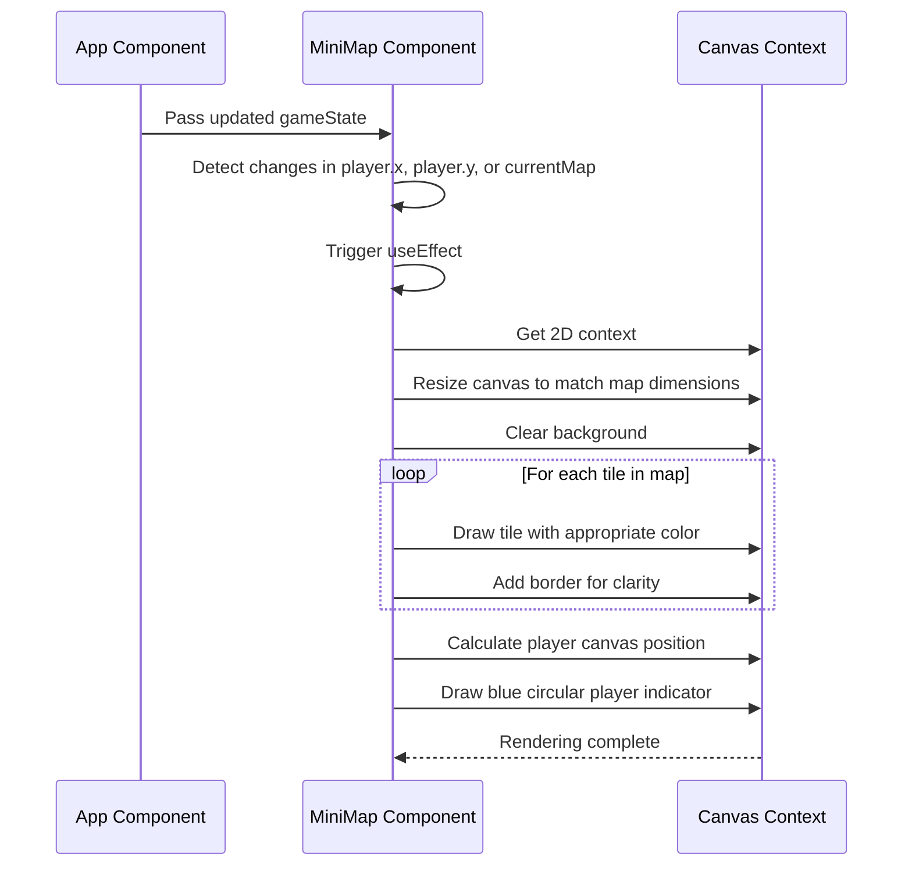

# MiniMap

<cite>
**Referenced Files in This Document**   
- [MiniMap.tsx](file://src/MiniMap.tsx)
- [MiniMap.css](file://src/MiniMap.css)
- [types.ts](file://src/types.ts)
- [App.tsx](file://src/App.tsx)
</cite>

## Table of Contents
1. [Introduction](#introduction)
2. [Core Components](#core-components)
3. [Architecture Overview](#architecture-overview)
4. [Detailed Component Analysis](#detailed-component-analysis)
5. [Visual Design and Styling](#visual-design-and-styling)
6. [State Management and React Integration](#state-management-and-react-integration)
7. [Performance Optimization](#performance-optimization)
8. [Conclusion](#conclusion)

## Introduction

The MiniMap component provides a top-down visualization of the current game level, offering players spatial awareness within the 3D environment. It renders a simplified representation of the game world using a dedicated canvas element, displaying walls, doors, and the player's real-time position. This documentation details the implementation, design choices, and technical architecture of the MiniMap feature, focusing on its integration with game state, rendering logic, and performance characteristics.

## Core Components

The MiniMap implementation consists of a React functional component that renders a dynamic top-down view of the current game level. It processes game state data to visualize the map layout and player position, using HTML5 Canvas for efficient rendering. The component synchronizes with the game's real-time state through React's useEffect hook, ensuring the minimap updates when the player moves or the map state changes.

**Section sources**
- [MiniMap.tsx](file://src/MiniMap.tsx#L11-L77)
- [types.ts](file://src/types.ts#L143-L162)

## Architecture Overview

The MiniMap component follows a reactive architecture pattern, where the visual representation is derived from the current game state. It receives the complete game state as a prop and extracts the player position and current map data for rendering. The component uses a canvas element as the rendering surface, with dimensions dynamically calculated based on the map size. The rendering process occurs within a useEffect hook that triggers only when relevant state changes, optimizing performance by avoiding unnecessary re-renders.

**Diagram sources**
- [MiniMap.tsx](file://src/MiniMap.tsx#L11-L77)
- [types.ts](file://src/types.ts#L143-L162)

## Detailed Component Analysis

### MiniMap Rendering Logic

The MiniMap component implements a comprehensive rendering system that translates the game's 2D tile map into a visual representation. It processes each tile in the current map, assigning colors based on tile type: white for walls (type 1), brown for normal doors (type 2), and green for exit doors (type 3). The rendering occurs on a dynamically sized canvas, with dimensions calculated as the product of map dimensions and TILE_SIZE (6 pixels).

The player's position is transformed from game coordinates to canvas coordinates by multiplying the player's x and y values by TILE_SIZE. The player is rendered as a circular blue dot with a diameter defined by PLAYER_SIZE (8 pixels), providing a clear visual indicator of the player's location within the level.

**Diagram sources**
- [MiniMap.tsx](file://src/MiniMap.tsx#L11-L77)

**Section sources**
- [MiniMap.tsx](file://src/MiniMap.tsx#L11-L77)

### Game State Integration

The MiniMap component integrates with the game's state management system through the GameState interface, which contains both the player object and currentMap data structure. The player object provides the x and y coordinates used to position the player indicator on the minimap, while the currentMap contains the tiles array that defines the level layout. This integration allows the minimap to maintain perfect synchronization with the game world, reflecting both the static map structure and dynamic player movement.

**Diagram sources**
- [types.ts](file://src/types.ts#L143-L162)
- [types.ts](file://src/types.ts#L126-L141)
- [types.ts](file://src/types.ts#L113-L124)

**Section sources**
- [types.ts](file://src/types.ts#L143-L162)
- [types.ts](file://src/types.ts#L126-L141)
- [types.ts](file://src/types.ts#L113-L124)

## Visual Design and Styling

The MiniMap employs a minimalist visual design focused on clarity and functionality. The CSS styling positions the minimap in the top-right corner of the screen with a semi-transparent black background and gray border, ensuring visibility against various game backgrounds. The component uses tile borders (strokeRect) to enhance the visibility of individual map elements, creating a grid-like appearance that improves spatial comprehension.

The color scheme follows intuitive conventions: white walls provide high contrast against the black background, brown doors distinguish passable obstacles from solid walls, and green exit doors serve as clear visual goals. The circular blue player indicator stands out against the map elements, providing immediate feedback on the player's current location.

**Diagram sources**
- [MiniMap.css](file://src/MiniMap.css#L1-L14)

**Section sources**
- [MiniMap.css](file://src/MiniMap.css#L1-L14)

## State Management and React Integration

The MiniMap component leverages React's useEffect hook for efficient state synchronization and rendering. The effect dependency array includes player.x, player.y, and currentMap, ensuring the minimap re-renders only when these specific state values change. This selective re-rendering approach optimizes performance by avoiding unnecessary canvas operations when other game state elements change.

The component uses useRef to maintain a reference to the canvas element, allowing direct access to the canvas context for drawing operations. This imperative approach to canvas manipulation is combined with React's declarative state management, creating a hybrid pattern that balances performance with React's component lifecycle.

**Diagram sources**
- [MiniMap.tsx](file://src/MiniMap.tsx#L11-L77)
- [App.tsx](file://src/App.tsx#L45)

**Section sources**
- [MiniMap.tsx](file://src/MiniMap.tsx#L11-L77)

## Performance Optimization

The MiniMap implementation incorporates several performance optimizations to ensure smooth gameplay. The most significant optimization is the selective re-rendering strategy implemented through the useEffect dependency array, which limits canvas operations to only when player position or map state changes. This prevents unnecessary re-drawing of the entire map during other game state updates.

The component also optimizes canvas usage by directly manipulating the canvas context rather than using React's virtual DOM for the minimap rendering. This imperative approach reduces overhead and leverages the browser's optimized 2D rendering engine. The fixed TILE_SIZE (6 pixels) and PLAYER_SIZE (8 pixels) values ensure consistent rendering performance across different map sizes.

Additional optimizations include the use of simple fill operations for tiles rather than complex textures, and the avoidance of anti-aliasing or other computationally expensive canvas features. The border strokes are kept minimal (using #333 color) to maintain visibility without significantly impacting rendering performance.

**Section sources**
- [MiniMap.tsx](file://src/MiniMap.tsx#L11-L77)

## Conclusion

The MiniMap component provides an essential navigation aid in the game environment, offering players a top-down perspective of their surroundings. Its implementation demonstrates effective integration of React's state management with imperative canvas rendering, creating a responsive and efficient visualization system. The component's design prioritizes clarity and performance, using intuitive color coding and selective re-rendering to maintain smooth gameplay while providing valuable spatial information. Through its tight coupling with the game state and thoughtful visual design, the MiniMap enhances the player experience by bridging the gap between the immersive 3D view and strategic level awareness.