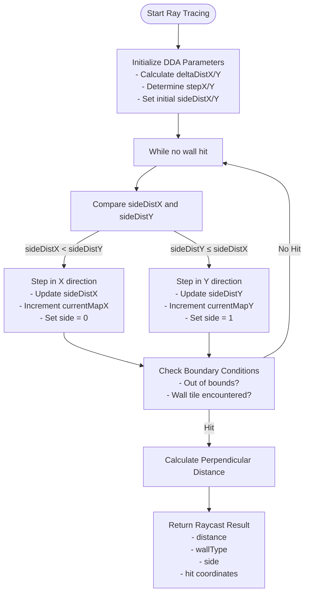
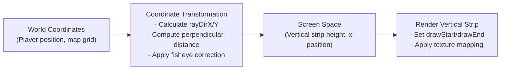
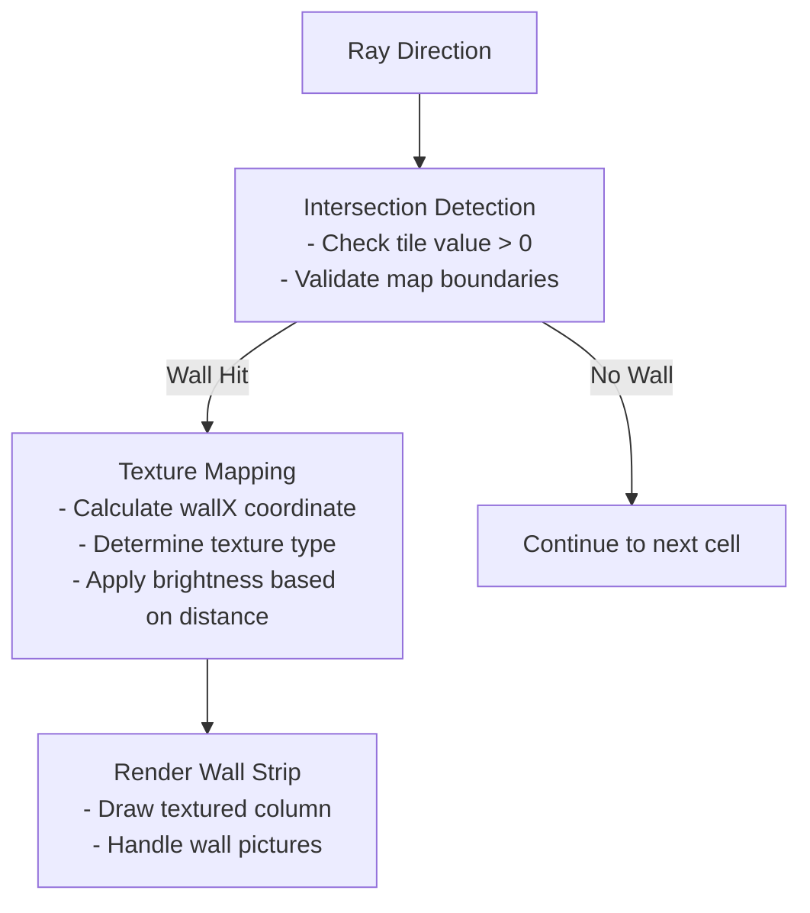
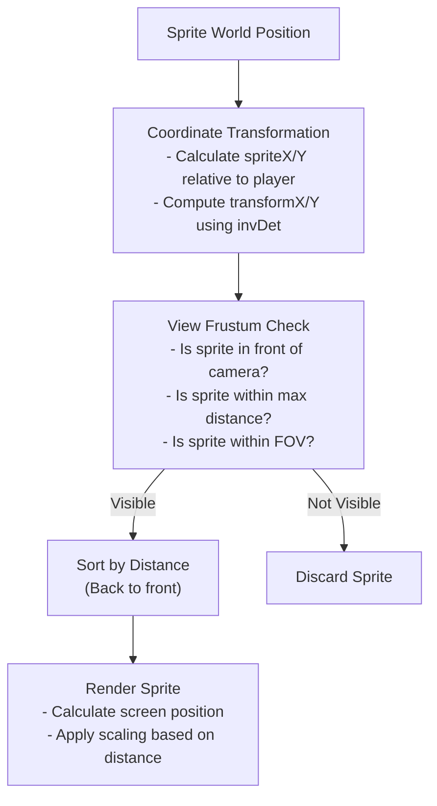
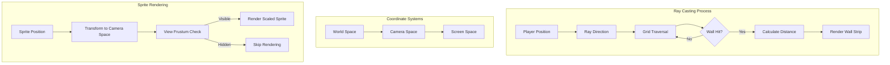

# Raycasting Engine

<cite>
**Referenced Files in This Document**   
- [raycasting.ts](file://src/raycasting.ts)
- [types.ts](file://src/types.ts)
- [App.tsx](file://src/App.tsx)
- [gameEngine.ts](file://src/gameEngine.ts)
</cite>

## Table of Contents
1. [Introduction](#introduction)
2. [DDA Algorithm Implementation](#dda-algorithm-implementation)
3. [Coordinate Transformation and Projection](#coordinate-transformation-and-projection)
4. [Ray-Map Intersection and Wall Rendering](#ray-map-intersection-and-wall-rendering)
5. [Sprite Rendering and View Frustum Culling](#sprite-rendering-and-view-frustum-culling)
6. [Performance Optimizations](#performance-optimizations)
7. [Edge Cases and Common Issues](#edge-cases-and-common-issues)
8. [Visual Diagrams](#visual-diagrams)

## Introduction
The raycasting engine is a core component of the 3D rendering system, responsible for projecting a 2D map into a 3D perspective view. It uses the Digital Differential Analysis (DDA) algorithm to efficiently determine wall intersections and render vertical strips based on perpendicular distance. The engine also handles sprite rendering for enemies, items, and decorative objects, applying coordinate transformations and depth sorting for accurate visual representation.

**Section sources**
- [raycasting.ts](file://src/raycasting.ts#L2-L227)
- [App.tsx](file://src/App.tsx#L502-L502)

## DDA Algorithm Implementation
The DDA (Digital Differential Analysis) algorithm is used to trace rays from the player's position through the game map to determine wall intersections. For each ray, the algorithm calculates the distance to the next vertical and horizontal grid line, stepping through the map until a wall is encountered.

The implementation begins by determining the initial step direction based on the ray's direction vector. If the ray's X component is negative, the step in the X direction is -1; otherwise, it is 1. Similarly, the Y step is determined by the sign of the ray's Y component. The distance to the first vertical and horizontal grid line is calculated using the player's fractional position within the current cell.

**Diagram sources**
- [raycasting.ts](file://src/raycasting.ts#L18-L102)

**Section sources**
- [raycasting.ts](file://src/raycasting.ts#L18-L102)

## Coordinate Transformation and Projection
The engine transforms world coordinates to screen space using camera plane vectors. The player's direction vector and camera plane vector are used to calculate the ray direction for each column of the screen. The transformation from world space to screen space involves calculating the perpendicular distance to walls, which is used to determine the height of vertical strips in the 3D projection.

The perpendicular distance is calculated differently based on whether the ray hits a horizontal or vertical wall. For horizontal wall hits (side = 0), the distance is computed using the X coordinate difference and the ray's X direction. For vertical wall hits (side = 1), the Y coordinate difference and ray's Y direction are used. This perpendicular distance corrects for the fisheye effect, ensuring walls appear at consistent heights regardless of viewing angle.

**Diagram sources**
- [raycasting.ts](file://src/raycasting.ts#L80-L90)
- [App.tsx](file://src/App.tsx#L601-L611)

**Section sources**
- [raycasting.ts](file://src/raycasting.ts#L80-L90)
- [App.tsx](file://src/App.tsx#L601-L611)

## Ray-Map Intersection and Wall Rendering
The ray-map intersection process involves checking for wall collisions as the ray traverses the grid. The algorithm terminates when the ray hits a wall (tile value > 0), goes out of bounds, or reaches the map boundaries. The wall type is determined by the tile value at the intersection point, with different values representing different wall types (e.g., normal walls, doors, exit doors).

Wall rendering uses the calculated perpendicular distance to determine the height of the vertical strip on screen. The strip height is inversely proportional to the distance, creating the perspective effect. The texture coordinate along the wall is calculated using the fractional part of the intersection position, ensuring seamless texture mapping across adjacent walls.

**Diagram sources**
- [raycasting.ts](file://src/raycasting.ts#L92-L102)
- [App.tsx](file://src/App.tsx#L650-L680)

**Section sources**
- [raycasting.ts](file://src/raycasting.ts#L92-L102)
- [App.tsx](file://src/App.tsx#L650-L680)

## Sprite Rendering and View Frustum Culling
Sprite rendering involves transforming the coordinates of enemies, items, and decorative objects from world space to screen space. The transformation uses the inverse of the camera matrix to calculate the sprite's position relative to the player. Sprites are then sorted by distance (back to front) to ensure proper depth ordering during rendering.

View frustum culling is implemented to optimize performance by only rendering sprites that are within the player's field of view. The `isInViewFrustum` function checks if a sprite is in front of the camera, within the maximum render distance, and within the horizontal field of view. This prevents unnecessary rendering calculations for sprites that are not visible.

**Diagram sources**
- [raycasting.ts](file://src/raycasting.ts#L105-L121)
- [raycasting.ts](file://src/raycasting.ts#L123-L227)

**Section sources**
- [raycasting.ts](file://src/raycasting.ts#L105-L227)

## Performance Optimizations
The raycasting engine implements several performance optimizations to maintain smooth rendering at interactive frame rates. Early loop termination is used in the DDA algorithm, stopping ray traversal as soon as a wall is encountered. Boundary checking is optimized by combining multiple conditions in a single if statement, reducing branching overhead.

The sprite rendering system uses view frustum culling to avoid processing sprites that are not visible. The `isInViewFrustum` function performs three quick checks: whether the sprite is behind the camera, too far away, or outside the horizontal field of view. This eliminates unnecessary transformation calculations for off-screen sprites.

Additional optimizations include:
- Using integer arithmetic where possible
- Minimizing function calls within tight loops
- Caching frequently accessed values
- Using efficient data structures for sprite management

**Section sources**
- [raycasting.ts](file://src/raycasting.ts#L105-L121)
- [raycasting.ts](file://src/raycasting.ts#L123-L227)

## Edge Cases and Common Issues
Several edge cases are addressed in the raycasting implementation. Boundary conditions are carefully handled to prevent array index out of bounds errors when rays approach the map edges. The algorithm checks both coordinate bounds and tile values in a single condition to ensure robustness.

Fisheye distortion is corrected by using the perpendicular distance rather than the Euclidean distance when calculating wall heights. This ensures that walls appear straight and parallel rather than curved. The perpendicular distance is calculated differently for horizontal and vertical wall hits to maintain accuracy.

Common issues and their solutions include:
- **Wall texture seams**: Solved by using consistent texture coordinate calculation based on fractional intersection positions
- **Sprite flickering**: Addressed by proper depth sorting and distance-based scaling
- **Ray leaks at corners**: Prevented by thorough boundary checking and proper grid traversal
- **Performance drops with many sprites**: Mitigated by view frustum culling and efficient sorting

**Section sources**
- [raycasting.ts](file://src/raycasting.ts#L70-L75)
- [raycasting.ts](file://src/raycasting.ts#L80-L90)

## Visual Diagrams
The following diagrams illustrate key aspects of the raycasting engine's operation.

**Diagram sources**
- [raycasting.ts](file://src/raycasting.ts#L18-L102)
- [raycasting.ts](file://src/raycasting.ts#L123-L227)