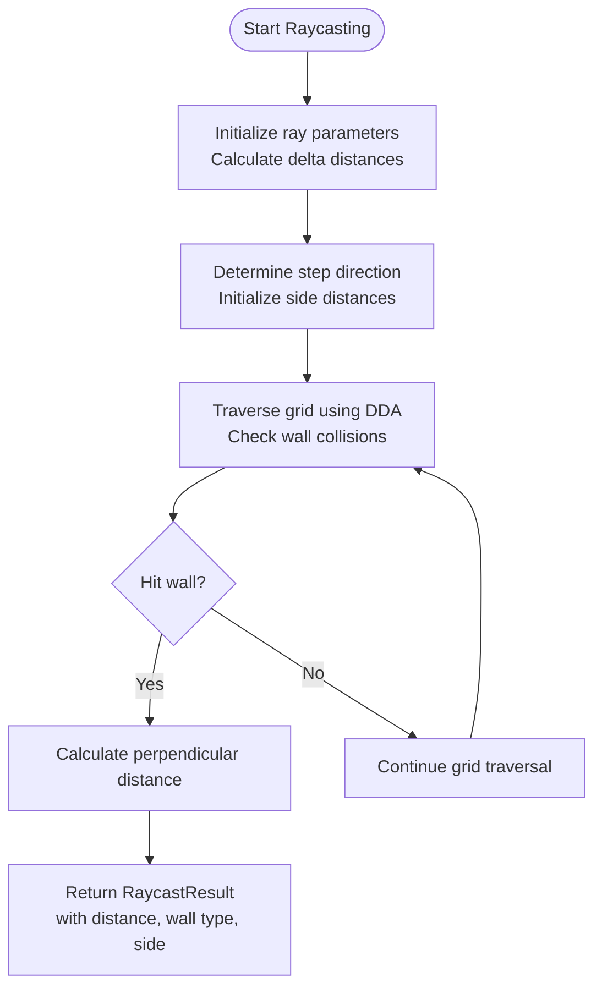
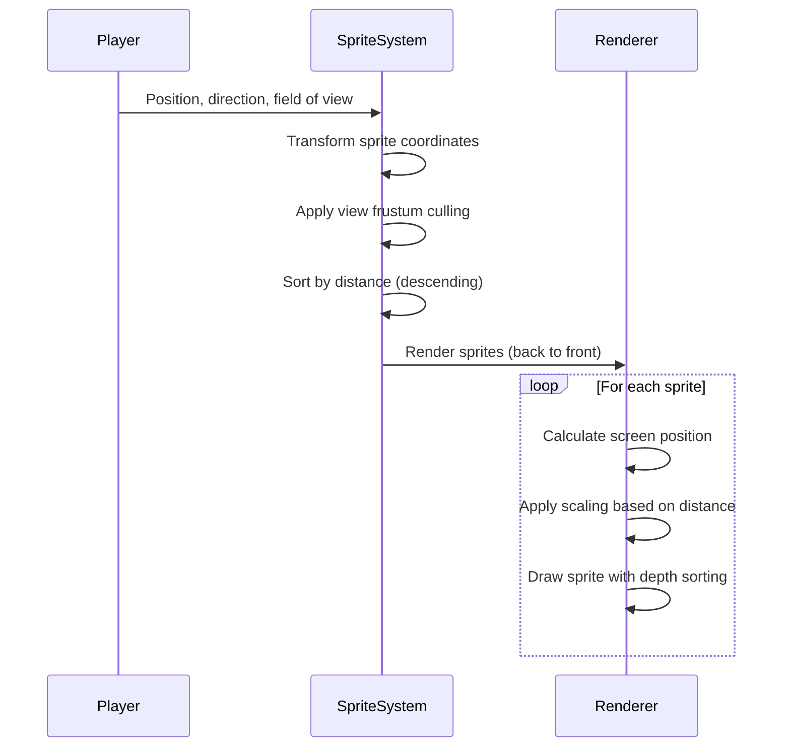
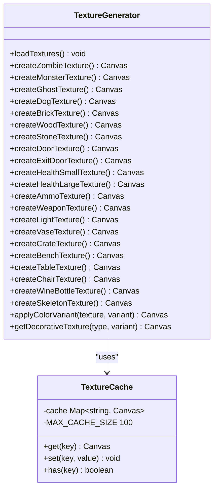
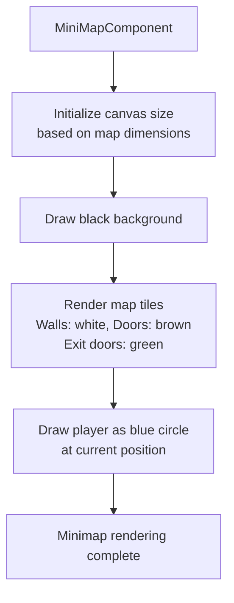

# Rendering System

<cite>
**Referenced Files in This Document**   
- [raycasting.ts](file://src/raycasting.ts)
- [textures.ts](file://src/textures.ts)
- [MiniMap.tsx](file://src/MiniMap.tsx)
- [types.ts](file://src/types.ts)
- [gameEngine.ts](file://src/gameEngine.ts)
- [App.css](file://src/App.css) - *Updated in recent commit*
</cite>

## Update Summary
**Changes Made**   
- Added new section on Health Bar UI Component to document the newly designed health bar
- Updated document sources to include App.css which contains the new health bar styles
- Maintained all existing sections about the 3D rendering engine functionality
- Added annotations to indicate updated files in the referenced files list

## Table of Contents
1. [Raycasting Algorithm with DDA Method](#raycasting-algorithm-with-dda-method)
2. [3D Projection and Coordinate Transformations](#3d-projection-and-coordinate-transformations)
3. [Sprite Rendering System](#sprite-rendering-system)
4. [Procedural Texture Generation](#procedural-texture-generation)
5. [Minimap Implementation](#minimap-implementation)
6. [Optimization Techniques](#optimization-techniques)
7. [Health Bar UI Component](#health-bar-ui-component)

## Raycasting Algorithm with DDA Method

The 3D rendering engine implements a raycasting algorithm using the Digital Differential Analysis (DDA) method for efficient wall rendering. This approach calculates intersections between rays and walls in the game world to determine wall distances and textures for each vertical column on the screen.

The `castRay` function in `raycasting.ts` performs the core DDA algorithm. It begins by determining the current map grid position of the player and calculating the delta distances for X and Y directions based on the ray direction vector. The algorithm then steps through the grid, incrementing either horizontally or vertically depending on which side distance is smaller, until it hits a wall or boundary.

Key components of the DDA implementation include:
- **Step calculation**: Determines whether to move in the positive or negative direction based on the ray direction
- **Side distance initialization**: Calculates the initial distance to the next X and Y grid lines
- **Grid traversal**: Efficiently steps through the grid until a wall is encountered
- **Perpendicular distance calculation**: Computes the true distance to the wall to prevent fisheye effect

The algorithm returns a `RaycastResult` interface containing the distance to the wall, wall type, side of collision (horizontal or vertical), and hit coordinates. This information is used to determine wall height, texture mapping, and shading in the final rendering.



**Diagram sources**
- [raycasting.ts](file://src/raycasting.ts#L18-L102)

**Section sources**
- [raycasting.ts](file://src/raycasting.ts#L2-L102)
- [types.ts](file://src/types.ts#L116-L116)

## 3D Projection and Coordinate Transformations

The rendering engine creates a first-person perspective through mathematical transformations that convert 3D world coordinates to 2D screen coordinates. The projection system uses standard raycasting principles to simulate depth and perspective.

For each vertical column on the screen, a ray is cast from the player's position in the direction of the viewing plane. The distance to the wall intersection, calculated by the DDA algorithm, is used to determine the height of the wall slice on the screen. The wall height is inversely proportional to the distance, creating the illusion of depth.

The coordinate transformation process involves:
- **Camera plane calculation**: Establishes the viewing plane perpendicular to the player's direction
- **Ray direction computation**: Calculates the direction vector for each ray based on the field of view
- **Perspective projection**: Converts 3D distances to 2D heights using the formula: wallHeight = screenHeight / distance
- **Texture coordinate mapping**: Maps texture pixels to wall slices based on the hit position

The engine also handles vertical positioning of wall slices on the screen, accounting for the player's height and any vertical movement (such as jumping). This creates a convincing first-person perspective where walls appear to recede into the distance.

**Section sources**
- [raycasting.ts](file://src/raycasting.ts#L18-L102)
- [gameEngine.ts](file://src/gameEngine.ts#L500-L550)

## Sprite Rendering System

The sprite rendering system handles enemies, items, and decorative objects with proper depth sorting and visibility culling. The system transforms 3D world coordinates of sprites into 2D screen coordinates relative to the camera, then sorts them by distance for correct rendering order.

The `getSpritesToRender` function in `raycasting.ts` implements the sprite rendering pipeline. It takes the player's position and direction along with lists of enemies, items, and decorative objects, then performs the following steps:

1. **Coordinate transformation**: Converts world coordinates to camera space using inverse matrix transformation
2. **View frustum culling**: Eliminates sprites that are behind the camera or outside the field of view
3. **Distance-based sorting**: Sorts sprites by distance from the camera (furthest first)
4. **Rendering preparation**: Returns a list of sprites ready for rendering with their screen coordinates

The system uses an optimized view frustum check implemented in the `isInViewFrustum` function, which quickly eliminates sprites that are:
- Behind the camera (transformY ≤ 0)
- Too far away (beyond maximum render distance)
- Outside the horizontal field of view

Sprites are rendered in back-to-front order to ensure proper depth sorting, with transparency and overlapping handled correctly. The rendering order prioritizes decorative objects, followed by enemies, and then items.



**Diagram sources**
- [raycasting.ts](file://src/raycasting.ts#L105-L121)
- [raycasting.ts](file://src/raycasting.ts#L123-L227)

**Section sources**
- [raycasting.ts](file://src/raycasting.ts#L105-L227)
- [types.ts](file://src/types.ts#L127-L128)

## Procedural Texture Generation

The rendering engine features a comprehensive procedural texture generation system that creates all wall, floor, and object textures algorithmically without relying on image files. Textures are generated at startup using the Canvas 2D API and stored in memory for efficient reuse during gameplay.

The texture system is implemented in `textures.ts` and includes several key components:

### Texture Types and Organization
- **Enemy textures**: 64x64 pixel textures for zombies, monsters, ghosts, and dogs
- **Wall textures**: 32x32 pixel textures for brick, wood, stone, and doors
- **Item textures**: 32x32 pixel textures for health packs, ammo, treasure, and weapons
- **Decorative object textures**: 64x64 pixel textures for vases, crates, benches, tables, chairs, wine bottles, skeletons, and ceiling lights

### Generation Techniques
The system employs various Canvas 2D techniques to create detailed textures:
- **Linear gradients**: Used for color transitions on clothing, skin, and surfaces
- **Radial gradients**: Creates glowing effects for eyes, lights, and magical elements
- **Pattern drawing**: Generates repeating patterns like brick layouts and wood grain
- **Shape composition**: Combines rectangles, circles, and custom paths to form complex objects
- **Color modulation**: Applies HSL-based color shifts to create variants of the same texture

### Specific Texture Examples
- **Zombie texture**: Features detailed facial features, wounds, and recognizable hands with five fingers
- **Monster texture**: Includes muscular structure with shading, detailed horns with metallic highlights, and glowing red-yellow eyes
- **Ghost texture**: Uses multiple transparency layers with ethereal, wispy edges and glowing eyes
- **Brick wall**: Creates realistic brick patterns with offset rows and mortar lines
- **Door texture**: Implements detailed wood grain with paneling, metal hinges, and a golden handle with 3D effects

The system also includes a caching mechanism for color variants, optimizing performance by storing generated variants and limiting cache size to prevent memory issues.



**Diagram sources**
- [textures.ts](file://src/textures.ts#L50-L184)
- [textures.ts](file://src/textures.ts#L1018-L1048)
- [textures.ts](file://src/textures.ts#L1368-L1424)
- [textures.ts](file://src/textures.ts#L1109-L1236)

**Section sources**
- [textures.ts](file://src/textures.ts#L12-L48)
- [textures.ts](file://src/textures.ts#L50-L2612)

## Minimap Implementation

The minimap provides an overhead view of the game environment, synchronized with the main 3D view to aid player orientation. Implemented in `MiniMap.tsx`, the minimap renders a top-down representation of the current level, showing walls, doors, and the player's position.

The minimap system works by:
- **Canvas setup**: Creating a canvas element sized according to the map dimensions and tile size
- **Background rendering**: Drawing a black background for the minimap
- **Tile rendering**: Iterating through the map tiles and drawing walls and doors with appropriate colors
- **Player rendering**: Drawing the player as a blue circle at their current position

Key features of the minimap implementation include:
- **Real-time synchronization**: The minimap updates whenever the player moves or the game state changes
- **Color coding**: Different tile types are represented by distinct colors (white for walls, brown for doors, green for exit doors)
- **Player indicator**: A blue circle shows the player's position with no directional indicator
- **Dynamic sizing**: The canvas size adjusts based on the map dimensions and predefined tile size

The minimap is integrated into the game UI as a React component that receives the game state as a prop, ensuring it stays synchronized with the main game view. The component uses React's useEffect hook to redraw the minimap whenever relevant state changes occur.



**Diagram sources**
- [MiniMap.tsx](file://src/MiniMap.tsx#L11-L77)

**Section sources**
- [MiniMap.tsx](file://src/MiniMap.tsx#L4-L77)
- [types.ts](file://src/types.ts#L144-L152)

## Optimization Techniques

The rendering engine incorporates several optimization techniques to maintain high performance while delivering a rich visual experience.

### View Frustum Culling
The engine implements efficient view frustum culling to avoid rendering sprites that are not visible to the player. The `isInViewFrustum` function in `raycasting.ts` performs three quick checks:
- **Backface culling**: Eliminates sprites behind the camera (transformY ≤ 0)
- **Distance culling**: Removes sprites beyond a maximum render distance (default 20 units)
- **Horizontal FOV culling**: Filters out sprites outside the horizontal field of view using the condition: |transformX| > transformY * 1.5

This optimization significantly reduces the number of sprites that need to be transformed and rendered each frame.

### Efficient Canvas Rendering
The engine uses several canvas-specific optimizations:
- **Texture caching**: All procedural textures are generated once at startup and reused throughout gameplay
- **Gradient reuse**: Complex gradients are created once and applied multiple times
- **Batched operations**: Related drawing operations are grouped to minimize context switches
- **Size optimization**: Textures use the minimum necessary resolution (64x64 for characters, 32x32 for walls)

### Memory Management
The texture system includes a cache with a maximum size of 100 entries to prevent excessive memory usage while still benefiting from texture reuse. When the cache reaches its limit, the oldest entries are removed using a first-in-first-out strategy.

### Collision Optimization
For decorative objects, the engine implements an optimized collision detection system that:
- Uses squared distance calculations to avoid expensive square root operations
- Implements early exit conditions to skip distant objects
- Only calculates exact distances for objects within a reasonable proximity threshold

These optimizations ensure smooth gameplay even on lower-end devices while maintaining the visual quality of the 3D environment.

**Section sources**
- [raycasting.ts](file://src/raycasting.ts#L105-L121)
- [textures.ts](file://src/textures.ts#L800-L850)
- [gameEngine.ts](file://src/gameEngine.ts#L100-L150)

## Health Bar UI Component

The health bar UI component provides visual feedback of the player's current health status. Implemented in `App.css`, the health bar consists of a container element with a fill element that dynamically adjusts its width based on the player's health percentage.

The health bar features:
- **Gradient styling**: Uses a linear gradient from dark red to bright red to create a vibrant visual effect
- **Smooth transitions**: Implements CSS transitions for the width property to create smooth animations when health changes
- **Layered design**: Composed of two elements - a background container with border and a fill element that represents current health
- **Responsive sizing**: Fixed width of 150px and height of 20px with proper spacing within the HUD layout

The component is integrated into the game's HUD system and updates in real-time as the player takes damage or collects health items. The visual design emphasizes the player's health status with high contrast against the dark background of the game interface.

```css
.health-bar {
  width: 150px;
  height: 20px;
  background: rgba(255, 255, 255, 0.2);
  border: 2px solid rgba(255, 255, 255, 0.5);
  border-radius: 2px;
  overflow: hidden;
  margin: 5px 0;
}

.health-bar-fill {
  height: 100%;
  background: linear-gradient(90deg, #ff4444, #ff6666, #ff8888);
  transition: width 0.3s ease;
  border-radius: 2px;
}
```

**Section sources**
- [App.css](file://src/App.css#L100-L115) - *Updated in commit 84658facfda7621774d7521e3ad767f225b875db*