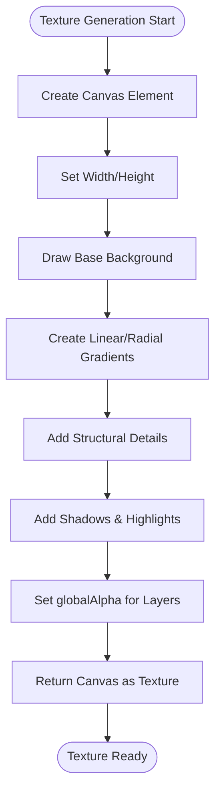
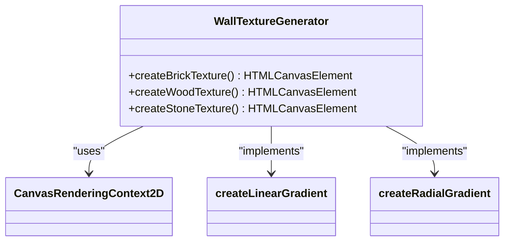
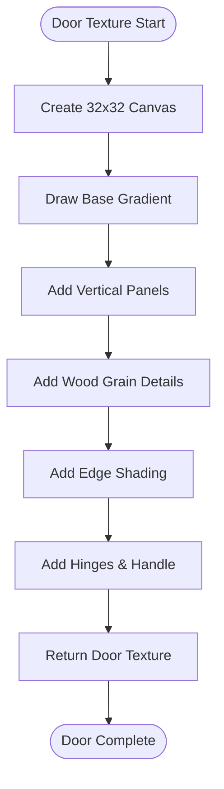
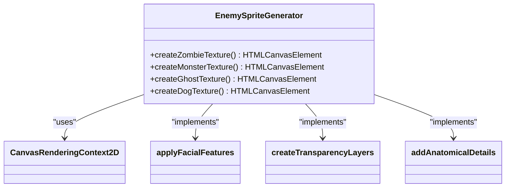
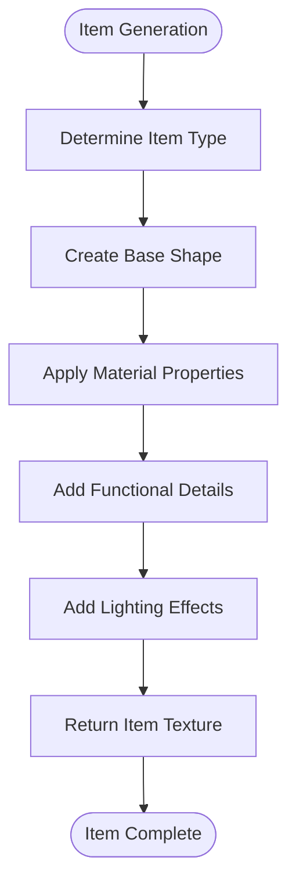
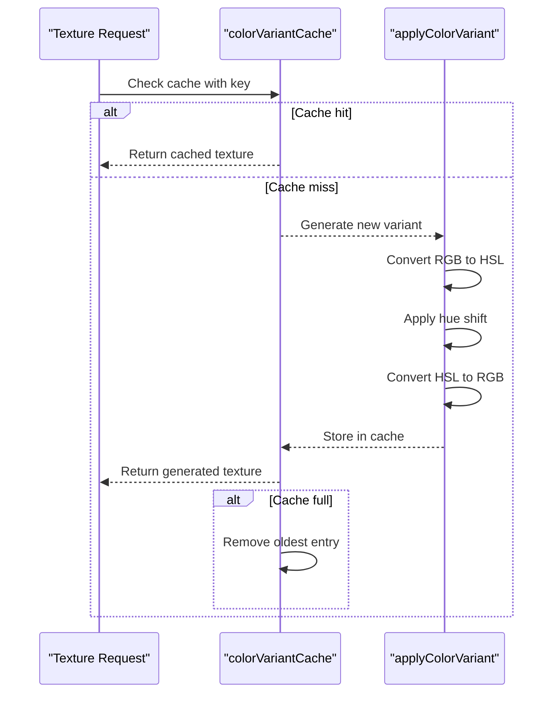
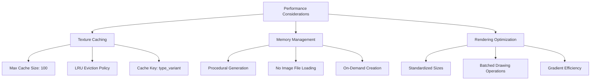

# Texture Management

<cite>
**Referenced Files in This Document**   
- [src/textures.ts](file://src/textures.ts)
- [src/App.tsx](file://src/App.tsx)
- [src/textureQualityCheck.ts](file://src/textureQualityCheck.ts)
</cite>

## Table of Contents
1. [Introduction](#introduction)
2. [Procedural Texture Generation System](#procedural-texture-generation-system)
3. [Wall Textures](#wall-textures)
4. [Door Textures](#door-textures)
5. [Enemy Sprites](#enemy-sprites)
6. [Items and Decorative Objects](#items-and-decorative-objects)
7. [Color Variant System](#color-variant-system)
8. [Performance Considerations](#performance-considerations)
9. [Conclusion](#conclusion)

## Introduction

The texture management system in this project implements a fully procedural approach to visual asset generation, eliminating the need for external image files. All textures are algorithmically created using the HTML Canvas API, enabling dynamic generation of wall surfaces, enemy sprites, items, and decorative objects. This approach provides significant advantages in terms of file size reduction, dynamic variation, and runtime customization. The system leverages advanced Canvas features including radial and linear gradients for depth effects, alpha transparency for layered visuals, and HSL-based color shifting for variant generation. A sophisticated caching mechanism ensures optimal performance while maintaining visual richness across the game environment.

**Section sources**
- [src/textures.ts](file://src/textures.ts#L0-L2613)

## Procedural Texture Generation System

The core of the texture system lies in its procedural generation methodology, which creates all visual assets programmatically through JavaScript drawing commands on HTML Canvas elements. This eliminates dependencies on external image files and enables dynamic texture creation at runtime. The system follows a structured approach where each texture type has a dedicated creation function that builds the visual representation through a sequence of Canvas API calls.

The generation process begins with canvas initialization, where each texture is assigned appropriate dimensions based on its type—64x64 pixels for enemy sprites and 32x32 pixels for wall textures and items. The drawing process follows a layered approach, starting with background elements and progressively adding details. This methodical construction allows for complex visual compositions while maintaining code readability and maintainability.

**Diagram sources**
- [src/textures.ts](file://src/textures.ts#L50-L2613)

**Section sources**
- [src/textures.ts](file://src/textures.ts#L0-L2613)

## Wall Textures

The wall texture system generates three distinct surface types—brick, wood, and stone—entirely through procedural drawing commands. Each texture type employs specific patterns and color schemes to create realistic surface appearances without image assets.

The brick texture uses a mortar background filled with a saddle brown color (#8B4513), upon which light gray (#D3D3D3) bricks are arranged in alternating rows to simulate real masonry patterns. Vertical seams between bricks are accentuated with a sienna color (#A0522D) to enhance the 3D effect. The wood texture features vertical planks in a medium brown (#654321) with dark gray (#4A4A4A) gaps between them, simulating wooden paneling. Horizontal wood grain lines in a darker brown (#5D4037) add texture detail across the surface. The stone texture creates a more organic appearance with four large stone blocks in varying shades of gray, each with shadowed edges to emphasize their individual forms.

**Diagram sources**
- [src/textures.ts](file://src/textures.ts#L1018-L1080)

**Section sources**
- [src/textures.ts](file://src/textures.ts#L1018-L1080)

## Door Textures

The door texture system implements two primary variants—standard doors and exit doors—both created with detailed procedural drawing techniques. The standard door features a rich wooden appearance with a linear gradient from dark brown (#654321) to very dark brown (#4A2A0A), creating depth through lighting effects. The surface is divided into four vertical panels with detailed wood grain patterns, each enhanced with shadows and highlights to create a 3D effect. Metal hinges and a golden door handle with radial gradient effects complete the realistic appearance.

The exit door follows a similar structural approach but with a green color scheme to distinguish it functionally. It uses a lime green (#32CD32) to dark green (#006400) gradient for the main surface, maintaining the same panel structure as the standard door. The key distinguishing feature is a prominent gold "X" symbol in the center, rendered with multiple layers including a glow effect, thick gold lines, and a dark outline to ensure high visibility against the green background.

**Diagram sources**
- [src/textures.ts](file://src/textures.ts#L1109-L1236)

**Section sources**
- [src/textures.ts](file://src/textures.ts#L1109-L1236)

## Enemy Sprites

Enemy sprites are procedurally generated with high visual complexity, featuring detailed anatomical structures, facial features, and thematic elements that define each enemy type. The system creates distinct visual identities for zombies, monsters, ghosts, and dogs through carefully crafted drawing sequences.

The zombie sprite features a decaying humanoid form with greenish skin tones ranging from seagreen (#2E8B57) to medium seagreen (#3CB371). Key visual elements include visible wounds in dark red (#5A0000), tattered clothing with blood stains, and distinctive facial features such as glowing yellow eyes with radial gradients from yellow (#FFFF00) to dark orange (#FF8C00). The hands are detailed with five clearly defined fingers on each hand, enhancing the creature's humanoid appearance.

The monster sprite presents a more muscular and aggressive form with crimson (#DC143C) to dark red (#5A0000) coloration. Its most distinctive features are the 3D horns with silver-to-dark gray linear gradients and glowing red-yellow eyes with multiple layers including an outer glow, middle red layer, and inner yellow core. The open mouth reveals 8 visible fangs arranged in upper and lower rows.

The ghost sprite utilizes transparency effects through multiple layers of alpha blending to create an ethereal appearance. The outer mist layer uses a 70% alpha with a radial gradient from light cyan (#E0FFFF) to sky blue (#87CEEB), while inner layers progressively increase in opacity to create a glowing core. The eyes feature hollow black circles with inner glows in light cyan, creating a haunting effect.

**Diagram sources**
- [src/textures.ts](file://src/textures.ts#L50-L611)

**Section sources**
- [src/textures.ts](file://src/textures.ts#L50-L611)

## Items and Decorative Objects

The system generates a variety of items and decorative objects, each with distinctive visual characteristics created through procedural drawing. Health packs are rendered as 3D medical kits with red plastic bodies and white crosses, using gradients to simulate plastic highlights and shadows. The small health pack uses thinner cross bars, while the large version features thicker bars and additional metallic clasps in silver with white highlights.

Treasure items appear as ornate golden chalices with multiple decorative elements including a gemstone in the center of the base and a blue gem on the cup. The rendering uses radial gradients to create metallic shine effects, with multiple highlight points to simulate light reflection on curved surfaces. Ammunition boxes are designed as military-style crates with olive green coloring, black straps, and visible bullet tips in gold.

Decorative objects include environmental elements such as ceiling lights, vases, crates, benches, tables, chairs, wine bottles, and skeletons. Each object uses appropriate gradients and structural details to convey its material properties—wood grain for furniture, glass transparency effects for bottles, and bone-white coloring for skeletons. The ceiling light features a radial gradient from bright yellow to transparent, simulating a glowing effect.

**Diagram sources**
- [src/textures.ts](file://src/textures.ts#L613-L1016)

**Section sources**
- [src/textures.ts](file://src/textures.ts#L613-L1016)

## Color Variant System

The color variant system implements HSL-based hue shifting to generate different appearances from base textures, allowing for visual diversity without additional asset creation. The system works by converting RGB color values to HSL (Hue, Saturation, Lightness) space, applying a hue shift based on a variant parameter, and converting back to RGB.

The `applyColorVariant` function takes a base texture and a color variant value between 0 and 1, where 0.5 represents the neutral (original) color. Values below 0.5 shift toward cooler tones while values above 0.5 shift toward warmer tones, with a maximum shift of ±30 degrees in the hue spectrum. This creates a natural color progression that maintains the original texture's visual integrity while producing distinct variations.

A critical optimization in this system is the texture caching mechanism, which prevents redundant computation of color variants. The `colorVariantCache` uses a Map to store generated variants, with cache keys combining the object type and color variant value. The cache has a maximum size of 100 entries, with a least-recently-used eviction policy that removes the oldest entry when the limit is exceeded. This ensures memory efficiency while maintaining performance benefits from caching.

**Diagram sources**
- [src/textures.ts](file://src/textures.ts#L889-L976)

**Section sources**
- [src/textures.ts](file://src/textures.ts#L889-L976)

## Performance Considerations

The texture system incorporates several performance optimizations to ensure smooth gameplay while maintaining visual quality. The most significant optimization is the texture caching mechanism, which limits memory usage to a maximum of 100 cached color variants. When this limit is reached, the system automatically removes the oldest entry using the Map's iteration order, implementing a simple but effective least-recently-used (LRU) eviction policy.

Memory management is further enhanced by the procedural generation approach, which eliminates the need to load large image files into memory. Instead, textures are generated on-demand and can be recreated as needed, reducing the initial memory footprint. The system also leverages the Canvas API's efficient drawing operations, using batched operations where possible to minimize rendering overhead.

The texture quality assurance system verifies that all textures meet performance requirements, confirming that enemy textures use 64x64 canvases, item textures use 32x32 canvases, and wall textures use 32x32 canvases. This standardization ensures consistent memory usage and rendering performance across all texture types. The system also confirms that all textures implement gradients and shading effects, ensuring visual quality without additional resource costs.

**Diagram sources**
- [src/textures.ts](file://src/textures.ts#L9-L10)
- [src/textureQualityCheck.ts](file://src/textureQualityCheck.ts#L0-L42)

**Section sources**
- [src/textures.ts](file://src/textures.ts#L9-L10)
- [src/textureQualityCheck.ts](file://src/textureQualityCheck.ts#L0-L42)

## Conclusion

The procedural texture generation system represents a sophisticated approach to visual asset management, leveraging the HTML Canvas API to create rich, detailed textures entirely through code. By eliminating reliance on external image files, the system achieves significant advantages in terms of file size, memory efficiency, and visual flexibility. The implementation of gradient effects, alpha transparency layers, and HSL-based color shifting enables the creation of visually complex sprites and surfaces with minimal resource overhead.

The architecture balances visual quality with performance through careful optimization, particularly in the color variant caching system that prevents redundant computation while limiting memory usage. This approach allows for dynamic visual variation across the game environment without compromising performance. The systematic organization of texture generation functions, combined with comprehensive quality assurance checks, ensures consistency and reliability across all visual elements in the game.

Future enhancements could include additional procedural effects such as noise patterns for more organic textures, animation support for dynamic texture changes, and adaptive resolution scaling based on device capabilities. However, the current implementation already provides a robust foundation for a visually rich gaming experience with optimal performance characteristics.