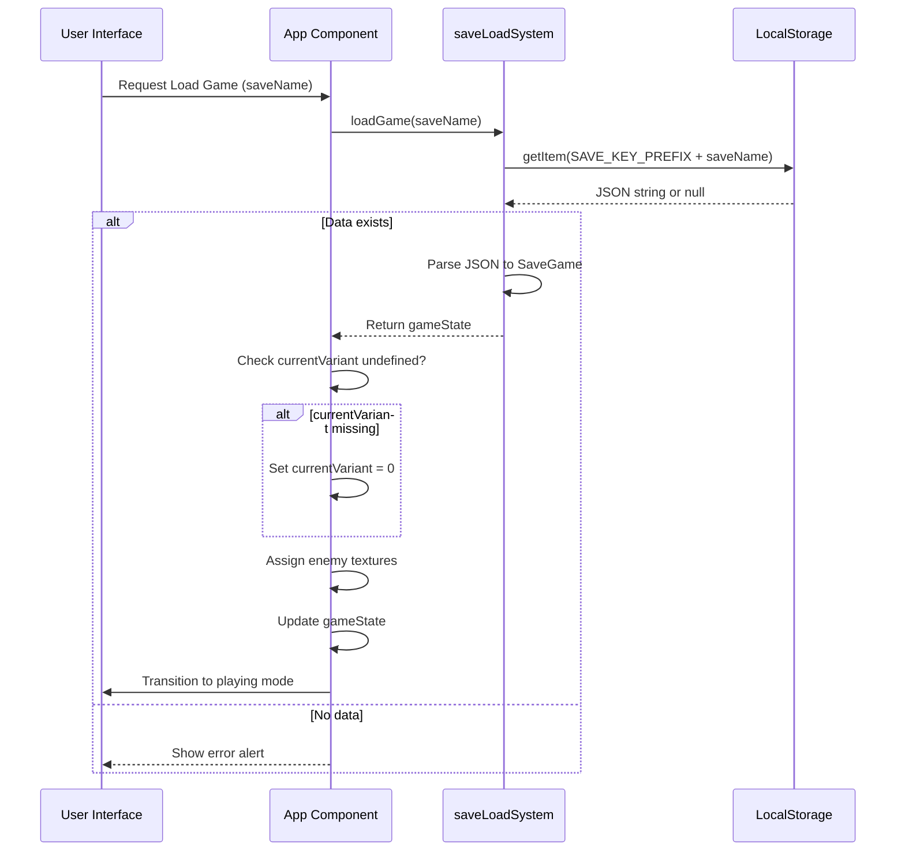
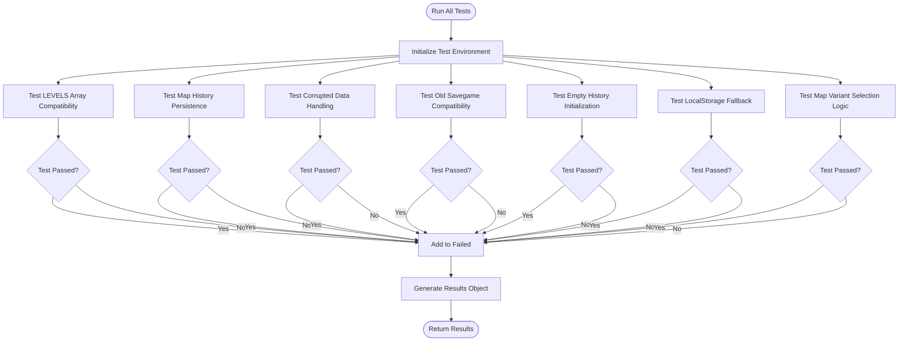
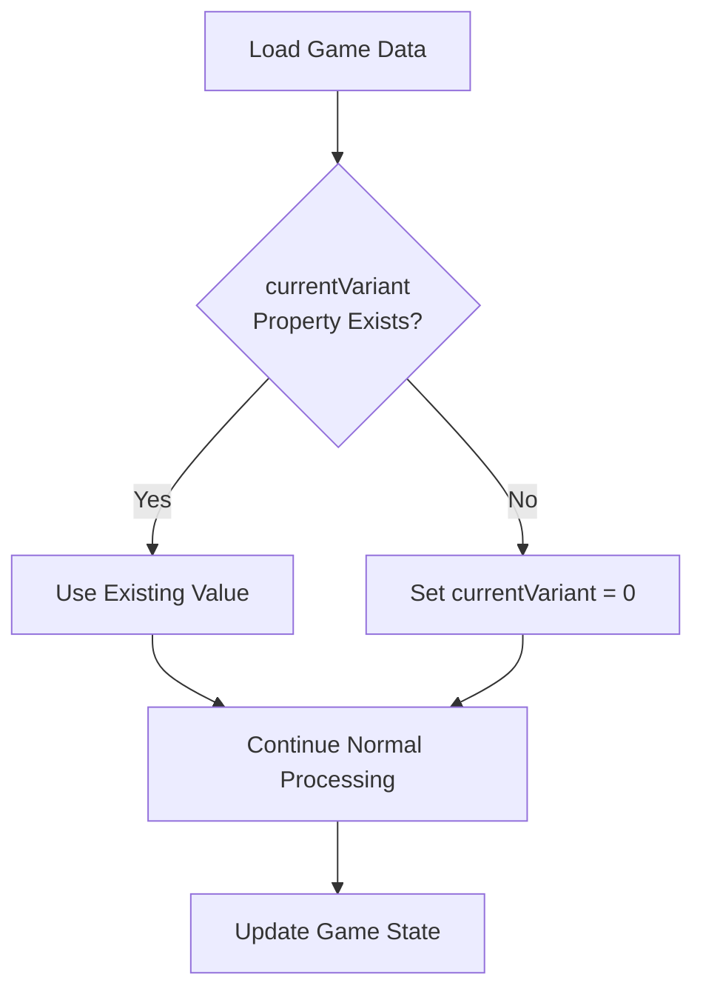

# Backward Compatibility

<cite>
**Referenced Files in This Document**   
- [App.tsx](file://src/App.tsx)
- [backwardCompatibilityTests.ts](file://src/backwardCompatibilityTests.ts)
- [saveLoadSystem.ts](file://src/saveLoadSystem.ts)
- [types.ts](file://src/types.ts)
</cite>

## Table of Contents
1. [Introduction](#introduction)
2. [Migration System for Save Data](#migration-system-for-save-data)
3. [Backward Compatibility Test Suite](#backward-compatibility-test-suite)
4. [Data Fallback and Default Value Strategy](#data-fallback-and-default-value-strategy)
5. [Version Migration Strategies](#version-migration-strategies)
6. [Introducing New Features Without Breaking Saves](#introducing-new-features-without-breaking-saves)
7. [Conclusion](#conclusion)

## Introduction
This document details the backward compatibility system implemented in the Egor game application, focusing on the preservation of user save data across different versions of the software. The system ensures that players can continue their progress even after updates that introduce new features or modify existing data structures. The implementation centers around a migration mechanism in the `handleLoadGame` function, a comprehensive test suite in `backwardCompatibilityTests.ts`, and robust error handling for edge cases such as corrupted data or unavailable storage.

## Migration System for Save Data

The migration system handles older save formats by detecting missing properties and applying appropriate defaults. The primary example is the addition of the `currentVariant` property to the `GameState` interface, which tracks which variant of a level the player is currently experiencing.

When loading a game, the system checks if the `currentVariant` property exists in the loaded state. If it is undefined (indicating an older save format), the property is automatically set to 0, representing the first variant of the level. This approach allows new functionality to be added without invalidating existing player progress.

The migration occurs in the `handleLoadGame` function, which orchestrates the loading process and applies necessary transformations to ensure compatibility with the current version of the game state structure.



**Diagram sources**
- [App.tsx](file://src/App.tsx#L99-L113)
- [saveLoadSystem.ts](file://src/saveLoadSystem.ts#L20-L33)

**Section sources**
- [App.tsx](file://src/App.tsx#L99-L113)

## Backward Compatibility Test Suite

The system includes a comprehensive test suite in `backwardCompatibilityTests.ts` that validates compatibility across various scenarios. The test suite covers seven critical areas:

1. **LEVELS Array Compatibility**: Ensures legacy code using the LEVELS array still functions
2. **Map History Persistence**: Verifies that map history is correctly saved and restored
3. **Corrupted Data Handling**: Tests graceful degradation with invalid or malformed data
4. **Old Savegame Compatibility**: Confirms that savegames without newer properties still work
5. **Empty History Initialization**: Validates proper handling of first-time users
6. **LocalStorage Fallback**: Tests in-memory storage when LocalStorage is unavailable
7. **Map Variant Selection Logic**: Ensures correct algorithm for selecting level variants

The test suite uses `runAllBackwardCompatibilityTests` to execute all individual tests and report aggregate results. Each test follows a pattern of setup, execution, validation, and cleanup, ensuring isolated and reliable results.



**Diagram sources**
- [backwardCompatibilityTests.ts](file://src/backwardCompatibilityTests.ts#L478-L502)

**Section sources**
- [backwardCompatibilityTests.ts](file://src/backwardCompatibilityTests.ts#L1-L503)

## Data Fallback and Default Value Strategy

The system employs a robust strategy for handling missing or invalid data by falling back to sensible default values. This approach ensures that the game remains playable even when encountering incomplete or corrupted save data.

For the `currentVariant` property specifically, the fallback value of 0 represents the first variant of a level, which is the most conservative choice that maintains gameplay integrity. The system checks for undefined values rather than using truthy/falsy checks, preventing valid values like 0 from being incorrectly treated as missing.

The fallback mechanism is implemented directly in the game loading flow, making it an integral part of the normal execution path rather than a special error case. This design choice ensures that the migration logic is consistently applied and tested alongside regular functionality.



**Diagram sources**
- [App.tsx](file://src/App.tsx#L102-L105)

**Section sources**
- [App.tsx](file://src/App.tsx#L99-L113)
- [types.ts](file://src/types.ts#L146)

## Version Migration Strategies

The system implements several version migration strategies to handle evolving data formats:

1. **Incremental Property Addition**: New properties are added as optional fields in the `GameState` interface, allowing older saves to remain valid
2. **Runtime Migration**: Migration logic is executed at load time rather than during save operations, minimizing the risk of data corruption
3. **Non-Destructive Updates**: The original save data remains unchanged; migrations are applied to the in-memory representation
4. **Type-Safe Transitions**: TypeScript interfaces ensure that migrations maintain type consistency
5. **Graceful Degradation**: When data cannot be recovered, the system falls back to defaults rather than failing completely

The migration system is designed to be extensible, allowing new migration steps to be added as future versions introduce additional properties or modify existing structures.

```mermaid
classDiagram
class GameState {
+player : Player
+currentLevel : number
+currentVariant? : number
+difficulty : Difficulty
+isPaused : boolean
+isGameOver : boolean
+enemies : Enemy[]
+items : Item[]
+currentMap : GameMap
+gameStartTime : number
+lastItemNotification? : {message : string, timestamp : number}
+allEnemiesDefeatedNotification? : {message : string, timestamp : number}
}
class SaveGame {
+name : string
+timestamp : number
+gameState : GameState
}
class SaveLoadSystem {
+saveGame(gameState : GameState, saveName : string) : boolean
+loadGame(saveName : string) : GameState | null
+getAllSaveGames() : SaveGame[]
+deleteSaveGame(saveName : string) : boolean
}
SaveLoadSystem --> GameState : "serializes/deserializes"
SaveLoadSystem --> SaveGame : "creates/reads"
GameState --> Player : "contains"
GameState --> GameMap : "contains"
```

**Diagram sources**
- [types.ts](file://src/types.ts#L143-L162)
- [saveLoadSystem.ts](file://src/saveLoadSystem.ts#L4-L33)

**Section sources**
- [types.ts](file://src/types.ts#L143-L162)
- [saveLoadSystem.ts](file://src/saveLoadSystem.ts#L4-L33)

## Introducing New Features Without Breaking Saves

The architecture enables the introduction of new features without breaking existing saves through several key principles:

1. **Optional Properties**: New features are represented as optional properties in interfaces, ensuring backward compatibility
2. **Defensive Loading**: The loading process anticipates missing data and provides defaults
3. **Comprehensive Testing**: The backward compatibility test suite validates that new changes don't break existing functionality
4. **Isolated Migration Logic**: Migration code is contained in specific, well-defined locations
5. **Storage Abstraction**: The save/load system abstracts away the storage mechanism, allowing for fallback strategies

When introducing the `currentVariant` feature, the team followed this pattern by making the property optional in the `GameState` interface and adding migration logic in the `handleLoadGame` function. This approach allowed the new feature to enhance gameplay (by tracking level variants) without compromising the ability to load older saves.

The system also includes safeguards for edge cases such as localStorage unavailability, where it falls back to in-memory storage, ensuring that players don't lose progress due to environmental constraints.

## Conclusion

The backward compatibility system in the Egor application demonstrates a robust approach to managing evolving data formats while preserving user progress. By implementing a migration system that detects and handles missing properties, creating a comprehensive test suite that validates compatibility across scenarios, and employing fallback strategies for missing or invalid data, the system ensures a seamless experience for players upgrading between versions.

The addition of the `currentVariant` property serves as a model for future enhancements, showing how new features can be introduced incrementally without breaking existing functionality. The combination of TypeScript's type system, defensive programming practices, and thorough testing creates a foundation that supports ongoing development while maintaining compatibility with historical save data.