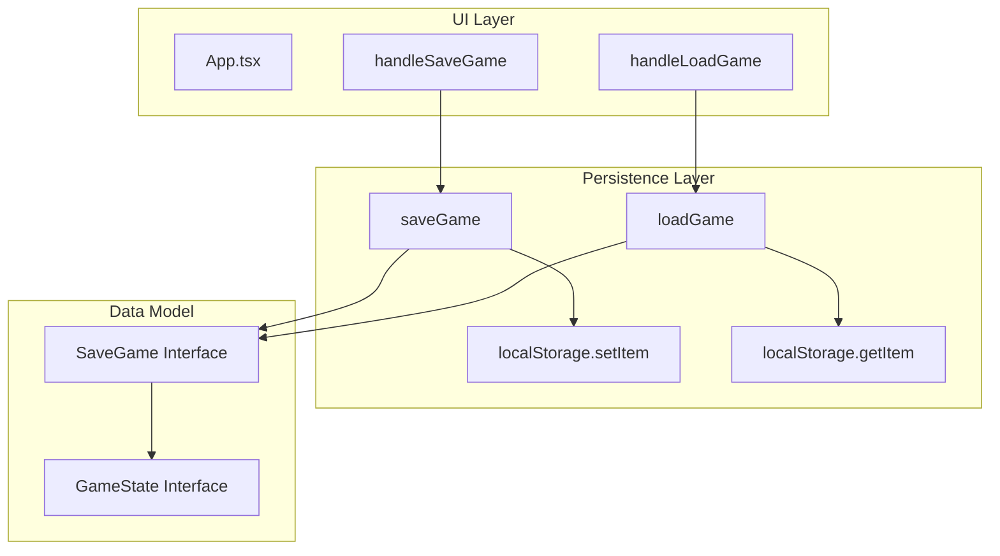
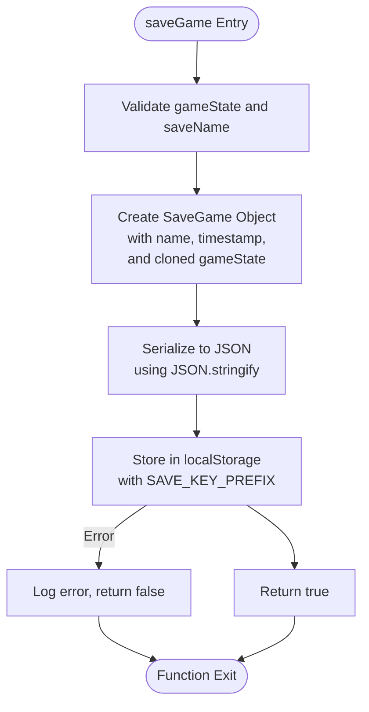
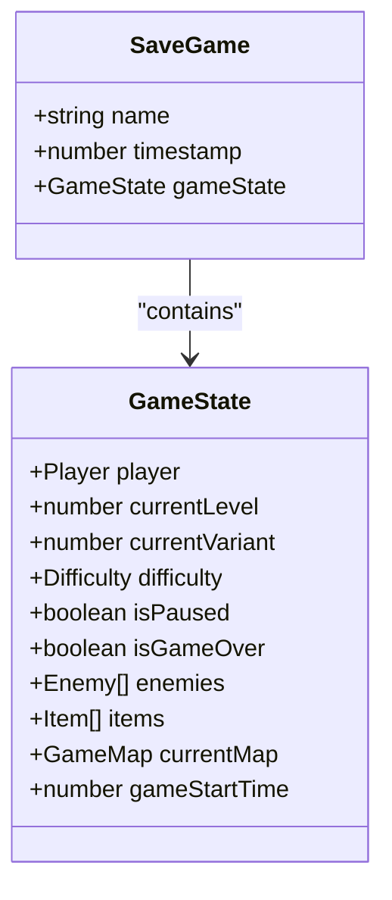
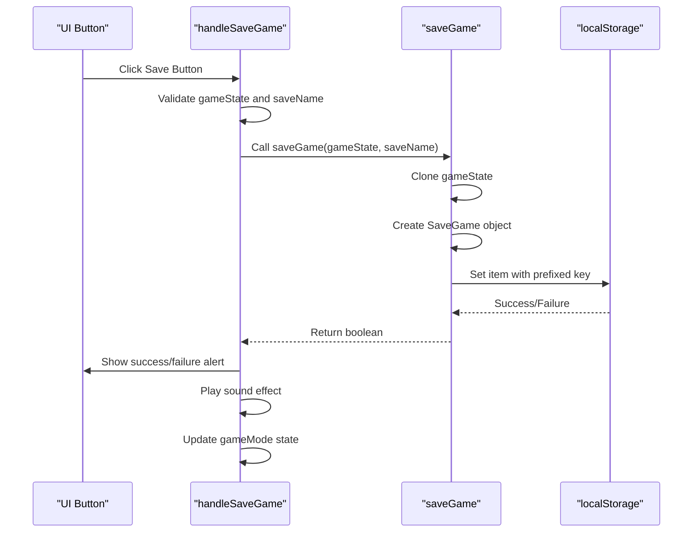
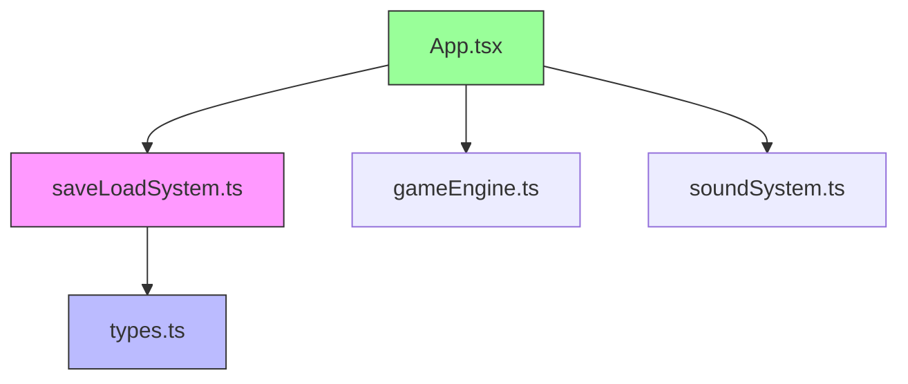

# Game State Persistence

<cite>
**Referenced Files in This Document**  
- [saveLoadSystem.ts](file://src/saveLoadSystem.ts)
- [App.tsx](file://src/App.tsx)
- [types.ts](file://src/types.ts)
</cite>

## Table of Contents
1. [Introduction](#introduction)
2. [Core Components](#core-components)
3. [Architecture Overview](#architecture-overview)
4. [Detailed Component Analysis](#detailed-component-analysis)
5. [Dependency Analysis](#dependency-analysis)
6. [Performance Considerations](#performance-considerations)
7. [Troubleshooting Guide](#troubleshooting-guide)
8. [Conclusion](#conclusion)

## Introduction
This document provides a comprehensive analysis of the game state persistence system in the Egor game application. The implementation leverages browser localStorage to enable players to save and load their progress, supporting both manual saves and automatic persistence. The system is designed with robust error handling, backward compatibility, and user-friendly integration within the game's React-based UI. This documentation details the technical architecture, data serialization process, component integration, and practical considerations for using localStorage in a game context.

## Core Components
The game state persistence functionality is implemented through a dedicated save/load system that handles serialization, storage, retrieval, and deserialization of game data. The core components include the `saveGame` and `loadGame` functions in `saveLoadSystem.ts`, the `SaveGame` interface that defines the stored data structure, and the UI integration handlers in `App.tsx`. These components work together to provide a seamless save/load experience while maintaining data integrity and handling potential storage failures gracefully.

**Section sources**
- [saveLoadSystem.ts](file://src/saveLoadSystem.ts#L4-L33)
- [App.tsx](file://src/App.tsx#L85-L113)
- [types.ts](file://src/types.ts#L170-L174)

## Architecture Overview
The game state persistence system follows a clean separation of concerns, with dedicated functions for saving and loading operations that interact with the browser's localStorage API. The architecture consists of a data layer that handles serialization and storage, a domain model that defines the structure of saved data, and a presentation layer that integrates these capabilities into the game's user interface. This layered approach ensures that the persistence logic remains decoupled from the game's core mechanics while providing reliable state management.

**Diagram sources**
- [saveLoadSystem.ts](file://src/saveLoadSystem.ts#L4-L33)
- [App.tsx](file://src/App.tsx#L85-L113)
- [types.ts](file://src/types.ts#L170-L174)

## Detailed Component Analysis

### Save and Load Functions Implementation
The `saveGame` and `loadGame` functions in `saveLoadSystem.ts` provide the core functionality for persisting game state to localStorage. The `saveGame` function takes a `GameState` object and a save name, creating a structured `SaveGame` object that includes metadata like timestamp and name before serializing it to JSON and storing it with a prefixed key. The function uses a deep clone technique with `JSON.parse(JSON.stringify(gameState))` to ensure a clean copy of the game state without reference issues. Error handling is implemented with try-catch blocks to gracefully handle storage failures, returning boolean success indicators.

**Diagram sources**
- [saveLoadSystem.ts](file://src/saveLoadSystem.ts#L4-L18)

**Section sources**
- [saveLoadSystem.ts](file://src/saveLoadSystem.ts#L4-L18)

### SaveGame Interface and Data Structure
The `SaveGame` interface defined in `types.ts` specifies the structure of data stored in localStorage. It contains three properties: `name` (string identifier for the save slot), `timestamp` (number representing when the save was created), and `gameState` (the complete game state object). This structure enables sorting of saves by recency and provides clear metadata for the user interface. The `gameState` property contains the complete snapshot of the game, including player state, level information, inventory, and current map configuration, ensuring that all necessary data is preserved between sessions.

**Diagram sources**
- [types.ts](file://src/types.ts#L170-L174)
- [types.ts](file://src/types.ts#L143-L162)

**Section sources**
- [types.ts](file://src/types.ts#L170-L174)

### App Component Integration
The `App.tsx` component integrates the save/load functionality through the `handleSaveGame` and `handleLoadGame` handler functions. These handlers bridge the React state management with the persistence layer, providing user feedback through alerts and sound effects. The `handleSaveGame` function validates input, calls `saveGame`, and provides appropriate feedback based on success or failure. The `handleLoadGame` function includes backward compatibility logic to handle older save formats by initializing missing properties like `currentVariant`. Both handlers update the React component state to reflect the new game state after loading or to return to gameplay after saving.

**Diagram sources**
- [App.tsx](file://src/App.tsx#L85-L96)

**Section sources**
- [App.tsx](file://src/App.tsx#L85-L113)

## Dependency Analysis
The game state persistence system has well-defined dependencies that maintain separation between concerns. The `saveLoadSystem.ts` module depends on `types.ts` for the `GameState` and `SaveGame` interfaces but has no dependencies on React or UI components. The `App.tsx` component depends on the save/load functions for persistence capabilities while providing the necessary context (game state, save name) for these operations. This dependency structure ensures that the persistence logic can be tested independently and reused across different parts of the application if needed.

**Diagram sources**
- [saveLoadSystem.ts](file://src/saveLoadSystem.ts#L1-L2)
- [App.tsx](file://src/App.tsx#L1-L10)

**Section sources**
- [saveLoadSystem.ts](file://src/saveLoadSystem.ts#L1-L2)
- [App.tsx](file://src/App.tsx#L1-L10)

## Performance Considerations
The game state persistence implementation considers several performance aspects. The use of `JSON.stringify` and `JSON.parse` for serialization is efficient for the typical size of game state data, though it may become a bottleneck for extremely large states. The deep cloning technique with `JSON.parse(JSON.stringify())` ensures data isolation but has O(n) time complexity relative to the size of the game state. The system avoids synchronous operations during gameplay by performing save/load operations only when explicitly triggered by the user, preventing frame rate drops. For large game states, future optimizations could include selective serialization of only changed data or asynchronous saving to prevent UI blocking.

## Troubleshooting Guide
When encountering issues with game state persistence, consider the following common problems and solutions:

1. **Save operations failing silently**: Check browser console for localStorage quota exceeded errors. The typical limit is 5-10MB per origin. Solution: Implement save data compression or reduce the amount of data stored.

2. **Inability to load saved games**: Verify that the `SAVE_KEY_PREFIX` is consistent across application versions. Migration code in `handleLoadGame` handles missing properties, but structural changes to `GameState` may require additional migration logic.

3. **Corrupted save data**: localStorage can become corrupted if the browser crashes during a write operation. The try-catch blocks in save/load functions help prevent application crashes but cannot recover corrupted data. Solution: Implement periodic autosaves to multiple slots.

4. **Cross-browser compatibility issues**: While localStorage is widely supported, some privacy-focused browsers or extensions may disable it. Always check for localStorage availability before attempting save operations.

**Section sources**
- [saveLoadSystem.ts](file://src/saveLoadSystem.ts#L4-L33)
- [App.tsx](file://src/App.tsx#L85-L113)

## Conclusion
The game state persistence system in the Egor application provides a robust solution for saving and loading game progress using browser localStorage. The implementation features a clean separation of concerns, with dedicated functions for persistence operations, a well-defined data structure for saved games, and seamless integration with the React component system. The use of error handling, backward compatibility measures, and user feedback mechanisms ensures a reliable and user-friendly experience. While the current implementation effectively meets the requirements, potential enhancements could include cloud synchronization, save compression, or incremental saving for improved performance with large game states.