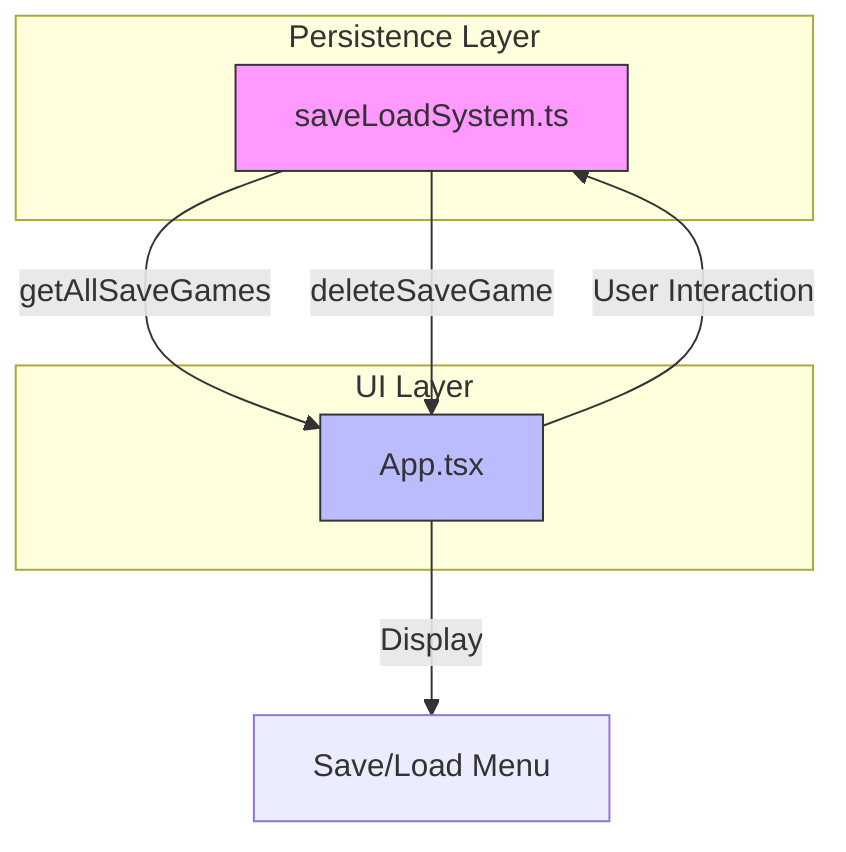
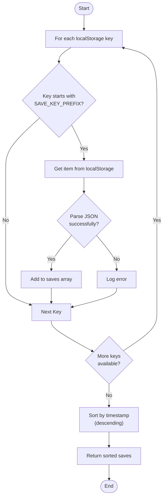
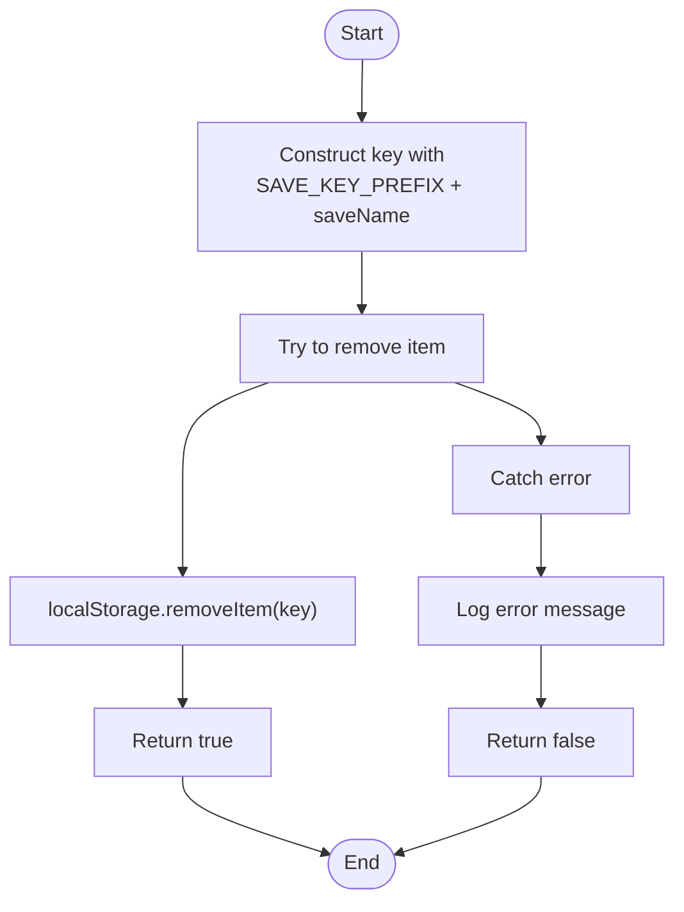
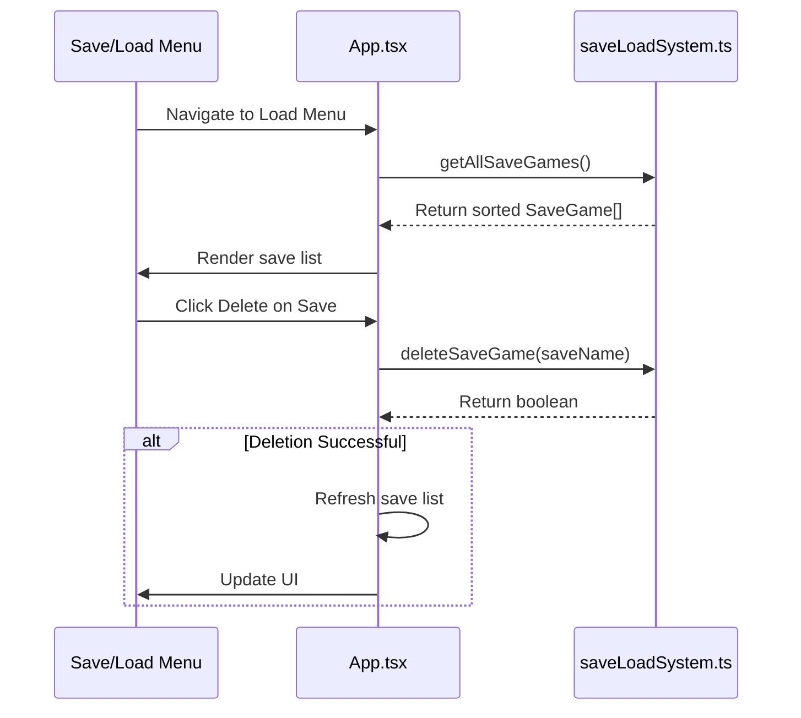
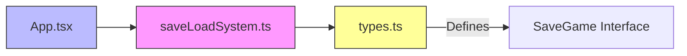

# Save Management

<cite>
**Referenced Files in This Document**   
- [saveLoadSystem.ts](file://src/saveLoadSystem.ts)
- [App.tsx](file://src/App.tsx)
- [types.ts](file://src/types.ts)
</cite>

## Table of Contents
1. [Introduction](#introduction)
2. [Core Components](#core-components)
3. [Architecture Overview](#architecture-overview)
4. [Detailed Component Analysis](#detailed-component-analysis)
5. [Dependency Analysis](#dependency-analysis)
6. [Performance Considerations](#performance-considerations)
7. [Troubleshooting Guide](#troubleshooting-guide)
8. [Conclusion](#conclusion)

## Introduction

This document provides a comprehensive analysis of the save management functionality in the Egor game application. The system enables players to save, load, list, and delete game states using browser localStorage as persistent storage. The implementation centers around two core functions—`getAllSaveGames` and `deleteSaveGame`—which are integrated into the main application UI through `App.tsx`. This documentation details the technical implementation, data flow, error handling, and user interface integration of these features, with emphasis on chronological sorting, safe deletion, and edge case management.

## Core Components

The save management system consists of utility functions in `saveLoadSystem.ts` that interface with localStorage using a defined prefix (`egor_save_`) to isolate game data. These functions are consumed by the React component in `App.tsx`, which renders the save/load menu UI and handles user interactions. The `SaveGame` interface defines the structure of stored data, including name, timestamp, and serialized game state.

**Section sources**
- [saveLoadSystem.ts](file://src/saveLoadSystem.ts#L35-L63)
- [App.tsx](file://src/App.tsx#L21)
- [types.ts](file://src/types.ts#L170-L174)

## Architecture Overview

The save management architecture follows a clean separation between data persistence logic and UI presentation. The `saveLoadSystem.ts` module encapsulates all localStorage operations, providing a safe API for saving, loading, listing, and deleting game states. The `App.tsx` component imports these functions and integrates them into the game's menu system, enabling users to manage their saved games through an intuitive interface.

**Diagram sources**
- [saveLoadSystem.ts](file://src/saveLoadSystem.ts)
- [App.tsx](file://src/App.tsx)

## Detailed Component Analysis

### getAllSaveGames Function Analysis

The `getAllSaveGames` function retrieves all saved game entries from localStorage by iterating through all keys and filtering those that start with the `SAVE_KEY_PREFIX` ("egor_save_"). For each matching key, it attempts to parse the stored JSON data into a `SaveGame` object, handling any parsing errors gracefully by logging them and continuing with the next entry. After collecting all valid saves, the function sorts them in descending order by timestamp to display the most recent saves first in the UI.

**Diagram sources**
- [saveLoadSystem.ts](file://src/saveLoadSystem.ts#L35-L53)

**Section sources**
- [saveLoadSystem.ts](file://src/saveLoadSystem.ts#L35-L53)
- [types.ts](file://src/types.ts#L170-L174)

### deleteSaveGame Function Analysis

The `deleteSaveGame` function removes a specified save game from localStorage by constructing the full key using the `SAVE_KEY_PREFIX` and the provided save name. It wraps the `removeItem` operation in a try-catch block to handle potential errors (such as quota exceeded or security restrictions), returning `true` on success and `false` on failure. This error handling ensures that the application remains stable even when localStorage operations fail unexpectedly.

**Diagram sources**
- [saveLoadSystem.ts](file://src/saveLoadSystem.ts#L55-L63)

**Section sources**
- [saveLoadSystem.ts](file://src/saveLoadSystem.ts#L55-L63)

### App.tsx Integration Analysis

The `App.tsx` component integrates the save management functions into the game's UI through the save/load menu system. When the user navigates to the load menu, the component calls `getAllSaveGames` to retrieve and display all available saves in chronological order. Each save is rendered as a clickable list item that triggers `handleLoadGame` when selected. The component also provides a delete button for each save that calls `deleteSaveGame`, refreshing the list upon successful deletion.

**Diagram sources**
- [App.tsx](file://src/App.tsx#L821)
- [saveLoadSystem.ts](file://src/saveLoadSystem.ts)

**Section sources**
- [App.tsx](file://src/App.tsx#L21)
- [App.tsx](file://src/App.tsx#L821-L847)

## Dependency Analysis

The save management system has a clear dependency hierarchy. The `App.tsx` component depends directly on functions exported from `saveLoadSystem.ts`, which in turn depends on the `SaveGame` interface from `types.ts`. There are no circular dependencies, and the separation of concerns allows for independent testing and modification of the persistence logic without affecting the UI layer.

**Diagram sources**
- [App.tsx](file://src/App.tsx#L21)
- [saveLoadSystem.ts](file://src/saveLoadSystem.ts)
- [types.ts](file://src/types.ts#L170-L174)

## Performance Considerations

The `getAllSaveGames` function iterates through all localStorage entries, which has O(n) time complexity where n is the total number of localStorage items. While this is acceptable for typical save counts (usually under 10), performance could degrade with hundreds of entries. The function could be optimized by maintaining a separate index of save keys, though this would add complexity to save/delete operations. Currently, the implementation prioritizes simplicity and reliability over optimization, which is appropriate given expected usage patterns.

## Troubleshooting Guide

The save management system includes several error handling mechanisms:
- **getAllSaveGames**: Catches JSON parsing errors and continues processing other saves
- **deleteSaveGame**: Catches localStorage errors and returns a boolean status
- **App.tsx**: Handles empty save lists by displaying appropriate messaging

Common issues and solutions:
- **Empty save list**: Check that `SAVE_KEY_PREFIX` is correct and that saves were created successfully
- **Failed deletion**: Check browser storage permissions and available quota
- **Corrupted saves**: The system skips invalid JSON entries rather than failing entirely
- **Concurrent modifications**: localStorage operations are atomic, but rapid concurrent access from multiple tabs is not explicitly handled

**Section sources**
- [saveLoadSystem.ts](file://src/saveLoadSystem.ts#L35-L63)
- [App.tsx](file://src/App.tsx#L821-L847)

## Conclusion

The save management system provides a robust and user-friendly way to persist game states using localStorage. The `getAllSaveGames` and `deleteSaveGame` functions implement safe, error-tolerant operations with proper sorting and filtering. Integration with `App.tsx` creates a seamless user experience for managing saved games. The architecture maintains clear separation between data persistence and UI concerns, making the system maintainable and extensible. Edge cases such as empty lists, parsing errors, and deletion failures are handled gracefully, ensuring a stable user experience.