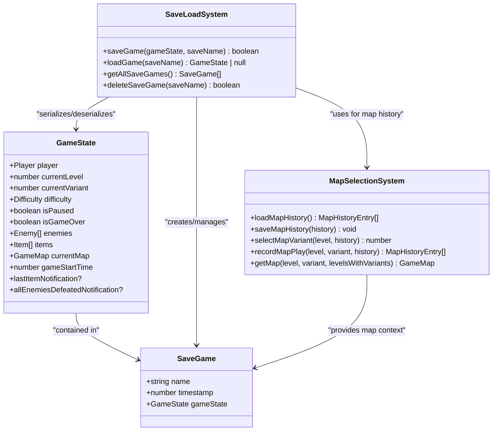
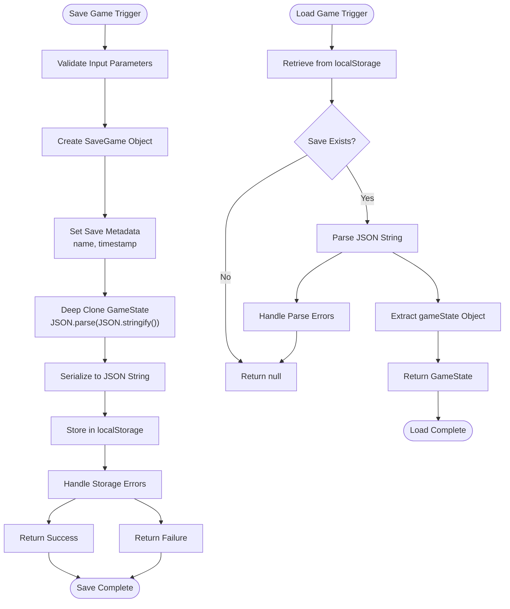
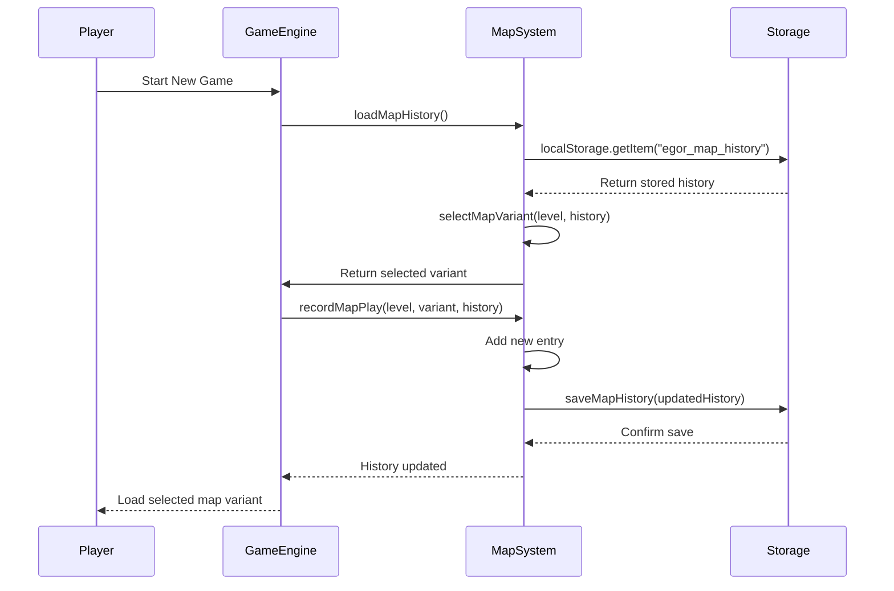
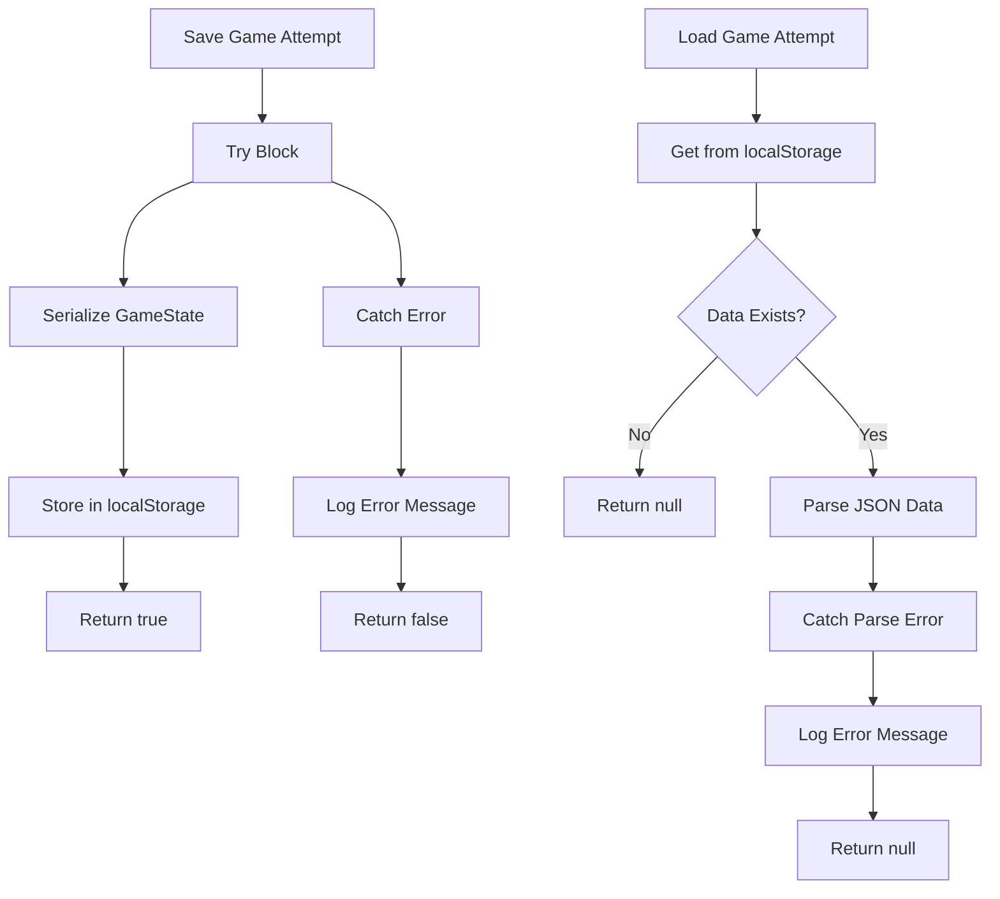
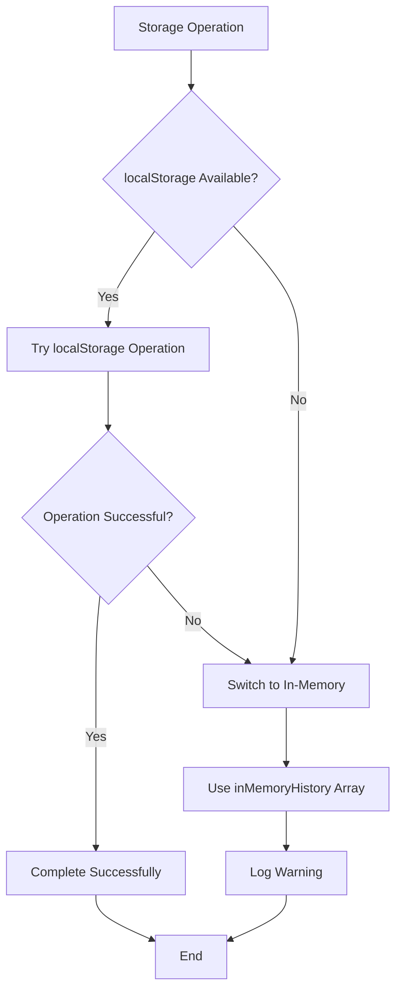

# Save/Load System

<cite>
**Referenced Files in This Document**   
- [saveLoadSystem.ts](file://src/saveLoadSystem.ts)
- [types.ts](file://src/types.ts)
- [gameEngine.ts](file://src/gameEngine.ts)
- [mapSelectionSystem.ts](file://src/mapSelectionSystem.ts)
- [backwardCompatibilityTests.ts](file://src/backwardCompatibilityTests.ts)
</cite>

## Table of Contents
1. [Introduction](#introduction)
2. [Core Components](#core-components)
3. [Game State Persistence Implementation](#game-state-persistence-implementation)
4. [Save Management System](#save-management-system)
5. [Backward Compatibility and Migration](#backward-compatibility-and-migration)
6. [Error Handling Strategies](#error-handling-strategies)
7. [Save/Load Workflows](#save-load-workflows)
8. [Security and Storage Considerations](#security-and-storage-considerations)

## Introduction

The save/load system in the Egor game implements a robust mechanism for preserving player progress using browser localStorage. This documentation provides a comprehensive analysis of the system's architecture, focusing on game state persistence, serialization, save management, backward compatibility, and error handling. The system is designed to maintain continuity across sessions while ensuring data integrity and providing a seamless user experience.

## Core Components

The save/load functionality is implemented through several interconnected components that work together to manage game state persistence. The core components include the save/load operations, game state definition, map selection system, and backward compatibility testing framework.

**Section sources**
- [saveLoadSystem.ts](file://src/saveLoadSystem.ts#L1-L65)
- [types.ts](file://src/types.ts#L143-L174)
- [gameEngine.ts](file://src/gameEngine.ts#L49-L89)
- [mapSelectionSystem.ts](file://src/mapSelectionSystem.ts#L19-L96)

## Game State Persistence Implementation

The game state persistence system is built around localStorage operations with proper serialization and deserialization of complex game objects. The implementation ensures that all relevant game data is preserved across sessions.



**Diagram sources**
- [types.ts](file://src/types.ts#L143-L174)
- [saveLoadSystem.ts](file://src/saveLoadSystem.ts#L1-L65)
- [mapSelectionSystem.ts](file://src/mapSelectionSystem.ts#L1-L214)

### Serialization and Deserialization Process

The system implements a straightforward but effective serialization process using JSON.stringify and JSON.parse methods. When saving a game, the entire GameState object is serialized into a SaveGame structure that includes metadata such as save name and timestamp.

The serialization process uses a deep copy technique with `JSON.parse(JSON.stringify(gameState))` to ensure that all nested objects are properly cloned and that no references to mutable objects are preserved. This approach prevents potential data corruption that could occur if the original game state object were modified after saving.



**Diagram sources**
- [saveLoadSystem.ts](file://src/saveLoadSystem.ts#L4-L33)
- [types.ts](file://src/types.ts#L143-L174)

**Section sources**
- [saveLoadSystem.ts](file://src/saveLoadSystem.ts#L4-L33)
- [types.ts](file://src/types.ts#L143-L174)

## Save Management System

The save management system provides comprehensive functionality for handling multiple save slots and implementing consistent naming conventions. The system is designed to be user-friendly while maintaining technical robustness.

### Multiple Save Slots and Naming Conventions

The system supports multiple save slots through a naming convention that uses a prefix (`egor_save_`) combined with user-provided save names. This approach allows players to create multiple named saves without technical limitations on the number of save slots.

The getAllSaveGames() function retrieves all available saves by iterating through localStorage keys that match the save prefix. The function returns saves sorted by timestamp in descending order, ensuring that the most recent saves appear first in the list.

```mermaid
flowchart TD
A[Get All Save Games] --> B[Initialize Empty Array]
B --> C[Iterate localStorage Keys]
C --> D{Key Starts With<br/>"egor_save_"?}
D --> |No| E[Skip Key]
D --> |Yes| F[Retrieve Save Data]
F --> G{Data Valid?}
G --> |No| H[Log Error]
G --> |Yes| I[Parse and Add to Array]
I --> J[Continue Iteration]
E --> J
H --> J
J --> K{More Keys?}
K --> |Yes| C
K --> |No| L[Sort by Timestamp<br/>Descending]
L --> M[Return Saves Array]
```

**Diagram sources**
- [saveLoadSystem.ts](file://src/saveLoadSystem.ts#L35-L65)

**Section sources**
- [saveLoadSystem.ts](file://src/saveLoadSystem.ts#L35-L65)

## Backward Compatibility and Migration

The system includes a sophisticated backward compatibility framework that ensures older save formats can be migrated to current versions. This is critical for maintaining player progress across game updates and version changes.

### Map History and Variant Selection System

The backward compatibility system is centered around the map selection and history management components. The system tracks which map variants a player has completed, allowing it to intelligently select appropriate maps for subsequent play sessions.



**Diagram sources**
- [mapSelectionSystem.ts](file://src/mapSelectionSystem.ts#L19-L96)
- [gameEngine.ts](file://src/gameEngine.ts#L49-L89)

The map selection algorithm follows these rules:
1. If no history exists for a level, select a random variant (0-4)
2. If some variants have been played, prioritize unplayed variants
3. If all variants have been played, select the oldest played variant

This approach ensures players experience new content first while providing a fair rotation mechanism for replayability.

**Section sources**
- [mapSelectionSystem.ts](file://src/mapSelectionSystem.ts#L19-L96)
- [gameEngine.ts](file://src/gameEngine.ts#L49-L89)

## Error Handling Strategies

The system implements comprehensive error handling strategies to manage corrupted or missing save data, ensuring a robust user experience even when storage issues occur.

### Corrupted Data Handling

The error handling system is designed to gracefully handle various failure scenarios:



**Diagram sources**
- [saveLoadSystem.ts](file://src/saveLoadSystem.ts#L4-L33)

The system includes specific error handling for:
- Missing save data (returns null)
- JSON parsing errors (catches and logs errors, returns null)
- Storage quota exceeded (catches and logs errors, returns false)
- Invalid data structures (validates and cleans data)

The backwardCompatibilityTests.ts file contains comprehensive tests for corrupted data scenarios, including invalid JSON, non-array data, invalid entries, and mixed valid/invalid data. The system is designed to clean corrupted data and return valid, usable results.

**Section sources**
- [saveLoadSystem.ts](file://src/saveLoadSystem.ts#L4-L33)
- [backwardCompatibilityTests.ts](file://src/backwardCompatibilityTests.ts#L117-L185)

## Save/Load Workflows

The system implements specific workflows for save and load operations that are triggered by various game events.

### Save Game Triggers

Save operations are triggered by specific game events:
- Manual save requests from the player
- Level completion
- Game initialization
- Map transitions

The saveGame() function is designed to be called with a GameState object and a save name, creating a timestamped save that can be retrieved later.

### Load Game Workflows

Load operations follow a specific sequence:
1. Retrieve save data from localStorage
2. Parse JSON data into SaveGame object
3. Extract gameState from SaveGame
4. Return gameState for game initialization

The load process is integrated with the game engine's state initialization, ensuring that loaded games resume exactly where they were saved.

**Section sources**
- [saveLoadSystem.ts](file://src/saveLoadSystem.ts#L4-L65)
- [gameEngine.ts](file://src/gameEngine.ts#L49-L89)

## Security and Storage Considerations

The system addresses important security and storage limitations inherent in browser localStorage.

### localStorage Limitations and Security

Browser localStorage has several important characteristics that the system accounts for:

- **Size limitations**: Typically 5-10MB per domain
- **Persistence**: Data persists until explicitly cleared
- **Security**: Data is accessible to any script on the same origin
- **Synchronization**: No automatic synchronization across devices

The system implements an in-memory fallback mechanism when localStorage is unavailable or throws errors. This ensures that the game remains playable even in restricted environments.



**Diagram sources**
- [mapSelectionSystem.ts](file://src/mapSelectionSystem.ts#L19-L96)

Security considerations include:
- No sensitive user data stored in saves
- Game state data is not encrypted (not sensitive)
- No authentication or authorization requirements for save/load
- Data validation to prevent injection attacks

The system avoids storing any personally identifiable information (PII) in save files, focusing only on game state data necessary for gameplay continuity.

**Section sources**
- [mapSelectionSystem.ts](file://src/mapSelectionSystem.ts#L19-L96)
- [saveLoadSystem.ts](file://src/saveLoadSystem.ts#L4-L65)